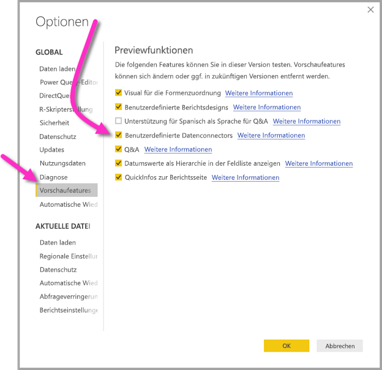

# Herstellen einer Verbindung zu Daten, die von Power BI-Dataflows in Power BI Desktop (Vorschauversion) erstellt wurden
In **Power BI Desktop** können Sie eine Verbindung mit Daten herstellen, die von **Power BI-Dataflows** wie alle anderen Datenquellen in Power BI Desktop erstellt wurden.

Mit dem Connector **Power BI-Dataflows (Vorschauversion)** können Sie eine Verbindung zu Entitäten herstellen, die von Dataflows im Power BI-Dienst erstellt wurden. Da sich Dataflows in der Vorschauphase befinden, müssen Sie einige Schritte ausführen, um den Dataflows-Connector auf Ihrem System verfügbar zu machen. 

## Herunterladen und Aktivieren des Power BI-Dataflows-Connectors (Vorschauversion)

Sie müssen eine Kopie des **Power BI-Dataflows**-Connectors herunterladen und diese dann an einen bestimmten Speicherort auf Ihrem Computer kopieren. In einem zukünftigen monatlichen Update für Power BI Desktop ist der Connector automatisch in der Liste von Datenconnectors enthalten. Dann sind die genannten Schritte nicht mehr vonnöten.

Sie können den **Power BI-Dataflows-Connector** hier herunterladen: [Power BI-Dataflows-Connector](https://visuals.azureedge.net/cds-analytics/PublicPreview/CDSA.mez)

Mit den folgenden Schritten können Sie den **Power BI-Dataflows**-Connector (Vorschauversion) auf Ihrem Computer verfügbar machen.

1. Laden Sie eine Kopie der MEZ-Datei (Datenconnectordatei) herunter. Kunden der privaten Vorschau erhalten die Downloadinformationen für die MEZ-Datei direkt von Microsoft.

2. Legen Sie die heruntergeladene Datenconnectordatei im folgenden Ordner auf Ihrem Computer ab: **Dokumente > Power BI Desktop > Ordner „Benutzerdefinierte Connectors“**.

3. Wechseln Sie in Power BI Desktop zu **Datei > Optionen und Einstellungen > Optionen**, und wählen Sie dann im linken Bereich **Vorschaufeatures** aus.

    

4. Aktivieren Sie das Feld **Benutzerdefinierte Datenconnectors**, falls es nicht schon aktiviert ist. 

5. Starten Sie **Power BI Desktop** neu, damit der Connector angezeigt wird.

## Verwenden des Power BI-Dataflows-Connectors (Vorschauversion)
Sobald **Power BI Desktop** neu gestartet wurde, wird der Connector als verfügbare Datenquelle angezeigt. Klicken Sie wie in der folgenden Abbildung gezeigt auf **Daten abrufen > Onlinedienste > Power BI-Dataflows (Beta)**, um eine Verbinden mit dem Datenpool herzustellen.

## Überlegungen und Einschränkungen

Damit Sie diese Vorschauversion des **Power BI-Dataflows-Connectors** verwenden können, müssen Sie die neueste Version von **Power BI Desktop** ausführen. Sie können [Power BI Desktop jederzeit herunterladen](desktop-get-the-desktop.md) und auf Ihrem Computer installieren, um sicherzustellen, dass Sie über die neueste Version verfügen.  

Hinweis: Wenn der Power BI-Dataflows-Connector in einem zukünftigen monatlichen Update für **Power BI Desktop** erscheint, *müssen* Sie die heruntergeladene MEZ-Datei aus dem Ordner unter **Dokumente > Power BI Desktop > Benutzerdefinierte Connectors** löschen, um Konflikte zu vermeiden. 

## Nächste Schritte
Mit Power BI-Datenverbindungen können Sie viele interessante Aktionen durchführen. In den Artikeln zu **Power BI Desktop** erhalten Sie weitere nützliche Informationen:

* [Datenquellen in Power BI Desktop](desktop-data-sources.md)
* [Strukturieren und Kombinieren von Daten mit Power BI Desktop](desktop-shape-and-combine-data.md)
* [Eingeben von Daten direkt in Power BI Desktop](desktop-enter-data-directly-into-desktop.md)   

