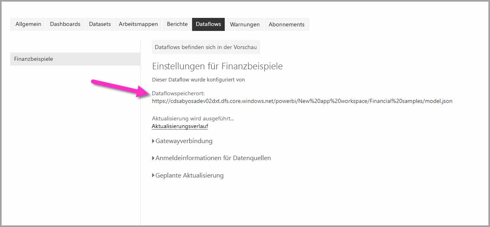

# Verbinden mit Daten, die von Power BI-Dataflows in Power BI Desktop (Beta) erstellt wurden
In **Power BI Desktop** können Sie eine Verbindung mit Daten herstellen, die von **Power BI-Dataflows** wie alle anderen Datenquellen in Power BI Desktop erstellt wurden.

Mit dem Connector **Power BI-Dataflows (Beta)** können Sie eine Verbindung mit Entitäten herstellen, die von Dataflows im Power BI-Dienst erstellt wurden. 

## Überlegungen und Einschränkungen

Um diese Betaversion vom **Power BI-Dataflowconnector** zu verwenden, müssen Sie die neueste Version von **Power BI Desktop** ausführen. Sie können [Power BI Desktop jederzeit herunterladen](desktop-get-the-desktop.md) und auf Ihrem Computer installieren, um sicherzustellen, dass Sie über die neueste Version verfügen.  

> [!NOTE]
> Die vorherige Version des Power BI-Dataflowconnectors erforderte, dass Sie eine MEZ-Datei herunterladen und in einem Ordner speichern. Aktuelle Versionen von **Power BI Desktop** enthalten den Power BI Dataflowconnector, sodass die Datei nicht mehr benötigt wird und keine Konflikte mit der enthaltenen Connecorversion verursachen kann. Wenn Sie die MEZ-Datei manuell in den Ordner verschieben, *müssen* Sie die heruntergeladene MEZ-Datei im Ordner **Dokumente > Power BI Desktop > Benutzerdefinierte Connectors** löschen, um Konflikte zu vermeiden. 

## Power BI Desktop-Leistung
**Power BI Desktop** wird lokal auf dem Computer ausgeführt, auf dem die App installiert wurde. Die Leistung der Dataflowerfassung wird von einer Vielzahl von Faktoren bestimmt. Zu diesen Faktoren gehören unter anderem die Datengröße, die CPU und der RAM Ihres Computers, die Netzwerkbandbreite sowie die Entfernung zum Rechenzentrum.

Sie können die Leistung der Datenerfassung für Dataflows verbessern. Wenn z.B. die erfasste Datengröße zu groß ist, um von **Power BI Desktop** auf Ihrem Computer verwaltet zu werden, können Sie verknüpfte und berechnete Entitäten in Dataflows zum Aggregieren der Daten (in Dataflows) verwenden und nur vorbereitete, aggregierte Daten erfassen. Dadurch erfolgt die Verarbeitung großer Datenmengen online in Dataflows, anstatt lokal in Ihrer ausgeführten **Power BI Desktop**-Instanz. Mit diesem Ansatz kann Power BI Desktop kleinere Datenmengen erfassen und die Arbeit mit Dataflows schnell und reaktionsschnell gestalten.

## Überlegungen und Einschränkungen

Die meisten Dataflows befinden sich im Mandanten des Power BI-Diensts. Benutzer von **Power BI Desktop** können jedoch nur auf Dataflows zugreifen, die in einem Azure Data Lake Storage Gen2-Konto gespeichert sind, wenn sie der Besitzer des jeweiligen Dataflows oder explizit für den CDM-Ordner des jeweiligen Dataflows autorisiert sind. Sehen Sie sich das folgende Beispiel an:

1.  Anna erstellt einen neuen App-Arbeitsbereich und konfiguriert ihn so, dass Dataflows im Data Lake Ihrer Organisation gespeichert werden.
2.  Ben ist ebenfalls Mitglied des Arbeitsbereichs, den Anna erstellt hat, und möchte Power BI Desktop und den Dataflowconnector verwenden, um Daten aus Annas Dataflow zu erhalten.
3.  Da Ben im Data Lake-Konto nicht als autorisierter Benutzer des CDM-Ordners des Dataflows hinzugefügt wurde, erhält er eine Fehlermeldung.

    

Ben müssen Leseberechtigungen für den CDM-Ordner und die darin enthaltenen Dateien gewährt werden, um dieses Problem zu beheben. Weitere Informationen zum Gewähren des Zugriffs auf den CDM-Ordner finden Sie in [diesem Artikel](https://go.microsoft.com/fwlink/?linkid=2029121).

## Nächste Schritte
Power BI-Dataflows bieten Ihnen viele interessante Möglichkeiten. Weitere Informationen finden Sie in den folgenden Artikeln:

* [Self-Service-Datenaufbereitung mit Dataflows](service-dataflows-overview.md)
* [Erstellen und Verwenden von Dataflows in Power BI](service-dataflows-create-use.md)
* [Verwenden berechneter Entitäten in Power BI Premium (Vorschau)](service-dataflows-computed-entities-premium.md)
* [Verwenden von Dataflows mit lokalen Datenquellen (Vorschau)](service-dataflows-on-premises-gateways.md)
* [Entwicklerressourcen für Power BI-Dataflows (Vorschau)](service-dataflows-developer-resources.md)

Weitere Informationen zur Integration in Azure Data Lake Storage Gen2 finden Sie in den folgenden Artikeln:

* [Dataflows und Integration in Azure Data Lake (Vorschauversion)](service-dataflows-azure-data-lake-integration.md)
* [Configure workspace dataflow settings (Preview) (Konfigurieren von Datafloweinstellungen im Arbeitsbereich (Vorschauversion))](service-dataflows-configure-workspace-storage-settings.md)
* [Hinzufügen eines CDM-Ordners als Dataflow in Power BI (Vorschauversion)](service-dataflows-add-cdm-folder.md)
* [Verbinden von Azure Data Lake Storage Gen2 für die Dataflowspeicherung (Vorschauversion)](service-dataflows-connect-azure-data-lake-storage-gen2.md)

Es gibt außerdem nützliche Artikel über **Power BI Desktop**:

* [Datenquellen in Power BI Desktop](desktop-data-sources.md)
* [Strukturieren und Kombinieren von Daten mit Power BI Desktop](desktop-shape-and-combine-data.md)
* [Eingeben von Daten direkt in Power BI Desktop](desktop-enter-data-directly-into-desktop.md)   

