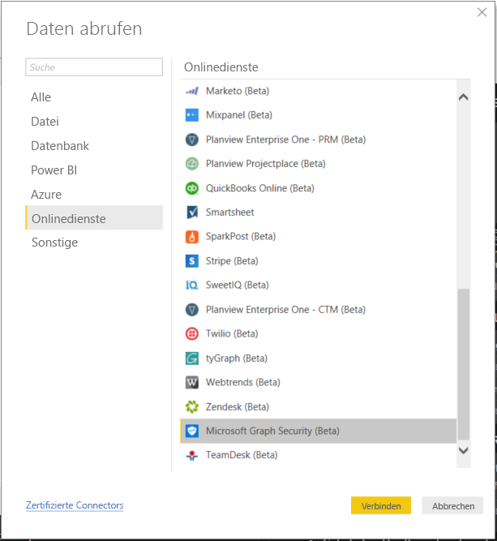
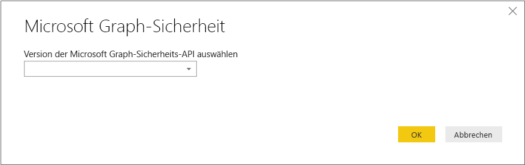
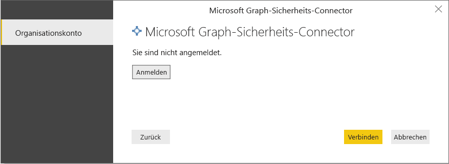
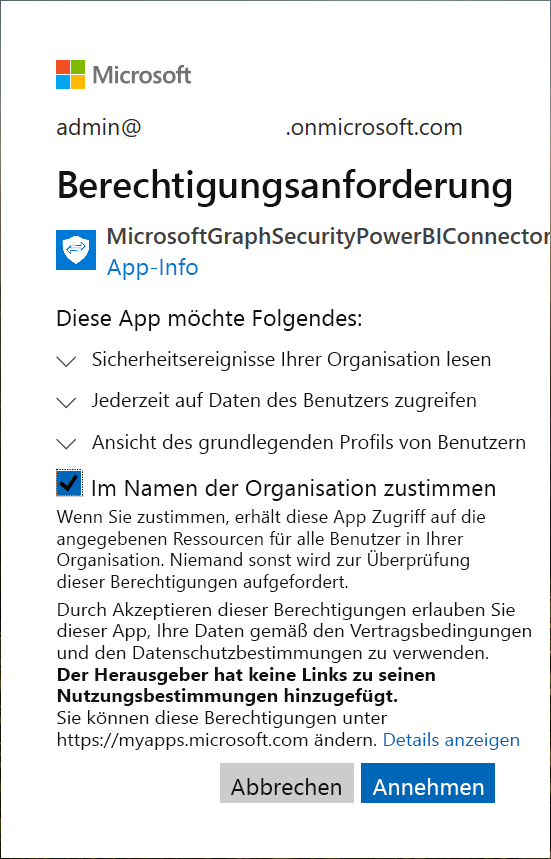
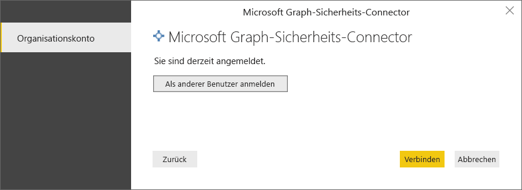
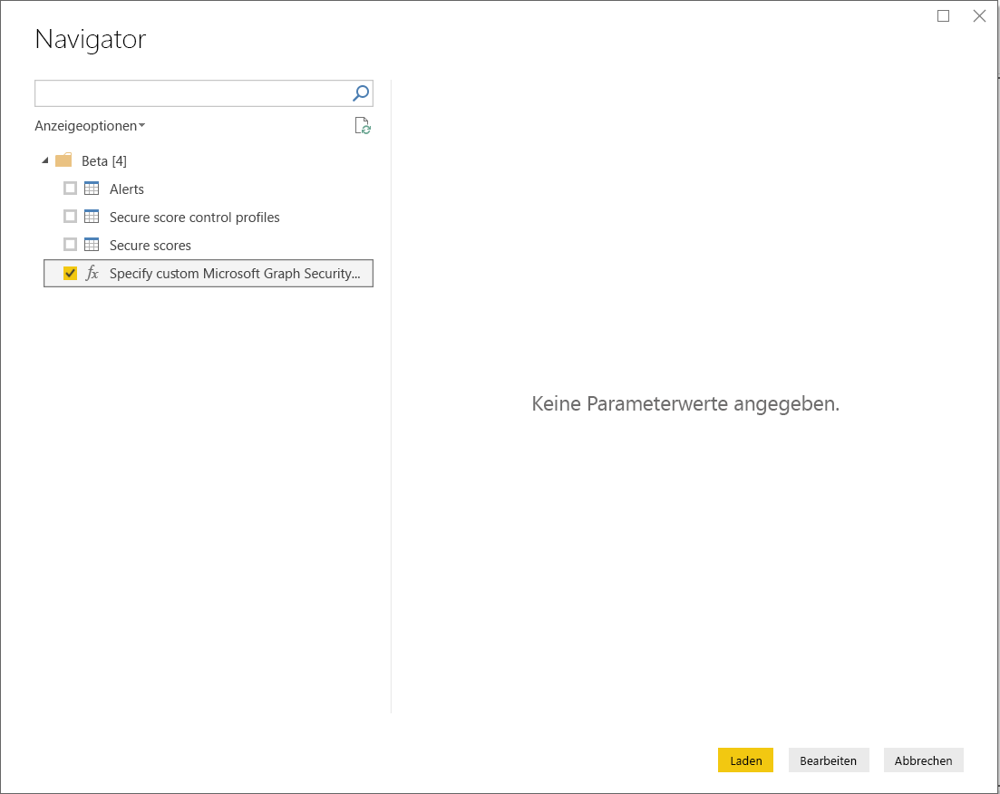
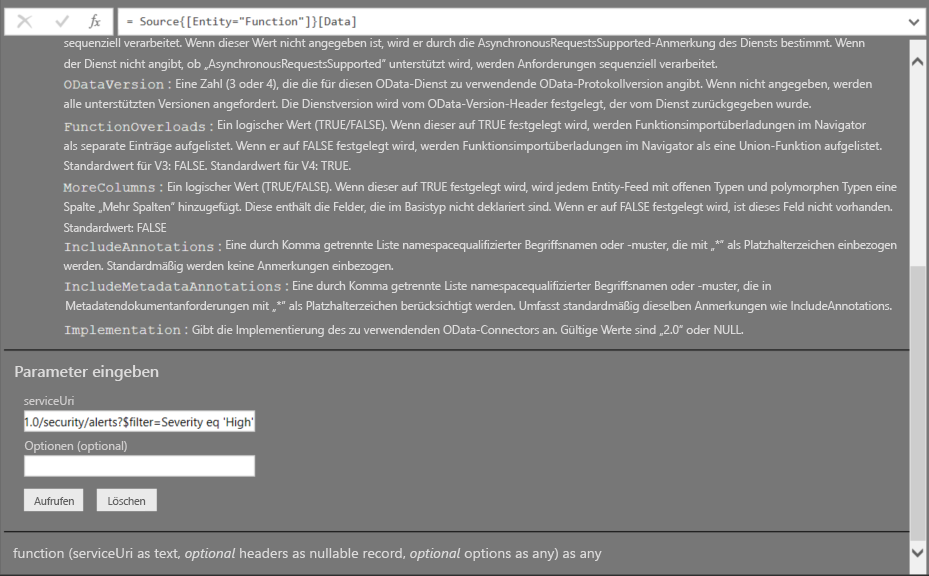
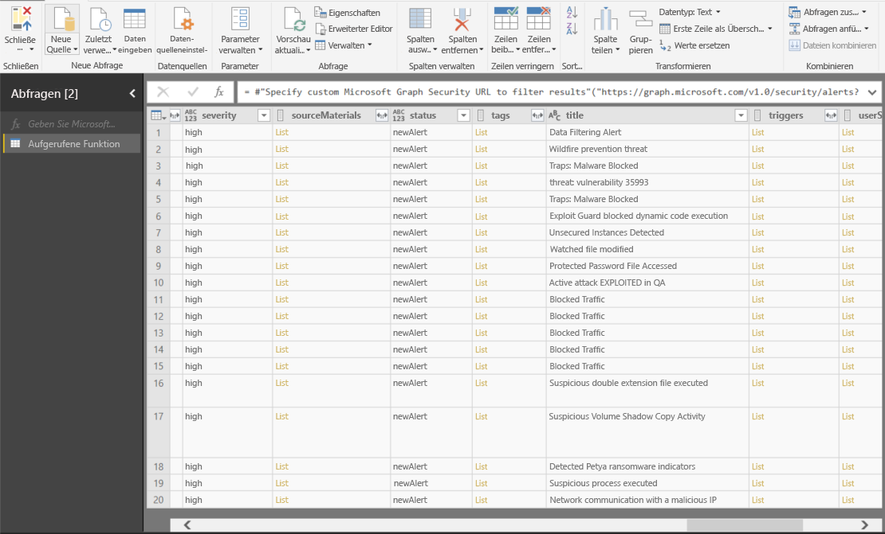

# Herstellen einer Verbindung mit der Microsoft Graph-Sicherheits-API in Power BI Desktop

Mithilfe des Microsoft Graph-Sicherheits-Connectors für Power BI können Sie in Power BI Desktop eine Verbindung mit der Microsoft Graph-Sicherheits-API herstellen. Dadurch können Sie Dashboards und Berichte erstellen, mit denen Sie Einblick in sicherheitsbezogene [Warnungen](https://docs.microsoft.com/graph/api/resources/alert?view=graph-rest-1.0) und Ihre [Sicherheitsbewertung](https://docs.microsoft.com/graph/api/resources/securescores?view=graph-rest-beta) erhalten. Die [Microsoft Graph-Sicherheits-API](https://aka.ms/graphsecuritydocs) verbindet [verschiedene Sicherheitslösungen](https://aka.ms/graphsecurityalerts) von Microsoft und Ökosystempartnern für eine einfachere Korrelation von Warnungen, den Zugriff auf umfassende Kontextinformationen und eine vereinfachte Automatisierung. Dadurch können Organisationen schnell Erkenntnisse zu ihren Sicherheitsprodukten gewinnen und Maßnahmen ergreifen und gleichzeitig die Kosten und den Aufwand für das Erstellen und Verwalten mehrerer Integrationen reduzieren.

## Voraussetzungen für das Verbinden mit dem Microsoft Graph-Sicherheits-Connector

* Wenn Sie den Microsoft Graph-Sicherheits-Connector verwenden möchten, benötigen Sie die *explizite Zustimmung* des Administrators Ihres Azure Active Directory-Mandanten (Azure AD). Diese Zustimmung ist Teil der [Authentifizierungsanforderungen für Microsoft Graph-Sicherheit](https://aka.ms/graphsecurityauth). Für die Zustimmung benötigen Sie die Anwendungs-ID und den Anwendungsnamen des Microsoft Graph-Sicherheits-Connectors in Power BI. Diese finden Sie auch im [Azure-Portal](https://portal.azure.com):

   | Eigenschaft | Wert |
   |----------|-------|
   | **Anwendungsname** | `MicrosoftGraphSecurityPowerBIConnector` |
   | **Anwendungs-ID** | `cab163b7-247d-4cb9-be32-39b6056d4189` |
   |||

   Der Administrator Ihres Azure AD-Mandanten kann einen der folgenden Schritte ausführen, um dem Connector zuzustimmen:

   * [Zustimmung des Mandantenadministrators für Azure AD-Anwendungen erteilen](https://docs.microsoft.com/azure/active-directory/develop/v2-permissions-and-consent).

   * Bei der ersten Ausführung Ihrer Logik-App kann die App die Administratorzustimmung Ihres Azure AD-Mandanten über die [Zustimmungsoberfläche für die Anwendung](https://docs.microsoft.com/azure/active-directory/develop/application-consent-experience) anfordern.
   
* Das Benutzerkonto, das Sie für die Anmeldung zum Herstellen der Verbindung mit dem Microsoft Graph-Sicherheits-Connectors in Power BI verwendet haben, muss Mitglied der eingeschränkten Administratorrolle mit Leseberechtigung für Sicherheitsfunktionen in Azure AD sein. Dabei kann es sich entweder um einen Benutzer mit Leseberechtigung für Sicherheitsfunktionen oder einen Sicherheitsadministrator handeln. Führen Sie die Schritte im Abschnitt [Zuweisen von Azure AD-Rollen für Benutzer](https://docs.microsoft.com/graph/security-authorization#assign-azure-ad-roles-to-users) aus. 

## Verwenden des Microsoft Graph-Sicherheits-Connectors

Wenn Sie den **Microsoft Graph-Sicherheits-Connector** verwenden möchten, führen Sie die folgenden Schritte aus:

1. Wählen Sie die Option **Daten abrufen > Mehr...** in Power BI Desktop im Menüband **Start** aus.
2. Wählen Sie in den Kategorien auf der linken Seite **Onlinedienste** aus.
3. Klicken Sie auf **Microsoft Graph-Sicherheit (Beta)**.

    
    
4. Wählen Sie im angezeigten Fenster **Microsoft Graph-Sicherheit** die Microsoft Graph-API-Version aus, die Sie abfragen möchten. Die Optionen sind „Version 1.0“ und „Beta“.

    
    
5. Melden Sie sich bei Ihrem Azure Active Directory-Konto an, wenn Sie dazu aufgefordert werden. Wie im Abschnitt „Voraussetzungen“ ausgeführt, benötigt dieses Konto eine **Benutzerrolle mit Leseberechtigung für Sicherheitsfunktionen**.

    
    
6. Wenn Sie der Mandantenadministrator sind **und** dem Microsoft Graph-Sicherheits-Connector in Power BI (Anwendung) gemäß den Voraussetzungen noch nicht zugestimmt haben, wird das folgende Dialogfeld angezeigt. Wählen Sie die Option „**Im Namen der Organisation zustimmen**“ aus.

    
    
7. Wenn Sie sich angemeldet haben, wird das folgende Fenster angezeigt mit dem Hinweis, dass Sie authentifiziert wurden. Wählen Sie **Verbinden** aus.

    
    
8. Nachdem Sie erfolgreich eine Verbindung hergestellt haben, wird das Fenster **Navigator** wie folgt angezeigt. Dort sehen Sie die Entitäten wie Warnungen usw., die in der [Microsoft Graph-Sicherheits-API](https://aka.ms/graphsecuritydocs) für die von Ihnen gewählte Version zur Verfügung stehen. Wählen Sie eine oder mehrere Entitäten aus, die Sie importieren und in **Power BI Desktop** verwenden möchten. Klicken Sie auf **Laden**, um die in Schritt 10 beschriebene Ergebnisansicht abzurufen.

   
    
9. Wenn Sie eine erweiterte Abfrage der Microsoft Graph-Sicherheits-API ausführen möchten, wählen Sie die Funktion **Specify custom Microsoft Graph Security URL to filter results (Angeben einer benutzerdefinierten Microsoft Graph-Sicherheits-URL zum Filtern von Ergebnissen)** aus. Dadurch können Sie eine [OData.Feed](https://docs.microsoft.com/power-bi/desktop-connect-odata)-Abfrage der Microsoft Graph-Sicherheits-API mit den erforderlichen Berechtigungen zum Zugriff auf die API ausführen.

   > [!NOTE]
   > Der unten verwendete Beispiel-ServiceUri lautet `https://graph.microsoft.com/v1.0/security/alerts?$filter=Severity eq 'High'`. Informationen zum Erstellen von Abfragen zum Filtern, Ordnen oder Abrufen der aktuellsten Ergebnisse finden Sie unter [Graph supported ODATA query parameters (Von Graph unterstützte ODATA-Abfrageparameter)](https://docs.microsoft.com/graph/query-parameters).

   
    
   Wenn Sie auf **Aufrufen** klicken, ruft die OData.Feed-Funktion die API auf, und der Abfrage-Editor wird geöffnet. Dort können Sie den Datensatz, den Sie verwenden möchten, filtern und einschränken und anschließend in Power BI Desktop laden.

10. Die folgende Abbildung zeigt das Ergebnisfenster für die Microsoft Graph-Sicherheitsentität/-entitäten, die Sie abgefragt haben.

   
    

Sie können die vom Microsoft Graph-Sicherheits-Connector importierten Daten nun in Power BI Desktop verwenden, um Visuals und Berichte zu erstellen oder um mit anderen Daten zu interagieren, mit denen Sie möglicherweise eine Verbindung herstellen bzw. die Sie möglicherweise importieren möchten, wie z.B. andere Excel-Arbeitsmappen, Datenbanken oder beliebige andere Datenquellen.

## Nächste Schritte
* Testen Sie Power BI-Beispiele und -Vorlagen, und verwenden Sie diesen Connector im [Microsoft Graph Security GitHub Power BI sample repo (GitHub-Repository mit Power BI-Beispielen für Microsoft Graph-Sicherheit)](https://aka.ms/graphsecuritypowerbiconnectorsamples).

* Benutzerszenarios und zusätzliche Informationen finden Sie im Blogbeitrag [Microsoft Graph Security Power BI Connector blogpost (Microsoft Graph-Sicherheits-Connector in Power BI)](https://aka.ms/graphsecuritypowerbiconnectorblogpost).

* Sie können mithilfe von Power BI Desktop eine Verbindung mit Daten jeglicher Art herstellen. Weitere Informationen zu Datenquellen finden Sie in folgenden Ressourcen:

    * [Was ist Power BI Desktop?](desktop-what-is-desktop.md)
    * [Datenquellen in Power BI Desktop](desktop-data-sources.md)
    * [Strukturieren und Kombinieren von Daten mit Power BI Desktop](desktop-shape-and-combine-data.md)
    * [Verbinden mit Excel in Power BI Desktop](desktop-connect-excel.md)
    * [Eingeben von Daten direkt in Power BI Desktop](desktop-enter-data-directly-into-desktop.md)
