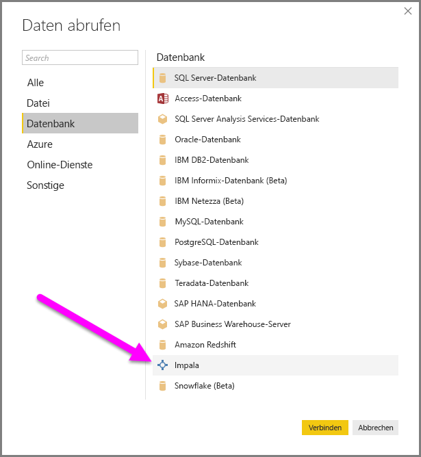
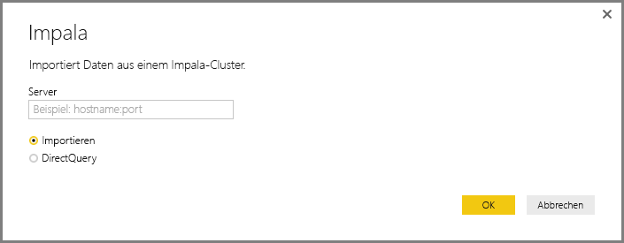
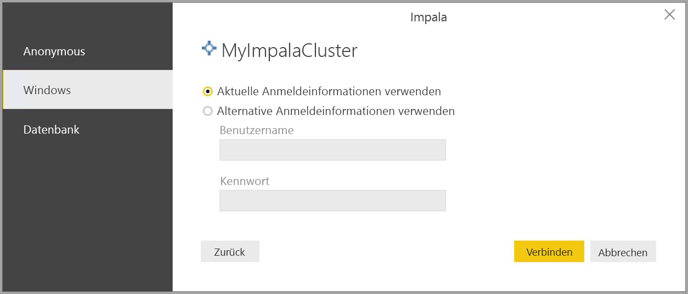
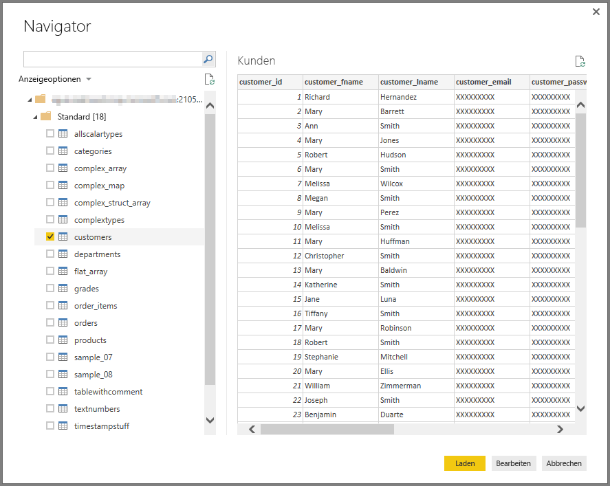

# Herstellen einer Verbindung mit einer Impala-Datenbank in Power BI Desktop
In Power BI Desktop können Sie eine Verbindung mit einer **Impala**-Datenbank herstellen und die zugrunde liegenden Daten wie alle anderen Datenquellen in Power BI Desktop verwenden.

## Herstellen einer Verbindung mit einer Impala-Datenbank
Wählen Sie in Power BI Desktop im Menüband **Start** die Option **Daten abrufen** aus, um eine Verbindung mit einer **Impala**-Datenbank herzustellen. Wählen Sie in den Kategorien auf der linken Seite **Datenbank** aus. Anschließend wird **Impala** angezeigt.

Geben Sie im angezeigten Fenster **Impala** den Namen des Impala-Servers in das Feld ein, oder fügen Sie ihn ein, und klicken Sie auf **OK**. Sie können Daten entweder direkt in Power BI **importieren** oder **DirectQuery** verwenden. Weitere Informationen finden Sie unter [Verwendung von DirectQuery](desktop-use-directquery.md).

Wenn Sie dazu aufgefordert werden, geben Sie Ihre Anmeldeinformationen ein, oder stellen Sie anonym eine Verbindung her. Der Impala-Connector unterstützt die Authentifizierung „Anonym“, „Basic“ (Benutzername + Kennwort) und „Windows“.

> [!NOTE]
> Wenn Sie Ihren Benutzernamen und Ihr Kennwort für einen bestimmten **Impala**-Server eingefügt haben, werden von Power BI Desktop für anschließende Verbindungen die gleichen Anmeldeinformationen verwendet. Sie können diese Anmeldeinformationen unter **Datei > Optionen und Einstellungen > Datenquelleneinstellungen** ändern.
> 
> 

Nachdem die Verbindung erfolgreich hergestellt wurde, wird das Fenster **Navigator** mit den auf dem Server verfügbaren Daten angezeigt. Aus diesen können Sie ein oder mehrere Elemente auswählen, die importiert und in **Power BI Desktop** verwendet werden sollen.

## Überlegungen und Einschränkungen
Beim **Impala**-Connector sind einige Einschränkungen und Überlegungen zu beachten:

* Der Impala-Connector wird auf dem lokalen Datengateway mit einem der drei unterstützten Authentifizierungsmechanismen unterstützt.

## Nächste Schritte
Sie können mithilfe von Power BI Desktop eine Verbindung mit Daten jeglicher Art herstellen. Weitere Informationen zu Datenquellen finden Sie in folgenden Ressourcen:

* [Erste Schritte mit Power BI Desktop](desktop-getting-started.md)
* [Datenquellen in Power BI Desktop](desktop-data-sources.md)
* [Strukturieren und Kombinieren von Daten mit Power BI Desktop](desktop-shape-and-combine-data.md)
* [Verbinden mit Excel in Power BI Desktop](desktop-connect-excel.md)   
* [Eingeben von Daten direkt in Power BI Desktop](desktop-enter-data-directly-into-desktop.md)   

