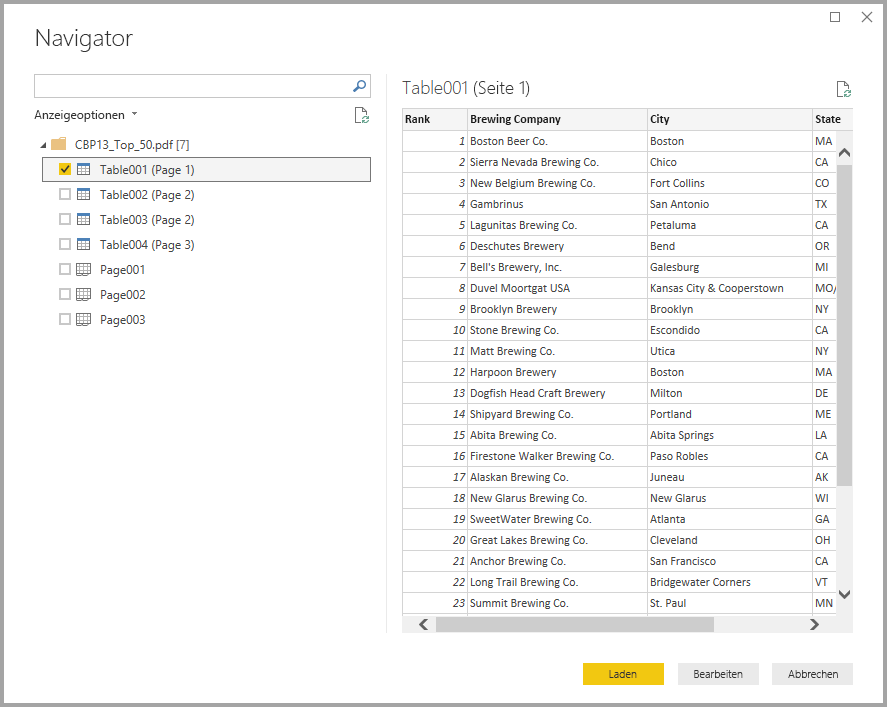
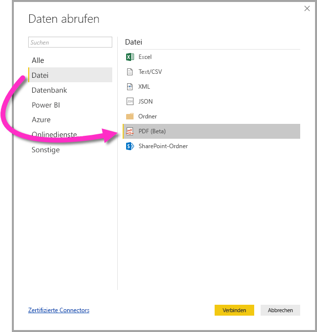

# Verbinden mit einer PDF-Datei in Power BI Desktop (Vorschau)
In Power BI Desktop können Sie eine Verbindung mit einer **PDF-Datei** herstellen und die enthaltenen Daten wie alle anderen Datenquellen in Power BI Desktop verwenden.

In den folgenden Abschnitten wird beschrieben, wie Sie eine Verbindung mit einer **PDF-Datei** herstellen, Daten auswählen und diese Daten an **Power BI Desktop** übergeben.

## Aktivieren des PDF-Connectors
Der PDF-Connector befindet sich in der Vorschau für **Power BI Desktop** und muss aktiviert werden. Wenn Sie den Connector aktivieren möchten, klicken Sie auf **Datei > Optionen und Einstellungen > Optionen > Vorschaufeatures**, und aktivieren Sie dann das Kontrollkästchen neben **Daten aus PDF-Dateien abrufen**. 

Sie müssen **Power BI Desktop** neu starten, nachdem Sie die Auswahl vorgenommen haben.

Bei der ersten Verwendung des **PDF-Connectors (Beta)** werden Sie gewarnt, dass sich der PDF-Connector noch in der Entwicklung befindet und sich in Zukunft ändern kann. Klicken Sie auf **Weiter**, um den Connector zu verwenden.

Grundsätzlich wird ein Upgrade auf das neueste Release von **Power BI Desktop** empfohlen. Dieses ist über einen Link in [Power BI Desktop abrufen](desktop-get-the-desktop.md) erhältlich. 

## Verbinden mit einer PDF-Datei
Klicken Sie in Power BI Desktop im Menüband **Start** auf die Option **Daten abrufen**, um eine Verbindung mit einer **PDF**-Datei herzustellen. Wählen Sie in den Kategorien auf der linken Seite **Datei** aus. Anschließend wird **PDF (Beta)** angezeigt.

Sie werden aufgefordert, den Speicherort der PDF-Datei anzugeben, die Sie verwenden möchten. Nachdem Sie den Speicherort angegeben haben und die PDF-Datei geladen wird, wird das **Navigator**-Fenster mit den in der Datei verfügbaren Daten angezeigt. Aus diesen können Sie ein oder mehrere Elemente auswählen, die importiert und in **Power BI Desktop** verwendet werden sollen.

Wenn Sie das Kontrollkästchen neben den in der PDF-Datei ermittelten Elementen aktivieren, werden sie im rechten Bereich angezeigt. Wenn Sie bereit zum Importieren sind, klicken Sie auf die Schaltfläche **Laden**, um die Daten in **Power BI Desktop** zu importieren.

Ab der November 2018-Version von **Power BI Desktop** können Sie die **Startseite** und die **Endseite** als optionale Parameter für Ihre PDF-Verbindung angeben. Darüber hinaus können Sie diese Parameter unter Verwendung des folgenden Formats in der Formelsprache „M“ angeben:

`Pdf.Tables(File.Contents("c:\sample.pdf"), [StartPage=10, EndPage=11])`

## Nächste Schritte
Sie können mithilfe von Power BI Desktop eine Verbindung mit Daten jeglicher Art herstellen. Weitere Informationen zu Datenquellen finden Sie in folgenden Ressourcen:

* [Was ist Power BI Desktop?](desktop-what-is-desktop.md)
* [Datenquellen in Power BI Desktop](desktop-data-sources.md)
* [Strukturieren und Kombinieren von Daten mit Power BI Desktop](desktop-shape-and-combine-data.md)
* [Verbinden mit Excel in Power BI Desktop](desktop-connect-excel.md)   
* [Eingeben von Daten direkt in Power BI Desktop](desktop-enter-data-directly-into-desktop.md)   

