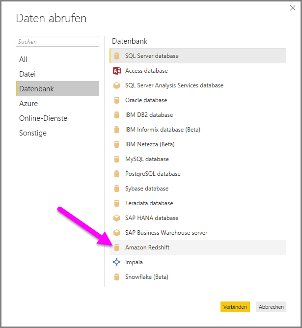
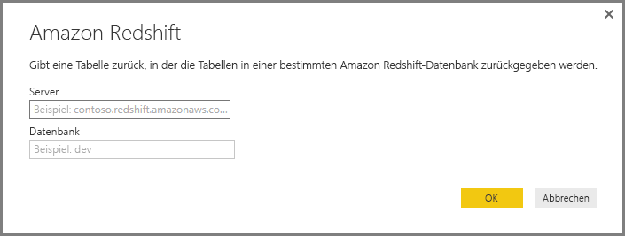
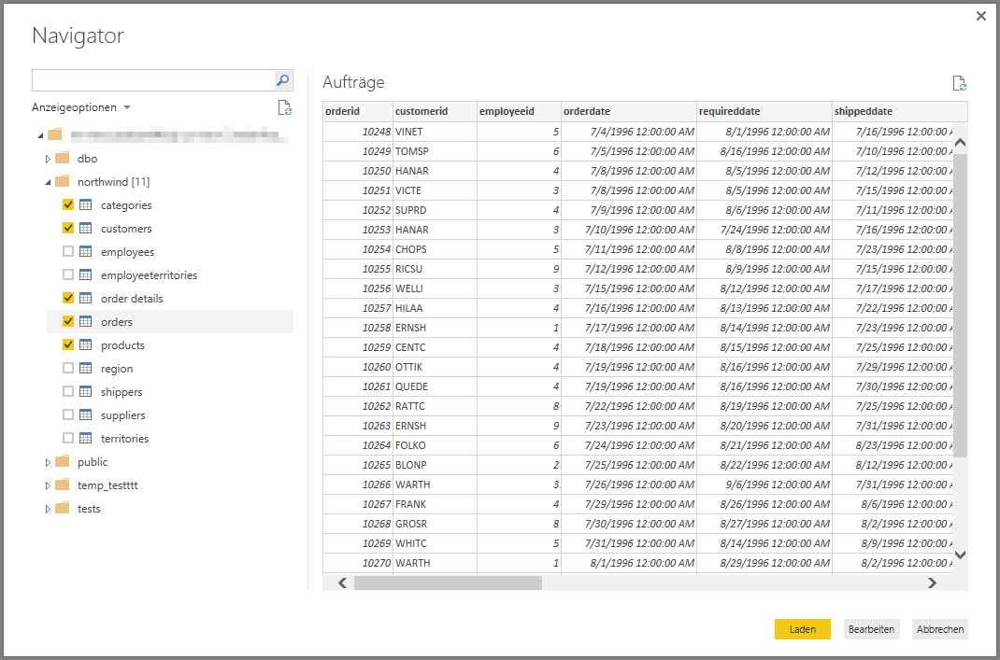

# Verbinden mit Amazon Redshift in Power BI Desktop
In **Power BI Desktop** können Sie eine Verbindung mit einer **Amazon Redshift**-Datenbank herstellen und die zugrunde liegenden Daten wie alle anderen Datenquellen in Power BI Desktop verwenden.

## Herstellen einer Verbindung mit einer Amazon Redshift-Datenbank
Klicken Sie in Power BI Desktop im Menüband **Start** auf die Option **Daten abrufen**, um eine Verbindung mit einer **Amazon Redshift**-Datenbank herzustellen. Wählen Sie in den Kategorien auf der linken Seite **Datenbank** aus. Anschließend wird **Amazon Redshift** angezeigt.

Geben Sie im angezeigten Fenster **Amazon Redshift** den Namen des **Amazon Redshift**-Servers und der Amazon Redshift-Datenbank in das Feld ein, oder fügen Sie sie ein. Im Feld *Server* können Benutzer einen Port im folgenden Format eingeben: *ServerURL:Port*

Wenn Sie dazu aufgefordert werden, geben Sie Ihren Benutzernamen und Ihr Kennwort ein. Sie sollten den Servernamen verwenden, der exakt mit dem SSL-Zertifikat übereinstimmt, um Fehler zu vermeiden. 

Nachdem die Verbindung erfolgreich hergestellt wurde, wird das Fenster **Navigator** mit den auf dem Server verfügbaren Daten angezeigt. Aus diesen können Sie ein oder mehrere Elemente auswählen, die importiert und in **Power BI Desktop** verwendet werden sollen.

Sobald Sie im Fenster **Navigator** eine Auswahl vornehmen, können Sie die Daten **laden** oder **bearbeiten**.

* Wenn Sie die Option zum **Laden** von Daten ausgewählt haben, werden Sie aufgefordert, hierzu den Modus *importieren* oder *DirectQuery* zu verwenden. Weitere Informationen finden Sie in diesem [Artikel, in dem DirectQuery erläutert wird](desktop-use-directquery.md).
* Wenn Sie die Option zum **Bearbeiten** der Daten ausgewählt haben, wird der **Abfrage-Editor** angezeigt. In diesem können Sie alle Arten von Transformationen und Filtern auf die Daten anwenden, von denen viele auf die zugrunde liegende **Amazon Redshift**-Datenbank selbst angewendet werden (sofern unterstützt).

## Nächste Schritte
Sie können mithilfe von Power BI Desktop eine Verbindung mit Daten jeglicher Art herstellen. Weitere Informationen zu Datenquellen finden Sie in folgenden Ressourcen:

* [Was ist Power BI Desktop?](desktop-what-is-desktop.md)
* [Datenquellen in Power BI Desktop](desktop-data-sources.md)
* [Strukturieren und Kombinieren von Daten mit Power BI Desktop](desktop-shape-and-combine-data.md)
* [Verbinden mit Excel in Power BI Desktop](desktop-connect-excel.md)   
* [Eingeben von Daten direkt in Power BI Desktop](desktop-enter-data-directly-into-desktop.md)   

