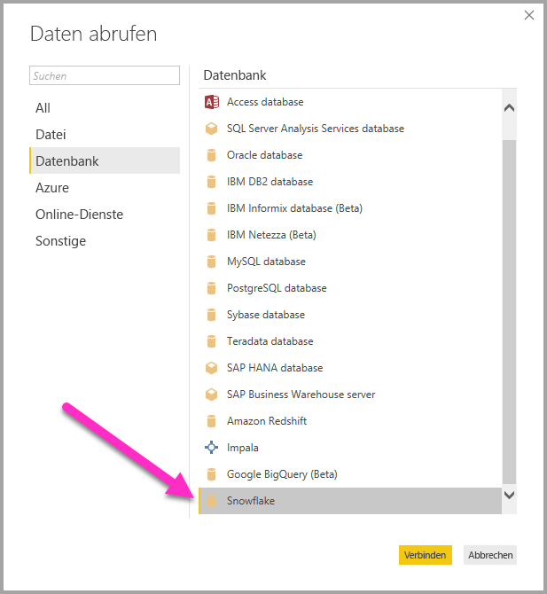
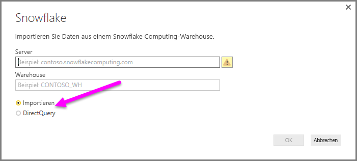
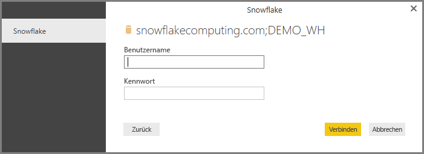
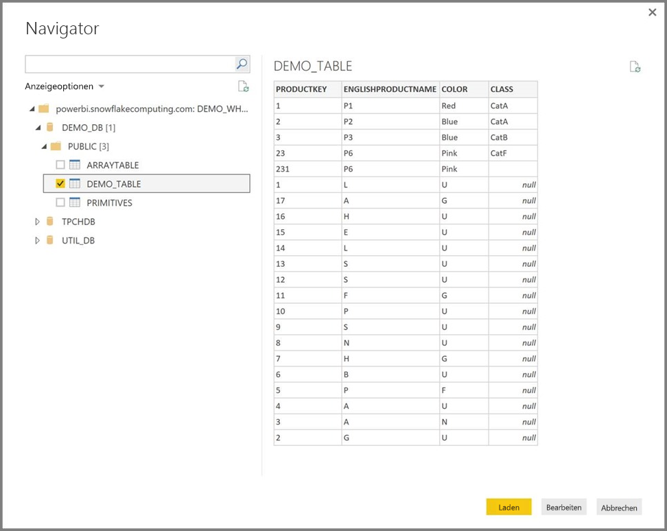

# Verbinden mit Snowflake in Power BI Desktop
In Power BI Desktop können Sie eine Verbindung mit einem **Snowflake Computing**-Warehouse herstellen und die zugrunde liegenden Daten wie jede andere Datenquelle in Power BI Desktop verwenden. 

> [!NOTE]
> Sie *müssen* zudem auf Computern, die den **Snowflake**-Connector verwenden, den **Snowflake-ODBC-Treiber installieren.** Dessen Architektur – 32 Bit oder 64 Bit – muss der Installation von **Power BI Desktop** entsprechen. Klicken Sie einfach auf den folgenden Link und [laden Sie den entsprechenden Snowflake-ODBC-Treiber herunter](http://go.microsoft.com/fwlink/?LinkID=823762).
> 
> 

## Verbinden mit einem Snowflake Computing-Warehouse
Klicken Sie in Power BI Desktop im Menüband **Start** auf **Daten abrufen**, um eine Verbindung mit einem **Snowflake Computing**-Warehouse herzustellen. Wählen Sie in den Kategorien auf der linken Seite **Datenbank** aus. Anschließend wird **Snowflake** angezeigt.

Geben Sie im angezeigten Fenster **Snowflake** den Namen des Snowflake Computing-Warehouse in das Feld ein, oder fügen Sie ihn ein, und klicken Sie auf **OK**. Sie können Daten entweder direkt in Power BI **importieren** oder **DirectQuery** verwenden. Weitere Informationen finden Sie unter [Verwendung von DirectQuery](desktop-use-directquery.md).

Wenn Sie dazu aufgefordert werden, geben Sie Ihren Benutzernamen und Ihr Kennwort ein.

> [!NOTE]
> Wenn Sie Ihren Benutzernamen und Ihr Kennwort für einen bestimmten **Snowflake**-Server eingefügt haben, werden von Power BI Desktop für anschließende Verbindungen die gleichen Anmeldeinformationen verwendet. Sie können diese Anmeldeinformationen unter **Datei > Optionen und Einstellungen > Datenquelleneinstellungen** ändern.
> 
> 

Nachdem die Verbindung erfolgreich hergestellt wurde, wird das Fenster **Navigator** mit den auf dem Server verfügbaren Daten angezeigt. Aus diesen können Sie ein oder mehrere Elemente auswählen, die importiert und in **Power BI Desktop** verwendet werden sollen.

Sie können die ausgewählte Tabelle **laden**, um die gesamte Tabelle in **Power BI Desktop** zu importieren, oder Sie können die Abfrage **bearbeiten**. Wenn Sie „Bearbeiten“ auswählen, wird der **Abfrage-Editor** geöffnet, sodass Sie den Satz der zu verwendenden Daten filtern und aufbereiten können, um diesen aufbereiteten Satz von Daten anschließend in **Power BI Desktop** zu laden.

## Nächste Schritte
Sie können mithilfe von Power BI Desktop eine Verbindung mit Daten jeglicher Art herstellen. Weitere Informationen zu Datenquellen finden Sie in folgenden Ressourcen:

* [Was ist Power BI Desktop?](desktop-what-is-desktop.md)
* [Datenquellen in Power BI Desktop](desktop-data-sources.md)
* [Strukturieren und Kombinieren von Daten mit Power BI Desktop](desktop-shape-and-combine-data.md)
* [Verbinden mit Excel in Power BI Desktop](desktop-connect-excel.md)   
* [Eingeben von Daten direkt in Power BI Desktop](desktop-enter-data-directly-into-desktop.md)   

