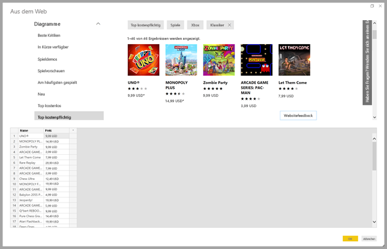
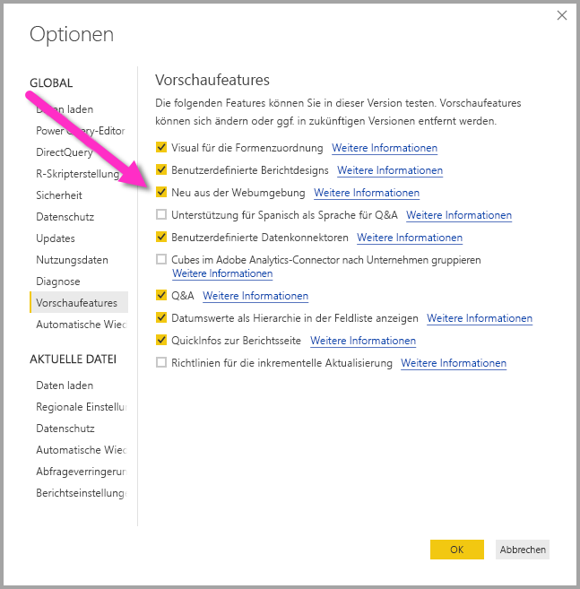
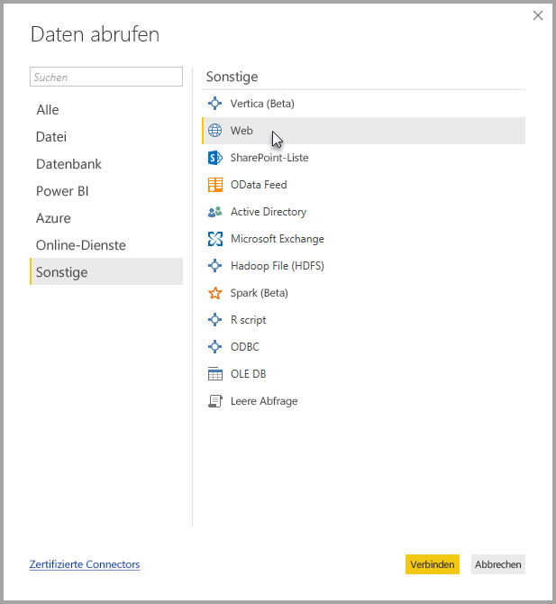
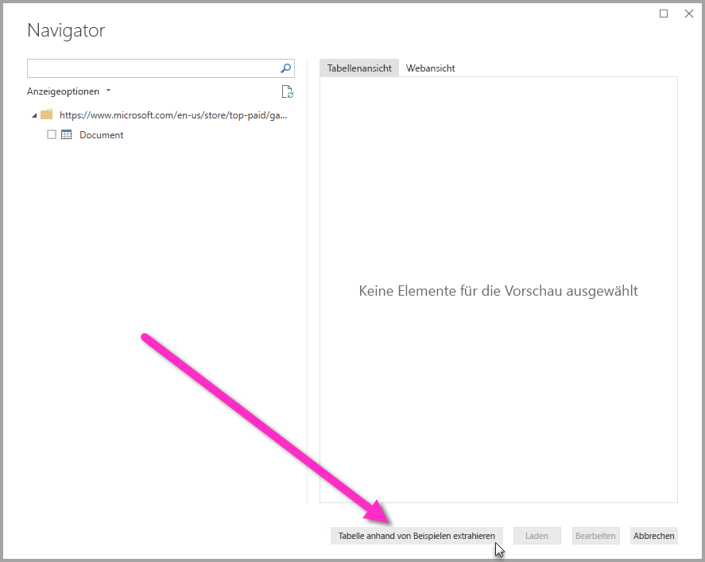
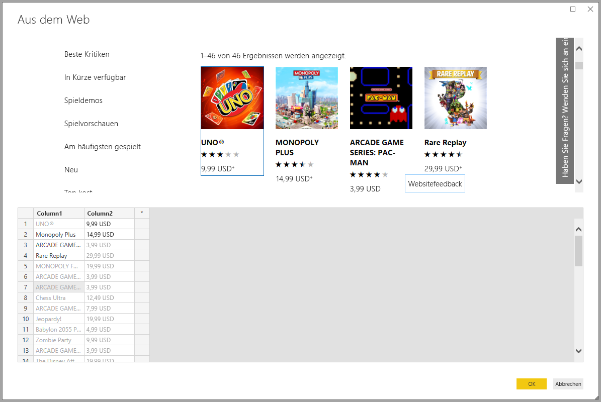
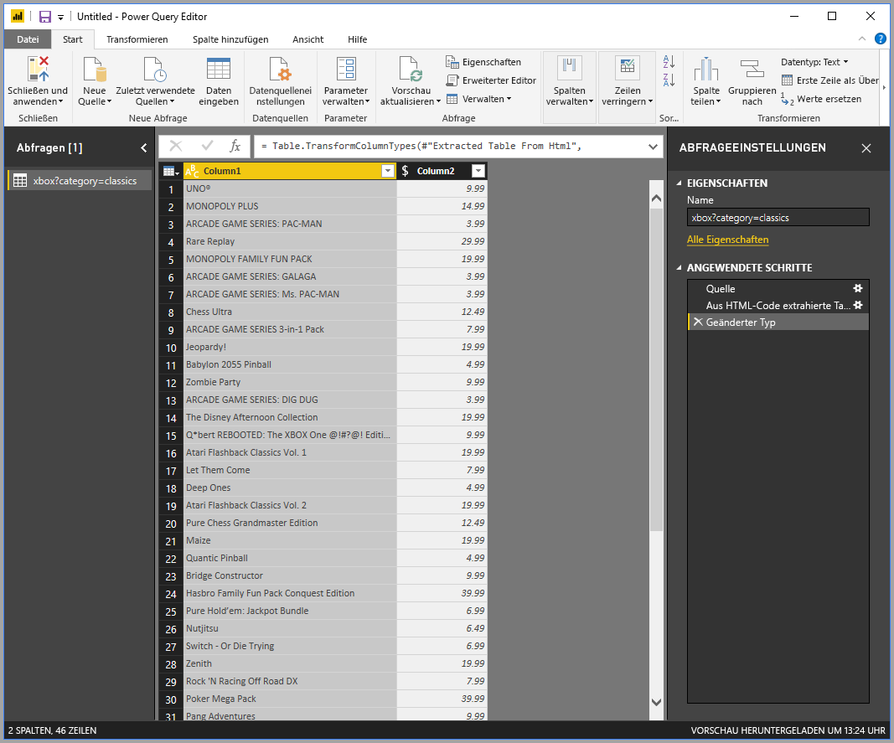

# Abrufen von Daten aus einer Webseite durch Angeben von Beispielen (Vorschau)

Durch Abrufen von Daten aus einer Webseite können Benutzer Daten ganz einfach aus Webseiten extrahieren und in **Power BI Desktop** importieren. Häufig liegen Daten auf Webseiten jedoch nicht in ordentlichen Tabellen vor, die sich problemlos extrahieren lassen. Das Abrufen von Daten aus solchen Seiten kann also – auch wenn die Daten strukturiert und konsistent sind – eine ziemliche Herausforderung sein. 

Es gibt jedoch eine Lösung: Mit dem Feature **Daten anhand von Beispielen aus dem Web abrufen** können Sie **Power BI Desktop** zeigen, welche Daten Sie extrahieren möchten, indem Sie im Connector-Dialogfeld mindestens ein Beispiel angeben. Power BI Desktop erfasst dann weitere Daten auf der Seite, die Ihren Beispielen entsprechen. Mit dieser Lösung können Sie alle Arten von Daten aus Webseiten extrahieren, also Daten in Tabellen *und* Daten, die sich nicht in Tabellen befinden. 

## Aktivieren des Vorschaufeatures „Daten anhand von Beispielen aus dem Web abrufen“

Das Feature **Daten anhand von Beispielen aus dem Web abrufen** befindet sich in der Vorschau und muss in **Power BI Desktop** aktiviert werden. Wählen Sie **Datei > Optionen und Einstellungen > Optionen > Vorschaufeatures** aus, und aktivieren Sie anschließend das Kontrollkästchen für **Neu aus der Webumgebung**. Sie müssen Power BI Desktop neu starten, nachdem Sie die Auswahl vorgenommen haben.

Sobald das Vorschaufeature aktiviert ist, können Sie es verwenden. 

## Verwenden von „Daten anhand von Beispielen aus dem Web abrufen“

Um **Daten anhand von Beispielen aus dem Web abrufen** zu verwenden, klicken Sie im Menübandmenü **Start** auf **Daten abrufen**. Wählen Sie im angezeigten Fenster links im Bereich der Kategorien die Option **Andere** und dann **Web** aus.

Geben Sie dort die URL der Webseite ein, aus der Sie Daten extrahieren möchten. In diesem Artikel verwenden wir die Microsoft Store-Webseite und zeigen, wie dieser Connector funktioniert. 

Wenn Sie das Prozedere nachvollziehen möchten, können Sie die gleiche [Microsoft Store-URL](https://www.microsoft.com/en-us/store/top-paid/games/xbox?category=classics) verwenden wie in diesem Artikel:

    https://www.microsoft.com/en-us/store/top-paid/games/xbox?category=classics

Wenn Sie auf **OK** klicken, werden Sie zum Dialogfeld **Navigator** weitergeleitet, in dem alle automatisch erkannten Tabellen der Webseite angezeigt werden. In der Abbildung unten wurden keine Tabellen gefunden, unten auf der Seite befindet sich jedoch eine Schaltfläche namens **Tabelle anhand von Beispielen extrahieren**, über die Sie Beispiele angeben können.

Wenn Sie **Tabelle anhand von Beispielen extrahieren** auswählen, wird ein interaktives Fenster geöffnet, in dem Sie eine Vorschau des Webseiteninhalts anzeigen und Beispielwerte für die Daten angeben können, die Sie extrahieren möchten. 

In diesem Beispiel extrahieren wir den *Namen* und den *Preis* für jedes Spiel auf der Seite. Hierzu geben wir für jede Spalte einige Beispiele von der Seite an, wie in der folgenden Abbildung gezeigt. Wenn diese Beispiele eingegeben sind, kann **Power Query** (die zugrunde liegende Technologie, die die Daten von der Webseite extrahiert) mithilfe von intelligenten Algorithmen Daten extrahieren, die dem Muster der Beispieleinträge entsprechen.

Sobald wir mit den von der Webseite extrahierten Daten zufrieden sind, klicken wir auf **OK**, um zum **Abfrage-Editor** zu wechseln. Dort können wir weitere Transformationen anwenden oder die Daten formen, indem wir diese Daten mit Daten aus anderen Quellen kombinieren.

Nun können Sie Visuals erstellen oder die Webseitendaten auf andere Weise nutzen, wenn Sie Ihre **Power BI Desktop**-Berichte erstellen.

## Nächste Schritte
Es gibt viele verschiedene Arten von Daten, mit denen Sie über **Power BI Desktop** eine Verbindung herstellen können. Weitere Informationen zu Datenquellen finden Sie in folgenden Ressourcen:

* [Hinzufügen einer Spalte anhand von Beispielen](desktop-add-column-from-example.md)
* [Herstellen einer Verbindung mit einer Webseite](desktop-connect-to-web.md)
* [Datenquellen in Power BI Desktop](desktop-data-sources.md)
* [Strukturieren und Kombinieren von Daten mit Power BI Desktop](desktop-shape-and-combine-data.md)
* [Verbinden mit Excel in Power BI Desktop](desktop-connect-excel.md)   
* [Verbinden mit CSV-Dateien in Power BI Desktop](desktop-connect-csv.md)   
* [Eingeben von Daten direkt in Power BI Desktop](desktop-enter-data-directly-into-desktop.md)   

