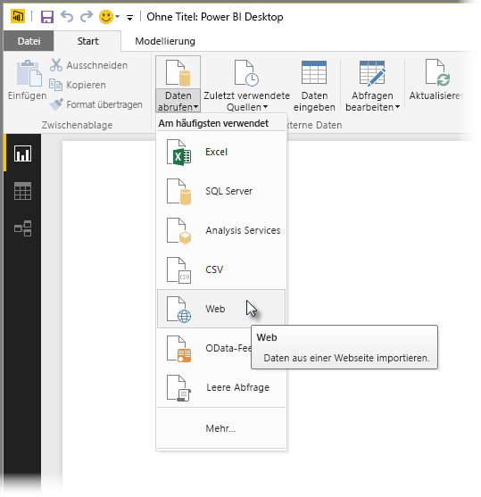
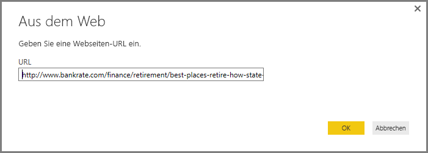
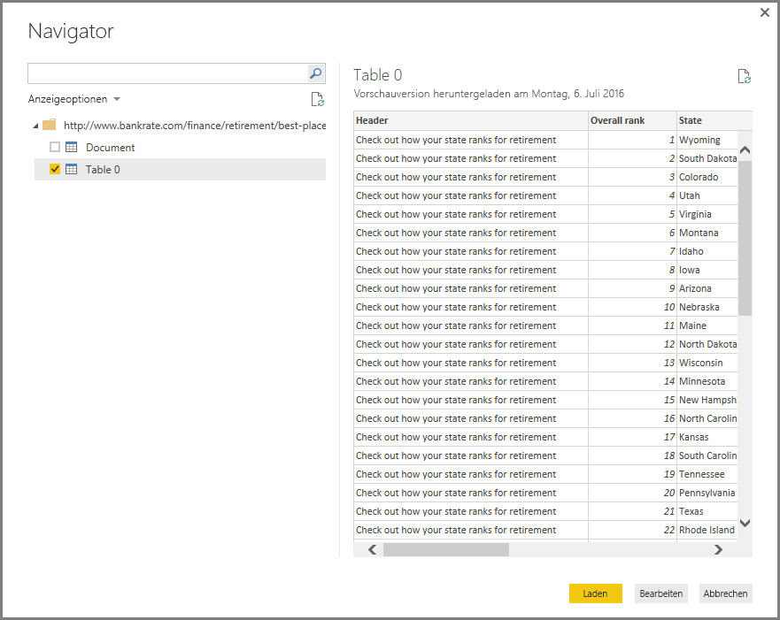
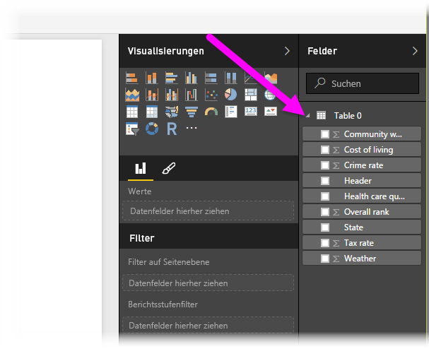

# Verbinden mit einer Webseite in Power BI Desktop
Sie können eine Verbindung mit einer Webseite herstellen und deren Daten in Power BI Desktop importieren, um sie in Ihren Visuals und Datenmodellen zu verwenden.

Wählen Sie in Power BI Desktop auf dem Menüband **Start** die Option **Daten abrufen > Web** aus.

Ein Dialogfeld wird angezeigt, das Sie nach der URL der Webseite fragt, von der Sie Daten importieren möchten.

Nachdem Sie die URL eingegeben (oder eingefügt) haben, wählen Sie **OK** aus. Power BI Desktop stellt eine Verbindung mit dieser Seite her und zeigt anschließend die verfügbaren Daten der Seite im Fenster **Navigator** an. Wenn Sie eines der verfügbaren Datenelemente wie z.B. eine Tabelle der gesamten Seite auswählen, wird im Fenster **Navigator** auf der rechten Seite eine Vorschau der Daten angezeigt.

Sie können die Schaltfläche **Bearbeiten** auswählen, wodurch der **Abfrage-Editor** gestartet wird, über den Sie die Daten dieser Webseite strukturieren und transformieren können, bevor Sie sie in Power BI Desktop importieren. Alternativ können Sie die Schaltfläche **Laden** auswählen und alle Datenelemente importieren, die Sie im linken Bereich ausgewählt haben.

Wenn Sie **Laden** auswählen, importiert Power BI Desktop die ausgewählten Elemente und stellt sie im Bereich **Felder** auf der rechten Seite der Berichtsansicht in Power BI Desktop zur Verfügung.

Das ist auch schon alles, was Sie tun müssen, um eine Verbindung mit einer Webseite herzustellen und deren Daten in Power BI Desktop zu importieren.

Von dort aus können Sie diese Felder auf den Berichtszeichenbereich ziehen und alle Visualisierungen erstellen, die Sie möchten. Sie können die Daten der Webseite wie alle anderen Daten auch verwenden: Sie können sie strukturieren, Beziehungen zwischen ihnen und anderen Datenquellen in Ihrem Modell erstellen und andernfalls tun, was Sie möchten, um genau den Power BI-Bericht zu erstellen, den Sie möchten.

Sehen Sie sich das Handbuch [Erste Schritte mit Power BI Desktop](desktop-getting-started.md) an, um einen detaillierteren Einblick in das Verbinden mit einer Webseite zu erhalten.

### Nächste Schritte
Sie können mithilfe von Power BI Desktop eine Verbindung mit Daten jeglicher Art herstellen. Weitere Informationen zu Datenquellen finden Sie in folgenden Ressourcen:

* [Datenquellen in Power BI Desktop](desktop-data-sources.md)
* [Strukturieren und Kombinieren von Daten mit Power BI Desktop](desktop-shape-and-combine-data.md)
* [Verbinden mit Excel in Power BI Desktop](desktop-connect-excel.md)   
* [Verbinden mit CSV-Dateien in Power BI Desktop](desktop-connect-csv.md)   
* [Eingeben von Daten direkt in Power BI Desktop](desktop-enter-data-directly-into-desktop.md)   

