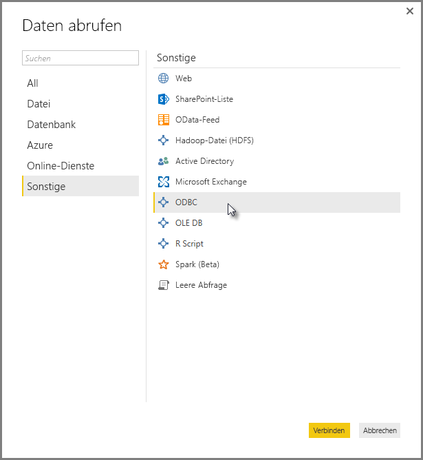
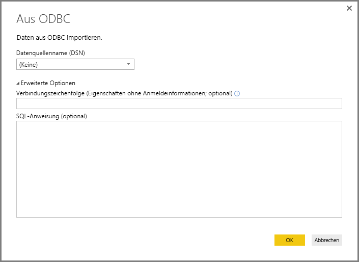
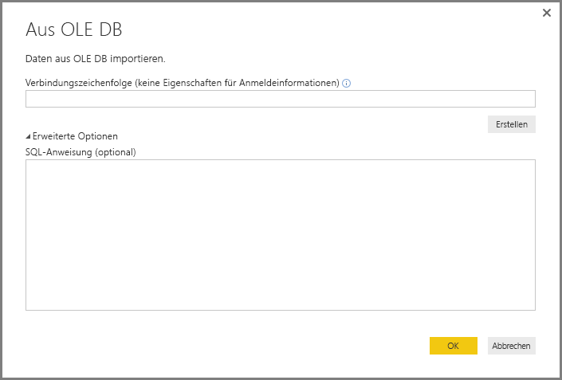
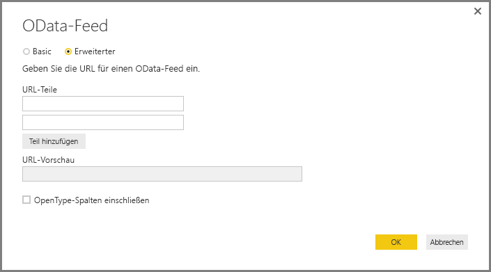
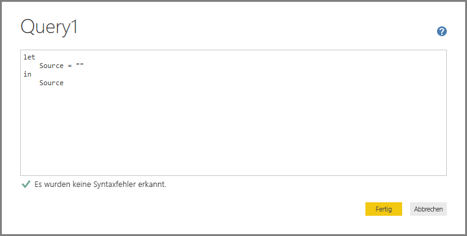
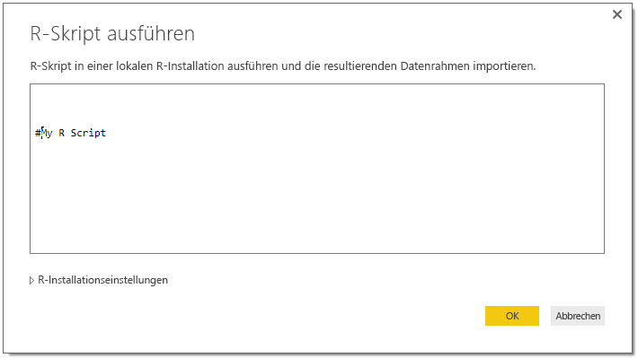

# Herstellen einer Verbindung mit Daten mithilfe generischer Schnittstellen in Power BI Desktop
Sie können mithilfe integrierter Datenconnectors, die von **Access-Datenbanken** bis zu **Zendesk**-Ressourcen reichen und im Fenster **Daten abrufen** aufgeführt sind, eine Verbindung mit zahlreichen unterschiedlichen Datenquellen in **Power BI Desktop** herstellen. Sie können auch eine Verbindung mit verschiedenen *anderen* Datenquellen herstellen. So verfügen Sie noch über weitaus mehr Verbindungsoptionen, indem Sie generische Schnittstellen (z.B. **ODBC** oder **REST-APIs**) verwenden, die in **Power BI Desktop** integriert sind.

## Power BI Desktop-Datenschnittstellen
**Power BI Desktop** enthält eine ständig wachsende Sammlung von Datenconnectors, die dem Herstellen der Verbindung mit einer bestimmten Datenquelle dienen. Beispielsweise stellt der Datenconnector **SharePoint-Liste** während der Verbindungssequenz bestimmte Felder und unterstützende Informationen bereit, die für **SharePoint-Listen** vorgesehen sind. Dies ist der Fall, wenn Sie **Daten abrufen > Sonstige** auswählen, um sonstige Datenquellen im Fenster anzuzeigen (siehe Abbildung oben).

Zudem können Sie in **Power BI Desktop** eine Verbindung mit Datenquellen herstellen, die nicht in den Listen in **Daten abrufen** aufgeführt sind, indem Sie eine der folgenden generischen Datenschnittstellen verwenden:

* **ODBC**
* **OLE DB**
* **OData**
* **REST-APIs**
* **R-Skript**

Durch die Bereitstellung der entsprechenden Parameter in den Verbindungsfenstern, die durch diese generischen Schnittstellen angezeigt werden, wird die Auswahl der Datenquellen, die Sie in **Power BI Desktop** aufrufen und verwenden können, wesentlich erweitert.

In den folgenden Abschnitten finden Sie Listen der Datenquellen, auf die über diese generischen Schnittstellen zugegriffen werden kann.

Finden Sie eine Datenquelle nicht, die Sie in **Power BI Desktop** verwenden möchten? Senden Sie Ihre Vorschläge an die [Liste der Vorschläge und Anforderungen](https://ideas.powerbi.com/) des Power BI-Teams.

## Datenquellen mit Zugriff über ODBC
Mit dem **ODBC**-Connector in **Power BI Desktop** können Sie Daten über den ODBC-Treiber von Drittanbietern importieren, indem Sie einfach einen **Datenquellennamen (DSN)** oder eine *Verbindungszeichenfolge* angeben. Optional können Sie auch eine SQL-Anweisung angeben, die für den ODBC-Treiber ausgeführt werden soll.

In der folgenden Liste sind einige Beispiele für Datenquellen aufgeführt, mit denen **Power BI Desktop** eine Verbindung über die generische **ODBC**-Schnittstelle herstellen kann.

| Generischer Power BI Desktop-Connector | Externe Datenquelle | Link für weitere Informationen |
| --- | --- | --- |
| ODBC |Cassandra |[Cassandra-ODBC-Treiber](http://www.simba.com/drivers/cassandra-odbc-jdbc/) |
| ODBC |Couchbase DB |[Couchbase und Power BI](https://powerbi.microsoft.com/blog/visualizing-data-from-couchbase-server-v4-using-power-bi/) |
| ODBC |DynamoDB |[DynamoDB-ODBC-Treiber](http://www.simba.com/drivers/dynamodb-odbc-jdbc/) |
| ODBC |BigQuery von Google |[BigQuery-ODBC-Treiber](http://www.simba.com/drivers/bigquery-odbc-jdbc/) |
| ODBC |HBase |[HBase-ODBC-Treiber](http://www.simba.com/drivers/hbase-odbc-jdbc/) |
| ODBC |Hive |[Hive-ODBC-Treiber](http://www.simba.com/drivers/hive-odbc-jdbc/) |
| ODBC |IBM Netezza |[Informationen zu IBM Netezza](https://www.ibm.com/support/knowledgecenter/SSULQD_7.2.1/com.ibm.nz.datacon.doc/c_datacon_plg_overview.html) |
| ODBC |Presto |[Presto-ODBC-Treiber](http://www.simba.com/drivers/presto-odbc-jdbc/) |
| ODBC |Project Online |[Project Online-Artikel](desktop-project-online-connect-to-data.md) |
| ODBC |Progress OpenEdge |[Blogeintrag zum Progress OpenEdge-ODBC-Treiber](https://na01.safelinks.protection.outlook.com/?url=https%3A%2F%2Fwww.progress.com%2Fblogs%2Fconnect-microsoft-power-bi-to-openedge-via-odbc-driver&data=02%7C01%7CMatt.Masson%40microsoft.com%7C5e63742e6c454308b58a08d4034b5923%7C72f988bf86f141af91ab2d7cd011db47%7C1%7C0%7C636137069555329811&sdata=gSu2Rq3vZ0uBVOgjaXxd8Y3uBf%2B8DidX6PG33jwAduY%3D&reserved=0) |

## Datenquellen mit Zugriff über OLE DB
Mit dem **OLE DB**-Connector in **Power BI Desktop** können Sie Daten über den OLE DB-Treiber von Drittanbietern importieren, indem Sie einfach eine *Verbindungszeichenfolge* angeben. Optional können Sie auch eine SQL-Anweisung angeben, die für den OLE DB-Treiber ausgeführt werden soll.

In der folgenden Liste sind einige Beispiele für Datenquellen aufgeführt, mit denen **Power BI Desktop** eine Verbindung über die generische **OLE DB**-Schnittstelle herstellen kann.

| Generischer Power BI Desktop-Connector | Externe Datenquelle | Link für weitere Informationen |
| --- | --- | --- |
| OLE DB |SAS OLE DB |[SAS-Anbieter für OLE DB](https://support.sas.com/downloads/package.htm?pid=648) |
| OLE DB |Sybase OLE DB |[Sybase-Anbieter für OLE DB](http://infocenter.sybase.com/help/index.jsp?topic=/com.sybase.infocenter.dc35888.1550/doc/html/jon1256941734395.html) |

## Datenquellen mit Zugriff über OData
Mit dem **OData**-Connector in **Power BI Desktop** können Sie Daten über eine beliebige**OData**-URL importieren, indem Sie einfach die **OData**-URL eingeben oder einfügen. Sie können mehrere URL-Teile hinzufügen, indem Sie diese Links in die Textfelder im Fenster **OData-Feed** eingeben oder einfügen.

In der folgenden Liste sind einige Beispiele für Datenquellen aufgeführt, mit denen **Power BI Desktop** eine Verbindung über die generische **OData**-Schnittstelle herstellen kann.

| Generischer Power BI Desktop-Connector | Externe Datenquelle | Link für weitere Informationen |
| --- | --- | --- |
| OData |In Kürze verfügbar |OData-Datenquellen werden hier in Kürze aufgeführt. |

## Datenquellen mit Zugriff über REST-APIs
Sie können mit **REST-APIs** eine Verbindung mit Datenquellen herstellen und auf diese Weise Daten aus allen Arten von Datenquellen verwenden, die **REST** unterstützen.

In der folgenden Liste sind einige Beispiele für Datenquellen aufgeführt, mit denen **Power BI Desktop** eine Verbindung über die generische **REST-API**-Schnittstelle herstellen kann.

| Generischer Power BI Desktop-Connector | Externe Datenquelle | Link für weitere Informationen |
| --- | --- | --- |
| REST-APIs |Couchbase DB |[Informationen zur Couchbase-REST-API](https://powerbi.microsoft.com/blog/visualizing-data-from-couchbase-server-v4-using-power-bi/) |

## Datenquellen mit Zugriff über R-Skript
Sie können mit **R-Skripts** auf Datenquellen zugreifen und diese Daten in **Power BI Desktop** verwenden.

In der folgenden Liste sind einige Beispiele für Datenquellen aufgeführt, mit denen **Power BI Desktop** eine Verbindung über die generische **R-Skript**-Schnittstelle herstellen kann.

| Generischer Power BI Desktop-Connector | Externe Datenquelle | Link für weitere Informationen |
| --- | --- | --- |
| R-Skript |SAS-Dateien |[Anleitung zu R-Skript vom CRAN](https://cran.r-project.org/doc/manuals/R-data.html) |
| R-Skript |SPSS-Dateien |[Anleitung zu R-Skript vom CRAN](https://cran.r-project.org/doc/manuals/R-data.html) |
| R-Skript |R-Statistikdateien |[Anleitung zu R-Skript vom CRAN](https://cran.r-project.org/doc/manuals/R-data.html) |

## Nächste Schritte
Sie können mithilfe von **Power BI Desktop** eine Verbindung mit allen Arten von Datenquellen herstellen. Weitere Informationen zu Datenquellen finden Sie in folgenden Ressourcen:

* [Was ist Power BI Desktop?](desktop-what-is-desktop.md)
* [Datenquellen in Power BI Desktop](desktop-data-sources.md)
* [Strukturieren und Kombinieren von Daten mit Power BI Desktop](desktop-shape-and-combine-data.md)
* [Verbinden mit Excel in Power BI Desktop](desktop-connect-excel.md)   
* [Eingeben von Daten direkt in Power BI Desktop](desktop-enter-data-directly-into-desktop.md)   

