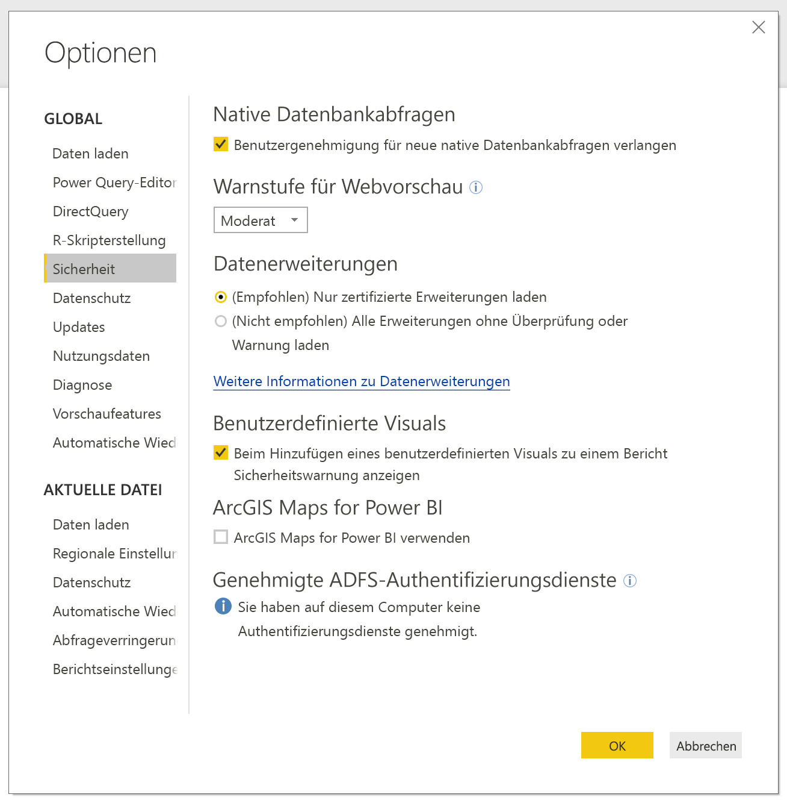
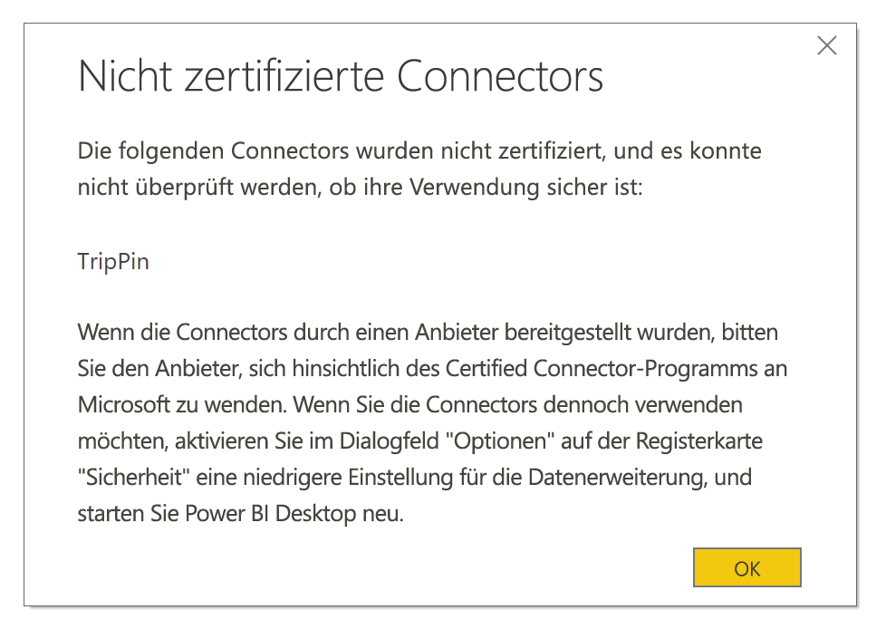

# Connectorerweiterbarkeit in Power BI

In Power BI können Kunden und Entwickler die Datenquellen, mit denen sie sich verbinden können, auf vielfältige Weise erweitern, z. B. über vorhandene Connectors und generische Datenquellen (z. B. ODBC, OData, OLEDB, Web, CSV, XML, JSON). Entwickler können zusätzlich zu diesen Datenquellen Datenerweiterungen erstellen, sogenannte **benutzerdefinierte Connectors**, und einen Connector zertifizieren, sodass er ein **zertifizierter Connector** wird.

Derzeit wird die Verwendung von **benutzerdefinierten Connectors** über einen Featureschalter aktiviert. Bevor dieses Feature aus der Beta-Version in die allgemeine Verfügbarkeit übergeht, wurde ein Menü hinzugefügt, mit dem Sie den benutzerdefinierten Code, den Sie auf Ihrem System ausführen möchten, sicher steuern können. Sie können alle benutzerdefinierten Connectors oder nur Connectors zulassen, die von Microsoft im Dialogfeld **Daten abrufen** zertifiziert und verteilt werden.

## Benutzerdefinierte Connectors

**Benutzerdefinierte Connectors** können zahlreiche Funktionen bereitstellen – von kleinen APIs, die für Ihr Unternehmen wichtig sind, bis hin zu großen branchenspezifischen Diensten, für die Microsoft keinen Connector veröffentlicht hat. Viele dieser Connectors werden vom Hersteller selbst vertrieben. Wenn Sie also einen bestimmten Datenconnector benötigen, sollten Sie sich an einen Hersteller wenden.

Um einen **benutzerdefinierten Connector** zu verwenden, legen Sie ihn in den Ordner *\[Dokumente]\\Power BI Desktop\\Benutzerdefinierte Connectors* und passen Sie die Sicherheitseinstellungen wie im folgenden Abschnitt beschrieben an.

Sie müssen die Sicherheitseinstellungen nicht anpassen, um **zertifizierte Connectors** zu verwenden.

## Sicherheit für Datenerweiterung

Um die Sicherheitseinstellungen der Datenerweiterung zu ändern, wählen Sie in **Power BI Desktop** **Datei > Optionen und Einstellungen > Optionen > Sicherheit** aus.

Unter **Datenerweiterungen** können Sie zwischen zwei Sicherheitsstufen wählen:

* (Empfohlen) Nur zertifizierte Erweiterungen laden
* (Nicht empfohlen) Alle Erweiterungen ohne Überprüfung oder Warnung laden

Wenn Sie **benutzerdefinierte Connectors** oder von Ihnen bzw. von einem Drittanbieter entwickelte und verteilte Connectors verwenden möchten, müssen Sie folgende Option auswählen: **„(Not Recommended) Allow any extension to load without warning“** ((Nicht empfohlen) Alle Erweiterungen ohne Überprüfung oder Warnung laden). Diese Sicherheitseinstellung wird nur empfohlen, wenn Sie **benutzerdefinierte Connectors** ausführen möchten.

Wenn Sie benutzerdefinierte Connectors in Ihrem System verwenden, wird bei der Sicherheitseinstellung **„(Empfohlen)“** ein Fehler angezeigt, der die Connectors beschreibt, die aus Sicherheitsgründen nicht geladen werden können.

Sie müssen Ihre Sicherheitseinstellungen wie oben beschrieben zu **„(Nicht empfohlen)“** ändern und **Power BI Desktop** neu starten, um den Fehler zu beheben und diese Connectors zu verwenden.

## Zertifizierte Connectors

Eine begrenzte Anzahl von Datenerweiterungen gilt als **zertifiziert**. Diese zertifizierten Connectors sind über das Dialogfeld **Daten erhalten** verfügbar, doch für Wartung und Support ist der Drittanbieter verantwortlich, der den Connector erstellt hat. Microsoft verteilt diese Connectors zwar, ist jedoch nicht für deren Leistung oder weitere Funktionalität verantwortlich.

Wenn Sie einen benutzerdefinierten Connector zertifizieren möchten, muss der Hersteller sich an dataconnectors@microsoft.com wenden.
