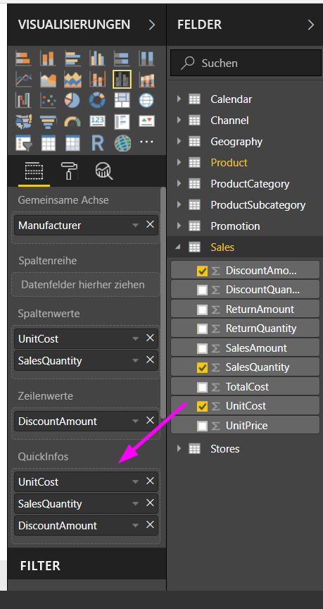
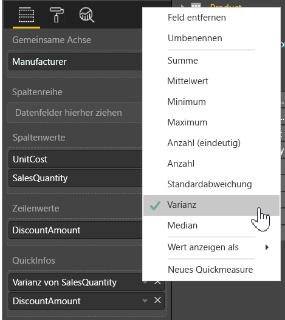

# Anpassen von QuickInfos in Power BI Desktop
QuickInfos sind eine elegante Methode zum Bereitstellen von kontextbezogenen Informationen und Details zu Datenpunkten in einer Visualisierung. Die folgende Abbildung zeigt eine QuickInfo zu einem Diagramm in Power BI Desktop.

Wenn eine Visualisierung erstellt wird, werden in der Standard-QuickInfo der Wert und die Kategorie Datenpunkts angezeigt. Es gibt viele Instanzen beim Anpassen der QuickInfo-Informationen nützlich ist, und kann zusätzlichen Kontext und Informationen für Benutzer, die die Visualisierung anzeigen bereitstellen. Mit QuickInfos können Sie zusätzliche Datenpunkte angeben, die als Teil der QuickInfo angezeigt werden.

## Anpassen von QuickInfos
Zum Erstellen einer benutzerdefinierten QuickInfo in der **Felder** und die **Visualisierungen** Bereich ziehen ein Feld in der **QuickInfos** Bucket in der folgenden Abbildung dargestellt. In der folgenden Abbildung wurden zwei Felder im Bucket **QuickInfos** eingefügt.

Wenn QuickInfos zum Feldbereich hinzugefügt wurden und der Benutzer den Mauszeiger auf einen Datenpunkt in der Visualisierung hält, werden die Werte für diese Felder in der QuickInfo angezeigt.

## Anpassen von QuickInfos mit Aggregation oder Schnellberechnungen
Sie können eine QuickInfo weiter anpassen, indem Sie eine Aggregationsfunktion oder eine *Schnellberechnung* auswählen. Klicken Sie hierfür auf den Pfeil neben dem Feld im Bucket **QuickInfos**, und wählen Sie eine der verfügbaren Optionen aus.

Es gibt viele Möglichkeiten zum Anpassen **QuickInfos**, mit beliebigen Feldern im Dataset, um schnell Informationen und Einblicke für die Benutzer anzeigen, Ihre Dashboards oder Berichte zu übermitteln.

