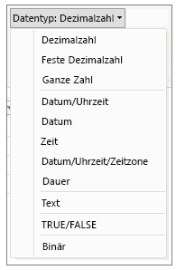

# Datentypen in Power BI Desktop
Dieser Artikel beschreibt Datentypen, die im Power BI Desktop und von DAX (Data Analysis Expressions) unterstützt werden. 

Wenn Sie Daten in Power BI Desktop laden, wird versucht, den Datentyp der Quellspalte in einen Datentyp zu konvertieren, der eine effizientere Speicherung, Berechnung und Datenvisualisierung unterstützt. Wenn beispielsweise eine Spalte mit Werten, die Sie aus Excel importieren, keine Bruchzahlen aufweist, konvertiert der Power BI Desktop die gesamte Spalte mit Daten in einen Ganzzahldatentyp, der für das Speichern von Ganzzahlen besser geeignet ist.

Dieses Konzept ist wichtig, da einige DAX-Funktionen spezielle Anforderungen in Bezug auf Datentypen haben. In vielen Fällen konvertiert DAX zwar implizit einen Datentyp für Sie, es gibt jedoch Fälle, in denen dies nicht der Fall ist.  Wenn eine DAX-Funktion beispielsweise einen Datumsdatentyp erfordert und der Datentyp für die Spalte Text ist, funktioniert die DAX-Funktion nicht ordnungsgemäß.  Daher ist es wichtig und nützlich, den richtigen Datentyp für eine Spalte zu verwenden. Implizite Konvertierungen werden weiter unten in diesem Artikel beschrieben.

## Bestimmen und Angeben des Datentyps einer Spalte
Im Power BI Desktop können Sie den Datentyp einer Spalte im Abfrage-Editor oder in der Datensicht bzw. der Berichtsansicht bestimmen und angeben:

**Datentypen im Abfrage-Editor**

**Datentypen in der Datensicht oder Berichtsansicht**

Die Dropdownliste "Datentyp" im Abfrage-Editor weist zwei Datentypen auf, die derzeit nicht in der Daten- oder Berichtsansicht enthalten sind: **Datum/Uhrzeit/Zeitzone** und **Dauer**. Wenn eine Spalte mit diesen Datentypen in das Modell geladen und in der Daten- oder Berichtansicht angezeigt wird, wird eine Spalte mit einem Datentyp für Datum/Uhrzeit/Zeitzone in einen Datentyp für Datum/Uhrzeit konvertiert, und eine Spalte mit einem Datentyp für die Dauer in eine Dezimalzahl.

### Zahlentypen
Power BI Desktop unterstützt drei Zahlentypen:

**Dezimalzahl** – Stellt eine 64-Bit (Acht Byte)-Gleitkommazahl dar. Es ist der am häufigsten vorkommende Zahlentyp, der Zahlen entspricht, wie sie der allgemeinen Vorstellung entsprechen.  Er ist zwar für die Behandlung von Zahlen mit Bruchwerten vorgesehen, verarbeitet jedoch auch ganze Zahlen.  Der Typ Dezimalzahl kann negative Werte von -1,79E +308 bis -2,23E -308, 0 sowie positive Werte von 2,23E -308 bis -1,79E + 308 behandeln. Beispielsweise sind Zahlen wie 34, 34,01 und 34,000367063 gültige Dezimalzahlen. Der größte Wert, der in einem Typ Dezimalzahl dargestellt werden kann, umfasst 15 Stellen.  Das Dezimaltrennzeichen kann an einer beliebigen Stelle in der Zahl stehen. Der Typ Dezimalzahl entspricht der Art und Weise, wie Excel Zahlen speichert.

**Feste Dezimalzahl** – Besitzt eine feste Position für das Dezimaltrennzeichen. Rechts vom Dezimaltrennzeichen befinden sich immer vier Stellen, insgesamt sind 19 signifikante Stellen möglich.  Der größte Wert, der auf diese Weise dargestellt werden kann, ist 922.337.203.685.477,5807 (positiv oder negativ).  Der Typ Feste Dezimalzahl ist hilfreich in Fällen, in denen durch Runden Fehler entstehen könnten.  Bei der Arbeit mit vielen Zahlen, die kleine Bruchwerte umfassen, können sich diese akkumulieren und zwangsläufig eine leicht abweichende Zahl ergeben.  Da die Werte nach den vier Stellen rechts vom Dezimaltrennzeichen abgeschnitten werden, kann der Typ Feste Dezimalzahl helfen, diese Arten von Fehlern zu vermeiden.   Wenn Sie mit SQL Server vertraut sind: Dieser Datentyp entspricht dem SQL Server Dezimal (19,4), oder dem Währungsdatentyp in Power Pivot. 

**Ganze Zahl** – Stellt einen 64-Bit (8-Byte)-Ganzzahlwert dar. Da es sich um eine Ganzzahl handelt, sind rechts vom Dezimaltrennzeichen keine Ziffern vorhanden. Es sind 19 Ziffern möglich, und zwar positive oder negative ganze Zahlen zwischen -9.223.372.036.854.775.808 (-2^63) und 9.223.372.036.854.775,807 (2^63-1).  Mit diesem Zahlentyp kann die größtmögliche Zahl der verschiedenen numerischen Datentypen dargestellt werden.  Wie beim Typ Feste Dezimalzahl kann auch der Typ Ganzzahl in Fällen hilfreich sein, in denen eine Rundungssteuerung erforderlich ist. 

### Datum/Uhrzeit-Typen
Power BI Desktop unterstützt fünf Datum/Uhrzeit-Datentypen in der Abfrageansicht und drei in der Berichtsansicht und im Modell.   Sowohl Datum/Uhrzeit/Zeitzone als auch die Dauer werden beim Laden in das Modell konvertiert.

**Datum/Uhrzeit** – Stellt einen Datums-und einen Uhrzeitwert dar.  Im Hintergrund wird der Datum/Uhrzeit-Wert als Dezimalzahltyp gespeichert.  Daher können Sie zwischen den beiden konvertieren.   Der Uhrzeitteil eines Datums wird als Bruchteil von ganzen Vielfachen von 1/300 Sekunden (3,33 ms) gespeichert.  Datumsangaben zwischen den Jahren 1900 und 9999 werden unterstützt.

**Datum** – Stellt nur ein Datum (ohne Uhrzeitteil) dar.  Bei der Konvertierung in das Modell entspricht ein Datum einem Datum/Uhrzeitwert mit 0 (null) für den Bruchteilwert.

**Uhrzeit** – Stellt nur die Uhrzeit dar (kein Datumsteil).  Bei der Konvertierung in das Modell entspricht ein Uhrzeitwert einem Datum/Uhrzeit-Wert ohne Ziffern links vom Dezimaltrennzeichen.

**Datum/Uhrzeit/Zeitzone** – Stellt einen UTC-Datum/Uhrzeit-Wert dar.  Dieser wird derzeit beim Laden in das Modell in einen Datum/Uhrzeit-Wert konvertiert.

**Dauer** – Stellt eine Zeitspanne dar. Sie wird beim Laden in das Modell in einen Dezimalzahlentyp konvertiert.  Als Dezimalzahlentyp kann sie einem Datum-/Uhrzeitfeld hinzugefügt oder davon subtrahiert werden und ergibt korrekte Ergebnisse.  Als Dezimalzahlentyp können Sie sie problemlos in Visualisierungen verwenden, die Größe anzeigen.

### Texttyp
**Text** – Eine Datenzeichenfolge von Unicode-Zeichen. Hierbei kann es sich um Zeichenfolgen, Zahlen oder Datumsangaben handeln, die im Textformat dargestellt werden. Die maximale Zeichenfolgenlänge beträgt 268.435.456 Unicode-Zeichen (256 Megazeichen) oder 536.870.912 Bytes.

### Wahr/Falsch-Typ
**Wahr/Falsch** – Ein boolescher Wert, der entweder auf Wahr oder Falsch gesetzt wird.

### Leerzeichen-/Null-Typ
**Leer** – Ein Datentyp in DAX, der SQL-Nullen darstellt und ersetzt. Sie können mit der [BLANK](http://msdn.microsoft.com/library/ee634820.aspx)-Funktion ein Leerzeichen erstellen und mit der logischen [ISBLANK](https://msdn.microsoft.com/library/ee634204.aspx)-Funktion nach Leerzeichen suchen.

### Tabellendatentyp
DAX verwendet einen Tabellendatentyp in vielen Funktionen, z. B. in Aggregationen und Zeitintelligenzberechnungen. Einige Funktionen erfordern einen Verweis auf eine Tabelle, während andere Funktionen eine Tabelle zurückgeben, die dann als Eingabe für andere Funktionen verwendet werden kann. In einigen Funktionen, die eine Tabelle als Eingabe erfordern, können Sie einen Ausdruck angeben, der eine Tabelle ergibt. Bei einigen Funktionen ist ein Verweis auf eine Basistabelle erforderlich. Informationen zu den Anforderungen bestimmter Funktionen finden Sie unter [DAX-Funktionsreferenz](https://msdn.microsoft.com/library/ee634396.aspx).

## Implizite und explizite Datentypkonvertierungen in DAX-Formeln
Jede DAX-Funktion hat bestimmte Anforderungen im Hinblick auf die Datentypen, die als Eingaben und Ausgaben verwendet werden. Einige Funktionen erfordern z. B. ganze Zahlen für einige Argumente und Daten für andere, während für andere Funktionen Text oder Tabellen erforderlich sind.

Wenn die Daten in der Spalte, die Sie als Argument angeben, nicht mit dem für die Funktion erforderlichen Datentyp kompatibel sind, gibt DAX in vielen Fällen einen Fehler zurück. Wo immer möglich, versucht DAX jedoch, die Daten implizit in den erforderlichen Datentyp zu konvertieren. Beispiel:

* Sie können ein Datum als Zeichenfolge eingeben, und DAX analysiert die Zeichenfolge und versucht, sie in ein Windows-Datums- und Uhrzeitformat umzuwandeln.
* Sie können TRUE + 1 addieren und erhalten als Ergebnis 2, da TRUE implizit in die Zahl 1 konvertiert wird und die Operation 1+1 ausgeführt wird.
* Wenn Sie Werte in zwei Spalten addieren und ein Wert als Text ("12") und der andere als Zahl (12) dargestellt wird, konvertiert DAX die Zeichenfolge implizit in eine Zahl und führt dann die Addition für ein numerisches Ergebnis durch. Der folgende Ausdruck gibt 44 zurück: = "22" + 22.
* Wenn Sie zwei Zahlen verketten möchten, stellt Excel sie als Zeichenfolgen dar und verkettet Sie dann. Der folgende Ausdruck gibt "1234" zurück: =12 & 34.

### Tabelle mit impliziten Datenkonvertierungen
Der ausgeführte Konvertierungstyp wird durch den Operator bestimmt, der die Werte umwandelt, bevor die entsprechende Operation durchgeführt wird. In diesen Tabellen sind die Operatoren aufgeführt. Außerdem wird die Konvertierung angegeben, die für die einzelnen Datentypen in der Spalte ausgeführt wird, wenn dieser dem Datentyp in der überschneidenden Zeile zugeordnet wird.

> [!NOTE]
>  Textdatentypen sind in diesen Tabellen nicht enthalten. Wenn eine Zahl wie in einem Textformat dargestellt wird, versucht Power BI in einigen Fällen, den Zahlentyp zu bestimmen und ihn als Zahl darzustellen.
> 
> 

**Addition (+)**

| Operator(+) | INTEGER | WÄHRUNG | REAL | Datum/Uhrzeit |
| --- | --- | --- | --- | --- |
| INTEGER |INTEGER |WÄHRUNG |REAL |Datum/Uhrzeit |
| WÄHRUNG |WÄHRUNG |WÄHRUNG |REAL |Datum/Uhrzeit |
| REAL |REAL |REAL |REAL |Datum/Uhrzeit |
| Datum/Uhrzeit |Datum/Uhrzeit |Datum/Uhrzeit |Datum/Uhrzeit |Datum/Uhrzeit |

Wenn beispielsweise eine reelle Zahl bei einer Addition in Verbindung mit Währungsdaten verwendet wird, werden beide Werte in REAL konvertiert, und das Ergebnis wird als REAL zurückgegeben.

**Subtraktion (-)**

In der folgenden Tabelle ist die Zeilenüberschrift der Minuend (linke Seite), und die Spaltenüberschrift ist der Subtrahend (rechte Seite).

| Operator(-) | INTEGER | WÄHRUNG | REAL | Datum/Uhrzeit |
| --- | --- | --- | --- | --- |
| INTEGER |INTEGER |WÄHRUNG |REAL |REAL |
| WÄHRUNG |WÄHRUNG |WÄHRUNG |REAL |REAL |
| REAL |REAL |REAL |REAL |REAL |
| Datum/Uhrzeit |Datum/Uhrzeit |Datum/Uhrzeit |Datum/Uhrzeit |Datum/Uhrzeit |

Wenn beispielsweise ein Datum bei einer Subtraktion mit einem beliebigen anderen Datentyp verwendet wird, werden beide Werte in Datumsangaben konvertiert, und der Rückgabewert ist ebenfalls ein Datum.

> [!NOTE]
>    Datenmodelle unterstützen auch den unären Operator - (negativ). Dieser Operator ändert jedoch nicht den Datentyp des Operanden.
> 
> 

**Multiplikation (*)**

| Operator(*) | INTEGER | WÄHRUNG | REAL | Datum/Uhrzeit |
| --- | --- | --- | --- | --- |
| INTEGER |INTEGER |WÄHRUNG |REAL |INTEGER |
| WÄHRUNG |WÄHRUNG |REAL |WÄHRUNG |WÄHRUNG |
| REAL |REAL |WÄHRUNG |REAL |REAL |

Wenn beispielsweise eine Ganzzahl bei einer Multiplikation mit einer reellen Zahl kombiniert wird, werden beide Zahlen in reelle Zahlen konvertiert, und der Rückgabewert ist ebenfalls REAL.

**Division (/)**

In der folgenden Tabelle ist die Zeilenüberschrift der Zähler und die Spaltenüberschrift der Nenner.

| Operator(/) (Zeile/Spalte) | INTEGER | WÄHRUNG | REAL | Datum/Uhrzeit |
| --- | --- | --- | --- | --- |
| INTEGER |REAL |WÄHRUNG |REAL |REAL |
| WÄHRUNG |WÄHRUNG |REAL |WÄHRUNG |REAL |
| REAL |REAL |REAL |REAL |REAL |
| Datum/Uhrzeit |REAL |REAL |REAL |REAL |

Wenn beispielsweise eine Ganzzahl bei einer Division mit einem Währungswert kombiniert wird, werden beide Werte in reelle Zahlen konvertiert, und das Ergebnis ist ebenfalls eine reelle Zahl.

### Vergleichsoperatoren
In Vergleichsausdrücken gelten boolesche Werte als größer als Zeichenfolgewerte, und Zeichenfolgewerte gelten als größer als numerische Werte oder Datums-/Uhrzeitwerte. Zahlen und Datums-/Uhrzeitwerte werden als gleichrangig betrachtet. Für boolesche Werte oder Zeichenfolgewerte werden keine impliziten Konvertierungen ausgeführt. BLANK oder ein leerer Wert wird abhängig vom Datentyp des anderen verglichenen Werts in 0/""/false konvertiert.

Die folgenden DAX-Ausdrücke veranschaulichen dieses Verhalten:

=IF(FALSE()\>"true", "Ausdruck ist true", "Ausdruck ist false"), gibt "Ausdruck ist true" zurück

=IF("12"\>12,"Ausdruck ist true", "Ausdruck ist false"), gibt "Ausdruck ist true" zurück.

=IF("12"=12,"Ausdruck ist true", "Ausdruck ist false"), gibt "Ausdruck ist false" zurück.

Konvertierungen werden implizit für numerische oder Datum/Uhrzeit-Typen ausgeführt, wie in der folgenden Tabelle beschrieben:

| Vergleichsoperator | INTEGER | WÄHRUNG | REAL | Datum/Uhrzeit |
| --- | --- | --- | --- | --- |
| INTEGER |INTEGER |WÄHRUNG |REAL |REAL |
| WÄHRUNG |WÄHRUNG |WÄHRUNG |REAL |REAL |
| REAL |REAL |REAL |REAL |REAL |
| Datum/Uhrzeit |REAL |REAL |REAL |Datum/Uhrzeit |

### Behandlung von Leerzeichen, leeren Zeichenfolgen und Nullwerten
In DAX werden Nullwerte, leere Werte, leere Zellen oder fehlende Werte durch den gleichen neuen Werttyp BLANK dargestellt. Sie können auch Leerzeichen mit der BLANK-Funktion generieren oder mit der ISBLANK-Funktion nach Leerzeichen suchen.

Wie Leerzeichen in Operationen wie Addition oder Verkettung behandelt werden, hängt von der jeweiligen Funktion ab. In der folgende Tabelle werden die Unterschiede zwischen DAX- und Microsoft Excel-Formeln bei der Behandlung von Leerzeichen zusammengefasst.

| Ausdruck (Expression) | DAX | Excel |
| --- | --- | --- |
| BLANK + BLANK |BLANK |0 (Null) |
| BLANK + 5 |5 |5 |
| BLANK * 5 |BLANK |0 (Null) |
| 5/BLANK |Unendlich |Fehler (Error) |
| 0/BLANK |NaN |Fehler (Error) |
| BLANK/BLANK |BLANK |Fehler (Error) |
| FALSE OR BLANK |FALSE |FALSE |
| FALSE AND BLANK |FALSE |FALSE |
| TRUE OR BLANK |TRUE |TRUE |
| TRUE AND BLANK |FALSE |TRUE |
| BLANK OR BLANK |BLANK |Fehler (Error) |
| BLANK AND BLANK |BLANK |Fehler (Error) |

