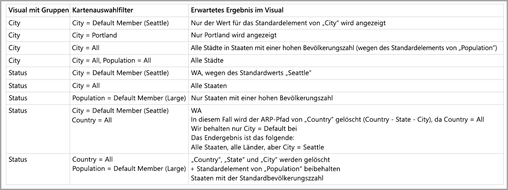

# Standardelement in mehrdimensionalen Modellen in Power BI

Sie können eine Verbindung mit mehrdimensionalen Modellen in Power BI herstellen und Berichte erstellen, in denen alle Arten von Daten innerhalb des Modells visualisiert werden. Bei der Arbeit mit mehrdimensionalen Modellen wendet Power BI Regeln auf die Verarbeitung von Daten basierend auf der Spalte an, die als *Standardelement* definiert ist. 

Bei der Arbeit mit mehrdimensionalen Modellen werden Daten aus dem Modell basierend darauf von Power BI verarbeitet, wo die Spalte mit dem **DefaultMember** verwendet wird. Das Attribut *DefaultMember* wird in CSDL (Conceptual Schema Definition Language, konzeptionelle Schemadefinitionssprache) für eine bestimmte Spalte in einem mehrdimensionalen Modell festgelegt. Weitere Informationen zum Standardelement finden Sie im entsprechenden [Artikel zu Attributeigenschaften](https://docs.microsoft.com/sql/analysis-services/multidimensional-models/attribute-properties-define-a-default-member?view=sql-server-2017). Bei Ausführung einer DAX-Abfrage wird das im Modell angegebene Standardelement automatisch angewendet.

Dieser Artikel beschreibt, wie Power BI sich bei der Arbeit mit mehrdimensionalen Modellen unter verschiedenen Bedingungen verhält, je nachdem, wo das *Standardelement* sich befindet. 

## Arbeiten mit Filterkarten

Beim Erstellen einer Filterkarte für ein Feld mit einem Standardelement wird der Wert des Standardelementfelds auf der Filterkarte automatisch ausgewählt. So können alle von der Filterkarte betroffenen Visuals ihre Standardmodelle in der Datenbank beibehalten. Die Werte auf solchen Filterkarten spiegeln das jeweilige Standardelement wider.

Wenn das Standardelement entfernt wird, wird es durch Aufheben der Auswahl des Werts für alle Visuals gelöscht, für die die Filterkarte gilt, und die angezeigten Werte spiegeln nicht das Standardelement wider.

Angenommen, wir verwenden eine Spalte *Währung*, deren Standardelement auf *USD* festgelegt ist:

* Wenn wir in diesem Beispielfall eine Karte verwenden, die den *Gesamtumsatz* angibt, wird das Standardelement auf den Wert angewendet, und es werden Umsätze in „USD“ angezeigt.
* Wenn wir *Währung* auf den Bereich der Filterkarte ziehen, wird *USD* als ausgewählter Standardwert angezeigt. Der Wert von *Gesamtumsatz* bleibt gleich, weil das Standardelement angewendet wird.
* Wenn wir die Auswahl des Werts *USD* auf der Filterkarte jedoch aufheben, wird das Standardelement für *Währung* gelöscht, und *Gesamtumsatz* spiegelt alle Währungen wider.
* Wenn wir daher einen anderen Wert auf der Filterkarte (beispielsweise *EURO*) zusammen mit dem Standardelement auswählen, spiegelt der *Gesamtumsatz* den Filter *Währung IN {USD, EURO}* wider.

## Verhalten beim Gruppieren

Immer wenn Sie in Power BI ein Visual in einer Spalte mit einem *Standardelement* gruppieren, löscht Power BI das *Standardelement* für diese Spalte sowie dessen Attributbeziehungspfad. So wird sichergestellt, dass das Visual alle Werte und nicht nur die Standardwerte anzeigt.

## Attributbeziehungspfade (ARPs)

Attributbeziehungspfade (ARPs) bieten *Standardelemente* mit leistungsstarken Funktionen, sorgen jedoch auch für eine gewisse Komplexität. Wenn ARPs ermittelt werden, folgt Power BI dem Attributbeziehungspfad, um zusätzliche Standardelemente für andere Spalten zu löschen und eine konsistente und genaue Verarbeitung von Daten für Visuals bereitzustellen.

Sehen wir uns ein Beispiel an, um das Verhalten zu verdeutlichen. Betrachten Sie die folgende ARP-Konfiguration:

Nehmen wir an, dass die folgenden *Standardelemente* für diese Spalten festgelegt werden:

* Stadt > Seattle
* Staat > WA
* Land > US
* Bevölkerung > Groß

Untersuchen wir jetzt, was geschieht, wenn jede der Spalten in Power BI verwendet wird. Hier sehen Sie die Ergebnisse, wenn Visuals nach den folgenden Spalten gruppiert werden:

* **Stadt**: Power BI zeigt alle Städte an, indem alle **Standardelemente** für *Stadt*, *Staat*, *Land* gelöscht werden, behält aber das **Standardelement** für *Bevölkerung* bei. Power BI hat den gesamten ARP für *Stadt* gelöscht.
    > [!NOTE]
    > *Bevölkerung* befindet sich nicht im ARP von *Stadt*, sondern bezieht sich ausschließlich auf *Staat* und wird somit nicht von Power BI gelöscht.
* **Staat**: Power BI zeigt alle *Staaten* an, indem alle **Standardelemente** für *Stadt*, *Staat*, *Land* und *Bevölkerung* gelöscht werden.
* **Land**: Power BI zeigt alle Länder an, indem alle **Standardelemente** für *Stadt*, *Staat* und *Land* gelöscht werden, behält aber das **Standardelement** für *Bevölkerung* bei.
* **Stadt und Staat**: Power BI löscht alle **Standardelemente** für alle Spalten.

Für im Visual angezeigte Gruppen wird der gesamte ARP gelöscht. 

Wenn eine Gruppe nicht im Visual angezeigt wird, aber Teil des ARP einer anderen Spalte ist, nach der gruppiert wird, gilt Folgendes:

* Nicht alle Verzweigungen des ARP werden automatisch gelöscht.
* Diese Gruppe wird weiterhin nach dem nicht gelöschten **Standardelement** gefiltert.

### Slicer und Filterkarten

Bei der Arbeit mit Slicern oder Filterkarten tritt das folgende Verhalten auf:

* Beim Laden eines Slicers oder einer Filterkarte mit Daten führt Power BI die Gruppierung nach der Spalte im Visual durch, sodass das Anzeigeverhalten dem im vorherigen Abschnitt beschriebenen Verhalten entspricht.

Weil Slicer und Filterkarten häufig für die Interaktion mit anderen Visuals verwendet werden, erfolgt die Logik zum Löschen von **Standardelementen** für die betreffenden Visuals wie in der folgenden Tabelle beschrieben. 

Für diese Tabelle verwenden wir dieselben Beispieldaten, die weiter oben in diesem Artikel verwendet wurden:

Die folgenden Regeln gelten für das Verhalten von Power BI in diesen Fällen.

Power BI löscht ein **Standardelement** für eine bestimmte Spalte in folgenden Fällen:

* Power BI gruppiert nach der betreffenden Spalte.
* Power BI gruppiert nach einer Spalte, die mit dieser Spalte in Zusammenhang steht (an einer beliebigen Stelle im ARP, oben oder unten).
* Power BI filtert nach einer Spalte, die sich im ARP befindet (oben oder unten).
* Die Spalte weist eine Filterkarte mit dem Zustand *ALLE* auf.
* Die Spalte weist eine Filterkarte mit einem beliebigen ausgewählten Wert auf. (Power BI erhält einen Filter für die Spalte.)

In folgenden Fällen wird ein **Standardelement** für eine bestimmte Spalte nicht von Power BI gelöscht:

* Die Spalte weist eine Filterkarte mit dem Standardzustand auf, und Power BI führt eine Gruppierung nach einer Spalte im zugehörigen ARP durch.
* Die Spalte befindet sich oberhalb einer anderen Spalte im ARP, und Power BI enthält eine Filterkarte für diese andere Spalte im Standardzustand.

## Nächste Schritte

Dieser Artikel beschreibt das Verhalten von Power BI bei der Arbeit mit Standardelementen in mehrdimensionalen Modellen. Folgende Artikel könnten Sie ebenfalls interessieren: 

* [Anzeigen von Elementen ohne Daten in Power BI](desktop-show-items-no-data.md)
* [Datenquellen in Power BI Desktop](desktop-data-sources.md)
