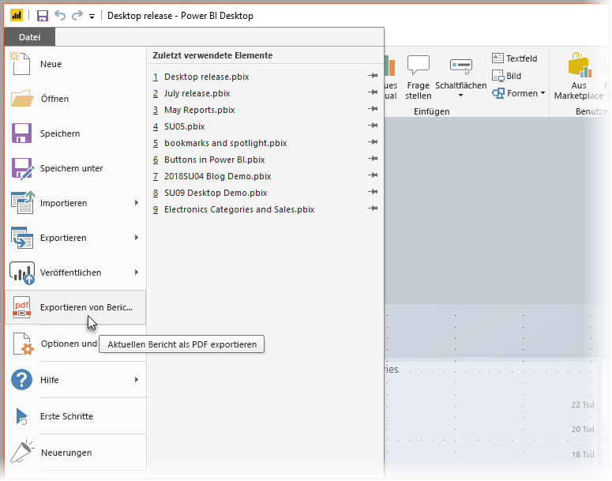
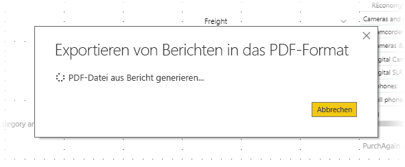

# Exportieren von Berichten aus Power BI Desktop in das PDF-Format
In **Power BI Desktop** können Sie Berichte in eine PDF-Datei exportieren und diese problemlos freigeben oder drucken.

Der Vorgang zum Exportieren eines Bericht aus **Power BI Desktop** in ein PDF-Dokument und die Möglichkeit zum anschließenden Drucken oder Freigeben der Dokumente ist unkompliziert. Klicken Sie in Power BI Desktop einfach auf **Datei > In PDF exportieren**.

**In PDF exportieren** exportiert alle *sichtbaren* Seiten im Bericht, wobei jede Berichtsseite in eine einzelne Seite in der PDF-Datei exportiert wird. Berichtsseiten wie QuickInfos oder ausgeblendete Seiten, die aktuell nicht sichtbar sind, werden nicht in die PDF-Datei exportiert. 

Wenn Sie auf **Datei > In PDF exportieren** klicken, wird der Export gestartet, und es wird ein Dialogfeld angezeigt, in dem darauf hingewiesen wird, dass der Exportvorgang ausgeführt wird. Das Dialogfeld wird solange auf dem Bildschirm angezeigt, bis der Exportvorgang abgeschlossen ist. Während des Exportvorgangs ist die Interaktion mit dem Bericht, der exportiert wird, vollständig deaktiviert. Sie können erst mit dem Bericht interagieren, nachdem der Exportvorgang abgeschlossen oder von Ihnen abgebrochen wurde. 

Wenn der Export abgeschlossen ist, wird die PDF-Datei im standardmäßig eingestellten PDF-Viewer des Computers geladen. 

## Überlegungen und Einschränkungen
Bei Verwendung des Features **In PDF exportieren** sind einige Punkte zu beachten:

* Das Feature **In PDF exportieren** ist nur mit **Power BI Desktop** verfügbar und zurzeit nicht im **Power BI-Dienst** verfügbar.
* Während benutzerdefinierte Visuals exportiert werden, werden im Bericht angewendete Hintergründe *nicht* exportiert.

Da der Hintergrund nicht in die PDF-Datei exportiert wird, sollten Sie besonders bei Berichten mit dunklen Hintergründen darauf achten. Wenn der Text in Ihrem Bericht hell oder weiß ist, um ihn vom dunklen Hintergrund hervorzuheben, wird er schwer zu lesen oder beim Exportvorgang in das PDF-Format nicht lesbar sein, da der Hintergrund nicht mit den anderen Berichtskomponenten exportiert wird. 

## Nächste Schritte
Es gibt viele interessante Visualelemente und Features in **Power BI Desktop**. Weitere Informationen finden Sie in den folgenden Ressourcen:

* [Use visual elements to enhance Power BI reports (Erweitern von Power BI-Berichten durch Visualelemente)](desktop-visual-elements-for-reports.md)
* [Was ist Power BI Desktop?](desktop-what-is-desktop.md)

