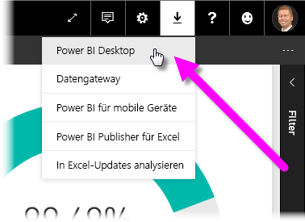
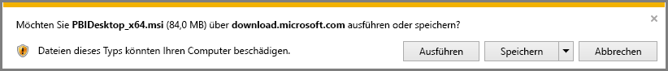
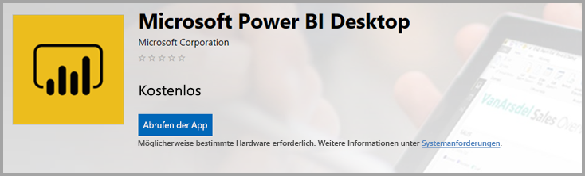
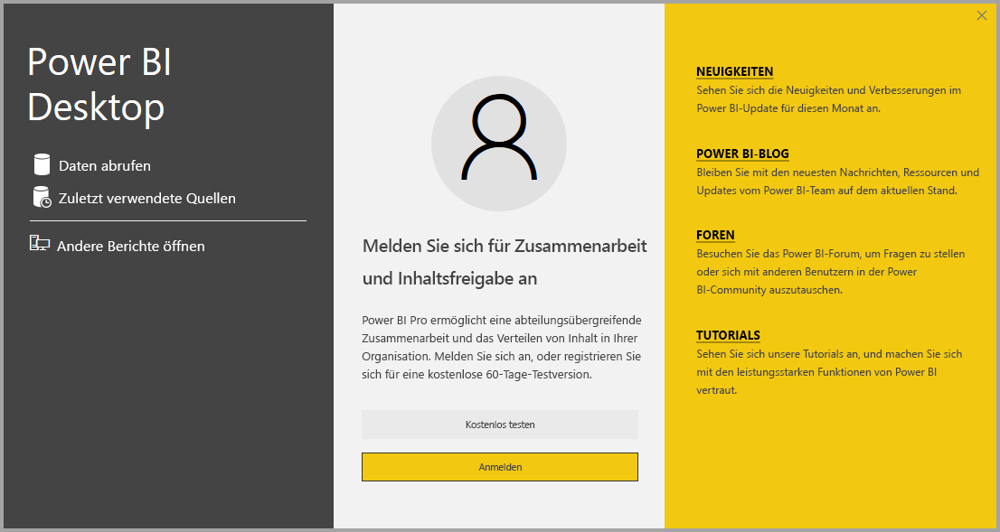

# Power BI Desktop erwerben
In **Power BI Desktop** können Sie erweiterte Abfragen, Modelle und Berichte erstellen, die Daten visualisieren. Mit **Power BI Desktop** können Sie Datenmodelle entwerfen, Berichte erstellen und Ihre Arbeit durch die Veröffentlichung im Power BI-Dienst freigeben.  **Power BI Desktop** steht als kostenloser Download zur Verfügung.

Sie können **Power BI Desktop** auf zwei Arten erhalten, von denen jede in den folgenden Abschnitten beschrieben wird:

* Direktes **Herunterladen** (ein MSI-Paket, das Sie herunterladen und auf dem Computer installieren)
* Installieren als App aus dem **Windows Store**

Mit beiden Methoden erhalten Sie auf Ihrem Computer die neueste Version von **Power BI Desktop**. Es sind jedoch einige Unterschiede zu beachten, die in den folgenden Abschnitten beschrieben werden.

## Laden Sie Power BI Desktop herunter
Um die neueste Version von **Power BI Desktop** herunterzuladen, können Sie im Power BI-Dienst rechts oben auf das Downloadsymbol klicken und **Power BI Desktop** auswählen.

Sie können die neueste Version von Power BI Desktop auch von dieser Downloadseite herunterladen:

* [**Power BI Desktop-Download** (32-Bit und 64-Bit-Version)](https://powerbi.microsoft.com/desktop).
  
  

Unabhängig von der ausgewählten Downloadoption werden Sie nach dem Download von **Power BI Desktop** zum Ausführen der Installationsdatei aufgefordert:

**Power BI Desktop** wird als Anwendung installiert und auf dem Desktop ausgeführt.

> [!NOTE]
> Das Installieren der heruntergeladenen Version (MSI-Paket) von **Power BI Desktop** und der Version aus dem **Windows Store** auf demselben Computer (manchmal als *parallele Installation* bezeichnet) wird nicht unterstützt.
> 
> 

## Installieren als App aus dem Windows Store
Über den folgenden Link erhalten Sie **Power BI Desktop** aus dem Windows Store:

* [Installieren von **Power BI Desktop** aus dem **Windows Store**](http://aka.ms/pbidesktopstore)

Das Installieren von **Power BI Desktop** aus dem Windows Store bietet einige Vorteile:

* **Automatische Updates** – Windows lädt automatisch im Hintergrund die aktuelle Version herunter, sobald sie verfügbar ist, sodass Ihre Version immer auf dem neuesten Stand ist.
* **Kleinere Downloads** – Im **Windows Store** wird sichergestellt, dass in den einzelnen Updates nur geänderte Komponenten auf Ihren Computer heruntergeladen werden, sodass bei den einzelnen Updates kleinere Downloads anfallen.
* **Keine Administratorberechtigung erforderlich** – Wenn Sie die MSI-Datei direkt herunterladen und installieren, müssen Sie Administrator sein, damit die Installation erfolgreich abgeschlossen wird. Wenn Sie **Power BI Desktop** aus dem Windows Store abrufen, ist *keine* Administratorberechtigung erforderlich.
* **Rollout durch IT möglich** – Die **Windows Store**-Version lässt sich leichter für alle Benutzer in der Organisation bereitstellen (per *Rollout*), und **Power BI Desktop** kann über den **Microsoft Store für Unternehmen** verfügbar gemacht werden.
* **Sprachenerkennung** – Die **Windows Store**-Version umfasst alle unterstützten Sprachen und überprüft bei jedem Start, welche Sprachen auf dem Computer verwendet werden. Dies wirkt sich auch auf die Lokalisierung von Modellen aus, die in **Power BI Desktop** erstellt werden. Beispielsweise entsprechen integrierte Datumshierarchien der Sprache, die in **Power BI Desktop** beim Erstellen der PBIX-Datei verwendet wurde.

Beim Installieren von **Power BI Desktop** aus dem Windows Store sind einige Einschränkungen und Überlegungen zu beachten, darunter die folgenden:

* Wenn Sie den SAP-Connector verwenden, müssen Sie möglicherweise die SAP-Treiberdateien in den Ordner *Windows\System32* verschieben.

> [!NOTE]
> Das Installieren der heruntergeladenen Version (MSI-Paket) von **Power BI Desktop** und der Version aus dem **Windows Store** auf demselben Computer (manchmal als *parallele Installation* bezeichnet) wird nicht unterstützt.
> 
> [!NOTE]
> Die Power BI-Berichtsserver-Version von **Power BI Desktop** ist eine eigene Installation und unterscheidet sich von den in diesem Artikel behandelten Versionen. Informationen über die Berichtsserver-Version von **Power BI Desktop** finden Sie im Artikel [Schnellstart: Erstellen eines Power BI-Berichts für Power BI-Berichtsserver](report-server/quickstart-create-powerbi-report.md).
> 
> 

## Verwenden von Power BI Desktop
Wenn Sie **Power BI Desktop** starten, wird ein*Willkommensbildschirm* angezeigt.

Wenn Sie **Power BI Desktop** zum ersten Mal verwenden (und die Installation kein Upgrade ist), werden Sie aufgefordert, ein Formular auszufüllen und einige Fragen zu beantworten, oder Sie müssen sich beim **Power BI-Dienst** anmelden, damit Sie fortfahren können.

Von dort aus können Sie damit beginnen, Datenmodelle oder Berichte zu erstellen und diese im Power BI-Dienst mit anderen Personen zu teilen. Über die Link **Weitere Informationen** am Ende dieses Artikels gelangen Sie zu weiteren Artikeln, die Ihnen bei Ihren ersten Schritten mit **Power BI Desktop** Unterstützung bieten.

## Mindestanforderungen
Die folgende Liste zeigt die Mindestanforderungen zur Ausführung von **Power BI Desktop**:

* Windows 7/Windows Server 2008 R2 oder höher
* .NET 4.5
* Internet Explorer 9 oder höher
* **Arbeitsspeicher (RAM):** Mindestens 1 GB freier Arbeitsspeicher, 1,5 GB oder mehr empfohlen.
* **Bildschirm:** Mindestens 1440 x 900 oder 1600 x 900 (16:9) empfohlen. Geringere Auflösungen, z. B. 1024 x 768 oder 1280 x 800, werden nicht empfohlen, da zum Anzeigen bestimmter Steuerelemente (z. B. das Schließen des Startbildschirms) eine höhere Auflösung erforderlich ist.
* **Windows-Anzeigeeinstellungen:** Wenn Ihre Anzeigeeinstellungen so konfiguriert sind, dass die Größe von Text, Apps und anderen Elementen auf mehr als 100 % geändert wird, sind einige Dialogfelder möglicherweise nicht sichtbar, die geschlossen oder bearbeitet werden müssen, damit Sie weiter in **Power BI Desktop** arbeiten können. Wenn dieses Problem auftritt, überprüfen Sie Ihre **Anzeigeeinstellungen**; wählen Sie dazu in Windows **Einstellungen > System > Anzeige** aus, und setzen Sie die Anzeigeeinstellungen mithilfe des Schiebereglers auf 100 % zurück.
* **CPU:** x86- oder x64-Prozessor mit 1 Gigahertz (GHz) oder schneller empfohlen.

## Nächste Schritte
Nachdem Sie **Power BI Desktop** installiert haben, erhalten Sie in den folgenden Artikeln die nötigen Informationen für einen schnellen Einstieg:

* [Erste Schritte mit Power BI Desktop](desktop-getting-started.md)
* [Übersicht zu Abfragen mit Power BI Desktop](desktop-query-overview.md)
* [Datenquellen in Power BI Desktop](desktop-data-sources.md)
* [Verbinden mit Daten in Power BI Desktop](desktop-connect-to-data.md)
* [Strukturieren und Kombinieren von Daten mit Power BI Desktop](desktop-shape-and-combine-data.md)
* [Allgemeine Abfrageaufgaben in Power BI Desktop](desktop-common-query-tasks.md)   

