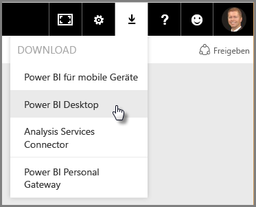

# Erste Schritte mit Power BI Desktop
Willkommen beim Handbuch **Erste Schritte mit Power BI Desktop**. Dieser kurze Überblick über Power BI Desktop soll Sie mit der Funktionsweise vertraut machen und die Möglichkeiten aufzeigen, die Ihnen in Power BI Desktop zur Verfügung stehen. Dadurch sind Sie rasch in der Lage, neben ansprechenden Berichten auch robuste Datenmodelle zu erstellen, die Ihr Business Intelligence-Potenzial erweitern. 

Gefallen Ihnen Videos besser als Text? Gerne können Sie sich auch unser [Video „Erste Schritte“ ansehen](desktop-videos.md). Wenn Sie parallel zum Video entsprechende Beispieldaten anzeigen möchten, können Sie die [Excel-Beispielarbeitsmappe herunterladen](http://go.microsoft.com/fwlink/?LinkID=521962).

Mit Power BI Desktop erstellen Sie eine Sammlung von Abfragen, Datenverbindungen und Berichten, die Sie ganz einfach für andere Personen freigeben können. Power BI Desktop setzt auf bewährten Microsoft-Technologien (leistungsfähiges Abfragemodul, Datenmodellierung und Visualisierungen) auf und arbeitet online nahtlos mit dem [**Power BI-Dienst**](https://app.powerbi.com/) zusammen.

Dank der Kombination von **Power BI Desktop** (hier erstellen Analysten und andere Personen leistungsfähige Datenverbindungen, Modelle und Berichte) mit dem [**Power BI-Dienst**](https://preview.powerbi.com/) (hier werden Berichte aus Power BI Desktop freigegeben, damit Benutzer diese anzeigen und bearbeiten können) lassen sich neue Erkenntnisse aus der Welt der Daten leichter modellieren, erstellen, freigeben und ergänzen.

Datenanalysten finden in Power BI Desktop ein leistungsfähiges, flexibles und hochverfügbares Werkzeug, mit dem sie nicht nur einen Zugang zur Welt der Daten erhalten, sondern diese auch strukturieren können. Mit Power BI Desktop lassen sich robuste Modelle erstellen und gut strukturierte Berichte anfertigen.

## Verwendung dieses Handbuchs
Sie können dieses Handbuch auf verschiedene Art und Weise verwenden. Sie können sich einen kurzen Überblick verschaffen oder alle Abschnitte sorgfältig studieren, um die Funktionsweise von Power BI Desktop in allen Aspekten zu verstehen.

Wenn Sie in Eile sind, können Sie dieses Handbuch in ein paar Minuten durchblättern und erhalten durch die visuellen Darstellungen einen fundierten Einblick in die Funktionsweise und Verwendung von Power BI Desktop. Dieses Handbuch besteht überwiegend aus Screenshots, welche die Funktionsweise von Power BI Desktop verdeutlichen.

Ein tiefgreifendes Verständnis gewinnen Sie, wenn Sie jeden Abschnitt sorgfältig lesen, die Schritte nachvollziehen und Ihre eigene Power BI Desktop-Datei erstellen, die Sie anschließend im **Power BI-Dienst** veröffentlichen und für andere freigeben können.

## So funktioniert Power BI Desktop
Mit Power BI Desktop können Sie *eine Verbindung zu Daten herstellen* (in der Regel aus mehreren Datenquellen), *die Daten strukturieren* (mit Abfragen, aus denen sich aufschlussreiche, überzeugende Datenmodelle erstellen lassen) und mit diesen Modellen *Berichte erstellen* (die andere Personen nutzen, als Grundlage verwenden und freigeben können).

Wenn Sie die Schritte – Verbinden, Strukturieren und Berichten – zu Ihrer Zufriedenheit abgeschlossen haben, können Sie Ihre Arbeit im Power BI Desktop-Dateiformat (.pbix) speichern. Power BI Desktop-Dateien können wie alle anderen Dateien freigegeben werden. Die überzeugendste Möglichkeit für ein Freigeben von Power BI Desktop-Dateien ist jedoch das Hochladen (Freigeben) über den [**Power BI-Dienst**](https://preview.powerbi.com/). 

Power BI Desktop erfasst und optimiert an zentraler Stelle, was sonst meist weit verstreut und verbindungslos ist und vereinfacht damit den mühseligen Prozess beim Entwerfen und Erstellen von Business Intelligence-Repositorys und -Berichten.

Sind Sie bereit, Power BI Desktop auszuprobieren? Fangen wir an.

## Installieren und Ausführen von Power BI Desktop
Sie können Power BI Desktop aus dem **Power BI**-Dienst herunterladen. Markieren Sie dazu das **Zahnradsymbol**, und wählen Sie dann **Power BI Desktop** aus.

Power BI Desktop wird als Anwendung installiert und auf dem Desktop ausgeführt.

Wenn Sie Power BI Desktop ausführen, wird ein *Willkommen* -Bildschirm angezeigt.

Direkt vom Bildschirm **Willkommen** aus können Sie (mithilfe der Verknüpfungen im linken Bereich) **Daten abrufen**, **Zuletzt verwendete Quellen** anzeigen oder **Andere Berichte** *öffnen*. Wenn Sie den Bildschirm schließen (durch Klicken auf **x** in der oberen rechten Ecke), wird die Ansicht **Bericht** von Power BI Desktop angezeigt.

Power BI Desktop weist drei Ansichten auf: Die Ansicht **Bericht** , die Ansicht **Daten** und die Ansicht **Beziehungen** . Power BI Desktop enthält außerdem den **Abfrage-Editor**, der in einem separaten Fenster geöffnet wird. Im **Abfrage-Editor**können Sie Abfragen erstellen und Daten transformieren, anschließend das weiter eingeschränkte Datenmodell in Power BI Desktop laden und Berichte erstellen.

Auf dem folgenden Bildschirm sind die Symbole der drei Ansichten auf der linken Seite von Power BI Desktop zu sehen: **Bericht**, **Daten**und **Beziehungen**, von oben nach unten. Die aktuelle Ansicht wird durch die gelbe Leiste am linken Rand angezeigt. In diesem Fall wird aktuell die Ansicht **Bericht** angezeigt. Sie können die Ansicht wechseln, indem Sie eines dieser drei Symbole auswählen.

Nach der Installation von Power BI Desktop können Sie Verbindungen zu Daten herstellen, die Daten strukturieren und Berichte erstellen (in der Regel in dieser Reihenfolge). In den folgenden Abschnitten werden diese Arbeitsschritte nacheinander vorgestellt.

## Verbinden mit Daten
Nachdem Sie Power BI Desktop installiert haben, ist der Weg zu der ständig wachsenden Welt der Daten frei. Im Fenster „Abfrage“ stehen *alle möglichen Arten* von Datenquellen zur Verfügung. Aus der folgenden Abbildung geht hervor, wie Sie eine Verbindung zu Daten herstellen. Wählen Sie dazu zuerst das Menüband **Start** und dann **Daten abrufen \> Mehr**aus.

 

Für diesen kurzen Überblick verbinden wir eine Reihe unterschiedlicher Datenquellen aus dem **Web** .

Stellen Sie sich vor, Sie gehen in Pension und möchten dort leben, wo oft die Sonne scheint, wo die Steuern günstig sind und wo eine gute Versorgung im Krankheitsfall gewährleistet ist. Vielleicht sind Sie aber auch ein Datenanalyst, der diese Informationen benötigt, um seinen Kunden zu helfen. Vielleicht möchten Sie aber Ihren Sonnenbrillenhändler dabei unterstützen, seinen Vertrieb auf die Gebiete auszurichten, in denen die Sonne besonders häufig scheint.

In allen drei Fällen hält die folgende Webressource u.a. Daten zu diesen Themenbereichen bereit:

[*http://www.bankrate.com/finance/retirement/best-places-retire-how-state-ranks.aspx*](http://www.bankrate.com/finance/retirement/best-places-retire-how-state-ranks.aspx)

Wählen Sie **Daten abrufen \> Web** aus, und fügen Sie die Adresse ein.

 

Mit der Auswahl von **OK**beginnt die **Abfragefunktion** von Power BI Desktop ihre Arbeit. Die Abfragefunktion kontaktiert die Webressource und gibt im Fenster **Navigator** die auf der Webseite gefundenen Ergebnisse zurück. In diesem Fall hat sie eine Tabelle (*Table 0*) und das allgemeine Webdokument gefunden. Da wir an der Tabelle interessiert sind, wählen wir diese in der Liste aus. Im Fenster **Navigator** wird eine Vorschau angezeigt.

 

An dieser Stelle können wir vor dem Laden der Tabelle die Abfrage bearbeiten (durch Auswahl von **Bearbeiten** unten im Fenster) oder die Tabelle direkt laden.

Bei der Auswahl von **Bearbeiten** wird im Abfrage-Editor eine repräsentative Ansicht der Tabelle angezeigt. Der Bereich **Abfrageeinstellungen** wird angezeigt. (Sollte der Bereich nicht angezeigt werden, wählen Sie im Menüband die Option **Ansicht** und dann **Anzeigen \> Abfrageeinstellungen** aus, um den Bereich **Abfrageeinstellungen**anzuzeigen). So sieht die Ansicht aus.

 

Weitere Informationen zum Herstellen einer Verbindung mit Daten finden Sie unter [Verbinden mit Daten in Power BI Desktop](desktop-connect-to-data.md).

Im nächsten Abschnitt werden die Daten angepasst, damit sie unseren Anforderungen entsprechen. Der Vorgang, bei dem verbundene Daten angepasst werden, wird als *Strukturieren* der Daten bezeichnet.

## Strukturieren und Kombinieren von Daten
Nachdem wir die Verbindung zu einer Datenquelle hergestellt haben, müssen wir die Daten an unsere Anforderungen anpassen. Anpassen bedeutet manchmal auch *Transformieren* der Daten. So müssen beispielsweise Spalten oder Tabellen umbenannt, Text in Zahlen umgewandelt, Zeilen entfernt oder die erste Zeile als Überschrift festgelegt werden.

Im Abfrage-Editor von Power BI Desktop kommen neben den im Menüband verfügbaren Aufgaben häufig Kontextmenüs (Rechtsklick) zum Einsatz. Die meisten Optionen, die im Menüband **Transformieren** zur Auswahl stehen, können auch über Klicken auf ein Element (z. B. eine Spalte) mit der rechten Maustaste und Auswählen aus dem Kontextmenü aufgerufen werden.

## Strukturieren von Daten
Wenn Sie im **Abfrage-Editor** Daten strukturieren, geben Sie schrittweise Anweisungen vor (die der **Abfrage-Editor** dann für Sie ausführt), um die Daten beim Laden und Darstellen im **Abfrage-Editor** anzupassen. Die ursprüngliche Datenquelle wird davon nicht berührt. Angepasst bzw. *strukturiert* wird nur diese spezifische Ansicht der Daten.

Die Schritte, die Sie angeben (z. B. Umbenennen einer Tabelle, Transformieren eines Datentyps oder Löschen von Spalten), werden vom **Abfrage-Editor** aufgezeichnet und bei jeder Verbindung zu dieser Datenquelle ausgeführt, sodass die Daten stets in der gewünschten Art „strukturiert“ sind. Dieser Vorgang erfolgt jedes Mal, wenn Sie die Abfrage in Power BI Desktop verwenden, aber auch jedes Mal, wenn jemand auf die freigegebene Abfrage zugreift, z. B. im **Power BI-Dienst**. Diese Schritte werden der Reihe nach im Bereich **Abfrageeinstellungen** unter **Angewendete Schritte** aufgezeichnet.

Die folgende Abbildung zeigt den Bereich **Abfrageeinstellungen** für eine strukturierte Abfrage. In den nächsten Abschnitten werden die Schritte im Einzelnen erläutert.

 

Wir wenden uns wieder den Daten zu, die wir für einen zukünftigen Pensionär durch Verbinden mit einer Webdatenquelle ermittelt haben, und strukturieren diese Daten so, dass sie unseren Anforderungen entsprechen.

Zunächst wurden die meisten Bewertungen als ganze Zahlen in den **Abfrage-Editor** geladen. Ausnahme war eine Spalte, die Text und Zahlen enthielt und daher nicht automatisch konvertiert wurde. Wir benötigen die Daten jedoch als Zahlen. Kein Problem: Klicken Sie einfach mit der rechten Maustaste auf die Spaltenüberschrift, und wählen Sie **Typ ändern\>> Ganze Zahl** aus, um den Datentyp zu ändern. Wenn Sie mehr als eine Spalte auswählen müssen, wählen Sie zuerst eine Spalte aus, drücken Sie die **UMSCHALTTASTE**, und wählen Sie dann mit gedrückter Taste weitere angrenzende Spalten aus. Klicken Sie anschließend mit der rechten Maustaste auf eine Spaltenüberschrift, um alle ausgewählten Spalten zu ändern. Sie können auch **STRG** verwenden, um nicht benachbarte Spalten auszuwählen.

 

Sie können auch Spalten von Text in Überschriften ändern bzw. *transformieren*, indem Sie das Menüband **Transformieren** verwenden. Die Abbildung zeigt das Menüband **Transformieren**. Der Pfeil weist auf die Schaltfläche **Datentyp**, mit der Sie den aktuellen Datentyp in einen anderen Typ transformieren können.

 

Beachten Sie, dass die vorgenommenen Änderungen in den **Abfrageeinstellungen**unter **Angewendete Schritte** angezeigt werden. Wenn Sie einen Schritt aus dem Strukturierungsprozess entfernen möchten, wählen Sie einfach nur den jeweiligen Schritt aus und klicken dann auf das **X** links neben dem Schritt.

 

Wir müssen aber noch ein paar Änderungen vornehmen, um die gewünschte Abfrage zu erhalten.

* *Entfernen der ersten Spalte* – Diese Spalte ist nicht erforderlich. Sie enthält nur überflüssige Zeilen mit dem Text „Check out how your state ranks for retirement“, ein Artefakt aufgrund der Tatsache, dass es sich um eine webbasierte Tabelle handelt.

<!-- -->

* *Beheben einiger Fehler* – Auf der Webseite gibt es eine Spalte mit Text und Zahlen (bei einigen Bundesstaaten sind die Zahlen mit dem Text „(tie)“ versehen). Das funktioniert zwar auf der Website, nicht aber bei unserer Datenanalyse. Dieses Problem ist (in diesem Fall) leicht zu beheben und verdeutlicht einige interessante Funktionen und Möglichkeiten des **Abfrage-Editors** und der **angewendeten Schritte**.

<!-- -->

* *Ändern des Tabellennamens* – **Table 0** ist kein sinnvoller Deskriptor, er kann aber sehr einfach geändert werden.

Jeder dieser Schritte wird unter **[Strukturieren und Kombinieren von Daten in Power BI Desktop](desktop-shape-and-combine-data.md)** veranschaulicht. Wahlweise können Sie diese Seite aufrufen oder mit diesem Dokument fortfahren, um zu erfahren, was als Nächstes passiert. Im nächsten Abschnitt wird der Vorgang fortgesetzt, nachdem die obigen Änderungen angewendet wurden.

## Kombinieren von Daten
Diese Daten von verschiedenen Bundesstaaten sind interessant und nützlich zur Erstellung weiterer Analysen und Abfragen. Es gibt allerdings ein Problem: Bei den meisten Daten wird ein zweistelliges Länderkürzel als Code für den Bundesstaat und nicht dessen voller Name verwendet. Wir müssen die Namen der Bundesstaaten in irgendeiner Weise mit den Kürzeln verknüpfen.

Glücklicherweise gibt es eine andere öffentliche Datenquelle, die genau das bereitstellt. Die Daten müssen jedoch noch entsprechend strukturiert werden, bevor wir sie mit unserer Tabelle mit bevorzugten Wohnorten für Pensionäre verbinden können. Hier befindet sich die Webressource mit den Länderkürzeln:

<http://en.wikipedia.org/wiki/List_of_U.S._state_abbreviations>

Wählen Sie im Menüband **Start** die Ansicht **Abfrage-Editor** und dann **Daten abrufen \> Web**aus. Geben Sie die Adresse ein, und klicken Sie auf **OK**. Im Fenster **Navigator** werden die Ergebnisse von dieser Webseite angezeigt.

 

Wählen Sie **Table[edit]** aus, da diese Tabelle die gewünschten Daten enthält. Sie muss aber noch strukturiert werden, um die Daten dieser Tabelle entsprechend zu kürzen. Jeder dieser Schritte wird auch unter **[Strukturieren und Kombinieren von Daten in Power BI Desktop](desktop-shape-and-combine-data.md)** veranschaulicht. Zusammenfassend werden die folgenden Schritte ausgeführt.

Sie wählen **Bearbeiten**aus, dann:

* *Entfernen Sie die beiden oberen Zeilen*. Sie sind auf die Erstellungsweise der Webseitentabelle zurückzuführen und werden nicht gebraucht.

<!-- -->

* *Entfernen Sie die letzten 26 Zeilen*. Hierbei handelt es sich um Gebiete, die wir nicht brauchen.

<!-- -->
* *Filtern Sie Washington, D.C., heraus*. In der Tabelle mit Statistiken zu den bevorzugten Wohnorten für Pensionäre ist Washington, D.C, nicht enthalten. Daher schließen wir es aus der Liste aus.

<!-- -->

* *Entfernen Sie ein paar überflüssige Spalten*. Wir brauchen nur die Zuordnung der Bundesstaaten zu den offiziellen zweistelligen Länderkürzeln. Daher können wir die übrigen Spalten entfernen.

<!-- -->

* *Verwenden Sie die erste Zeile als Überschrift*. Da wir die oberen drei Zeilen entfernt haben, ist die aktuelle oberste Zeile die benötigte Überschrift.

>[!NOTE]
>An dieser Stelle sei darauf hingewiesen, dass die *Reihenfolge* der im **Abfrage-Editor** angewendeten Schritte wichtig ist und sich auf die Strukturierung der Daten auswirken kann. Berücksichtigt werden muss auch, wie sich ein Schritt auf einen anderen, nachfolgenden Schritt auswirkt. Wenn Sie also aus **Angewendete Schritte** einen Schritt entfernen, verhalten sich die nachfolgenden Schritte aufgrund des Einflusses der Schrittreihenfolge der Abfrage möglicherweise nicht mehr so, wie es ursprünglich beabsichtigt war.

* *Benennen Sie die Spalten und die eigentliche Tabelle um*. Wie üblich, gibt es mehrere Möglichkeiten, eine Spalte umzubenennen. Wählen Sie Ihr bevorzugtes Verfahren aus.

Nachdem nun die Tabelle *StateCodes* strukturiert wurde, können wir die beiden Tabellen bzw. Abfragen kombinieren. Da die Tabellen, die wir jetzt haben, die Ergebnisse der Abfragen sind, die wir auf die Daten angewendet haben, werden sie häufig auch als *Abfragen* bezeichnet.

Zum Kombinieren von Daten gibt zwei bevorzugte Möglichkeiten: *Zusammenführen* und *Anhängen*.

Wenn eine oder mehrere Spalten zu einer anderen Abfrage hinzugefügt werden sollen, werden die Abfragen **zusammengeführt** . Wenn einer vorhandenen Abfrage zusätzliche Datenzeilen hinzugefügt werden sollen, wird die Abfrage **angehangen** .

Im vorliegenden Fall werden wir die Abfragen zusammenführen. Wählen Sie zunächst die Abfrage aus, *mit der* die andere Abfrage zusammengeführt werden soll. Anschließend wählen Sie im Menüband auf der Registerkarte **Start** die Option **Abfragen zusammenführen** aus.

 

Im Fenster **Zusammenführen** werden Sie aufgefordert, die Tabelle auszuwählen, die mit der ausgewählten Tabelle zusammengeführt werden soll. Anschließend müssen Sie die entsprechenden Spalten angeben, die für die Zusammenführung verwendet werden sollen. Wählen Sie *State* in der Tabelle (Abfrage) *RetirementStats* und dann die Abfrage *StateCodes* aus. (Das ist in diesem Fall recht einfach, da es nur eine andere Abfrage gibt. Wenn Sie Verbindungen zu vielen Datenquellen herstellen, stehen hier viele Abfragen zur Auswahl.) Wenn Sie die übereinstimmenden Spalten – *State* aus *RetirementStats* und *State Name* aus *StateCodes* – richtig auswählen, sieht das Fenster **Zusammenführen** wie folgt aus, und die Schaltfläche **OK** ist aktiviert.

 

Am Ende der Abfrage wird eine neue Spalte namens **NewColumn** erstellt, die den Inhalt der Tabelle (Abfrage) enthält, die mit der vorhandenen Abfrage zusammengeführt wurde. Alle Spalten der zusammengeführten Abfrage werden auf die neue Spalte **NewColumn** reduziert. Sie können jedoch die Tabelle **erweitern** und die gewünschten Spalten einbeziehen. Um die zusammengeführte Tabelle zu erweitern und auszuwählen, welche Spalten einbezogen werden sollen, klicken Sie auf das Erweiterungssymbol (). Das Fenster **Erweitern** wird geöffnet.

 

In unserem Fall benötigen wir nur die Spalte *State Code*. Daher wählen Sie nur diese Spalte aus und klicken dann auf **OK**. Deaktivieren Sie das Kontrollkästchen **Ursprünglichen Spaltennamen als Präfix verwenden**, da wir den ursprünglichen Spaltennamen nicht benötigen. Wenn das Kontrollkästchen aktiviert bleibt, erhält die zusammengeführte Spalte den Namen *NewColumn.State Code* (zusammengesetzt aus dem ursprünglichen Spaltennamen bzw. *NewColumn*, einem Punkt und dem Namen der in die Abfrage eingefügten Spalte).

>[!NOTE]
>Möchten Sie ein wenig mit dem Einfügen der Tabelle *NewColumn* experimentieren? Sie können ein wenig ausprobieren. Wenn Ihnen die Ergebnisse nicht gefallen, löschen Sie diesen Schritt einfach in der Liste **Angewendete Schritte** im Bereich **Abfrageeinstellungen**. Ihre Abfrage wird dann wieder in den Zustand vor Anwenden des Schritts **Erweitern** versetzt. Auf diese Weise können Sie beliebig oft und solange experimentieren, bis die Erweiterung Ihren Vorstellungen entspricht.

Wir haben jetzt eine einzelne Abfrage (Tabelle), in der zwei entsprechend den Anforderungen strukturierte Datenquellen miteinander kombiniert sind. Diese Abfrage kann als Grundlage für viele weitere interessante Datenverbindungen dienen, z. B. für Statistiken zu Wohnkosten, demografischen Daten oder Beschäftigungsmöglichkeiten in den einzelnen Bundesstaaten.

Eine umfangreichere Beschreibung der einzelnen Schritte zum Strukturieren und Kombinieren der Daten finden Sie unter [Strukturieren und Kombinieren von Daten in Power BI Desktop](desktop-shape-and-combine-data.md).

Jetzt haben wir genügend Daten, um einige interessante Berichte zu erstellen – ebenfalls in Power BI Desktop. Da es sich hier um einen Meilenstein handelt, sollten wir diese Power BI Desktop-Datei speichern. Wir nennen sie **Erste Schritte in Power BI Desktop**. Um die Änderungen im **Abfrage-Editor** zu übernehmen und sie in Power BI Desktop zu laden, wählen Sie im Menüband **Start** den Befehl **Schließen und übernehmen** aus.

## Erstellen von Berichten
Weitere Änderungen können nach dem Laden der Tabelle vorgenommen werden, und Sie können ein Modell erneut laden, um die von Innen vorgenommenen Änderungen anzuwenden. Aber für den Moment reicht unser Stand. In der Ansicht **Bericht** von Power BI Desktop können Sie mit dem Erstellen von Berichten beginnen.

Die Ansicht **Bericht** besteht aus fünf Hauptbereichen:

1. Das Menüband, in dem häufige Aufgaben in Verbindung mit Berichten und Visualisierungen angezeigt werden
2. Die Ansicht **Bericht** , oder die Zeichenfläche, in der Visualisierungen erstellt und angeordnet werden
3. Der Registerkartenbereich **Seiten** , der sich quer über den unteren Rand erstreckt, in dem Sie eine Berichtsseite auswählen oder hinzufügen können
4. Der Bereich **Visualisierungen** , in dem Sie Visualisierungen ändern, Farben oder Achsen anpassen, Filter anwenden, Felder ziehen und weitere Aktionen ausführen können
5. Der Bereich **Felder** , in dem Sie Abfrageelemente und Filter auf die Ansicht **Bericht** oder auf den Bereich **Filter** des Bereichs **Visualisierungen** ziehen können
   
   

Die Bereiche **Visualisierungen** sowie **Felder** können durch Auswahl des kleinen Pfeils entlang der Kante reduziert werden, damit in der Ansicht **Bericht** mehr Platz zum Erstellen interessanter Visualisierungen zur Verfügung steht. Beim Ändern von Visualisierungen werden Pfeile nach oben und unten angezeigt, die bedeuten, dass Sie den betreffenden Abschnitt entsprechend erweitern oder reduzieren können.

 

Zum Erstellen einer Visualisierung ziehen Sie einfach ein Feld aus der Liste **Felder** auf die Ansicht **Bericht** . Ziehen Sie in diesem Fall das Feld *State* aus *RetirementStats*, und schauen Sie, was passiert.

 

Jetzt sehen wir es uns mal an... Power BI Desktop hat automatisch eine kartenbasierte Visualisierung erstellt, da die Software erkannt hat, dass das Feld *State* Daten zu geografischen Standorten enthält.

Beachten Sie, dass auf der Seite **Visualisierungen** verschiedene Arten von Visualisierungen ausgewählt und im Bereich unterhalb der entsprechenden Symbole Felder auf verschiedenen Bereichen abgelegt werden können, um eine Legende zu platzieren oder die Visualisierung in anderer Weise zu verändern.

 

Wir machen einen schnellen Vorlauf und sehen uns an, wie die Ansicht **Bericht** nach dem Hinzufügen einiger Visualisierungen und ein paar neuer Berichtsseiten aussieht. Weitere Informationen zu Berichten finden Sie unter [Berichtsansicht in Power BI Desktop](desktop-report-view.md).

Die erste Berichtsseite enthält eine Ansicht der Daten auf der Basis von *Allgemeine Rangfolge*. Wenn Sie eine der Visualisierungen auswählen, wird im Bereich **Felder und Filter** angezeigt, welche Felder ausgewählt wurden. Ersichtlich ist auch die Struktur der Visualisierung (die Felder, die auf **Gemeinsame Achse**, **Spaltenwerte** und **Zeilenwerte** angewendet wurden).

 

In diesem Bericht gibt es sechs **Seiten** , auf denen jeweils bestimmte Datenelemente visualisiert werden.

1. Die erste Seite (siehe oben) enthält alle Bundesstaaten auf der Basis *Allgemeine Rangfolge*.
2. Die zweite Seite konzentriert sich auf die zehn besten Bundesstaaten auf der Basis *Allgemeine Rangfolge*.
3. Auf der dritten Seite werden die 10 besten Bundesstaaten in Bezug auf Lebenshaltungskosten (und die entsprechenden Daten) visualisiert.
4. Auf der vierten Seite steht das Wetter im Mittelpunkt; herausgefiltert wurden die 15 Bundesstaaten mit den meisten Sonnenstunden.
5. Auf der fünften Seite befindet sich ein Diagramm zum gesellschaftlichen Wohlbefinden, das für die 15 besten Bundesstaaten visualisiert ist.
6. Und zum Schluss eine Statistik zur Kriminalitätsrate, welche die zehn sichersten (und auch die zehn unsichersten) Bundesstaaten visualisiert.

Hier sehen Sie, wie die Berichtsseite mit den Lebenshaltungskosten aussieht.

 

Es gibt alle möglichen interessanten Berichte und Visualisierungen, die Sie erstellen können.

## Freigeben Ihrer Arbeit
Nachdem wir den Power BI Desktop-Bericht halbwegs abgeschlossen haben, können wir ihn im **Power BI-Dienst** für andere Personen freigeben. Es gibt verschiedene Verfahren zum Freigeben Ihrer Arbeit in Power BI Desktop. Sie können im **Power BI** -Dienst veröffentlichen, Sie können die PBIX-Datei direkt aus dem Power BI-Dienst hochladen, oder Sie können die PBIX-Datei speichern und sie wie eine beliebige andere Datei senden.

Sehen wir uns zunächst die direkte Veröffentlichung im **Power BI** -Dienst von Power BI Desktop aus an. Wählen Sie im Menüband **Start** den Befehl **Veröffentlichen**aus.

Möglicherweise werden Sie aufgefordert, sich bei Power BI anzumelden.

Wenn Sie angemeldet waren, und der Veröffentlichungsprozess abgeschlossen ist, wird das folgende Dialogfeld angezeigt.

Wenn Sie sich bei Power BI anmelden, wird die Power BI Desktop-Datei angezeigt, die Sie soeben in den Abschnitten **Dashboards**, **Berichte**und **Datasets** des Diensts geladen haben.

Ein anderes Verfahren zum Freigeben Ihrer Arbeit besteht darin, sie aus dem **Power BI** -Dienst zu laden. Über den folgenden Link wird der **Power BI** -Dienst in einem Browser geöffnet:

`https://app.powerbi.com`

Wählen Sie **Daten abrufen** aus, um den Ladevorgang des Power BI Desktop-Berichts zu starten.

 

Die Seite **Daten abrufen** wird geöffnet, auf der Sie Dienste oder Dateien auswählen können. In diesem Fall wählen Sie im Feld **Dateien** den Befehl **Abrufen** aus.

Die Ansicht **Dateien** wird geöffnet. In diesem Fall wählen wir **Lokale Datei**aus.

Wenn Sie die Datei auswählen, lädt Power BI die Datei hoch.

Nachdem die Datei hochgeladen wurde, können Sie sie in den **Berichten** im linken Bereich des Power BI-Diensts auswählen.

Im **Power BI-Dienst** wird die erste Seite des Berichts angezeigt. Am unteren Rand der Seite können Sie eine beliebige Registerkarte auswählen, um die entsprechende Seite des Berichts anzuzeigen.

 

Sie können an einem Bericht Änderungen im **Power BI** -Dienst vornehmen, indem Sie oben auf der Berichtszeichnungsfläche **Bericht bearbeiten** auswählen.

Um den Bericht zu speichern, wählen Sie im Dienst **Datei \> Speichern unter** aus. Es gibt diverse interessante Visualisierungen, die Sie im **Power BI** -Dienst aus Ihrem Bericht erstellen und an ein *Dashboard*heften können. Informationen zu Dashboards im **Power BI**-Dienst**[ finden Sie unter „Tipps zum Entwerfen eines optimalen Dashboards“](service-dashboards-design-tips.md)**.

 

Nach dem Speichervorgang wählen Sie auf der Hauptseite das Symbol **Freigeben** aus.

 

Von hier aus können Sie eine E-Mail an die Kollegen schicken, für die Sie das Dashboard freigeben möchten.

 

Weitere Informationen zum Erstellen, Freigeben und Ändern von Dashboards finden Sie unter [Freigeben eines Dashboards](service-share-dashboards.md).

Es gibt diverse anspruchsvolle Mashups und Visualisierungen, die Sie mit Power BI Desktop und dem Power BI-Dienst erstellen können. Weitere Informationen hierzu finden Sie im folgenden Abschnitt.

## Nächste Schritte
Mit Power BI Desktop können Sie viele Aufgaben ausführen. Weitere Informationen zu den Funktionen und Möglichkeiten finden Sie in folgenden Ressourcen:

* [Übersicht zu Abfragen mit Power BI Desktop](desktop-query-overview.md)
* [Datenquellen in Power BI Desktop](desktop-data-sources.md)
* [Verbinden mit Daten in Power BI Desktop](desktop-connect-to-data.md)
* [Strukturieren und Kombinieren von Daten mit Power BI Desktop](desktop-shape-and-combine-data.md)
* [Allgemeine Abfrageaufgaben in Power BI Desktop](desktop-common-query-tasks.md)   

