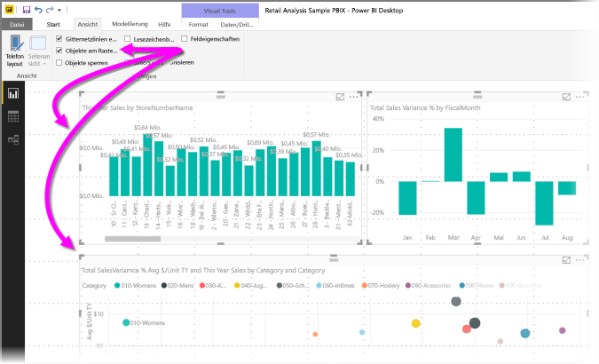
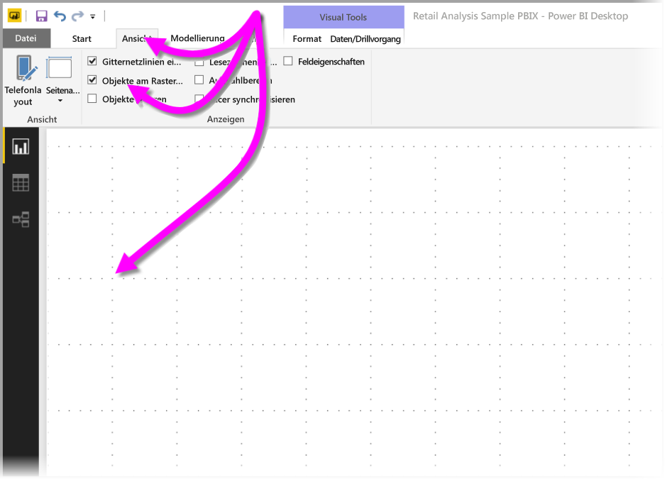
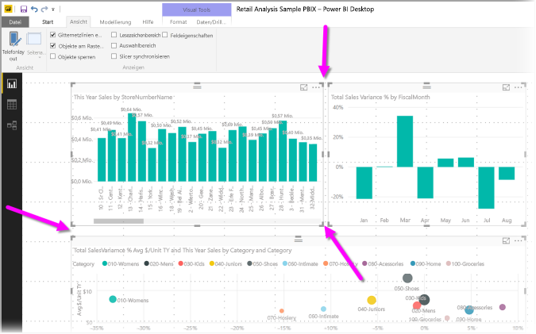
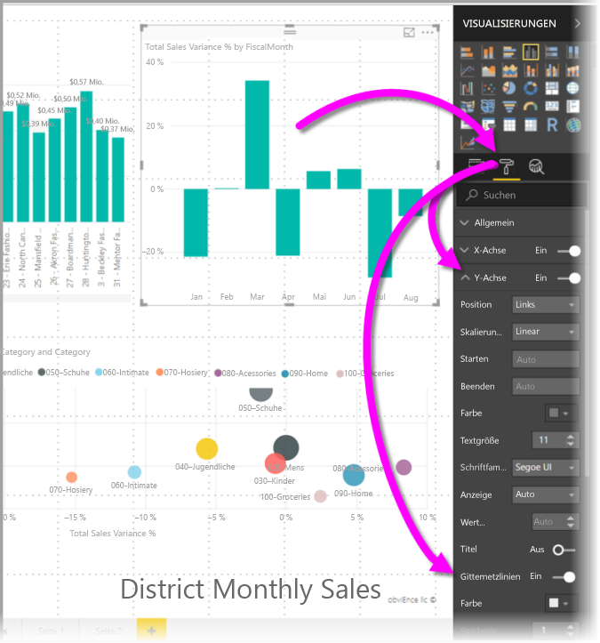
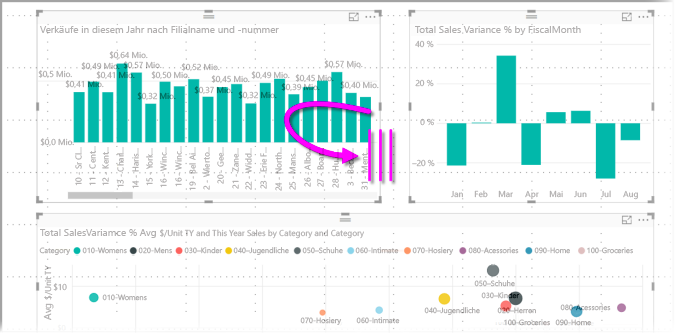
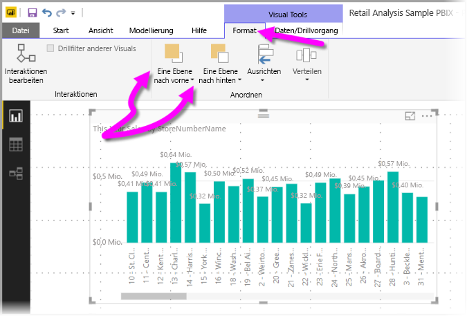
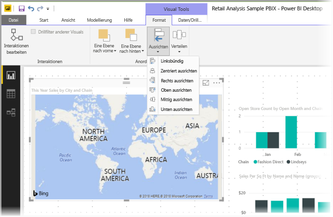
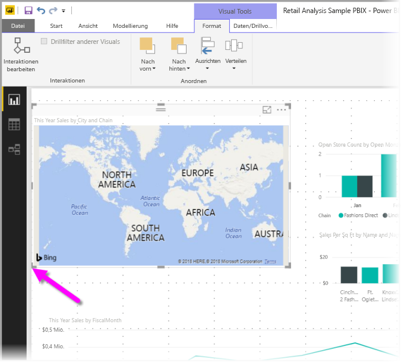
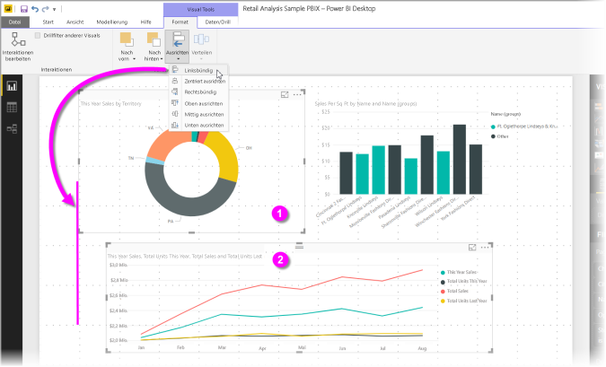
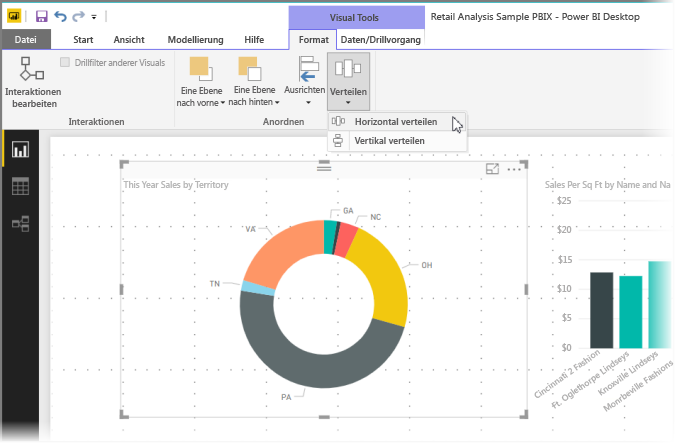

# Verwenden von Gitternetzlinien und „Am Raster ausrichten“ in Power BI Desktop-Berichten
Der Berichtszeichenbereich in **Power BI Desktop** enthält Gitternetzlinien, mit denen Sie Visualisierungen auf einer Berichtsseite genau ausrichten können, sowie die Funktion „Am Raster ausrichten“, sodass Berichte aufgeräumt, organisiert und konsistent aussehen.

In **Power BI Desktop** können Sie außerdem die Z-Reihenfolge (in den Vordergrund/Hintergrund) von Objekten in einem Bericht anpassen und Objekte im Zeichenbereich ausrichten oder mit gleichem Abstand verteilen.

### Aktivieren von Gitternetzlinien und die Funktion „Am Raster ausrichten“
Um Gitternetzlinien und die Option „Am Raster ausrichten“ zu aktivieren, wählen Sie das Menüband **Ansicht** aus, und aktiveren Sie dann die Kontrollkästchen für **Gitternetzlinien anzeigen** und **Objekte am Raster ausrichten**. Sie können eines oder beide Kontrollkästchen aktivieren; die Funktionen sind voneinander unabhängig.

> [!NOTE]
> Wenn **Gitternetzlinien anzeigen** und **Objekte am Raster ausrichten** deaktiviert sind, stellen Sie eine Verbindung mit einer beliebigen Datenquelle her, um diese Funktionen zu aktivieren.
> 
> 

### Verwenden von Gitternetzlinien
Gitternetzlinien sind visuelle Hilfsmittel, mit denen Sie feststellen können, ob mehrere Visualisierungen korrekt ausgerichtet sind. Wenn Sie die Ausrichtung mehrerer Visualisierungen überprüfen möchten, können Sie Gitternetzlinien verwenden, um die Ausrichtung anhand der Rahmen zu beurteilen.

Mithilfe von *STRG+Klick* können Sie mehrere Visualisierungen gleichzeitig auswählen, wodurch deren Rahmen angezeigt werden, sodass Sie die Ausrichtung der Visualisierungen überprüfen können.

#### Verwenden von Gitternetzlinien in Visuals
In Power BI enthalten Visuals auch Gitternetzlinien, die visuelle Unterstützung zum Vergleichen von Datenpunkten und Werten bieten. Ab der im September 2017 veröffentlichten Version von **Power BI Desktop** können Sie die Gitternetzlinien in Visuals mit der Karte **X-Achse** oder **Y-Achse** (je nach Typ des Visuals) im Abschnitt **Format** des Bereichs **Visualisierungen** verwalten. Sie können die folgenden Elemente von Gitternetzlinien in einem Visual verwalten:

* Aktivieren oder Deaktivieren von Gitternetzlinien
* Ändern der Farbe von Gitternetzlinien
* Anpassen der Strichstärke (Breite) von Gitternetzlinien
* Auswählen der Linienart der Gitternetzlinien im Visual, z.B. „Durchgezogen“, „Gestrichelt“ oder „Gepunktet“

In Berichten, in denen dunkle Hintergründe für Visuals verwendet werden, kann das Ändern bestimmter Elemente von Gitternetzlinien besonders hilfreich sein. In der folgenden Abbildung wird der Abschnitt *Gitternetzlinien* auf der Karte **X-Achse** dargestellt.

### Verwenden von „Am Raster ausrichten“
Wenn Sie die Funktion **Objekte am Raster ausrichten** aktivieren, werden alle Visualisierungen auf der Zeichenfläche in **Power BI Desktop** automatisch an der nächsten Gitternetzachse ausgerichtet, wenn diese bewegt (oder in der Größe angepasst) werden. So können Sie leicht sicherstellen, dass mehrere Visualisierungen an derselben Stelle der Seite horizontal oder vertikal ausgerichtet sind.

Und das ist schon alles, was es über **Gitternetzlinien** und die Funktion **Am Raster ausrichten** zu sagen gibt. Das saubere Ausrichten von Visualisierungen in Berichten ist jetzt also ganz einfach.

### Verwenden der Z-Reihenfolge, Ausrichten und Verteilen
Sie können in Berichten die Reihenfolge von Visualisierungen auf der Vordergrund-Hintergrund-Achse ändern (die *Z-Reihenfolge* von Elementen). Mithilfe der Z-Reihenfolge können Visualisierungen sich in beliebiger Weise überlappen. Sie können diese Reihenfolge mit den Schaltflächen **Nach vorn** und **Nach hinten** ändern, die sich im Abschnitt **Anordnen** im Menüband **Format** befinden. Um auf diese Funktion zuzugreifen, muss mindestens eine Visualisierung auf der Seite ausgewählt sein. Sie steht nicht zur Verfügung, wenn keine Visualisierung ausgewählt ist.

Über das Menüband **Format** können Sie Visualisierungen auf viele verschiedene Arten anordnen. So werden Visualisierungen auf der Seite stets so angezeigt, wie es in Ihren Augen am besten aussieht und funktioniert.

Wenn Sie bei ausgewählter Visualisierung die Schaltfläche **Ausrichten** verwenden, wird die Visualisierung an der Kante (oder am Mittelpunkt) des Berichtszeichenbereichs ausgerichtet (siehe die folgende Abbildung).

Wenn mindestens zwei Visualisierungen ausgewählt sind, werden sie zusammen ausgerichtet, wobei die Begrenzung einer der Visualisierungen zur Ausrichtung dient. Beispiel: Zwei Visualisierungen sind ausgewählt. Sie wählen die Schaltfläche *Links ausrichten*. Jetzt werden die Visualisierungen an der am weitesten links liegenden Begrenzung aller ausgewählten Visualisierungen ausgerichtet.

Sie können Visualisierungen im Berichtszeichenbereich auch gleich verteilen (horizontal und vertikal). Verwenden Sie einfach Schaltfläche **Verteilen** im Menüband **Format**.

Mit den Tools für Gitternetzlinien, Ausrichtung und Verteilung sehen Ihre Berichte schnell professionell aus.

