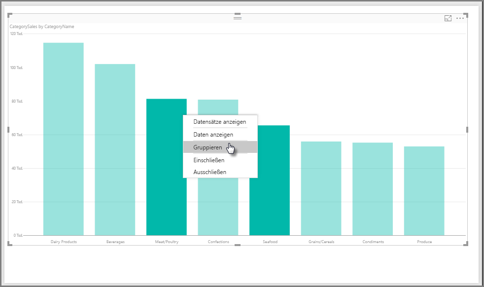
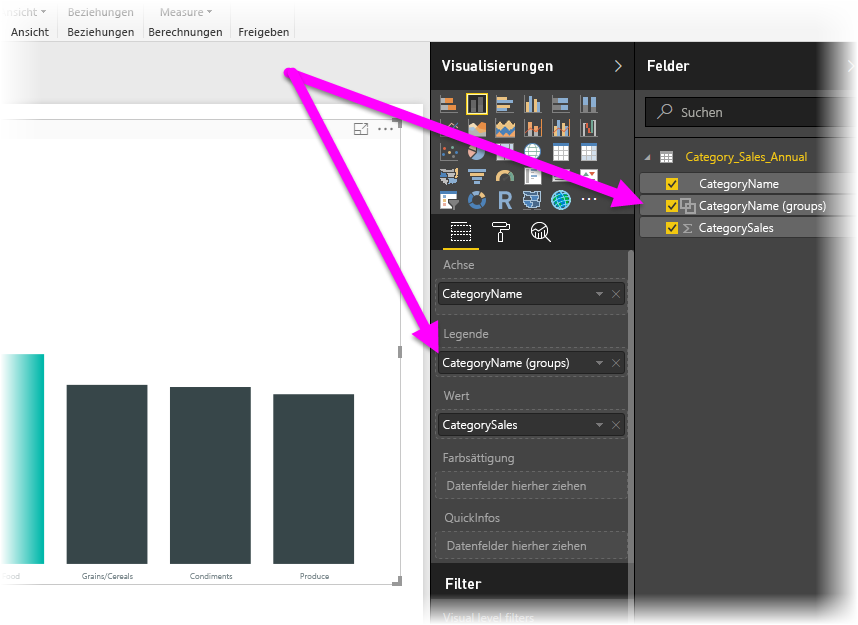
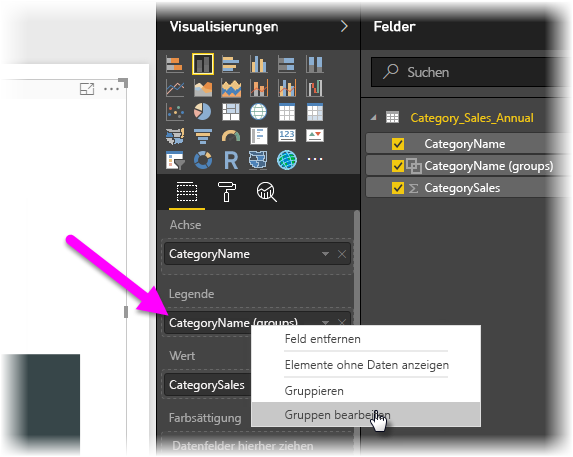
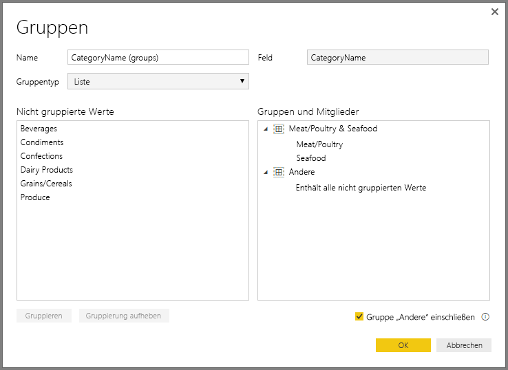
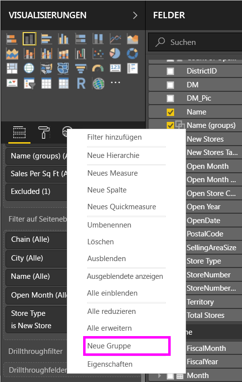
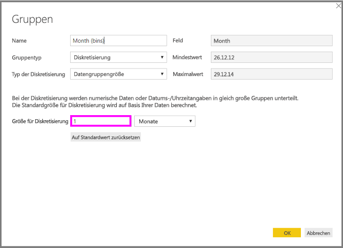
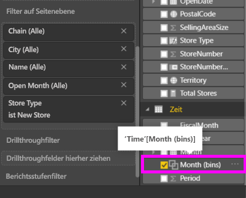

# Verwenden von Gruppierung und Diskretisierung in Power BI Desktop
Beim Erstellen von Visuals in **Power BI Desktop** werden die Daten basierend auf Werten in den zugrunde liegenden Daten in Blöcken (oder Gruppen) aggregiert. Häufig ist dies ausreichend, in manchen Situationen ist es jedoch sinnvoll, die Darstellung der Blöcke zu verfeinern. Beispielsweise möchten Sie eventuell drei Kategorien von Produkten in einer größeren Kategorie (einer *Gruppe*) anordnen. Alternativ sollen Umsatzzahlen in Diskretisierungen der Größe 1.000.000 Dollar statt des gleichmäßig verteilten Betrags von 923.983 Dollar unterteilt werden.

Sie können in Power BI Desktop Datenpunkte **gruppieren**, um Daten und Trends in den Visuals deutlicher anzeigen, analysieren und untersuchen zu können. Sie können zudem die **Größe der Diskretisierung** definieren (häufig als *Diskretisieren* bezeichnet), um Werte in Gruppen gleicher Größe zu unterteilen, die es ihnen erleichtern, Daten auf aussagekräftige Weise zu visualisieren.

## Verwenden von Gruppierung
Wählen Sie zum Verwenden von Gruppierung mindestens zwei Elemente in einem Visual aus. Verwenden Sie zum Auswählen mehrerer Elemente STRG+Klick. Klicken Sie dann mit der rechten Maustaste auf eines der per Mehrfachauswahl ausgewählten Elemente, und wählen Sie im angezeigten Menü **Gruppe** aus.

Nachdem die Gruppe erstellt wurde, wird sie dem Bucket **Legende** für das Visual hinzugefügt und auch in der Liste **Felder** angezeigt.

Sobald eine Gruppe erstellt wurde, können Sie die Mitglieder dieser Gruppe einfach bearbeiten. Klicken Sie hierzu im Bucket **Legende** oder in der Liste **Felder** mit der rechten Maustaste auf das Feld, und wählen Sie **Gruppen bearbeiten** aus.

Im daraufhin angezeigten Fenster **Gruppen** können Sie neue Gruppen erstellen oder vorhandene Gruppen ändern. Sie können jede Gruppe auch *umbenennen*, indem Sie im Feld **Gruppen und Mitglieder** auf den Titel „Gruppe“ doppelklicken und einen neuen Namen eingeben.

Gruppen bieten Ihnen viele Gestaltungsmöglichkeiten. Sie können Elemente von der Liste **Nicht gruppierte Werte** zu einer neuen oder einer existierenden Gruppe hinzufügen. Um eine neue Gruppe zu erstellen, wählen Sie im Feld **Nicht gruppierte Werte** (mit STRG+Klick) mindestens zwei Elemente aus, und klicken Sie dann auf die Schaltfläche **Gruppieren**, die sich unter dem Feld befindet.

Sie können einen nicht gruppierten Wert zu einer bestehenden Gruppe hinzufügen, indem Sie den nicht gruppierten Wert und dann die bereits vorhandene Gruppe, der Sie den Wert hinzufügen möchten, wählen und auf die Schaltfläche **Gruppieren** klicken. Um ein Element aus einer Gruppe zu entfernen, klicken Sie im Feld **Gruppen und Mitglieder** auf das Element und dann auf **Gruppierung aufheben**. Sie können auch auswählen, ob nicht gruppierte Kategorien in die Gruppe **Sonstige** eingefügt oder ungruppiert bleiben sollen.

> [!NOTE]
> Sie können im Bereich **Felder** Gruppen für jedes Feld erstellen, ohne mehrere Elemente in einem Visual auswählen zu müssen. Klicken Sie einfach mit der rechten Maustaste auf das Feld, und wählen Sie im angezeigten Menü **Neue Gruppe** aus.

## Verwenden von Diskretisierung
Sie können die Größe der Diskretisierung für numerische Felder und Zeitfelder in **Power BI Desktop** festlegen. Mit Diskretisierung können Sie die richtige Größe der in **Power BI Desktop** angezeigten Daten festlegen.

Um eine Größe der Diskretisierung anzuwenden, klicken Sie mit der rechten Maustaste auf ein **Feld**, und wählen Sie **Neue Gruppen** aus.

Legen Sie im Fenster **Gruppen** die **Größe für Diskretisierung** auf die gewünschte Größe fest.

Wenn Sie auf **OK** klicken, wird im Bereich **Felder** ein neues Feld angezeigt, an das *(Container)* angefügt ist. Sie können das Feld dann in den Zeichenbereich ziehen, um die Größe der Diskretisierung in einer Visualisierung zu verwenden.

In diesem [Video](https://www.youtube.com/watch?v=BRvdZSfO0DY) wird gezeigt, wie **Diskretisierung** angewendet wird.

Nun verfügen Sie über die nötigen Informationen, um **Gruppierung** und **Diskretisierung** zu verwenden und um sicherzustellen, dass die Visualisierungen in den Berichten die Daten genau so anzeigen, wie Sie es wünschen.

