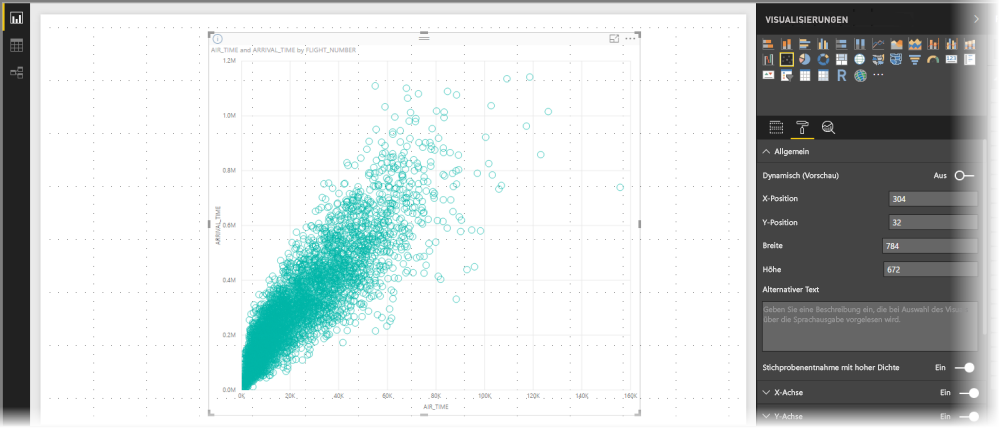
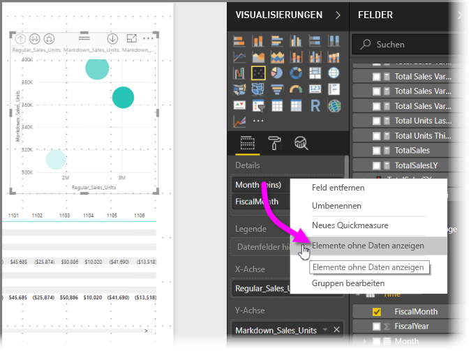
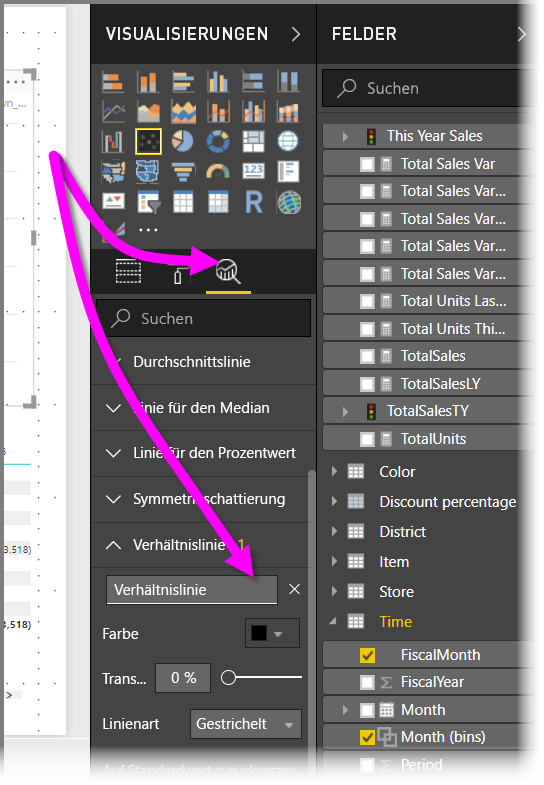
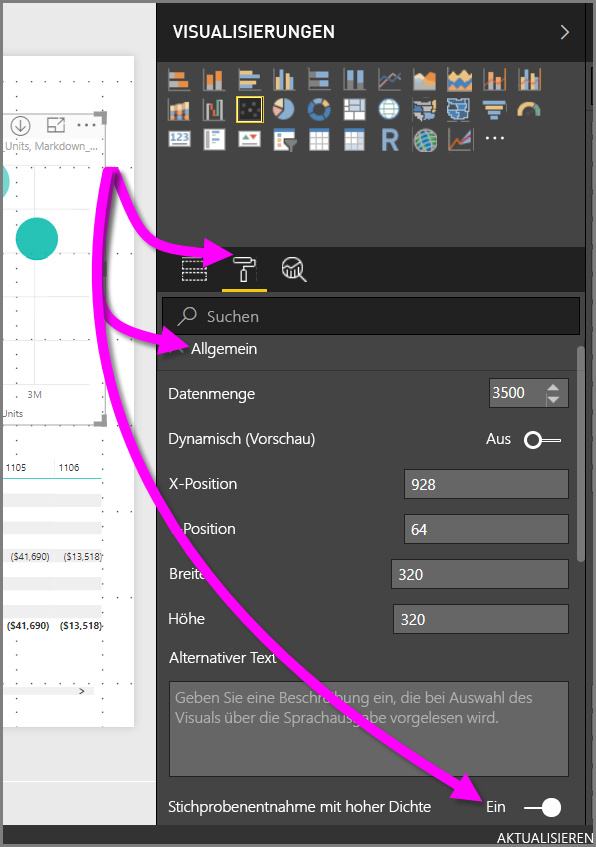

# Stichprobenentnahme mit hoher Dichte in Power BI-Punktdiagrammen
Mit Veröffentlichung von **Power BI Desktop** im September 2017 und den Updates des **Power BI-Diensts** steht ein neuer Stichprobenalgorithmus zur Verfügung, der die Darstellung von Daten mit hoher Dichte in Punktdiagrammen verbessert.

Sie können z.B. ein Punktdiagramm der Verkaufsaktivitäten Ihrer Organisation erstellen, wobei für jedes Ladengeschäft Zehntausende von Datenpunkten pro Jahr vorhanden sind. Ein Punktdiagramm mit derartigen Informationen entnimmt stichprobenartig Daten (wählen Sie eine aussagekräftige Darstellung dieser Daten, um die Verkaufszahlen über die Zeit hinweg darzustellen) aus den verfügbaren Daten und erstellt ein Punktdiagramm, das die zugrunde liegenden Daten veranschaulicht. Dies ist eine gängige Methode für Punktdiagramme mit hoher Dichte. Die Stichprobenentnahme von Daten mit hoher Dichte von Power BI wurde verbessert. Dies wird in diesem Artikel ausführlicher beschrieben.

> [!NOTE]
> Der in diesem Artikel beschriebene Algorithmus der **Stichprobenentnahme mit hoher Dichte** ist in den Punktdiagrammen für **Power BI Desktop** und für den **Power BI-Dienst** verfügbar.
> 
> 

## Funktionsweise von Punktdiagrammen mit hoher Dichte
Früher hat **Power BI** zum Erstellen eines Punktdiagramms eine Sammlung von Beispieldatenpunkten im vollständigen Bereich der zugrunde liegenden Daten auf deterministische Weise ausgewählt. In Power BI wurde die erste und die letzte Datenzeile in der Datenreihe des Punktdiagramms ausgewählt, und dann wurden die restlichen Zeilen gleichmäßig unterteilt, sodass im Punktdiagramm insgesamt 3.500 Datenpunkte dargestellt werden. Wenn die Stichprobe beispielsweise 35.000 Zeilen umfasst, werden die erste und letzte Zeile für die Darstellung ausgewählt und außerdem jede zehnte Zeile dargestellt (35.000/10 = jede zehnte Zeile = 3.500 Datenpunkte). Zudem wurden früher NULL-Werte oder nicht darstellbare Punkte (z.B. Textwerte) in Datenreihen nicht angezeigt und somit beim Generieren des Visuals nicht berücksichtigt. Bei einer solchen Stichprobenentnahme basiert die wahrgenommene Dichte des Punktdiagramms auch auf den repräsentativen Datenpunkten. Deshalb war die implizierte visuelle Dichte eine Folge der als Stichprobe entnommenen Datenpunkte und nicht der vollständigen Sammlung der zugrunde liegenden Daten.

Wenn Sie **Stichprobenentnahme mit hoher Dichte** aktivieren, implementiert Power BI einen Algorithmus, der überlappende Punkte ausschließt, und es wird sichergestellt, dass die Punkte im Visual bei der Interaktion mit dem Visual erreicht werden können. Darüber hinaus stellt der Algorithmus sicher, dass alle Punkte im Dataset im Visual dargestellt werden. So wird nicht nur einfach eine repräsentative Stichprobe sondern auch der Kontext ausgewählter Punkte dargestellt.

Definitionsgemäß werden Stichproben von Daten mit hoher Dichte entnommen, um schnell Visualisierungen zu erstellen, die auf Interaktivität reagieren. Zu viele Datenpunkte in einem Visual können dieses verlangsamen und die Sichtbarkeit von Trends beeinträchtigen. Das Erstellen des Algorithmus zur Stichprobenentnahme hängt davon ab, wie die Daten entnommen werden, um die beste Visualisierung zu bieten und sicherzustellen, dass alle Daten dargestellt werden. Durch den verbesserten Algorithmus in Power BI werden Reaktionsfähigkeit, Darstellung und die Erhaltung von wichtigen Punkten im gesamten Dataset optimal miteinander vereint.

> [!NOTE]
> Punktdiagramme, die **Stichprobenentnahme mit hoher Dichte** verwenden, lassen sich wie alle Punktdiagramme am besten in quadratischen Visuals darstellen.
> 
> 

## Funktionsweise des neuen Algorithmus der Stichprobenentnahme für Punktdiagramme
Der neue Algorithmus der **Stichprobenentnahme mit hoher Dichte** für Punktdiagramme nutzt Methoden, mit denen die zugrunde liegenden Daten effektiver erfasst und dargestellt und überlappende Punkte ausgeschlossen werden. Hierzu wird mit einem kleinen Radius für jeden Datenpunkt (der visuelle Kreisradius für einen bestimmten Punkt in der Visualisierung) begonnen. Anschließend wird der Radius aller Datenpunkte vergrößert. Wenn sich zwei (oder mehr) Datenpunkte überlappen, werden die überlappenden Datenpunkte durch einen einzelnen Kreis (mit vergrößertem Radius) dargestellt. Der Algorithmus vergrößert den Radius der Datenpunkte weiter, bis der Radiuswert dazu führt, dass im Punktdiagramm eine angemessene Anzahl von Datenpunkten – 3.500 – angezeigt wird.

Die Methoden in diesem Algorithmus stellen sicher, dass Ausreißer im resultierenden Visual dargestellt werden. Der Algorithmus berücksichtigt beim Bestimmen der Überlappung auch die Skalierung, sodass exponentielle Skalierungen gemäß den zugrunde liegenden visualisierten Datenpunkten dargestellt werden.

Der Algorithmus bewahrt zudem die Gesamtform des Punktdiagramms.

> [!NOTE]
> Bei Verwendung des Algorithmus der **Stichprobenentnahme mit hoher Dichte** für Punktdiagramme wird eine *genaue Verteilung* der Daten und *nicht* die implizierte visuelle Dichte angestrebt. Beispielsweise wird eventuell ein Punktdiagramm angezeigt, in dem sich in einem bestimmten Bereich sehr viele Kreise überlappen (Dichte), und Sie nehmen an, dass dort viele Datenpunkte zusammengedrängt sind. Da der Algorithmus für die **Stichprobenentnahme mit hoher Dichte** mit einem einzelnen Kreis viele Datenpunkte darstellen kann, wird die implizierte visuelle Dichte (Clustering) nicht angezeigt. Um weitere Details in einem angegebenen Bereich anzuzeigen, können Sie mit Schiebereglern die Darstellung vergrößern.
> 
> 

Darüber hinaus werden Datenpunkte, die nicht dargestellt werden können (z.B. NULL-Werte oder Textwerte), ignoriert, und stattdessen wird ein anderer Wert ausgewählt, der dargestellt werden kann. Auch dies stellt sicher, dass die richtige Form des Punktdiagramms erhalten bleibt.

### Wenn der Standardalgorithmus für Punktdiagramme verwendet wird
Es gibt Situationen, in denen die **Stichprobenentnahme mit hoher Dichte** nicht auf ein Punktdiagramm angewendet werden kann und der ursprüngliche Algorithmus verwendet wird. Dabei handelt es sich um die folgenden Situationen:

* Wenn Sie mit der rechten Maustaste auf einen Wert unter **Details** klicken und diesen daraufhin im Menü auf **Elemente ohne Daten anzeigen** festlegen, wird das Punktdiagramm auf den ursprünglichen Algorithmus zurückgesetzt.
  
  
* Wenn sich auf der **Wiedergabeachse** Werte befinden, wird das Punktdiagramm auf den ursprünglichen Algorithmus zurückgesetzt.
* Wenn in einem Punktdiagramm die X-und Y-Achse fehlen, wird das Diagramm auf den ursprünglichen Algorithmus zurückgesetzt.
* Wenn im Bereich **Analyse** eine **Verhältnislinie** verwendet wird, wird das Diagramm auf den ursprünglichen Algorithmus zurückgesetzt.
  
  

## Aktivieren der Stichprobenentnahme mit hoher Dichte für ein Punktdiagramm
Wählen Sie zum Aktivieren der **Stichprobenentnahme mit hoher Dichte** ein Punktdiagramm aus, navigieren Sie zum Bereich **Formatierung**, erweitern Sie die Karte **Allgemein**, und schalten Sie den Schieberegler **Stichprobenentnahme mit hoher Dichte** unten auf dieser Karte auf **Ein**.

> [!NOTE]
> Nachdem der Schieberegler auf „Ein“ geschoben wurde, wird der Algorithmus der **Stichprobenentnahme mit hoher Dichte** in Power BI verwendet, wann immer dies möglich ist. Wenn der Algorithmus nicht verwendet werden kann (z.B. weil Sie auf der *Wiedergabeachse* einen Wert platzieren), bleibt der Schieberegler in der Position **Ein**, obwohl das Diagramm auf den Standardalgorithmus zurückgesetzt wurde. Wenn Sie dann einen Wert von der *Wiedergabeachse* entfernen (oder die Bedingungen sich ändern, sodass der Algorithmus für die Stichprobenentnahme mit hoher Dichte verwendet werden kann), wird automatisch die Stichprobenentnahme mit hoher Dichte für das Diagramm verwendet, da das Feature aktiviert ist.
> 
> [!NOTE]
> Datenpunkte werden nach dem Index gruppiert oder ausgewählt. Das Vorhandensein einer Legende beeinträchtigt nicht die Stichprobenentnahme durch den Algorithmus, es wirkt sich nur auf die Sortierung des Visuals aus.
> 
> 

## Überlegungen und Einschränkungen
Der Algorithmus der Stichprobenentnahme mit hoher Dichte ist eine wichtige Verbesserung in Power BI. Es gibt jedoch einige Aspekte, die Sie berücksichtigen sollten, wenn Sie mit Werten hoher Dichte und Punktdiagrammen arbeiten.

* Der Algorithmus der **Stichprobenentnahme mit hoher Dichte** kann nur für Liveverbindungen mit auf dem Power BI-Dienst basierenden Modellen, importierten Modellen oder DirectQuery ausgeführt werden.

## Nächste Schritte
Weitere Informationen über die Stichprobenentnahme mit hoher Dichte in anderen Diagrammen finden Sie im folgenden Artikel.

* [Strichprobenentnahme für visuelle Linienelemente mit hoher Dichte in Power BI](desktop-high-density-sampling.md)

