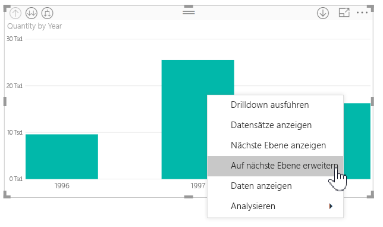
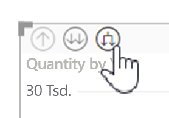
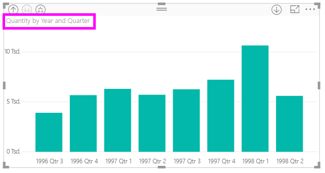
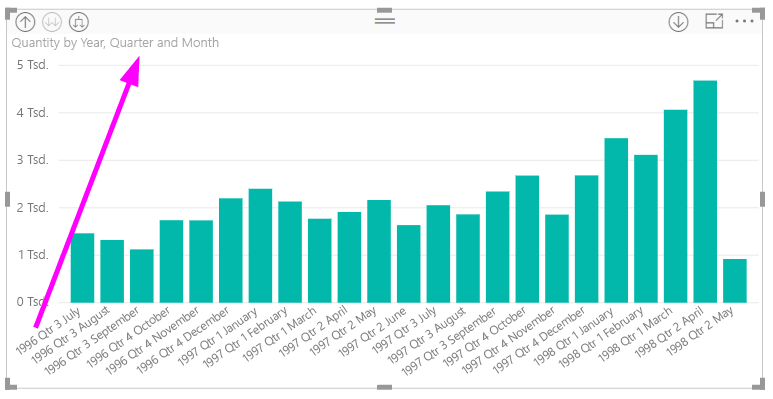
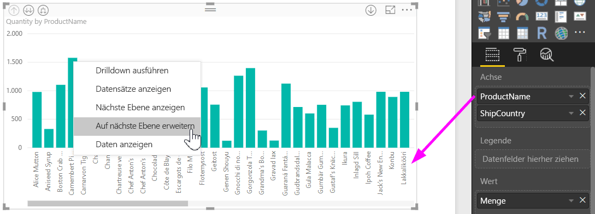
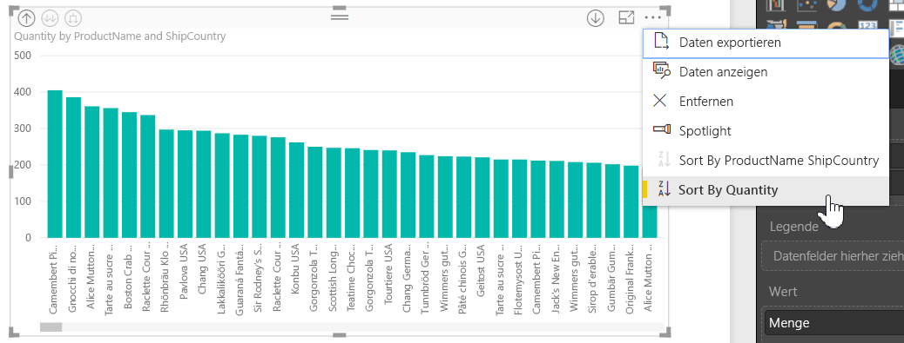
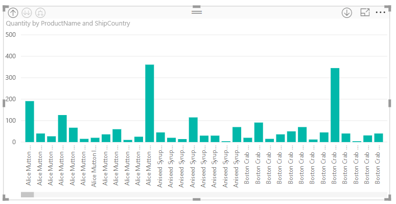

# Verwenden von Inlinehierarchiebeschriftungen in Power BI Desktop
**Power BI Desktop** unterstützt die Verwendung von **Inlinehierarchiebeschriftungen**. Dies ist das erste von zwei Features, die die Ermittlung hierarchischer Details verbessern sollen. Das zweite Feature, das derzeit entwickelt wird, ist die Fähigkeit, geschachtelte Hierarchiebeschriftungen zu verwenden (achten Sie auf weitere Updates).   

## Funktionsweise von Inlinehierarchiebeschriftungen
Mit Inlinehierarchiebeschriftungen werden bei der Erweiterung von Visualisierungen mit dem Feature **Alle erweitern** Hierarchiebeschriftungen angezeigt. Ein großer Vorteil dieser Hierarchiebeschriftungen ist, dass Sie diese beim Erweitern der Hierarchiedaten auch **sortieren** können.

### Verwenden des integrierten Features „Erweitern“ (ohne Sortierung nach Hierarchiebeschriftungen)
Bevor wir uns Inlinehierarchiebeschriftungen in Aktion ansehen, werfen wir einen Blick auf das Verhalten des Standardfeatures **Auf nächste Ebene erweitern**. Dies verdeutlicht, wie nützlich Inlinehierarchiebeschriftungen sein können

Die folgende Abbildung zeigt ein visuelles Balkendiagramm für den Jahresumsatz. Wenn Sie einen Rechtsklick auf die Leiste ausführen, können Sie **Auf nächste Ebene erweitern** auswählen.

> [!NOTE]
> Alternativ können Sie zum Rechtsklick auf eine Leiste auch auf der Visualisierung oben links auf die Schaltfläche *Erweitern* klicken.

  

Nachdem Sie **Auf nächste Ebene erweitern** ausgewählt haben, wird die Datenhierarchie im Visual von *Jahr* zu *Quartal* erweitert, wie in der folgenden Abbildung dargestellt.

Die Beschriftungen *Jahr* und *Quartal* werden dabei jeweils in einer Zeile angezeigt. Dieses Beschriftungsschema setzt sich fort, wenn Sie bis zum Ende der Hierarchie weiter **Alle erweitern** auswählen.

Dies ist die Verhaltensweise der integrierten Hierarchie für *Datum* in Verbindung mit Feldern mit dem Datentyp *Datum/Uhrzeit*. Gehen wir zum nächsten Abschnitt, in dem erläutert wird, was bei der neuen Feature für Inlinehierarchiebeschriftungen anders ist.

### Verwenden von Inlinehierarchiebeschriftungen
Sehen wir uns jetzt ein anderes Diagramm an. Dieses enthält Daten mit einer informellen Hierarchie. Im folgenden Visual wird ein Balkendiagramm mit **Quantity** mit *ProductName* als Achse angezeigt. In diesen Daten bilden *ProductName* und *ShipCountry* eine informelle Hierarchie. Von hier aus können Sie erneut *Auf nächste Ebene erweitern* auswählen, um einen Drilldown in der Hierarchie durchzuführen.

Durch Auswahl von **Auf nächste Ebene erweitern** wird die nächste Ebene mit der Inlineanzeige von Hierarchiebeschriftungen angezeigt. Standardmäßig werden Inlinehierarchien nach Measurewert sortiert, in diesem Fall **Quantity**. Wenn Sie Inlinehierarchiebeschriftungen aktivieren, können Sie diese Daten auch nach Hierarchie sortiere. Klicken Sie hierfür rechts oben auf die Auslassungszeichen (**...**), und wählen Sie dann **Sort by ProductName ShipCountry** (Sortieren nach ProductName ShipCountry), wie in der folgenden Abbildung dargestellt.

Sobald **ShipCountry** ausgewählt ist, werden die Daten nach der informellen Hierarchieauswahl sortiert, wie in der folgenden Abbildung dargestellt.

> [!NOTE]
> Mit dem Feature für Inlinehierarchiebeschriftungen kann die integrierte Zeithierarchie noch nicht nach Wert, sondern nur nach hierarchischer Reihenfolge sortiert werden.
> 
> 

## Problembehandlung
Es kann vorkommen, dass Ihre Visualisierungen in einer erweiterten Inlinehierarchieebene hängenbleiben. Möglicherweise stellen Sie fest, dass Ihre Visualisierungen in dem Modus hängenbleiben, in dem sie erweitert wurden. Ein Drillup funktioniert in diesem Fall nicht. Dies kann passieren, wenn Sie die folgenden Schritte ausführen (die Lösung finden Sie *unter* diesen Schritten):

Schritte, bei denen Ihre Visualisierungen in einem erweiterten Zustand hängenbleiben können:

1. Sie aktivieren das Feature für **Inlinehierarchiebeschriftung**.
2. Sie erstellen Visualisierungen mit Hierarchien.
3. Anschließend wählen Sie **Alle erweitern** und speichern die Datei.
4. *Deaktivieren* Sie als Nächstes das Feature für die **Inlinehierarchiebeschriftung**, und starten Sie Power BI Desktop neu.
5. Öffnen Sie erneut Ihre Datei.

Wenn Sie diese Schritte ausführen und Ihre Visualisierungen im erweiterten Modus hängenbleiben, können Sie dies wie folgt lösen:

1. Aktivieren Sie erneut das Feature für die **Inlinehierarchiebeschriftung**, und starten Sie Power BI Desktop neu.
2. Öffnen Sie Ihre Datei erneut, und führen Sie einen Drillup zum Anfang der betroffenen Visualisierungen durch.
3. Speichern Sie die Datei.
4. Deaktivieren Sie das Feature für **Inlinehierarchiebeschriftungen**, und starten Sie Power BI Desktop anschließend neu.
5. Öffnen Sie erneut Ihre Datei.

Sie können Ihre Visualisierung auch löschen und neu erstellen.

