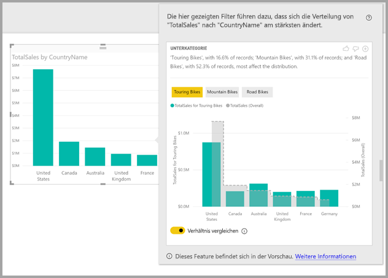
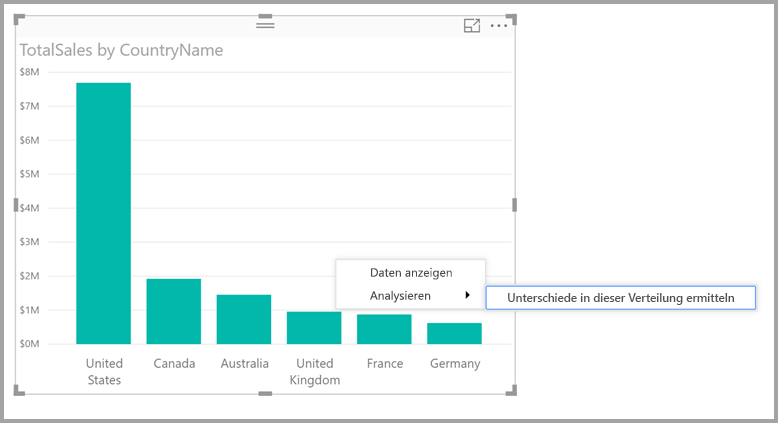
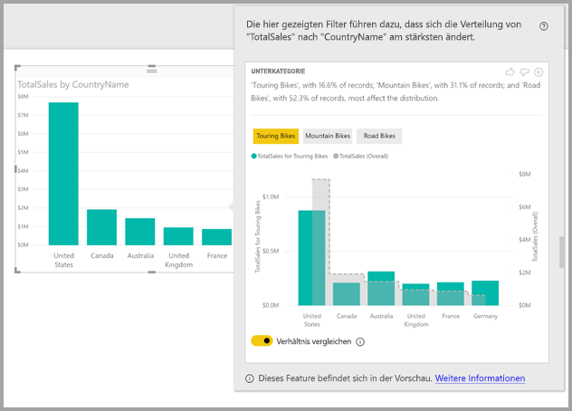

# Verwenden von Einblicken in Power BI Desktop zum Ermitteln von unterschiedlicher Verteilung (Vorschau)

Visuals veranschaulichen oft Datenpunkte. Doch ist die Verteilung für verschiedene Kategorien gleich? Mit **Einblicken** in **Power BI Desktop** können Sie das mit wenigen Klicks herausfinden.

Betrachten Sie das folgende Visual, das den *Gesamtumsatz* pro *Land* veranschaulicht. Wie das Diagramm zeigt, stammen die meisten Umsätze aus den USA – 57 % des Gesamtumsatzes. Der Anteil der anderen Länder ist geringer. In solchen Fällen ist es oft interessant zu untersuchen, ob die gleiche Verteilung für verschiedene Teilgesamtheiten angezeigt wird. Gilt dies beispielsweise gleichermaßen für alle Jahre, alle Vertriebskanäle und alle Produktkategorien?  Sie können zwar verschiedene Filter anwenden und die Ergebnisse visuell vergleichen, doch dieser Ansatz kann zeitaufwendig und fehleranfällig sein. 

Sie können in **Power BI Desktop** Unterschiede in der Verteilung ermitteln und schnell automatische aussagekräftige Analysen der Daten erhalten. Klicken Sie einfach mit der rechten Maustaste auf einen Datenpunkt, und wählen Sie **Analysieren > Unterschiede in dieser Verteilung ermitteln** aus. Daraufhin werden die Einblicke in einem benutzerfreundlichen Fenster angezeigt.

In diesem Beispiel zeigt die automatisierte Analyse schnell, dass bei *Tourenrädern* der Umsatzanteil in den USA und Kanada geringer ist, während der Anteil aus den anderen Ländern höher ist.   

> [!NOTE]
> Dieses Feature ist eine Vorschauversion und unterliegt Änderungen. Einblicke sind ab der im September 2017 veröffentlichten Version von **Power BI Desktop** standardmäßig aktiviert (Sie müssen nicht das Kontrollkästchen „Vorschau“ markieren, um sie zu aktivieren).
> 
> 

## Verwenden von Einblicken
Um mit Einblicken Verteilungsunterschiede in Diagrammen zu ermitteln, klicken Sie einfach mit der rechten Maustaste auf einen beliebigen Datenpunkt (oder auf das Visual als Ganzes) und wählen Sie **Analysieren > Unterschiede in dieser Verteilung ermitteln** aus.

**Power BI Desktop** führt dann seine Machine Learning-Algorithmen für die Daten aus und füllt ein Fenster mit einem Visual und einer Beschreibung dazu, welche Kategorien (Spalten)und welche Werte dieser Spalten zu den größten Unterschieden in der Verteilung führen. Einblicke werden als Säulendiagramm bereitgestellt, wie in der folgenden Abbildung gezeigt. 

Die Werte mit dem ausgewählten Filter werden mit der normalen Standardfarbe angezeigt. Die Gesamtwerte, wie auf dem ursprünglichen Visual zu sehen, werden zur besseren Vergleichbarkeit grau dargestellt. Bis zu drei verschiedene Filter sind möglich (in diesem Beispiel *Tourenräder*, *Mountainbikes*, *Rennräder*). Filter können durch Anklicken ausgewählt werden (bzw. mehrere Filter durch STRG + Klick).

Bei einfachen additiven Measures (in diesem Beispiel *Gesamtumsatz*) basiert der Vergleich auf den relativen – statt absoluten – Werten. Während die Verkäufe für Tourenräder sicherlich niedriger sind als die Gesamtverkäufe für alle Kategorien, verwendet das Visual standardmäßig eine Doppelachse, um den Umsatzanteil in verschiedenen Ländern vergleichen zu können – für Tourenräder im Vergleich zu allen Fahrradkategorien.  Durch Aktivieren des Umschalters unter dem Visual können die beiden Werte in der gleichen Achse angezeigt werden, sodass sich die absoluten Werte leicht vergleichen lassen (siehe folgendes Bild).    

Der beschreibende Text weist auch auf die Bedeutung eines Filterwerts hin, indem die Anzahl der Datensätze angegeben wird, die dem Filter entsprechen. In diesem Beispiel können Sie also sehen, dass die Verteilung für *Tourenräder* zwar signifikante Unterschiede aufweist, dies jedoch nur für 16,6 % der Datensätze gilt.

Mit den Symbolen *Daumen hoch* und *Daumen runter* am oberen Rand der Seite können Sie Feedback über das Visual und das Feature geben. Dadurch wird zwar Feedback gesendet, jedoch nicht der Algorithmus trainiert, um die Ergebnisse zu beeinflussen, die bei der nächsten Verwendung der Funktion zurückgegeben werden.

Insbesondere können Sie mit der Schaltfläche **+** am oberen Rand des Visuals das ausgewählte Visual dem Bericht hinzufügen, so als ob Sie es manuell erstellt hätten. Anschließend können Sie das hinzugefügte Visual wie jedes andere Visual im Bericht formatieren oder auf andere Weise anpassen. Sie können ein ausgewähltes Visual für Einblicke nur hinzufügen, wenn Sie einen Bericht in **Power BI Desktop** bearbeiten.

Sie können Einblicke verwenden, wenn sich der Bericht im Lese- oder Bearbeitungsmodus befindet. Dies bietet Ihnen die Flexibilität, sowohl Daten zu analysieren als auch Visuals zu erstellen, die Sie den Berichten einfach hinzufügen können.

## Details zu zurückgegebenen Ergebnissen
Der Algorithmus berücksichtigt im Grunde alle anderen Modellspalten, wendet sie auf alle Werte dieser Spalten als Filter für das ursprüngliche Visual an und ermittelt, welche dieser Filterwerte den größten *Unterschied* im Vergleich zum Original aufweisen.

Doch was genau bedeutet *unterschiedlich*? Angenommen, dass die Gesamtaufteilung der Umsätze zwischen den USA und Kanada folgendermaßen aussieht:

|Country  |Umsatz (Mio. $)|
|---------|----------|
|USA      |15        |
|Canada   |5         |

Dann sieht die Umsatzaufteilung für eine bestimmte Produktkategorie (*Rennräder*) möglicherweise so aus:

|Country  |Umsatz (Mio. $)|
|---------|----------|
|USA      |3        |
|Canada   |1         |

Während die Zahlen in jeder dieser Tabellen unterschiedlich sind, sind die relativen Werte für die USA und Kanada identisch (75 % und 25 % insgesamt und für Rennräder). Aus diesem Grund werden sie nicht als unterschiedlich betrachtet. Für einfache additive Measures wie diese, sucht der Algorithmus daher nach Unterschieden im *relativen* Wert.  

Betrachten Sie dagegen ein Measure wie die Marge, die als Gewinn/Kosten berechnet wird. Angenommen, dass die Gesamtmargen für die USA und Kanada wie folgt aussehen:

|Country  |Marge (%)|
|---------|----------|
|USA      |15        |
|Canada   |5         |

Dann sieht die Umsatzaufteilung für eine bestimmte Produktkategorie (*Rennräder*) möglicherweise so aus:

|Country  |Marge (%)|
|---------|----------|
|USA      |3        |
|Canada   |1         |

Solche Measures weisen einen interessanten *Unterschied* auf. Für nicht additive Measures wie in diesem Margenbeispiel sucht der Algorithmus also nach Unterschieden im absoluten Wert.

Die angezeigten Visuals sollen somit die Unterschiede zwischen der Gesamtverteilung (wie im ursprünglichen Visual zu sehen) und dem Wert unter Anwendung des jeweiligen Filters veranschaulichen.  

Für additive Measures, wie *Umsatz* im vorherigen Beispiel, wird ein Säulen- und Liniendiagramm verwendet. Eine Doppelachse mit entsprechender Skalierung vereinfacht den Vergleich relativer Werte. Die Säulen zeigen den Wert mit dem angewandten Filter und die Linie den Gesamtwert an (wobei die Achse des Säulendiagramms links und die des Liniendiagramms rechts ist, wie üblich). Das Liniendiagramm wird *abgestuft* mit einer gestrichelten Linie und grauer Füllung dargestellt (im vorherigen Beispiel). Wenn der Maximalwert der Säulendiagrammachse 4 und der der Liniendiagrammachse 20 ist, können die relativen Werte für die USA und Kanada einfach für die gefilterten und die Gesamtwerte verglichen werden. 

Für nicht additive Measures wie die *Marge* im vorherigen Beispiel wird ebenfalls ein Säulen- und Liniendiagramm verwendet, wobei die Verwendung einer einzelnen Achse bedeutet, dass die absoluten Werte leicht verglichen werden können. Auch hier zeigt die grau gefüllte Zeile den Gesamtwert an. Ob nun die tatsächlichen oder die relativen Zahlen verglichen werden: Bei der Bestimmung des Grades, in dem sich zwei Verteilungen unterscheiden, geht es nicht nur um die Berechnung der Differenz der Werte. Beispiel:

* Die Grundgesamtheit wird berücksichtigt, da ein Unterschied weniger statistisch signifikant und weniger interessant ist, wenn er für einen kleineren Anteil der Gesamtheit gilt. Beispielsweise könnte die Umsatzverteilung zwischen einzelnen Ländern für ein bestimmtes Produkt sehr unterschiedlich sein. Dies wäre nicht interessant, wenn es Tausende von Produkten gäbe, sodass das bestimmte Produkt nur einen kleinen Prozentsatz des Gesamtumsatzes ausmacht.

* Unterschiede für Kategorien, in denen die ursprünglichen Werte sehr hoch oder sehr nahe bei Null waren, werden höher gewichtet als andere. Wenn beispielsweise ein Land nur 1 % des Gesamtumsatzes ausmacht, aber 6 % zu einem bestimmten Produkttyp beiträgt, ist das statistisch bedeutsamer und daher interessanter als ein Land, dessen Anteil von 50 % auf 55 % gestiegen ist. 

* Verschiedene Heuristiken werden verwendet, um die aussagekräftigsten Ergebnisse auszuwählen, z. B. unter Berücksichtigung anderer Beziehungen zwischen den Daten.
     
Nachdem verschiedene Spalten und die jeweiligen Werte untersucht wurden, werden die Werte ausgewählt, die die größten Unterschiede aufweisen. Zum besseren Verständnis werden diese dann als gruppierte Säulen ausgegeben, wobei die Säule, deren Werte den größten Unterschied ergeben, zuerst angezeigt wird. Pro Spalte werden bis zu drei Werte angezeigt, es können jedoch auch weniger angezeigt werden, wenn es weniger als drei Werte gibt, die eine große Bedeutung haben, oder wenn einige Werte viel wirkungsvoller sind als andere. 

Möglicherweise werden nicht alle Spalten des Modells in der verfügbaren Zeit untersucht, sodass die bedeutendsten Spalten und Werte ggf. nicht angezeigt werden. Allerdings werden verschiedene Heuristiken eingesetzt, um sicherzustellen, dass die wahrscheinlichsten Spalten zuerst untersucht werden. Angenommen, dass nach Prüfung aller Spalten festgestellt wird, dass die folgenden Spalte/Werte den größten Einfluss auf die Verteilung haben (in absteigender Reihenfolge):

    Subcategory = Touring Bikes
    Channel = Direct
    Subcategory = Mountain Bikes
    Subcategory = Road Bikes
    Subcategory = Kids Bikes
    Channel = Store

Die ausgegebene Spaltenreihenfolge wäre wie folgt:

    Subcategory: Touring Bikes, Mountain Bikes, Road Bikes (only three listed, with the text including “...amongst others” to indicate that more than three have a significant impact) 

    Channel = Direct (only Direct listed, if it’s level of impact was much greater than Store)

## Überlegungen und Einschränkungen
In der folgenden Liste sind die Szenarien aufgeführt, die derzeit für **Einblicke** nicht unterstützt werden:

* TopN-Filter
* Kennzahlenfilter
* Nicht numerische Measures
* Verwendung von „Wert anzeigen als“
* Gefilterte Measures – diese Berechnungen mit einem bestimmten Filter auf Visualebene (z. B. *Gesamtumsatz Frankreich*) werden für einige Visuals verwendet, die von der Funktion Einblicke erstellt wurden

Außerdem werden die folgenden Modelltypen und Datenquellen für Einblicke derzeit nicht unterstützt:

* DirectQuery
* Live Connect
* Lokale Reporting Services
* Einbetten

## Nächste Schritte
Weitere Informationen zu **Power BI Desktop** und den ersten Schritten finden Sie in den folgenden Artikeln.

* [Was ist Power BI Desktop?](desktop-what-is-desktop.md)
* [Übersicht zu Abfragen mit Power BI Desktop](desktop-query-overview.md)
* [Datenquellen in Power BI Desktop](desktop-data-sources.md)
* [Verbinden mit Daten in Power BI Desktop](desktop-connect-to-data.md)
* [Strukturieren und Kombinieren von Daten mit Power BI Desktop](desktop-shape-and-combine-data.md)
* [Allgemeine Abfrageaufgaben in Power BI Desktop](desktop-common-query-tasks.md)   

