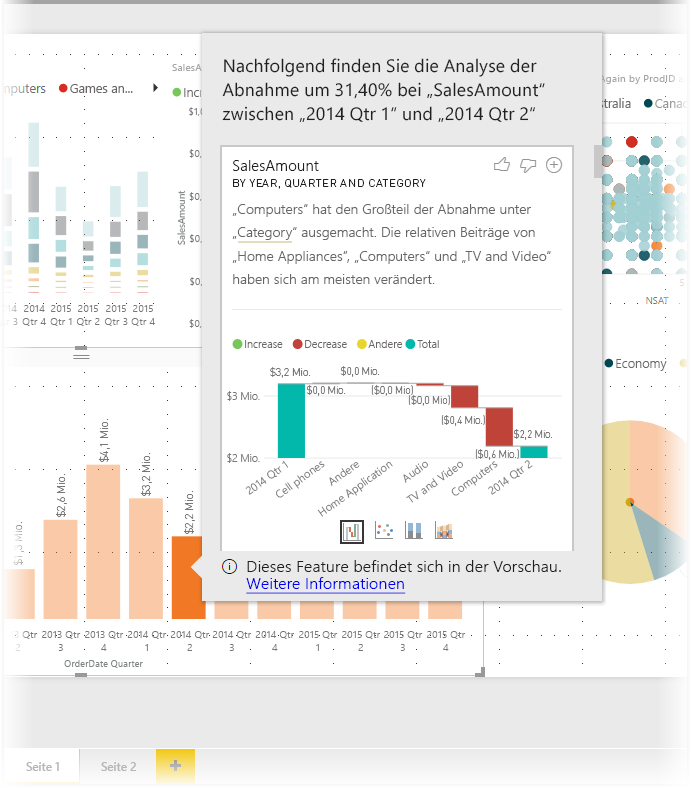
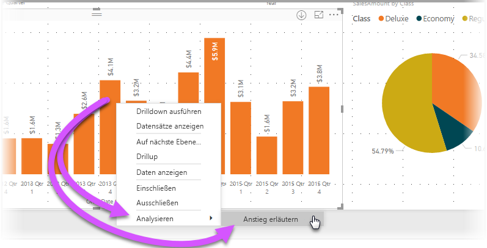
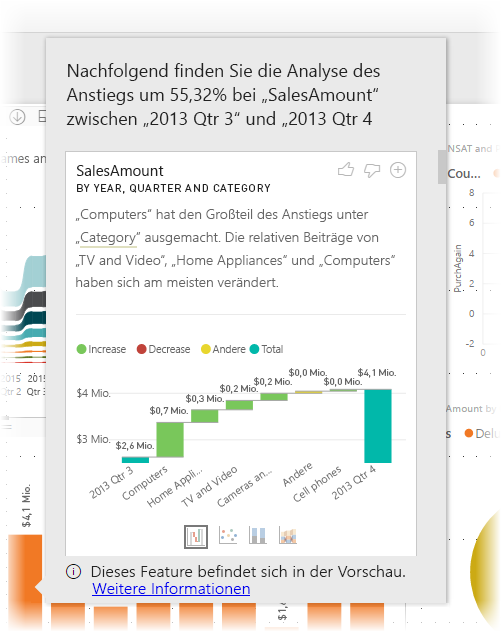
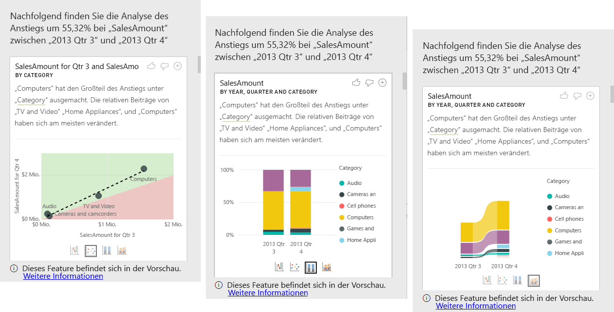

# Verwenden von Einblicken in Power BI Desktop zur Erklärung von Anstiegen und Rückgängen in Visuals (Vorschau)

Visuals weisen oft einen starken Anstieg und dann einen starken Rückgang von Werten auf. Was ist die Ursache für solche Schwankungen? Mit **Einblicke** in **Power BI Desktop** können Sie das mit wenigen Klicks herausfinden.

Betrachten Sie zum Beispiel das folgende Visual, das *Umsatzbetrag* pro *Jahr* und *Land* anzeigt. Im Jahr 2014 kommt es zu einem starken Umsatzrückgang zwischen dem *1. Quartal* und dem *2. Quartal*. In solchen Fällen können Sie die Daten untersuchen, um die aufgetretenen Veränderungen zu erklären. 

Sie können sich in **Power BI Desktop** Rückgänge und Anstiege in Diagrammen erläutern lassen, Verteilungsfaktoren in Diagrammen anzeigen und schnell automatische aussagekräftige Analysen Ihrer Daten erhalten. Klicken Sie einfach mit der rechten Maustaste auf einen Datenpunkt, und wählen Sie **Analysieren > Erläutern Sie den Rückgang** (oder „Erläutern Sie den Anstieg“, wenn der vorherige Balken niedriger war) oder **Analysieren > Ermitteln Sie die Unterschiede in dieser Verteilung** aus. Daraufhin bietet Ihnen ein benutzerfreundliches Fenster die entsprechenden Erkenntnisse.

Die Einblicke sind kontextabhängig und basieren auf dem unmittelbar vorherigen Datenpunkt, z.B. dem vorherigen Balken oder der vorherigen Spalte.

> [!NOTE]
> Dieses Feature ist eine Vorschauversion und unterliegt Änderungen. Einblicke sind ab der im September 2017 veröffentlichten Version von **Power BI Desktop** standardmäßig aktiviert (Sie müssen nicht das Kontrollkästchen „Vorschau“ markieren, um sie zu aktivieren).

## Verwenden von Einblicken
Um mithilfe von Einblicken Anstiege und Rückgänge in Diagrammen zu erklären, klicken Sie einfach mit der rechten Maustaste auf einen Datenpunkt in einem Balken- oder Liniendiagramm, und wählen Sie **Analysieren > Anstieg erläutern** (oder *Rückgang erläutern*) aus, da alle Einblicke auf der Änderung des vorherigen Datenpunkts basieren.

**Power BI Desktop** führt dann seine Machine Learning-Algorithmen für die Daten aus und füllt ein Fenster mit einem Visual und einer Beschreibung der Kategorien, die sich am stärksten auf den Anstieg oder den Rückgang ausgewirkt haben. Einblicke werden standardmäßig als *Wasserfallvisual* bereitgestellt, wie in der folgenden Abbildung gezeigt.

Sie können mithilfe der kleinen Symbole am unteren Rand des Wasserfallvisuals auswählen, ob Einblicke als Punktdiagramm, gestapeltes Säulendiagramm oder Menübanddiagramm angezeigt werden sollen.

Mit den Symbolen *Daumen hoch* und *Daumen runter* am oberen Rand der Seite können Sie Feedback über das Visual und das Feature geben. Dadurch wird zwar Feedback gesendet, jedoch nicht der Algorithmus trainiert, um die Ergebnisse zu beeinflussen, die bei der nächsten Verwendung der Funktion zurückgegeben werden.

Insbesondere können Sie mit der Schaltfläche **+** am oberen Rand des Visuals das ausgewählte Visual dem Bericht hinzufügen, so als ob Sie es manuell erstellt hätten. Anschließend können Sie das hinzugefügte Visual wie jedes andere Visual im Bericht formatieren oder auf andere Weise anpassen. Sie können ein ausgewähltes Visual für Einblicke nur hinzufügen, wenn Sie einen Bericht in **Power BI Desktop** bearbeiten.

Sie können Einblicke verwenden, wenn sich der Bericht im Lese- oder Bearbeitungsmodus befindet. Dies bietet Ihnen die Flexibilität, sowohl Daten zu analysieren als auch Visuals zu erstellen, die Sie den Berichten einfach hinzufügen können.

## Details zu zurückgegebenen Ergebnissen

Die von Einblicke zurückgegebenen Informationen sollen die Unterschiede zwischen den beiden Zeiträumen aufzeigen, damit Sie die Entwicklung nachvollziehen können.  

Wenn beispielsweise der *Umsatz* um insgesamt 55 % von *Quartal 3* auf *Quartal 4* gestiegen ist, und dies gleichermaßen für jede *Produktkategorie* (Umsatzanstieg um 55 % bei Computern, Audio etc.), jedes Land und jeden Kundentyp gilt, liefern die Daten wenige Hinweise zur Erklärung der Entwicklung. Dies entspricht jedoch nicht der Regel. In der Regel lassen sich Unterschiede feststellen, sodass die Kategorien *Computer* und *Haushaltsgeräte* um einen viel größeren Prozentsatz angestiegen sind (63 %) als *TV und Audio* (nur 23 %). Daher haben *Computer* und *Haushaltsgeräte* einen größeren Anteil an der Gesamtsumme von *Quartal 4* als von *Quartal 3*.  Angesichts dieses Beispiels wäre eine vernünftige Erklärung für den Anstieg: *Besonders starke Umsätze bei Computern sowie TV und Audio*. 

Der Algorithmus gibt also nicht nur die Werte zurück, die den Großteil der Änderung bedingen. Wenn beispielsweise die große Mehrheit (98 %) des Umsatzes aus den USA kommt, würde für gewöhnlich auch der Großteil des Anstiegs in den USA stattfindet. Ohne eine signifikante Veränderung des relativen Anteils der USA oder anderer Länder am Gesamtwert wäre *Land* in diesem Zusammenhang jedoch nicht interessant.  

Vereinfacht ausgedrückt, berücksichtigt der Algorithmus alle anderen Modellspalten, berechnet die Aufteilung pro Spalte für die Zeiträume *vorher* und *nachher* und bestimmt, wie sehr sich diese Aufteilung geändert hat. Daraufhin werden die Spalten mit der größten Veränderung zurückgegeben. Zum Beispiel wurde *Kategorie* im obigen Beispiel gewählt, da der Anteil von *TV und Video* um 7 % von 33 % auf 26 % gefallen ist, während der Anteil von *Haushaltsgeräte* von 0 % auf über 6 % anstieg. 

Für jede zurückgegebene Spalte können vier Visuals angezeigt werden. Drei dieser Visuals sollen die Veränderung des Anteils zwischen den beiden Zeiträumen verdeutlichen. Beispiel: Erläuterung des Anstiegs von *Quartal 2* zu *Quartal 3*.

### Punktdiagramm

Das Punktdiagramm zeigt den Wert des Measures im ersten Zeitraum (X-Achse) im Vergleich zum zweiten Zeitraum (Y-Achse) für jeden Wert der Spalte (hier *Kategorie*). Wie im folgenden Bild dargestellt, befinden sich also alle Datenpunkte im grünen Bereich, wenn der Wert gestiegen ist, und im roten Bereich, wenn er gesunken ist. 

Die gepunktete Linie ist die Ausgleichsgerade, d. h. die Datenpunkte über dieser Linie sind überdurchschnittlich angestiegen und die unter ihr unterdurchschnittlich.  

Datenelemente, deren Wert in einem Zeitraum leer war, werden nicht im Punktdiagramm angezeigt (z. B. hier *Haushaltsgeräte*).

### Gestapeltes Säulendiagramm (100 %)

Das zu 100 % gestapelte Säulendiagramm zeigt den Measurewert vor und nach der ausgewählten Säule als 100 % gestapelte Säule an. Dies ermöglicht den direkten Vorher-Nachher-Vergleich. Die QuickInfos zeigen den tatsächlichen Anteil für den ausgewählten Wert.

### Menübanddiagramm

Das Menübanddiagramm zeigt auch den vorherigen und nachfolgenden Measurewert an. Dies ist besonders nützlich, um die Änderungen an Anteilen anzuzeigen, wenn sich die *Reihenfolge* der Kategorien geändert hat (z. B. wenn *Computer* vorher an erste Stelle stand und nun an dritter steht). 

### Wasserfalldiagramm

Das vierte Visual ist ein Wasserfalldiagramm, das die wichtigsten tatsächlichen Anstiege bzw. Rückgänge zwischen den Zeiträumen zeigt. Dieses Visual zeigt deutlich die tatsächlichen Veränderungen, – aber nicht nur beim Anstieg/Rückgang des Anteils –, die hervorheben, warum die Spalte als interessant eingestuft wurde. 

Beim Einstufen der Spalte, die die größten Unterschiede bei den relativen Anteilen aufweist, wird Folgendes berücksichtigt: 

* Die Kardinalität wird berücksichtigt, da ein Unterschied weniger statistisch signifikant und weniger interessant ist, wenn eine Spalte eine hohe Kardinalität hat. 

* Unterschiede für Kategorien, in denen die ursprünglichen Werte sehr hoch oder sehr nahe bei Null waren, werden höher gewichtet als andere. Wenn z. B. eine Kategorie nur 1 % des Umsatzes ausmachte und daraus 6 % werden, ist das statistisch bedeutsamer und daher interessanter als eine Kategorie, deren Anteil von 50 % auf 55 % steigt. 

* Verschiedene Heuristiken werden verwendet, um die aussagekräftigsten Ergebnisse auszuwählen, z. B. unter Berücksichtigung anderer Beziehungen zwischen den Daten.
 
Nach Prüfung verschiedener Spalten werden diejenigen ausgewählt und ausgegeben, die die größte Veränderung des relativen Anteils aufweisen. In der Beschreibung werden jeweils die Werte aufgeführt, die sich am stärksten verändert haben. Darüber hinaus werden auch die Werte abgerufen, die tatsächlich am meisten angestiegen und zurückgegangen sind.

## Überlegungen und Einschränkungen
Da diese Einblicke auf Änderungen im Vergleich zum vorherigen Datenpunkt basieren, sind sie nicht verfügbar, wenn Sie den ersten Datenpunkt in einem Visual auswählen. 

In der folgenden Liste sind die Szenarien aufgeführt, die derzeit für **Anstieg/Rückgang erklären** nicht unterstützt werden:

* TopN-Filter
* Filter einschließen/ausschließen
* Kennzahlenfilter
* Nicht numerische Measures
* Verwendung von „Wert anzeigen als“
* Gefilterte Measures – diese Berechnungen mit einem bestimmten Filter auf Visualebene (z. B. *Gesamtumsatz Frankreich*) werden für einige Visuals verwendet, die von der Funktion Einblicke erstellt wurden
* Kategoriespalten auf der X-Achse, sofern keine skalare Sortierung nach Spalte definiert wird. Wenn eine Hierarchie verwendet wird, muss jede Spalte in der aktiven Hierarchie diese Bedingung erfüllen.

Außerdem werden die folgenden Modelltypen und Datenquellen für Einblicke derzeit nicht unterstützt:

* DirectQuery
* Live Connect
* Lokale Reporting Services
* Einbetten

## Nächste Schritte
Weitere Informationen zu **Power BI Desktop** und den ersten Schritten finden Sie in den folgenden Artikeln.

* [Was ist Power BI Desktop?](desktop-what-is-desktop.md)
* [Übersicht zu Abfragen mit Power BI Desktop](desktop-query-overview.md)
* [Datenquellen in Power BI Desktop](desktop-data-sources.md)
* [Verbinden mit Daten in Power BI Desktop](desktop-connect-to-data.md)
* [Strukturieren und Kombinieren von Daten mit Power BI Desktop](desktop-shape-and-combine-data.md)
* [Allgemeine Abfrageaufgaben in Power BI Desktop](desktop-common-query-tasks.md)   

