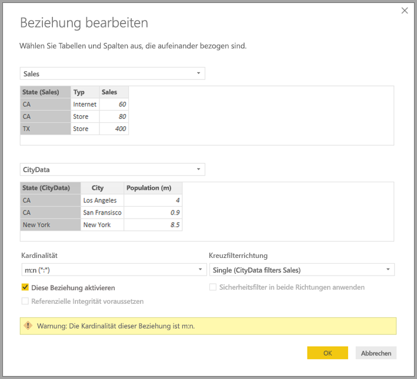
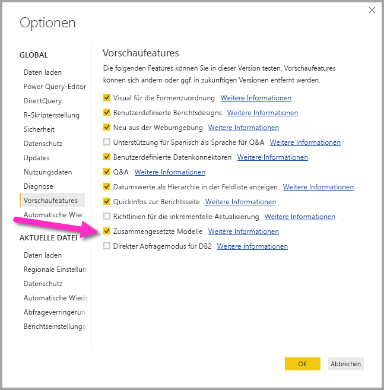

# m:n-Beziehungen in Power BI Desktop (Vorschauversion)

Mit dem Feature für *m:n-Beziehungen* in Power BI Desktop können Sie Tabellen verknüpfen, die die Kardinalität *m:n* verwenden. Sie können einfacher und intuitiver Datenmodelle erstellen, die zwei oder mehr Datenquellen enthalten können. Das Feature *m:n-Beziehungen* ist Teil der umfangreicheren Funktionen des Features *Zusammengesetzte Modelle* in Power BI Desktop.

Die Funktion *m:n-Beziehungen* in Power BI Desktop ist eines von drei in Beziehung stehenden Features:

* **Zusammengesetzte Modelle**: Hierbei kann ein Bericht mindestens zwei Datenverbindungen beinhalten, einschließlich DirectQuery- oder Importverbindungen in beliebiger Kombination. Weitere Informationen finden Sie unter [Zusammengesetzte Modelle in Power BI Desktop (Vorschauversion)](desktop-composite-models.md).

* **m:n-Beziehungen**: Mithilfe *zusammengesetzter Modelle* können Sie *m:n-Beziehungen* zwischen Tabellen einrichten. Bei diesem Ansatz entfallen die Anforderungen für eindeutige Werte in Tabellen. Zudem sind vorherige Problemumgehungen hinfällig, wie z.B. die Einführung neuer Tabellen zum Einrichten von Beziehungen. Im vorliegenden Artikel wird das Feature ausführlich erläutert.

* **Speichermodus**: Sie können nun angeben, welche Visuals eine Abfrage in Back-End-Datenquellen erfordern. Visuals, für die keine Abfrage nötig ist, werden importiert, auch wenn diese auf DirectQuery basieren. Mit diesem Feature kann die Leistung verbessert und die Auslastung des Back-Ends verringert werden. Zuvor initiierten sogar einfache Visuals wie Slicer Abfragen, die an Back-End-Quellen gesendet wurden. Weitere Informationen finden Sie im Artikel zum [Speichermodus in Power BI Desktop (Vorschauversion)](desktop-storage-mode.md).

## Aktivieren des Vorschaufeatures *m: n-Beziehungen*

Das Feature *m:n-Beziehungen* muss in Power BI Desktop aktiviert sein. Um zusammengesetzte Modelle zu aktivieren, klicken Sie auf **Datei** > **Optionen und Einstellungen** > **Optionen** > **Vorschaufeatures**, und aktivieren Sie anschließend das Kontrollkästchen **Zusammengesetzte Modelle**.

Starten Sie Power BI Desktop neu, um das Feature zu aktivieren.

## Verbesserung durch *m:n-Beziehungen*

Vor dem Feature für *m:n-Beziehungen* wurde die Beziehung zwischen zwei Tabellen in Power BI definiert. Mindestens eine der Tabellenspalten, die an der Beziehung beteiligt war, musste eindeutige Werte enthalten. Häufig hat jedoch keine Spalte eindeutige Werte enthalten. 

Beispielsweise enthielten zwei Tabellen eine Spalte namens *Country*, die Werte von *Country* waren jedoch in keiner der beiden Tabellen eindeutig. Solche Tabellen konnten nur über Umwege verknüpft werden. Ein möglicher Umweg besteht darin, zusätzliche Tabellen mit den erforderlichen eindeutigen Werten zum Modell hinzuzufügen. Mit dem Feature für *m:n-Beziehungen* können Sie solche Tabellen direkt verknüpfen, indem Sie eine Beziehung mit einer Kardinalität von **m:n** verwenden.  

## Verwenden von *m:n-Beziehungen*.

Wenn Sie eine Beziehung zwischen zwei Tabellen in Power BI definieren, müssen Sie die Kardinalität der Beziehung definieren. Die Beziehung zwischen *ProductSales* und *Product* mithilfe der Spalten *ProductSales[ProductCode]* und *Product[ProductCode]* würde als *n:1* definiert werden. Die Beziehung auf diese Weise wird definiert, weil es viele Verkäufe für jedes Produkt gibt und die Spalte *(ProductCode)* in der Tabelle *Product* eindeutig ist. Wenn Sie die Kardinalität einer Beziehung als *n:1*, *1:n* oder *1:1* definieren, überprüft Power BI diese Angabe, um sicherzustellen, dass die ausgewählte Kardinalität den tatsächlichen Daten entspricht.

Werfen Sie beispielsweise einen Blick auf das einfache Modell in der folgenden Abbildung.

Nehmen Sie nun an, dass die Tabelle *Product* wie im Folgenden dargestellt nur zwei Zeilen anzeigt:

Nehmen Sie zudem an, die Tabelle *Sales* würde nur vier Zeilen enthalten, darunter die Zeile für ein „Product C“. Aufgrund eines Fehlers mit der referentiellen Integrität ist die Zeile für „Product C“ nicht in der Tabelle *Product* enthalten.

Die Spalten *ProductName* und *Price* (aus der Tabelle *Product*) zusammen mit der gesamten *Qty* für jedes Produkt (aus der Tabelle *ProductSales*) anzeigt, wird wie im Folgenden dargestellt angezeigt werden: 

Wie in der vorherigen Abbildung zu sehen ist, enthält *ProductName* eine leere Zeile, die den Verkäufen für „Product C“ zugeordnet ist. Diese leere Zeile würde Folgendes abdecken:

* Alle Zeilen in der Tabelle *ProductSales*, für die keine zugehörige Zeile in der Tabelle *Product* vorhanden ist. Es besteht ein Problem mit der referentiellen Integrität, das sich in diesem Beispiel auf *Product C* auswirkt.

* Zeilen in der Tabelle *ProductSales*, bei denen die Fremdschlüsselspalte NULL ist. 

Aus diesen Gründen deckt die leere Zeile in beiden Fällen Verkäufe ab, bei denen *ProductName* und *Price* unbekannt sind.

Manchmal kann es allerdings vorkommen, dass die Tabellen durch zwei Spalten verknüpft sind, jedoch keine Spalte eindeutig ist. Betrachten Sie beispielsweise die folgenden zwei Tabellen:

* Die Tabelle *Sales* stellt die Umsatzdaten nach *State* dar, wobei jede Zeile den Umsatzbetrag für den Typ des Umsatzes im jeweiligen Bundesstaat enthält. Zu diesen Bundesstaaten zählen z.B. Kalifornien, Washington und Texas (CA, WA, TX). 

    

* Die Tabelle *CityData* stellt Daten zu Städten dar, einschließlich der Einwohnerzahl und des Bundesstaats (z.B. CA, WA und New York).

    

Es gibt zwar eine Spalte für *State* in beiden Tabellen, und es ist sinnvoll, den gesamten Umsatz nach Bundesstaat und der Gesamteinwohnerzahl der einzelnen Bundesstaaten zu erfassen, jedoch besteht das Problem, dass die Spalte *State* in keiner der Tabellen eindeutig ist. 

## Die bisherige Problemumgehung

In Versionen von Power BI Desktop vor dem Release im Juli 2018 konnten Benutzer keine direkte Beziehung zwischen diesen Tabellen erstellen. Eine gängige Problemumgehung bestand darin, die folgenden Schritte durchzuführen:

* Eine dritte Tabelle wurde erstellt, die ausschließlich die eindeutigen IDs von *State* enthält. Die Tabelle kann einer oder allen folgenden Optionen entsprechen:
  * Eine berechnete Tabelle, die mithilfe von DAX (Data Analysis Expressions) definiert wurde
  * Eine Tabelle, die auf einer Abfrage basiert, die im Abfrage-Editor definiert wurde, und in der die eindeutigen IDs enthalten sein können, die aus einer der Tabellen abgerufen wurden.
  * Eine Kombination aus beidem.

* Die beiden ursprünglichen Tabellen wurden mithilfe der allgemeinen *n:1*-Beziehungen mit dieser neuen Tabelle in Beziehung gesetzt.

Sie können die Tabelle, die zur Problemumgehung dient, entweder sichtbar lassen oder ausblenden, sodass sie nicht in der Liste **Fields** angezeigt wird. Wenn Sie die Tabelle ausblenden, werden die *n:1*-Beziehungen üblicherweise darauf festgelegt, in beide Richtungen zu filtern, und Sie können das Feld *State* aus jeder Tabelle verwenden. Die nachfolgende Kreuzfilterung würde an die andere Tabelle weitergegeben werden. Dieser Ansatz wird in der folgenden Abbildung veranschaulicht:

Ein Visual, das *State* (aus der Tabelle *CityData*) zusammen mit der Gesamtwert von *Population* und *Sales* anzeigt, würde dann wie folgt aussehen:

> [!NOTE]
> Da der Bundesstaats aus der Tabelle *CityData* in dieser Problemumgehung verwendet wird, werden nur die State-Werte in dieser Tabelle aufgeführt (daher ist TX ausgeschlossen). Im Gegensatz zu *n:1*-Beziehungen ist in den Details darüber hinaus keine leere Zeile enthalten, die solche nicht übereinstimmenden Zeilen abdeckt. Die Zeile „Total“ enthält hingegen alle *Sales*-Werte (einschließlich der von TX). Analog dazu gäbe es keine leere Zeile, die alle *Sales*-Werte abdeckt, bei denen der Wert für *State* NULL lautet.

Wenn Sie außerdem *City* zu diesem Visual hinzufügen, obwohl die Einwohnerzahl für jede *City*-Spalte bekannt ist, wiederholt die *Sales*-Spalte für *City* nur den *Sales*-Wert für die entsprechende *State*-Spalte. Dies ist normalerweise der Fall, wenn die Gruppierung in einer Spalte nicht mit einem aggregierten Measure verknüpft ist. Dies wird in folgender Abbildung veranschaulicht:

Wenn wir die neue Tabelle *Sales* als Kombination aller *State*-Spalten in dieser Problemumgehung definieren und diese in der Liste **Fields** sichtbar machen, würde das gleiche Visual *State* (in der neuen Tabelle) und den Gesamtwert von *Population* und *Sales* darstellen. Dies wird in folgender Abbildung veranschaulicht:

Sie sehen, dass *TX* (mit Daten für *Sales*, aber mit unbekannten Daten für *Population*) und *New York* (mit bekannten Daten für *Population*, aber ohne Daten für *Sales*) enthalten wäre. Diese Umgehung ist nicht ideal und führt zu vielen Problemen. Mit der Erstellung von m:n-Beziehungen werden die daraus resultierenden Probleme wie im folgenden Abschnitt beschrieben behoben.

## Verwendung von *m:n-Beziehungen* anstelle der Problemumgehung

Seit der Power BI Desktop-Version vom Juli 2018 können Sie Tabellen direkt miteinander verknüpfen, ohne auf ähnliche Problemumgehungen zurückgreifen zu müssen. Die Kardinalität für Beziehungen kann nun auf *m:n* festgelegt werden. Diese Einstellung gibt an, dass keine der Tabellen eindeutige Werte enthält. Bei solchen Beziehungen können Sie nach wie vor steuern, welche Tabelle die jeweils andere Tabelle filtert, oder die bidirektionale Filterung anwenden, bei der beide Tabellen sich gegenseitig filtern.  

> [!NOTE]
> Das Feature für *m:n-Beziehungen* befindet sich in der Vorschauversion. Während der Vorschauphase können Sie keine Modelle im Power BI-Dienst veröffentlichen, bei denen *m:n-Beziehungen* verwendet werden. 

In Power BI Desktop wird die Kardinalität standardmäßig auf *m:n* festgelegt, wenn festgestellt wird, dass keine der Tabellen eindeutige Werte für die Spalten in der Beziehung enthält. In solchen Fällen wird eine Warnung angezeigt, um zu bestätigen, dass diese Beziehungseinstellung Ihren Absichten entspricht und keine unbeabsichtigte Auswirkung eines Datenproblems darstellt. 

Wenn Sie z.B. eine direkte Beziehung zwischen *CityData* und *Sales* erstellen, wobei die Filter von *CityData* zu *Sales* übergehen sollen, zeigt Power BI Desktop das Fenster **Beziehung bearbeiten** wie in der folgenden Abbildung dargestellt an:

Die resultierende **Beziehungsansicht** würde dann die direkte m:n-Beziehung zwischen den beiden Tabellen darstellen. Die Darstellung der Tabelle in der Liste **Fields** und deren Verhalten, wenn die Visuals erstellt wurden, ähneln den Ergebnissen, die durch die Problemumgehung erzielt wurden. In der Problemumgehung wurde die zusätzliche Tabelle, die die unterschiedlichen Daten für *State* darstellt, nicht sichtbar gemacht. Wie im vorherigen Abschnitt beschrieben, würde ein Visual, das die Daten für *State*, *Population* und *Sales* anzeigt, folgendermaßen aussehen:

Zwischen *m:n*-Beziehungen und den geläufigeren *n:1*-Beziehungen bestehen folgende wesentliche Unterschiede:

* Die angezeigten Werte enthalten keine leere Zeile, die nicht übereinstimmende Zeilen in der anderen Tabelle abdeckt. Die Werte decken ebenfalls nicht die Zeilen ab, bei denen die Spalte, die in der anderen Tabelle in der Beziehung verwendet wurde, den Wert NULL aufweist.
* Die Funktion `RELATED()` kann nicht verwendet werden, da mehr als eine Zeile verknüpft sein könnte.
* Mit der Funktion `ALL()` werden in einer Tabelle keine Filter entfernt, die auf andere verknüpfte Tabellen angewendet wurden, mit denen eine m:n-Beziehung besteht. Im vorherigen Beispiel würde ein Measure, das wie im folgenden Skript dargestellt definiert wurde, keine Filter aus Spalten in der verknüpften Tabelle *CityData* entfernen:

    

    Ein Visual, das die Daten für *State*, *Sales* und *Sales Total* anzeigt, würde wie folgt aussehen:

    

Beachten Sie diese Unterschiede, und stellen Sie sicher, dass die Berechnungen, die `ALL(\<Table>)` verwenden (z.B. *Prozentsatz der Gesamtsumme*), die gewünschten Ergebnisse zurückgeben. 

## Einschränkungen und Überlegungen

Bei diesem Release für *m:n-Beziehungen* und zusammengesetzte Modelle gibt es einige Einschränkungen.

Die folgenden (mehrdimensionalen) Live Connect-Quellen können nicht mit zusammengesetzten Modellen verwendet werden:

* SAP HANA
* SAP Business Warehouse
* SQL Server Analysis Services
* Power BI-Datasets
* Azure Analysis Services

Wenn Sie mithilfe von DirectQuery eine Verbindung mit diesen mehrdimensionalen Quellen herstellen, können Sie keine Verbindung mit einer anderen DirectQuery-Quelle herstellen oder diese mit importierten Daten kombinieren.

Die bestehenden Einschränkungen für die Verwendung von DirectQuery gelten nach wie vor, wenn Sie *m:n-Beziehungen* verwenden. Viele dieser Einschränkungen gelten jetzt abhängig vom Speichermodus der Tabelle für eine einzelne Tabelle. Beispielsweise kann eine berechnete Spalte in einer importierten Tabelle auf andere Tabellen verweisen, wohingegen eine berechnete Spalte in einer DirectQuery-Tabelle nach wie vor nur auf Spalten in derselben Tabelle verweisen kann. Es gelten weitere Einschränkungen für das Modell als Ganzes, wenn eine der Tabellen den Modus „DirectQuery“ aufweist. Die Features „QuickInsights“ und „Q&A“ sind nicht für Modelle verfügbar, wenn eine der Tabellen den Speichermodus „DirectQuery“ aufweist. 

## Nächste Schritte

Weitere Informationen zu zusammengesetzten Modellen und DirectQuery finden Sie in den folgenden Artikeln:
* [Zusammengesetzte Modelle in Power BI Desktop (Vorschauversion)](desktop-composite-models.md)
* [Speichermodus in Power BI Desktop (Vorschauversion)](desktop-storage-mode.md)
* [Verwenden von DirectQuery in Power BI Desktop](desktop-directquery-about.md)
* [Von DirectQuery in Power BI Desktop unterstützte Datenquellen](desktop-directquery-data-sources.md)
