# Verwenden des Matrixvisuals in Power BI Desktop
Mit dem **Matrixvisual** können Sie visuelle Matrixelemente (auch als *Tabellen* bezeichnet) in **Power BI Desktop**-Berichten erstellen. Das neue Visual ermöglicht die Kreuzhervorhebung von Elementen innerhalb der Matrix mit anderen Visuals. Darüber hinaus können Sie Zeilen, Spalten und sogar einzelne Zellen für die Kreuzhervorhebung auswählen. Um den für Layouts verfügbaren Platz besser auszunutzen, unterstützt das Matrixvisual ein abgestuftes Layout.

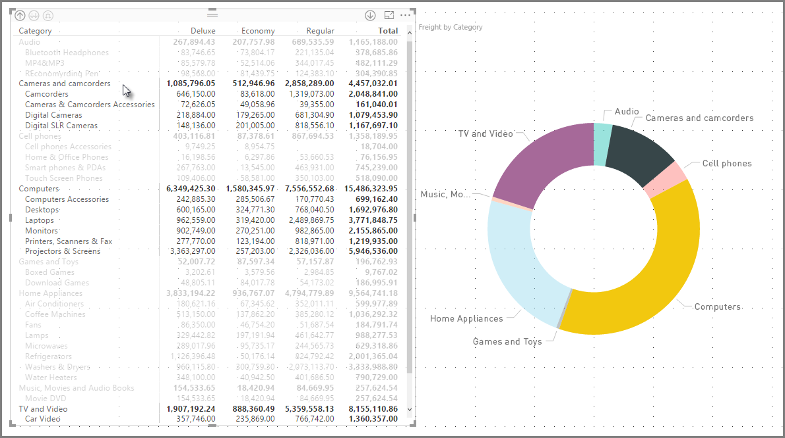

Die Matrix bietet viele Features, die in den folgenden Abschnitten dieses Artikels erläutert werden.

> [!NOTE]
> Ab dem **Power BI Desktop**-Release vom Juli 2017 übernehmen die neuen Matrix- und Tabellenvisuals die Formatierung (einschließlich der Farben) des angewendeten **Berichtsdesigns**. Diese entsprechen möglicherweise nicht den erwarteten Farben für das Matrixvisual, die Sie in der Konfiguration für Ihr **Berichtsdesign** ändern können. Weitere Informationen zu Designs finden Sie unter [**Verwenden von Berichtsdesigns in Power BI Desktop**](desktop-report-themes.md).
> 
> 

## Verwenden von Drilldown mit dem Matrixvisual
Mit dem **Matrixvisual** können Sie Drilldowns jeglicher Art ausführen, die zuvor nicht verfügbar waren. Hierzu zählt die Möglichkeit des Drilldowns auf Zeilen, Spalten und sogar einzelne Abschnitte und Zellen. Befassen wir uns nun mit der Funktionsweise.

### Drilldown auf Zeilenüberschriften
Wenn Sie im Bereich **Visualisierungen** mehrere Felder zum Abschnitt **Zeilen** des Bereichs **Felder** hinzufügen, wird der Drilldown auf Zeilen in der Matrixvisualisierung aktiviert. Im Grunde erstellen Sie eine Hierarchie, durch deren Ebenen Sie sich dann per Drilldown (und Drillup) bewegen können, um die Daten der jeweiligen Ebene zu analysieren.

In der folgenden Abbildung enthält der Abschnitt **Zeilen** auch *Kategorie* und *Unterkategorie*, wodurch eine Gruppierung (oder Hierarchie) der Zeilen entsteht, bei denen ein Drillthrough möglich ist.

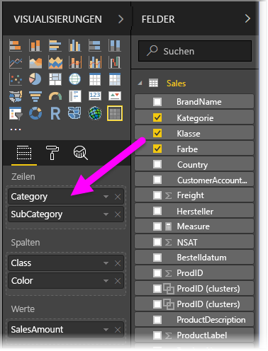

Wenn für die Visualisierung im Abschnitt **Zeilen** eine Gruppierung erstellt wurde, werden oben links in der Visualisierung selbst die Symbole für *Drill* und *Erweitern* angezeigt.

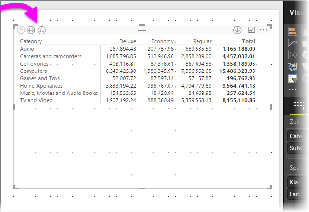

Mit diesen Schaltflächen können Sie in der Hierarchie einen Drilldown (oder Drillup) ausführen (das Verhalten gleicht dem in anderen Visualisierungen). In diesem Fall können wir einen Drilldown von *Kategorie* zu *Unterkategorie* ausführen (siehe die folgende Abbildung, in der das Gabelpfeil-Symbol für den Drilldown um eine Ebene gewählt wurde).

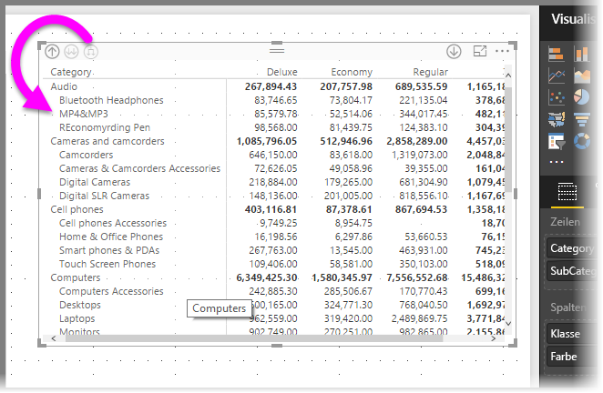

Statt die Symbole zu verwenden, können Sie auch einen Rechtsklick auf eine beliebige Zeilenüberschrift ausführen und den Drilldown über das nun angezeigte Menü veranlassen.

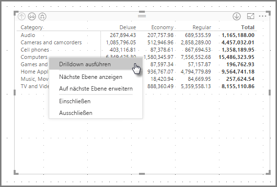

Das Menü enthält verschiedene Optionen, die zu unterschiedlichen Ergebnissen führen:

Mit **Drilldown** wird die Matrix für *diese* Zeilenebene erweitert, alle anderen Zeilenüberschriften, mit Ausnahme derjenigen, auf die der Rechtsklick ausgeführt wurde, sind *nicht betroffen*. In der folgenden Abbildung wurde auf *Computer* geklickt, und **Drilldown** wurde ausgewählt. Wie Sie sehen, werden andere Zeilen, die der höchsten Ebene angehören, nicht mehr in der Matrix angezeigt. Dieses nützliche Feature wird im Abschnitt **Kreuzhervorhebungen** genauer erläutert.

Um zur Ansicht der obersten Ebene zurückzukehren, klicken Sie auf das Symbol für **Drillup**. Wenn Sie im Kontextmenü **Nächste Ebene anzeigen** auswählen, erhalten Sie eine alphabetische Liste aller Elemente auf der nächsten Ebene (hier das Feld *Unterkategorie*) ohne die Kategorisierung der höheren Hierarchieebene.

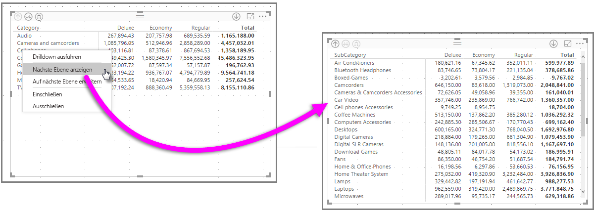

Wenn Sie links oben auf das Symbol für **Drillup** klicken, werden wieder alle Kategorien auf der obersten Ebene in der Matrix angezeigt. Wenn Sie nun erneut einen Rechtsklick ausführen und **Auf nächste Ebene erweitern** auswählen, sehen Sie Folgendes:

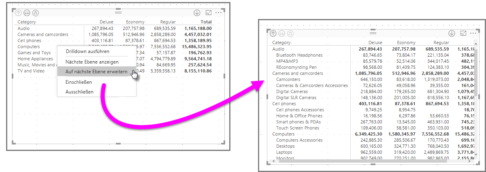

Sie können auch die Menüelemente **Einschließen** und **Ausschließen** verwenden, um die Zeile mit dem Rechtsklick (und ihre Unterkategorien) in der Matrix zu behalten oder aus ihr zu entfernen.

### Drilldown auf Spaltenüberschriften
Wie auf Zeilen können Sie auch auf **Spalten** einen Drilldown ausführen. In der folgenden Abbildung sehen Sie, dass der Feldbereich **Spalten** zwei Felder umfasst, sodass Sie wie bei Zeilen eine Hierarchie erstellen können (siehe oben in diesem Artikel). Der Feldbereich **Spalten** enthält *Klasse* und *Farbe*.

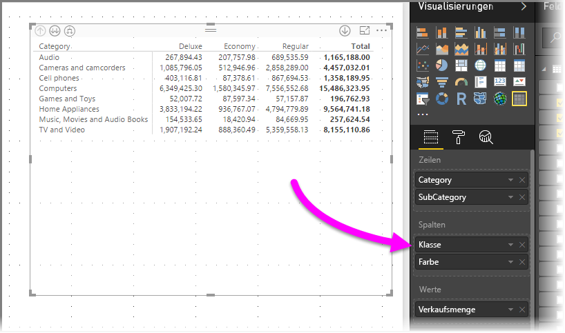

Wenn Sie im **Matrixvisual** mit der rechten Maustaste auf eine Spalte klicken, wird die Option für den Drilldown angezeigt. In der folgenden Abbildung haben wir einen Rechtsklick auf *Deluxe* ausgeführt und **Drilldown** ausgewählt.

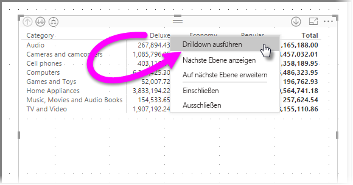

Wenn **Drilldown** ausgewählt wurde, wird die nächste Ebene der Spaltenhierarchie von *Deluxe* angezeigt, in diesem Fall *Farbe*.

Alle weiteren Kontextmenüelemente für Spalten sind identisch mit denen für Zeilen (siehe den vorigen Abschnitt **Drilldown auf Zeilenüberschriften**). Wie bei Zeilen stehen bei Spalten die Optionen **Nächste Ebene anzeigen**, **Auf nächste Ebene erweitern** und **Einschließen** oder **Ausschließen** zur Verfügung.

> [!NOTE]
> Die Symbole für Drilldown und Drillup oben links im Matrixvisual sind für Zeilen vorbehalten. Um einen Drilldown auf Spalten auszuführen, verwenden Sie das Kontextmenü.
> 
> 

## Abgestuftes Layout mit visuellen Matrixelementen
Beim **Matrixvisual** werden Unterkategorien in einer Hierarchie automatisch unter dem übergeordneten Element eingerückt. Dieser Einzug wird als **abgestuftes Layout** bezeichnet.

In der *ursprünglichen* Version der Matrixvisualisierung wurden Unterkategorien in einer eigenen Spalte angezeigt. Dadurch beanspruchten sie deutlich mehr Platz in der Visualisierung. Die folgende Abbildung zeigt die Tabelle in der ursprünglichen **Matrix**-Visualisierung (mit eigener Spalte für Unterkategorien).

In der Abbildung unten sehen Sie ein **Matrixvisual** mit aktiviertem **abgestuften Design**. Bei der Kategorie *Computer* sind die Unterkategorien (Computerzubehör, Desktops, Laptops, Monitore usw.) leicht eingerückt und die Visualisierung ist klarer und prägnanter strukturiert.

Sie können die Einstellungen für das **abgestufte Layout** einfach anpassen. Erweitern Sie bei ausgewähltem **Matrixvisual** im Abschnitt **Format** (das Farbroller-Symbol) des Bereichs **Visualisierungen** den Abschnitt **Zeilenüberschriften**. Dort haben Sie zwei Optionen: den Schalter **Abgestuftes Layout** (zum Ein-/Ausschalten des Layouts) und das Eingabefeld **Abgestufter Layouteinzug** (zum Festlegen des Einzugs in Pixel).

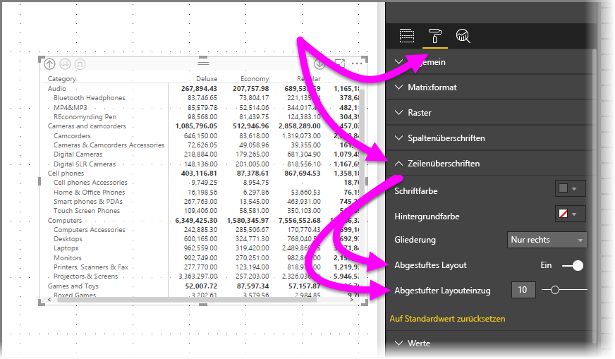

Wenn Sie die Option **Abgestuftes Layout** deaktivieren, werden die Unterkategorien nicht mehr unter dem übergeordneten Element eingerückt, sondern in einer eigenen Spalte angezeigt.

## Teilergebnisse mit Matrixvisuals
Sie können in Matrixvisuals Teilergebnisse sowohl für Zeilen als auch für Spalten aktivieren und deaktivieren. In der folgenden Abbildung sind die Teilergebnisse auf **Ein** festgelegt.

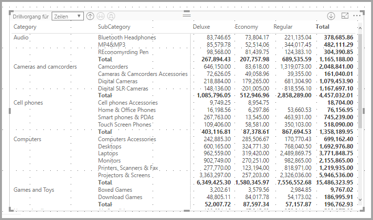

Erweitern Sie im Abschnitt **Format** des Bereichs **Visualisierungen** die Karte **Teilsummen**, und ziehen Sie den Schieberegler **Zeilenzwischensummen** auf **Aus**. Wenn Sie dies tun, werden die Teilergebnisse nicht angezeigt.

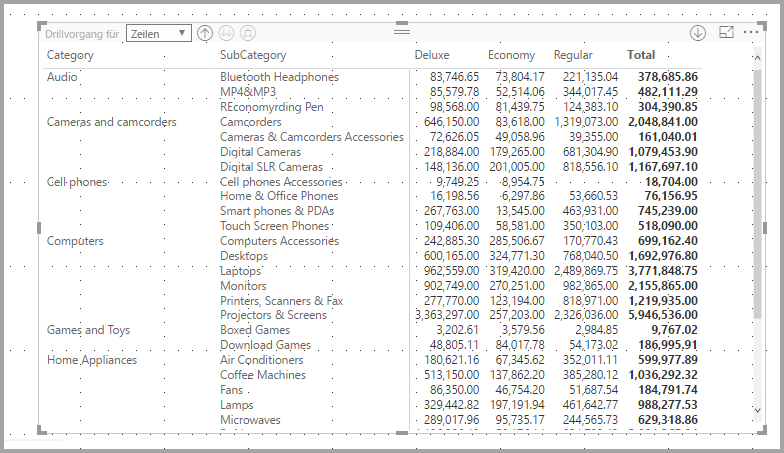

Dasselbe Verfahren wird für die Spaltenteilergebnisse angewendet.

## Kreuzhervorhebung mit visuellen Matrixelementen
Jedes Element im **Matrixvisual** kann als Basis für die übergreifende Hervorhebung dienen. Wenn Sie in einem **Matrixvisual** eine Spalte auswählen, wird sie hervorgehoben (wie bei anderen Visuals auf der Berichtsseite). Die Auswahl eines Datenpunkts ist eine Standardfunktion in anderen Visuals, die jetzt auch im **Matrixvisual** unterstützt wird.

Auch wird STRG+Klicken jetzt für die Kreuzhervorhebung unterstützt. In der folgenden Abbildung sehen Sie eine Reihe von Unterkategorien, die im **Matrixvisual** ausgewählt wurden. Nicht ausgewählte Elemente sind abgeblendet (grau). Andere Visuals auf der Seite reflektieren die im **Matrixvisual** getroffene Auswahl.

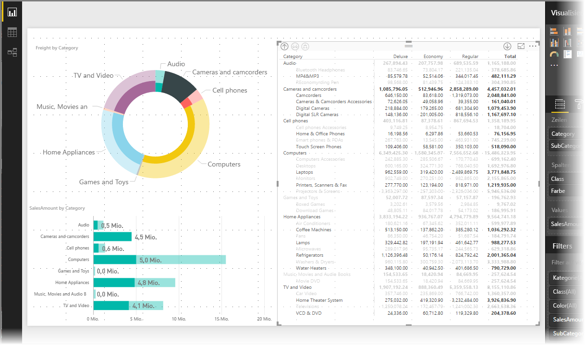

## Schattierung und Schriftfarben für Matrixvisuals
Mit dem **Matrixvisual** können Sie **bedingte Formatierung** (Farben und Schattierung) auf den Hintergrund von Zellen in der Matrix und bedingte Formatierung auf den Text und die Werte selbst anwenden.

Um bedingte Formatierung anzuwenden, können Sie einen der folgenden Schritte ausführen, wenn ein Matrixvisual ausgewählt ist:

* Klicken Sie im Bereich **Felder** mit der rechten Maustaste auf das Feld, und wählen Sie im Menü **Bedingte Formatierung** aus.
  
  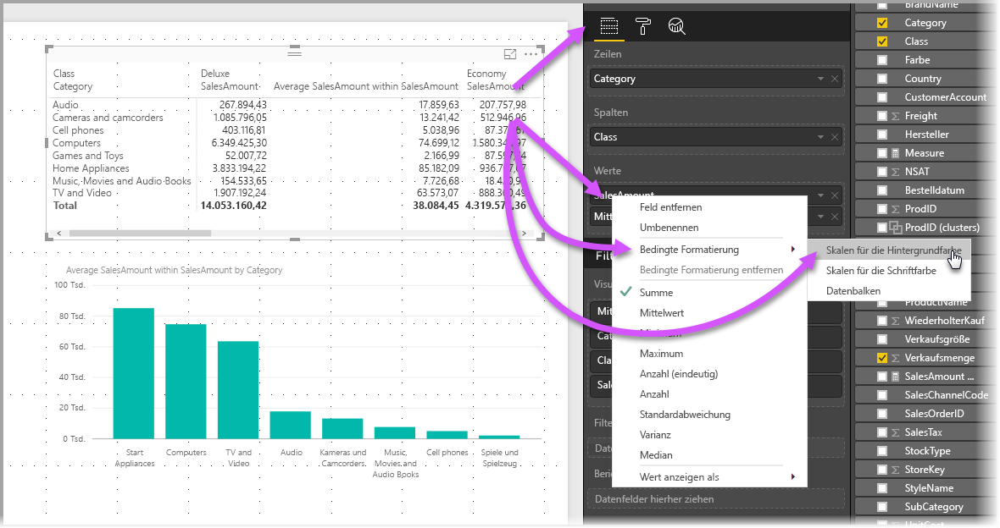
* Oder erweitern Sie im Bereich **Format** die Karte **Bedingte Formatierung**, und ziehen Sie den Schieberegler für **Skalen für die Hintergrundfarbe** oder **Skalen für die Schriftfarbe** auf **Ein**. Durch Aktivieren einer dieser Optionen wird ein Link für *Erweiterte Steuerelemente* angezeigt, sodass Sie die Farben und Werte für die Farbformatierung anpassen können.
  
  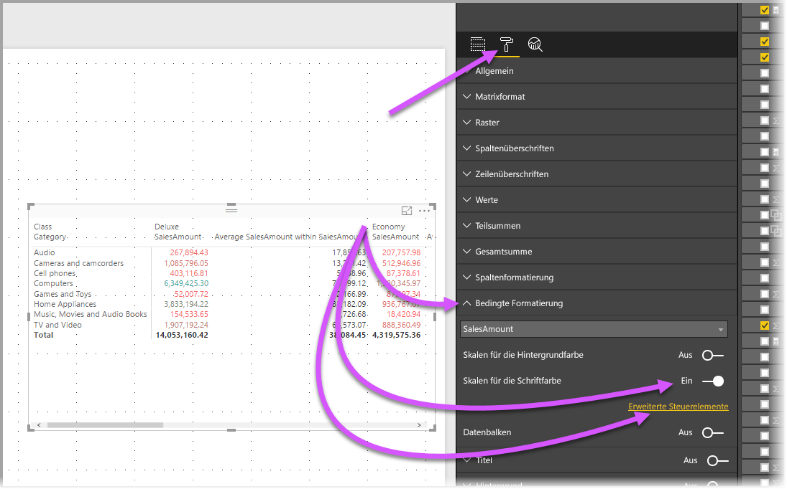

Mit beiden Vorgehensweisen wird das gleiche Ergebnis erreicht. Nach Auswahl von *Erweiterte Steuerelemente* wird das folgende Dialogfeld angezeigt, in dem Sie Anpassungen vornehmen können:

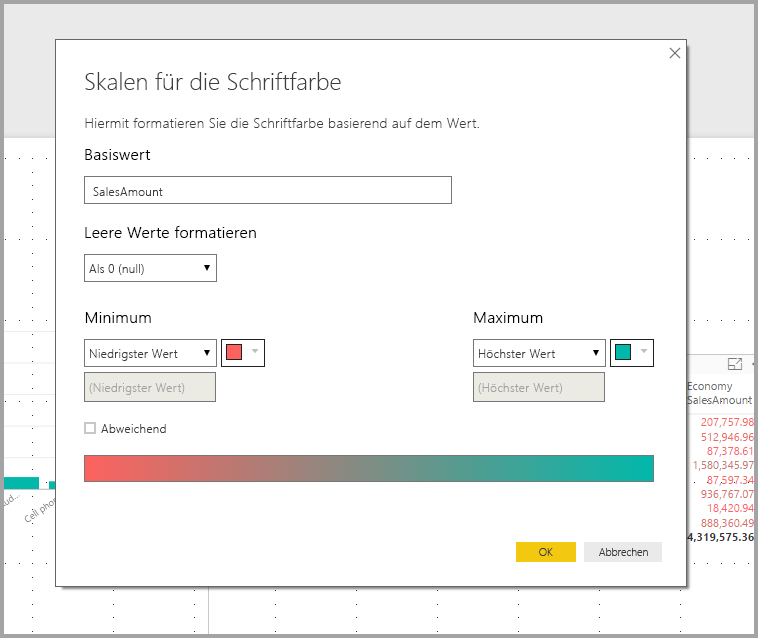

## Einschränkungen und Überlegungen
Diese Version des **Matrixvisuals** unterliegt einigen Einschränkungen. Hier erfahren Sie, was zu beachten ist.

* Drillvorgänge für Spalten können nur über das Kontextmenü ausgeführt werden, und es ist derzeit nicht aus der Visualisierung ersichtlich, dass Drillvorgänge für Gruppen von Zeilen oder Spalten möglich sind.
* Die Elemente auf einer Ebene können nur gemeinsam erweitert werden, nicht nach Kategorien.
* Möglicherweise wird im Kontextmenü einer Spaltenüberschrift die Option **Datensätze** angezeigt, die aber noch nicht implementiert ist.
* Derzeit ist die Zeile *Gesamtsumme* nicht vorhanden.
* Das Deaktivieren der Zwischensummenzeile im abgestuften Layout hat keine Auswirkungen.
* Spaltenüberschriften können abgeschnitten werden, wenn der Text einer inneren Gruppe kürzer als der der äußeren Gruppe ist.
* Wenn Sie im abgestuften Layout den Einzug ändern, sollte der Einzug der Zeilengruppe außen gleich bleiben.

Teilen Sie uns Ihre Meinung mit. Wir führen im Moment eine kurze **Umfrage** zu diesem **Matrixvisual** durch und würden uns über [Ihre Teilnahme](https://www.instant.ly/s/PYXT1) freuen.

