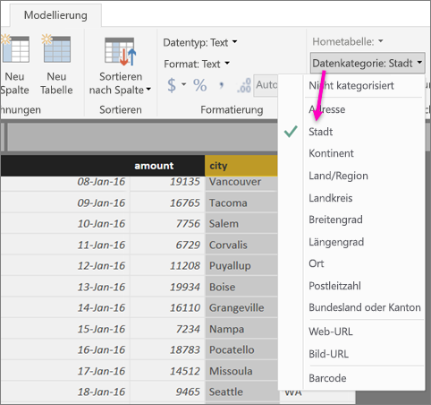
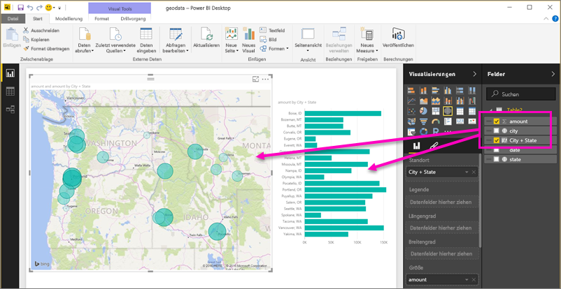
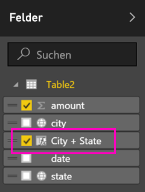

# Festlegen eines geografischen Filters in Power BI Desktop für die mobilen Apps
In Power BI Desktop können Sie für eine Spalte [geografische Daten kategorisieren](desktop-data-categorization.md), damit Power BI Desktop weiß, wie Werte in Visualisierungen in einem Bericht behandelt werden sollen. Als zusätzlichen Vorteil stellt Power BI automatisch geografische Filter zu Ihrem Standort zur Verfügung, wenn dieser Bericht Ihnen oder Ihren Kollegen in den mobilen Power BI-Apps angezeigt wird. 

Nehmen wir z.B. an, dass Sie ein Vertriebsleiter sind, der sich auf einer Geschäftsreise befindet, um sich mit Kunden zu treffen. Sie möchten nach dem Gesamtabsatz und -umsatz für den bestimmten Kunden filtern, mit dem Sie sich treffen. Sie möchten die Daten für Ihren aktuellen Standort herausfiltern, ob nach Bundesland oder Kanton, Ort oder einer richtigen Adresse. Wenn Sie später noch Zeit übrig haben, möchten Sie andere Kunden in der Nähe besuchen. Sie können [im Bericht nach Ihrem Standort filtern, um diese Kunden zu finden](consumer/mobile/mobile-apps-geographic-filtering.md).

> [!NOTE]
> Sie können in der mobilen App nur nach dem Standort filtern, wenn die geografischen Namen im Bericht auf Englisch sind, z.B. „New York City“ oder „Germany“.
> 
> 

## Identifizieren von geografischen Daten in Ihrem Bericht
1. Wechseln Sie in Power BI Desktop zur Datenansicht .
2. Wählen Sie eine Spalte mit geografischen Daten, z.B. eine Spalte „City“ aus.
   
    
3. Wählen Sie auf der Registerkarte **Modellierung** **Datenkategorie** aus, und korrigieren Sie anschließend die Kategorie – in diesem Fall **City**.
   
    
4. Legen Sie weiterhin Kategorien für geografische Daten für alle anderen Felder im Modell fest. 
   
   > [!NOTE]
   > Sie können in einem Modell mehrere Spalten für jede Datenkategorie festlegen. In diesem Fall kann das Modell in der mobilen Power BI-App jedoch keinen geografischen Filter anwenden. Um das geografische Filtern in den mobilen Apps zu verwenden, legen Sie nur eine Spalte für jede Datenkategorie fest &#150; z.B. nur eine Spalte **City**, eine Spalte **State or Province** und eine Spalte **Country**. 
   > 
   > 

## Erstellen von Visualisierungen mit geografischen Daten
1. Wechseln Sie zur Berichtsansicht , und erstellen Sie Visuals basierend auf Feldern mit geografischen Daten. 
   
    
   
    In diesem Beispiel enthält das Modell außerdem eine berechnete Spalte, in der die Stadt und der Bundesstaat verkettet sind. Weitere Informationen zum [Erstellen von berechneten Spalten in Power BI Desktop](desktop-calculated-columns.md)
   
    
2. Veröffentlichen Sie den Bericht im Power BI-Dienst.

## Anzeigen des Berichts in der mobilen Power BI-App
1. Öffnen Sie den Bericht in einer [mobilen Power BI-App](consumer/mobile/mobile-apps-for-mobile-devices.md).
2. Wenn zu Ihrem geografischen Standort Daten im Bericht vorliegen, können Sie diesen automatisch nach Ihrem Standort filtern.
   
    

Weitere Informationen zum [Filtern eines Berichts nach Standort in den mobilen Power BI-Apps](consumer/mobile/mobile-apps-geographic-filtering.md).

## Nächste Schritte
* [Datenkategorisierung in Power BI Desktop](desktop-data-categorization.md)  
* Haben Sie Fragen? [Stellen Sie Ihre Frage in der Power BI-Community.](http://community.powerbi.com/)

