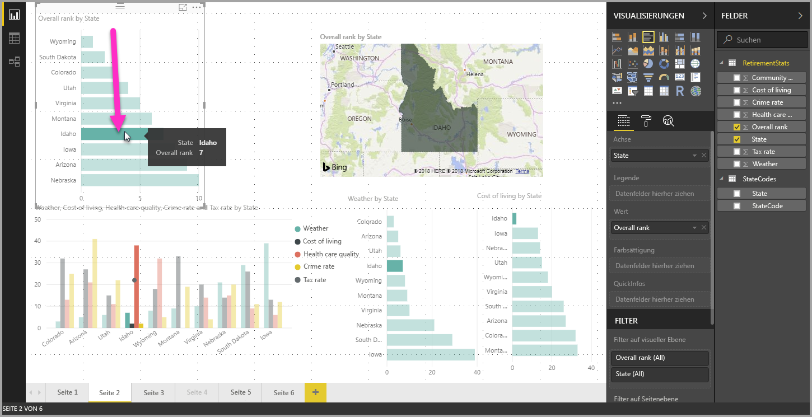
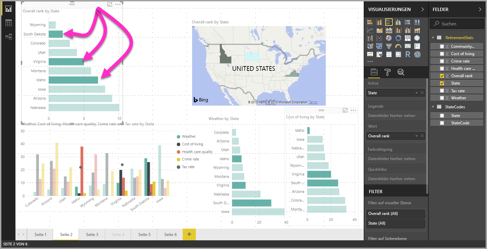

# Mehrfachauswahl von Datenelementen in Visuals mit Power BI Desktop

Sie können in **Power BI Desktop** einen Datenpunkt in einem Visual auswählen, indem Sie auf ihn klicken. Wenn Sie z.B. einen Balken oder ein anderes Diagrammelement auswählen und möchten, dass in anderen Visuals auf der Berichtsseite die Daten basierend auf Ihrer Auswahl markiert werden sollen, können Sie auf das Datenelement im Visual klicken. Anschließend werden die Ergebnisse in anderen Visuals auf der Seite angezeigt. Dies ist die Standard- bzw. Einfachauswahl. Diese Auswahlart wird in der folgenden Abbildung demonstriert. 

Mit der Mehrfachauswahl können Sie mehrere Datenpunkte auf der Berichtsseite von **Power BI Desktop** auswählen und die Ergebnisse in mehreren Visuals auf der Seite hervorheben. Dies entspricht einer **und** -Anweisung oder -funktion, wie sie z.B. in „Ergebnisse für Idaho **und** Virginia hervorheben“ verwendet wird. Eine Mehrfachauswahl von Datenpunkten in Visuals nehmen Sie ganz einfach mit **STRG+Klick** vor. In der folgenden Abbildung wird die Auswahl **mehrerer Datenpunkte** demonstriert.

Diese Funktion mag trivial erscheinen, eröffnet aber viele Möglichkeiten beim Erstellen und Freigeben von Berichten und bei der Interaktion mit diesen. 

## Nächste Schritte

Folgende Artikel könnten Sie ebenfalls interessieren:

* [Verwenden von Gitternetzlinien und „Am Raster ausrichten“ in Power BI Desktop-Berichten](desktop-gridlines-snap-to-grid.md)
* [Informationen zu Filtern und Hervorhebungen in Power BI-Berichten](power-bi-reports-filters-and-highlighting.md)

