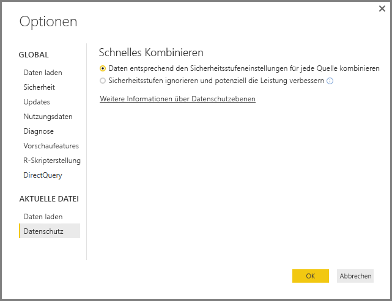
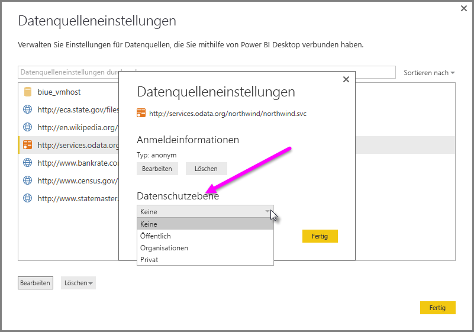

# Power BI Desktop – Datenschutzebenen
In **Power BI Desktop** geben Datenschutzebenen eine Isolationsstufe an, die den Grad der Isolation einer Datenquelle von anderen Datenquellen angibt. Obwohl eine restriktive Isolationsstufe den Austausch von Informationen zwischen Datenquellen blockiert, kann sie Funktionalitäts- und Leistungseinbußen bewirken.

Die Einstellung **Datenschutzebenen** unter **Datei > Optionen und Einstellungen > Optionen** und dann **Aktuelle Datei > Datenschutz** bestimmt, ob Power BI Desktop Ihre Datenschutzebenen-Einstellungen beim Kombinieren von Daten verwendet. Dieses Dialogfeld enthält einen Link zur Power BI Desktop-Dokumentation zu Datenschutzebenen und der Option „Datenschutzebenen“ (dieser Artikel).

## Konfigurieren einer Datenschutzebene
Mithilfe von Datenschutzebenen geben Sie eine Isolationsstufe an, die den Grad der Isolation einer Datenquelle von anderen Datenquellen angibt.

| Einstellung | Beschreibung | Beispieldatenquellen |
| --- | --- | --- |
| **Private Datenquelle** |Eine **private** Datenquelle enthält sensible oder vertrauliche Informationen, wobei die Sichtbarkeit der Datenquelle ggf. auf autorisierte Benutzer beschränkt ist. Eine private Datenquelle ist von anderen Datenquellen vollständig isoliert. |Facebook-Daten, eine Textdatei mit Aktienzuteilungen oder eine Arbeitsmappe mit Mitarbeitergesprächsinformationen. |
| **Organisationsweite Datenquelle** |Eine **organisationsweite** Datenquelle schränkt die Sichtbarkeit einer Datenquelle auf eine vertrauenswürdige Gruppe von Personen ein. Eine **organisationsweite** Datenquelle ist von allen **öffentlichen** Datenquellen isoliert, aber für andere **organisationsweite** Datenquellen sichtbar. |Ein **Microsoft Word** -Dokument auf einer SharePoint-Intranetwebsite mit Berechtigungen, die für eine vertrauenswürdige Gruppe aktiviert sind. |
| **Öffentliche Datenquelle** |Eine **öffentliche** Datenquelle ermöglicht jedem die Anzeige der in der Datenquelle enthaltenen Daten. Nur Dateien, Internetdatenquellen und Arbeitsmappendaten können als **öffentlich** markiert werden. |Frei zugängliche Daten in Microsoft Azure Marketplace, Daten auf einer Wikipedia-Seite und lokale Dateien, die von einer öffentlichen Webseite kopierte Daten enthalten. |

## Konfigurieren von Einstellungen für Datenschutzebenen
Das Dialogfeld mit den Einstellungen für den **Datenschutz** für jede Datenquelle befindet sich unter **Datei > Optionen und Einstellungen > Datenquelleneinstellungen**.

Wählen Sie zum Konfigurieren der Datenschutzebene einer Datenquelle erst die Datenquelle und dann **Bearbeiten**aus. Das Dialogfeld **Datenquelleneinstellungen** wird angezeigt, in dem Sie unten im Dropdownmenü die gewünschte Datenschutzebene auswählen können (siehe die folgende Abbildung).

> [!CAUTION]
> Sie sollten eine Datenquelle mit äußerst sensiblen oder vertraulichen Daten als **Privat** konfigurieren.
> 

## Konfigurieren von Datenschutzebenen
**Datenschutzebenen** ist eine Einstellung, die standardmäßig auf **Daten entsprechend den Sicherheitsstufeneinstellungen für jede Quelle kombinieren** festgelegt ist, was bedeutet, dass **Datenschutzebenen** nicht aktiviert ist.

| Einstellung | Beschreibung |
| --- | --- |
| **Daten entsprechend den Sicherheitsstufeneinstellungen für jede Quelle kombinieren** (in der Standardeinstellung aktiviert) |Einstellungen für Datenschutzebenen dienen beim Kombinieren von Daten zum Bestimmen des Isolationsgrads zwischen Datenquellen. |
| **Sicherheitsstufen ignorieren und potenziell die Leistung verbessern** (deaktiviert) |Datenschutzebenen werden beim Kombinieren von Daten nicht berücksichtigt, wodurch sich Leistung und Funktionalität der Daten erhöhen können. |

> **Sicherheitshinweis:** Wenn **Datenschutzebenen** über **Sicherheitsstufen ignorieren und die Leistung möglicherweise verbessern** im Dialogfeld **Datenschutzebenen** aktiviert wird, können nicht autorisierten Personen sensible oder vertrauliche Daten zugänglich gemacht werden. Aktivieren Sie **Datenschutzebenen** nur dann, wenn Sie sicher sind, dass die Datenquelle keine sensiblen oder vertraulichen Daten enthält.
> 
> 

> [!CAUTION]
> Die Option **Sicherheitsstufen ignorieren und potenziell die Leistung verbessern** kann im Power BI-Dienst nicht verwendet werden. Power BI Desktop-Berichte, in denen diese Einstellung aktiviert ist und die dann im Power BI-Dienst veröffentlicht werden, weisen *nicht* dieses Verhalten auf, wenn sie im Dienst verwendet werden.
> 

**Konfigurieren von Datenschutzebenen**

Wählen Sie in Power BI Desktop oder im Abfrage-Editor **Datei > Optionen und Einstellungen > Optionen** und dann **Aktuelle Datei > Datenschutz** aus.

a. Wenn **Daten entsprechend den Sicherheitsstufeneinstellungen für jede Quelle kombinieren** ausgewählt ist, werden Daten gemäß Ihrer Einstellung für die Datenschutzebene kombiniert. Das Isolationszonen für den Datenschutz übergreifende Zusammenführen von Daten führt zu einer Datenpufferung.

b. Wenn **Sicherheitsstufen ignorieren und die Leistung möglicherweise verbessern** ausgewählt ist, werden die Daten unter Ignorieren Ihrer Datenschutzebenen kombiniert, was sensible oder vertrauliche Daten autorisierten Benutzern zugänglich machen kann. Die Einstellung kann die Leistung und Funktionalität verbessern.

> **Sicherheitshinweis:** Durch Auswählen von **Sicherheitsstufen ignorieren und die Leistung möglicherweise verbessern** verbessert sich ggf. die Leistung. Power BI Desktop kann allerdings nicht den Datenschutz von Daten gewährleisten, die in der Power BI Desktop-Datei zusammengeführt werden.
> 
> 

