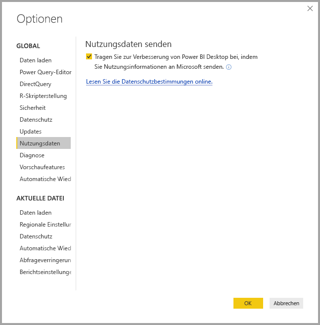
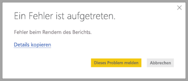

# Power BI Desktop – Datenschutz

Bei Microsoft arbeiten wir hart, um Ihre Privatsphäre zu schützen, und gleichzeitig bieten wir Produkte, die Ihnen die gewünschte Leistung sowie den gewünschten Komfort bieten. Microsoft sammelt bestimmte Informationen zu Ihrer Verwendung von Power BI Desktop, damit Probleme diagnostiziert und das Produkt verbessert werden kann. Weitere Informationen zu den Datenschutzpraktiken finden Sie in den Datenschutzbestimmungen von Microsoft. Dies gilt für die Daten, die wir auf Basis Ihrer Nutzung von **Power BI Desktop** erfassen.
 
Die von uns gesammelten Informationen von **Power BI Desktop**-Benutzern können Daten auf dem Betriebssystem, Power BI Desktop-Informationen sowie Internet Explorer-Versionen enthalten. 
 
Wenn Sie die Regel für diese Datensammlung deaktivieren möchten, navigieren Sie zu **Datei > Optionen und Einstellungen > Optionen**, und deaktivieren Sie auf der Registerkarte **Nutzungsdaten** das Kontrollkästchen **Nutzungsdaten senden**, so wie in folgender Abbildung dargestellt.

## Senden weiterer Informationen

Wenn Sie auf Probleme wie Abstürze o.Ä. stoßen, können Sie Fehlerberichte und zusätzliche Informationen übermitteln, die uns dabei helfen können, das Problem in einem zukünftigen Release zu beheben. Des Weiteren sammeln wir Informationen über den Zustand der **Power BI Desktop**-Datei, mit der Sie gearbeitet haben, z.B. über das Gebietsschema für das Dokument, aktivierte Vorschaufeatures sowie den Speichermodus. Dies können Screenshots, Fehlermeldungen sowie Formeln aus Ihrem Modell sein. Diese Elemente können die Dateiinhalte enthalten, die Sie verwendet haben, als ein Fehler aufgetreten ist. Überprüfen Sie sie deshalb vor dem Senden. Wir erinnern Sie vor dem Senden daran, dass Sie auswählen können, welche Informationen an Microsoft übermittelt werden.  
 
Wenn Sie nicht möchten, dass diese Informationen gesendet werden, können Sie auf **Schließen** klicken, wenn ein Fehler auftritt, oder das Senden von Nutzungsdaten, so wie oben beschrieben, deaktivieren. 

