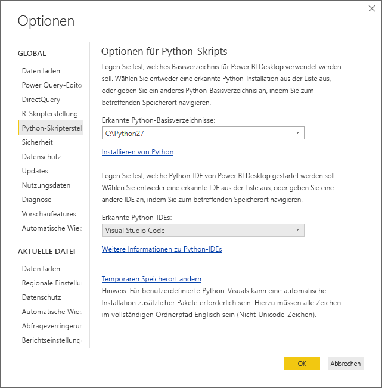
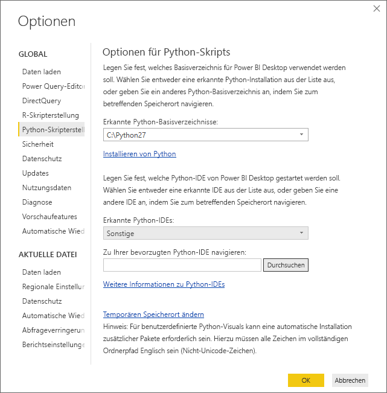
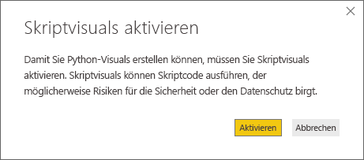
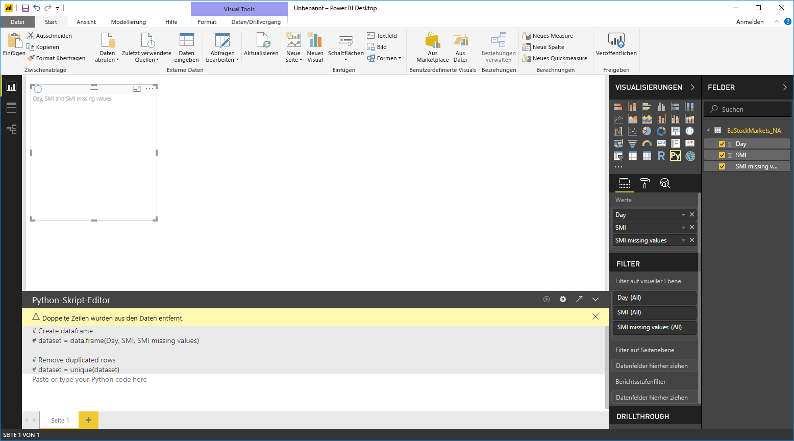
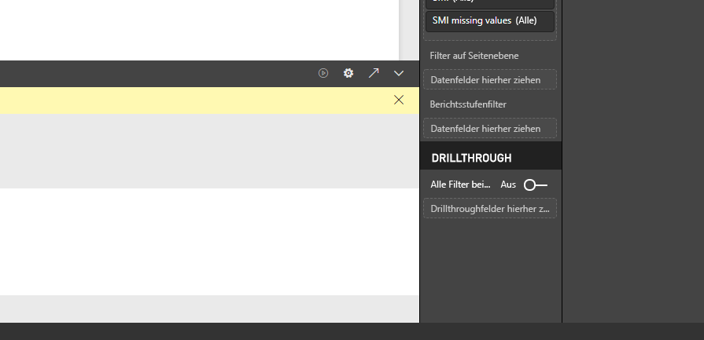
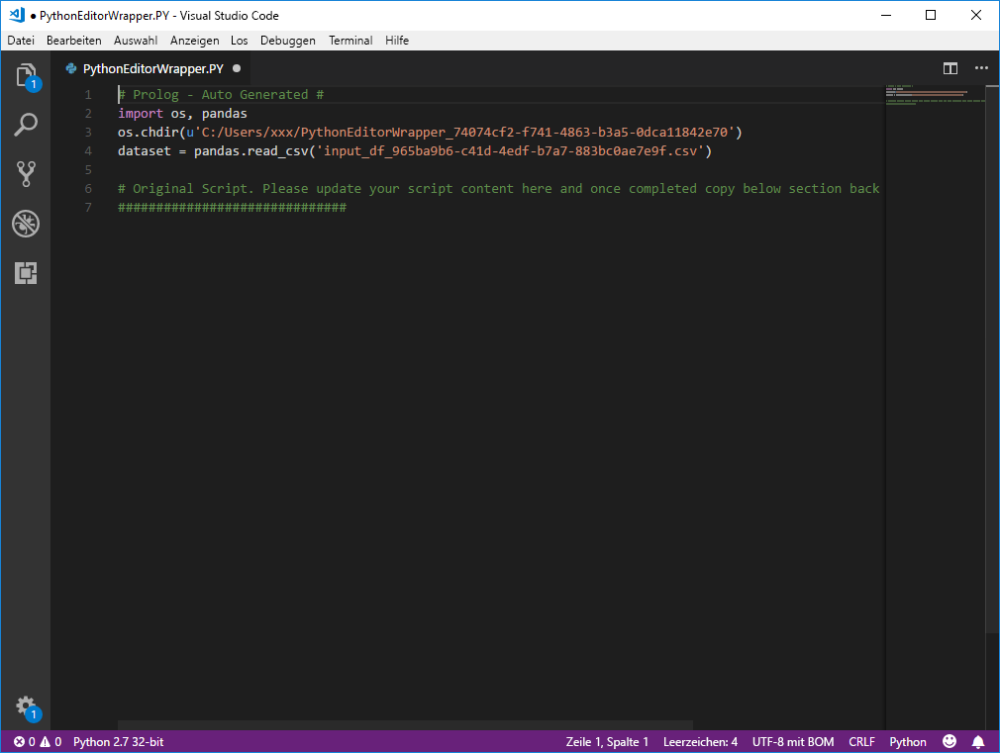

# Verwenden einer externen Python-IDE mit Power BI
Mit **Power BI Desktop** können Sie eine externe Python-IDE (Integrated Development Environment, integrierte Entwicklungsumgebung) zum Erstellen und Optimieren von Python-Skripts verwenden und diese Skripts dann in Power BI nutzen.

## Aktivieren einer externen Python-IDE
Sie können die externe Python-IDE aus **Power BI Desktop** starten. Ihre Daten werden automatisch importiert und in der Python-IDE angezeigt. Dort können Sie das Skript in der externen Python-IDE ändern und dann wieder in **Power BI Desktop** einfügen, um visuelle Power BI-Objekte und -Berichte zu erstellen.

Sie können angeben, welche Python-IDE Sie verwenden möchten und sie automatisch aus **Power BI Desktop** starten lassen.

### Anforderungen
Um dieses Feature verwenden zu können, müssen Sie eine **Python-IDE** auf dem lokalen Computer installieren. Die Python-Engine ist in **Power BI Desktop** nicht enthalten und wird nicht bereitgestellt oder installiert. Sie müssen daher **Python** separat auf dem lokalen Computer installieren. Sie können die zu verwendende Python-IDE auswählen. Dabei stehen die folgenden Optionen zur Wahl:

* Sie können Ihre bevorzugte Python-IDE installieren. Viele sind kostenlos verfügbar, z.B. über die [Visual Studio Code-Downloadseite](https://code.visualstudio.com/download/).
* **Power BI Desktop** unterstützt auch **Visual Studio**.
* Sie können auch eine andere **Python-IDE** installieren und sie durch **Power BI Desktop** starten lassen. Führen Sie dazu einen der folgenden Schritte aus:
  
  * Verknüpfen Sie **PY**-Dateien mit der externen IDE, die von **Power BI Desktop** gestartet werden soll.
  * Sie können die EXE-Datei angeben, die von **Power BI Desktop** gestartet werden soll, indem Sie im Abschnitt **Optionen für Python-Skript** des Dialogfelds **Optionen** die Option *Sonstige* angeben. Sie öffnen das Dialogfeld **Optionen**, indem Sie **Datei > Optionen und Einstellungen > Optionen** auswählen.
    
    

Wenn Sie mehrere Python-IDEs installiert haben, können Sie angeben, welche gestartet werden soll, indem Sie sie im Dialogfeld **Optionen** in der Dropdownliste *Erkannte Python-IDEs* auswählen.

**Power BI Desktop** startet standardmäßig **Visual Studio Code** als externe Python-IDE, wenn es auf dem lokalen Computer installiert ist. Wenn **Visual Studio Code** nicht installiert ist und Sie über **Visual Studio**  verfügen, wird stattdessen dieses gestartet. Wenn keine dieser Python-IDEs installiert ist, wird die mit den **PY**-Dateien verknüpfte Anwendung gestartet.

Und wenn keine Dateiassoziation mit **PY**-Dateien vorhanden ist, können Sie im Abschnitt *Wechseln Sie zu Ihrer bevorzugten Python-IDE* des Dialogfelds **Optionen** einen Pfad zu einer benutzerdefinierten IDE angeben. Sie können auch eine andere Python-IDE starten, indem Sie in **Power BI Desktop** neben dem Pfeilsymbol **Python-IDE starten** das Zahnradsymbol **Einstellungen** auswählen.

## Starten einer Python-IDE aus Power BI Desktop
Führen Sie zum Starten einer Python-IDE aus **Power BI Desktop** die folgenden Schritte aus:

1. Laden Sie Daten in **Power BI Desktop**.
2. Wählen Sie einige Felder im Bereich **Felder** aus, mit denen Sie arbeiten möchten. Wenn Sie noch keine visuellen Skriptelemente aktiviert haben, werden Sie hierzu aufgefordert.
   
   
3. Wenn visuelle Skriptelemente aktiviert wurden, können Sie ein visuelles Python-Element im Bereich **Visualisierungen** auswählen. Hiermit wird ein leeres visuelles Python-Element erstellt, das die Ergebnisse des Skripts anzeigen kann. Der Bereich **Python-Skript-Editor** wird ebenfalls angezeigt.
   
   
4. Jetzt können Sie die Felder auswählen, die Sie in Ihrem Python-Skript verwenden möchten. Wenn Sie ein Feld auswählen, wird im Feld **Python-Skript-Editor** automatisch Skriptcode auf Grundlage der ausgewählten Felder erstellt. Sie können das Python-Skript direkt im Bereich **Python-Skript-Editor** erstellen (oder einfügen), oder Sie lassen ihn leer.
   
   
   
   > [!NOTE]
   > Der Standardaggregationstyp für visuelle Python-Elemente lautet *Nicht zusammenfassen*.
   > 
   > 
5. Jetzt können Sie die Python-IDE direkt aus **Power BI Desktop** starten. Wählen Sie die Schaltfläche **Python-IDE starten** rechts auf der Titelleiste des **Python-Skript-Editors** aus, wie unten dargestellt.
   
   
6. Die angegebene Python-IDE wird von Power BI Desktop gestartet, wie in der folgenden Abbildung dargestellt (in dieser Abbildung ist die Standard-Python-IDE **Visual Studio Code**).
   
   
   
   > [!NOTE]
   > **Power BI Desktop** fügt die ersten drei Zeilen des Skripts hinzu, damit Ihre Daten aus **Power BI Desktop** importiert werden können, wenn Sie das Skript ausführen.
   > 
   > 
7. Im Bereich **Python-Skript-Editor** in **Power BI Desktop** erstellte Skripts werden ab Zeile 4 in der Python-IDE angezeigt. Jetzt können Sie Ihr eigenes Python-Skript in der Python-IDE erstellen. Sobald das Python-Skript in der Python-IDE fertig ist, müssen Sie es kopieren und wieder im Bereich **Python-Skript-Editor** in **Power BI Desktop** einfügen, *ohne* die ersten drei Zeilen des Skripts, die von **Power BI Desktop** automatisch generiert wurden. Kopieren Sie die ersten drei Zeilen des Skripts nicht wieder in **Power BI Desktop**, diese Zeilen wurden nur zum Importieren der Daten aus **Power BI Desktop** in die Python-IDE benötigt.

### Bekannte Einschränkungen
Für das Starten einer Python-IDE direkt aus Power BI Desktop gelten einige Einschränkungen:

* Das automatische Exportieren eines Skripts aus der Python-IDE in **Power BI Desktop** wird nicht unterstützt.

## Nächste Schritte
Betrachten Sie die folgenden zusätzlichen Informationen über Python in Power BI.

* [Ausführen von Python-Skripts in Power BI Desktop](desktop-python-scripts.md)
* [Erstellen von Power BI-Visualisierungen mithilfe von Python](desktop-python-visuals.md)

