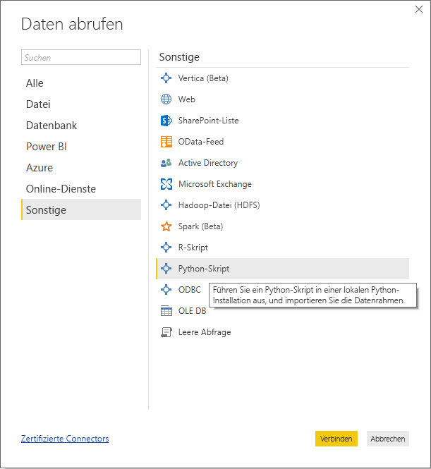
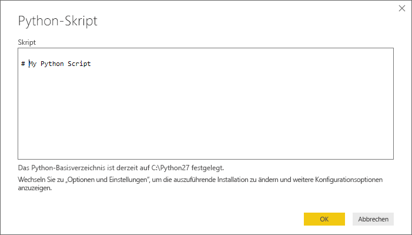
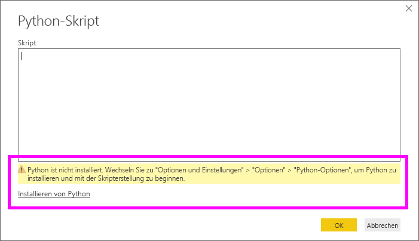
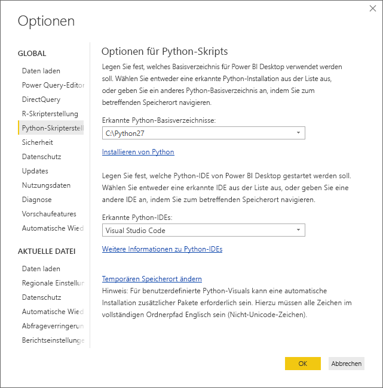

# <a name="run-python-scripts-in-power-bi-desktop"></a>Ausführen von Python-Skripts in Power BI Desktop
Sie können Python-Skripts direkt in **Power BI Desktop** ausführen und die resultierenden Datasets in ein Power BI Desktop-Datenmodell importieren.

## <a name="install-python"></a>Python installieren
Damit Sie Python-Skripts in Power BI Desktop ausführen können, müssen Sie **Python** auf dem lokalen Computer installieren. **Python** können Sie an vielen Stellen im Internet kostenlos herunterladen und installieren, u.a. von der [Offiziellen Python-Downloadseite](https://www.python.org/) und aus [Anaconda](https://anaconda.org/anaconda/python/). Die aktuelle Version der Python-Skripterstellung in Power BI Desktop unterstützt Unicode-Zeichen ebenso wie Leerzeichen (leere Zeichen) im Installationspfad.

### <a name="install-required-python-packages"></a>Installieren erforderlicher Python-Pakete
Für die Power BI-Python-Integration müssen zwei Python-Pakete installiert werden (Pandas und Matplotlib).  Installieren Sie mithilfe des pip-Befehlszeilentools die folgenden zwei Pakete:

```
pip install pandas
pip install matplotlib
```

## <a name="run-python-scripts"></a>Ausführen von Python-Skripts
Mit nur wenigen Schritten in Power BI Desktop können Sie Python-Skripts ausführen und ein Datenmodell erstellen, auf Basis dessen Sie Berichte erstellen und im Power BI-Dienst freigeben können.

### <a name="prepare-a-python-script"></a>Vorbereiten eines Python-Skripts
Wenn Sie ein Python-Skript in Power BI Desktop ausführen möchten, erstellen Sie das Skript in Ihrer lokalen Python-Entwicklungsumgebung, und vergewissern Sie sich, dass es erfolgreich ausgeführt wird.

Zum Ausführen des Skripts in Power BI Desktop stellen Sie sicher, dass das Skript in einem neuen und unveränderten Arbeitsbereich erfolgreich ausgeführt wird. Dies bedeutet, dass alle Pakete und Abhängigkeiten explizit geladen und ausgeführt werden müssen.

Beim Vorbereiten und Ausführen eines Python-Skripts in Power BI Desktop müssen Sie einige Einschränkungen beachten:

* Es werden nur Pandas-Datenrahmen importiert. Stellen Sie darum sicher, dass die nach Power BI zu importierenden Daten in einem Datenrahmen dargestellt werden.
* Wenn die Ausführung eines Python-Skripts länger als 30 Minuten dauert, wird sie mit einem Timeout abgebrochen.
* Bei interaktiven Aufrufen in einem Python-Skript, z. B. beim Warten auf eine Benutzereingabe, wird die Ausführung des Skripts angehalten.
* Wenn Sie das Arbeitsverzeichnis im Python-Skript angeben, *müssen* Sie den vollständigen Pfad zu diesem Verzeichnis angeben – der relative Pfad genügt nicht.
* Geschachtelte Tabellen (Tabellen von Tabellen) werden derzeit nicht unterstützt. 

### <a name="run-your-python-script-and-import-data"></a>Ausführen des Python-Skripts und Importieren der Daten
1. In Power BI Desktop befindet sich das Python-Skript-Datenconnector unter **Daten abrufen**. Wählen Sie zum Ausführen Ihres Python-Skripts **Daten abrufen &gt; Mehr...** und anschließend **Sonstige &gt; Python-Skript** aus, wie in der folgenden Abbildung dargestellt:
   
   
2. Wenn Python auf dem lokalen Computer installiert ist, wird die neueste installierte Version als Python-Engine ausgewählt. Kopieren Sie Ihr Skript einfach in das Skriptfenster, und wählen Sie **OK**aus.
   
   
3. Wenn Python nicht installiert ist, nicht erkannt wird oder auf Ihrem lokalen Computer mehrere Installationen vorhanden sind, wird eine Warnung angezeigt.
   
   
   
   Die Python-Installationseinstellungen befinden sich zentral im Abschnitt „Python-Skripterstellung“ des Dialogfelds „Optionen“. Wählen Sie zum Festlegen Ihrer Python-Installationseinstellungen **Datei > Optionen und Einstellungen** und anschließend **Optionen > Python-Skripterstellung** aus. Wenn mehrere Installationen von Python verfügbar sind, wird ein Dropdownmenü angezeigt, das Ihnen die Auswahl der gewünschten Installation ermöglicht. Sie können auch **Andere** auswählen und einen benutzerdefinierten Pfad eingeben.
   
   
4. Wählen Sie **OK** aus, um das Python-Skript auszuführen. Wenn das Skript erfolgreich ausgeführt wird, können Sie die resultierenden Datenrahmen auswählen, die Sie dem Power BI-Modell hinzufügen möchten.

### <a name="refresh"></a>Aktualisieren
Sie können ein Python-Skript in Power BI Desktop aktualisieren. Wenn Sie ein Python-Skript aktualisieren, führt Power BI Desktop das Python-Skript in der Power BI Desktop-Umgebung erneut aus.

## <a name="next-steps"></a>Nächste Schritte
Betrachten Sie die folgenden zusätzlichen Informationen über Python in Power BI.

* [Erstellen von visuellen Python-Elementen in Power BI Desktop](desktop-python-visuals.md)
* [Verwenden einer externen Python-IDE mit Power BI](desktop-python-ide.md)
