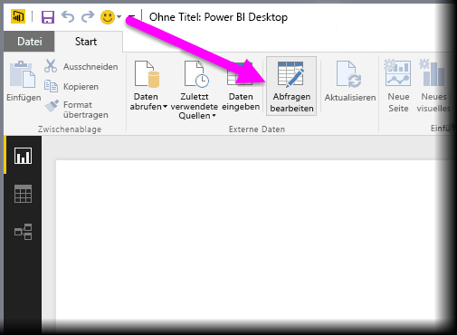
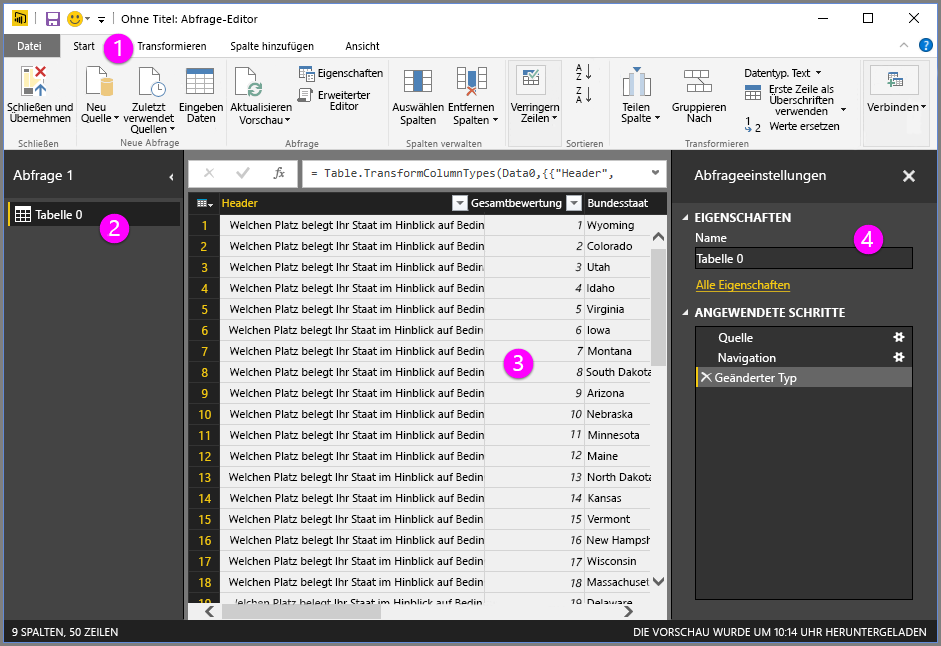
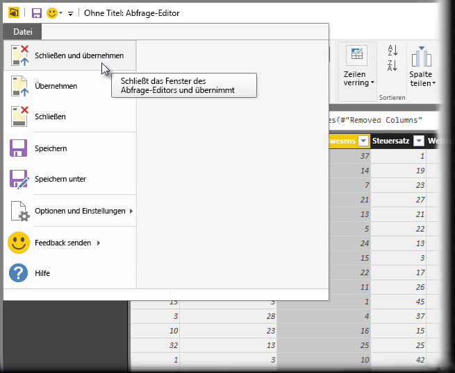

# Abfrageübersicht in Power BI Desktop
Mit **Power BI Desktop** vernetzen Sie sich mit der Welt der Daten, erstellen überzeugende und fundierte Berichte und teilen Ihre Arbeit mit anderen, die dann darauf aufbauen und so ihr Business Intelligence-Potenzial erweitern können.

Power BI Desktop verfügt über drei Ansichten:

* **Berichtsansicht.** Hier entwerfen Sie mithilfe selbst erstellter Abfragen ansprechende Visualisierungen, ordnen diese wie gewünscht und bei Bedarf auf mehreren Seiten an und geben Sie für andere Benutzer frei
* **Datenansicht.** Hier können Sie die Daten Ihres Berichts im Datenmodellformat anzeigen und Measures hinzufügen, neue Spalten erstellen und Beziehungen verwalten
* **Beziehungsansicht.** Hier können Sie eine grafische Darstellung der Beziehungen abrufen, die in Ihrem Datenmodell eingerichtet wurden, und diese je nach Bedarf verwalten oder ändern.

Um auf diese Ansichten zuzugreifen, verwenden Sie die drei Symbole auf der linken Seite in Power BI Desktop. In der folgenden Abbildung ist die Berichtsansicht ausgewählt. Dies wird durch den gelben Streifen neben dem Symbol signalisiert.  

Power BI Desktop enthält auch einen **Abfrage-Editor**, mit dem Sie eine Verbindung mit einer oder mehreren Datenquellen herstellen, die Daten gemäß Ihren Anforderungen strukturieren und transformieren und das Modell dann in Power BI Desktop laden können.

Das vorliegende Dokument enthält eine Übersicht über die Arbeit mit Daten im **Abfrage-Editor**. Aber es gibt natürlich noch mehr, das Sie wissen sollten. Deswegen finden Sie am Ende dieses Dokuments eine Reihe von Links, über die Sie ausführliche Anleitungen zu unterstützten Datentypen, zum Herstellen einer Datenverbindung, zum Strukturieren von Daten, zum Erstellen von Beziehungen und für den Einstieg in Power BI Desktop aufrufen können.

Zuerst wollen wir uns aber mit dem **Abfrage-Editor** vertraut machen.

## Abfrage-Editor
Zum Aufrufen des **Abfrage-Editors** wählen Sie in Power BI Desktop auf der Registerkarte **Start** die Option **Abfragen bearbeiten** aus.  

Solange noch keine Datenverbindungen hergestellt wurden, ist der **Abfrage-Editor** ein leerer Bereich, der auf Daten wartet.  

Sobald eine Abfrage geladen wurde, werden im **Abfrage-Editor** weitere Informationen angezeigt. Wenn Sie eine Verbindung mit der folgenden Webdatenquelle herstellen, lädt der **Abfrage-Editor** Informationen zu den Daten, mit deren Strukturierung Sie anschließend beginnen können.

[*http://www.bankrate.com/finance/retirement/best-places-retire-how-state-ranks.aspx*](http://www.bankrate.com/finance/retirement/best-places-retire-how-state-ranks.aspx)

Nach dem Herstellen der Datenverbindung präsentiert sich der **Abfrage-Editor** wie folgt:

1. Im Menüband sind jetzt viele Schaltflächen aktiv, über die Sie die Daten in der Abfrage interaktiv bearbeiten können
2. Im linken Bereich sind die Abfragen aufgelistet und können ausgewählt, angezeigt und strukturiert werden
3. Der mittlere Bereich zeigt die Daten der ausgewählten Abfrage an und erlaubt deren Strukturierung
4. Das Fenster **Abfrageeinstellungen** wird angezeigt. Hier sind die Eigenschaften der Abfrage und die angewendeten Schritte aufgelistet  
   
   

In den folgenden Abschnitten sehen wir uns alle vier Bereiche an: das Menüband, den Abfragebereich, die Datenansicht und den Bereich „Abfrageeinstellungen“.

## Das Menüband im Abfrage-Editor
Das Menüband im **Abfrage-Editor** enthält vier Registerkarten: **Start**, **Transformieren**, **Spalte hinzufügen** und **Ansicht**.

Die Registerkarte **Start** enthält allgemeine Abfrageaufgaben wie die Option **Daten abrufen** (das ist der erste Schritt bei jeder Abfrage). In der folgenden Abbildung ist das Menüband mit der Registerkarte **Start** dargestellt.  

Um eine Datenverbindung herzustellen und mit dem Erstellen der Abfrage zu beginnen, klicken Sie auf die Schaltfläche **Daten abrufen**. Ein Menü mit den am häufigsten verwendeten Datenquellen wird angezeigt.  

Weitere Informationen zu verfügbaren Datenquellen finden Sie unter **Datenquellen**. Informationen zum Herstellen von Datenverbindungen sowie entsprechende Beispiele und Schritte finden Sie unter **Verbinden mit Daten**.

Auf der Registerkarte **Transformieren** haben Sie Zugriff auf allgemeine Aufgaben zum Transformieren der Daten. Sie können z.B. Spalten hinzufügen oder entfernen, Datentypen ändern, Spalten teilen oder andere datenbezogene Aufgaben durchführen. In der folgenden Abbildung ist die Registerkarte **Transformieren** dargestellt.  

Weitere Informationen zum Transformieren von Daten sowie Beispiele hierzu finden Sie unter **Kombinieren und Strukturieren von Daten**.

Die Registerkarte **Spalte hinzufügen** enthält weitere Aufgaben im Zusammenhang mit dem Hinzufügen einer Spalte, dem Formatieren von Spaltendaten und dem Hinzufügen benutzerdefinierter Spalten. In der folgenden Abbildung ist die Registerkarte **Spalte hinzufügen** dargestellt.  

Die Registerkarte **Ansicht** im Menüband wird zum Umschalten der Anzeige bestimmter Bereiche oder Fenster verwendet. Sie dient auch zum Anzeigen des Erweiterten Editors. In der folgenden Abbildung ist die Registerkarte **Ansicht** dargestellt.  

Es ist hilfreich zu wissen, dass viele der im Menüband verfügbaren Aufgaben auch über das Kontextmenü (zugänglich nach einem Rechtsklick auf eine Spalte oder andere Daten im mittleren Bereich) aufgerufen werden können.

## Linker Bereich
Im linken Bereich werden die Anzahl der aktiven Abfragen sowie der Name der Abfrage angezeigt. Wenn Sie im linken Bereich eine Abfrage auswählen, werden die entsprechenden Daten im mittleren Bereich angezeigt. Hier können Sie die Daten entsprechend Ihren Anforderungen strukturieren und transformieren. Die folgende Abbildung zeigt den linken Bereich mit mehreren Abfragen.  

## Mittlerer Bereich (Datenbereich)
Im mittleren Bereich bzw. Datenbereich werden die Daten der ausgewählten Abfrage angezeigt und können strukturiert werden. Hier werden die meisten Aufgaben im Abfrage-Editor ausgeführt.

In der folgenden Abbildung wird die bereits früher erstellte Webdatenverbindung angezeigt. Die Spalte **Health care quality** ist ausgewählt, und durch Rechtsklick auf die Überschrift werden die im Kontextmenü verfügbaren Elemente angezeigt. Beachten Sie, dass viele Kontextmenüelemente auch als Schaltflächen auf den Registerkarten im Menüband verfügbar sind.  

Bei Auswahl eines Kontextmenüelements (oder einer Schaltfläche im Menüband) wendet die Abfrage den Schritt auf die Daten an und speichert ihn als Teil der Abfrage. Die Schritte werden wie im nächsten Abschnitt beschrieben im Bereich **Abfrageeinstellungen** in der entsprechenden Reihenfolge aufgezeichnet.  

## Bereich „Abfrageeinstellungen“
Im Bereich **Abfrageeinstellungen** werden alle Schritte angezeigt, die mit einer Abfrage verbunden sind. Im folgenden Bild geht aus dem Bereich **Abfrageeinstellungen** unter **Angewendete Schritte** beispielsweise hervor, dass wir gerade den Typ der Spalte **Health care quality** geändert haben.

Beim Anwenden weiterer Strukturierungsschritte auf die Abfrage werden auch diese im Bereich **Angewendete Schritte** erfasst.

Es ist wichtig zu wissen, dass die zugrunde liegenden Daten *nicht* geändert werden. Die Abfrage passt nur die Ansicht und Struktur der Daten an. Jegliche Interaktion mit den Basisdaten erfolgt in der von der Abfrage strukturierten und modifizierten Ansicht dieser Daten.

Im Bereich **Abfrageeinstellungen** können Sie Schritte nach Bedarf umbenennen, löschen oder neu anordnen. Klicken Sie dazu mit der rechten Maustaste in den Bereich **Angewendete Schritte**, und nehmen Sie im Kontextmenü die gewünschte Auswahl vor. Alle Abfrageschritte werden in der Reihenfolge ausgeführt, in der sie im Bereich **Angewendete Schritte** aufgeführt sind.

## Erweiterter Editor
Wenn Sie den Code, den der Abfrage-Editor bei den einzelnen Schritten erzeugt, anzeigen oder eigenen Strukturierungscode erstellen möchten, können Sie das im Fenster **Erweiterter Editor**tun. Zum Starten des Erweiterten Editors wählen Sie zunächst **Ansicht** im Menüband und dann **Erweiterter Editor**aus. Ein Fenster wird geöffnet, in dem der Code der vorhandenen Abfrage angezeigt wird.  

Im Fenster **Erweiterter Editor** können Sie den Code direkt bearbeiten. Zum Schließen des Fensters wählen Sie die Schaltfläche **Fertig** oder **Abbrechen** aus.  

## Speichern der Arbeit
Wenn Ihre Abfrage das gewünschte Aussehen hat, können Sie die Änderungen am Datenmodell in Power BI Desktop anwenden lassen und den Abfrage-Editor dann schließen. Wählen Sie hierzu im Abfrage-Editor im Menü **Datei** die Option **Schließen und übernehmen** aus.  

Nachfolgend zeigt Power BI Desktop in einem Dialogfeld eine Fortschrittsanzeige an.  

Wenn die Bearbeitung Ihrer Abfrage abgeschlossen ist oder Sie einfach nur sicherstellen möchten, dass Ihre Arbeit gespeichert wird, können Sie sie in Power BI Desktop als PBIX-Datei speichern.

Wählen Sie zum Speichern wie in der folgenden Abbildung gezeigt **Datei \> Speichern** (oder **Datei \> Speichern unter**) aus.  

## Nächste Schritte
Mit Power BI Desktop können Sie viele Aufgaben ausführen. Weitere Informationen zu den Funktionen und Möglichkeiten finden Sie in den folgenden Ressourcen:

* [Erste Schritte mit Power BI Desktop](desktop-getting-started.md)
* [Datenquellen in Power BI Desktop](desktop-data-sources.md)
* [Verbinden mit Daten in Power BI Desktop](desktop-connect-to-data.md)
* [Strukturieren und Kombinieren von Daten mit Power BI Desktop](desktop-shape-and-combine-data.md)
* [Allgemeine Abfrageaufgaben in Power BI Desktop](desktop-common-query-tasks.md)   

