# Verwenden von Quickmeasures zur einfachen Nutzung gängiger und leistungsstarker Berechnungsfunktionen
Mit **Quickmeasures** können Sie gängige und leistungsstarke Berechnungsfunktionen nutzen. Ein **Quickmeasure** führt für eine Eingabe, die Sie in einem Dialogfeld vornehmen, im Hintergrund eine Reihe von (vorgefertigten) DAX-Befehlen aus und liefert Ergebnisse, die Sie dann in Ihrem Bericht verwenden können. Und das Beste: Sie können sich ansehen, welche DAX-Befehle das Quickmeasure ausführt, und sich so besser mit DAX vertraut machen.

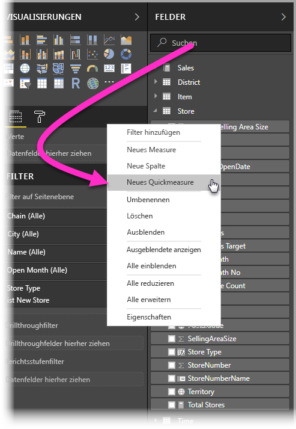

Klicken Sie zum Erstellen von **Schnellmeasures** im Bereich **Felder** mit der rechten Maustaste auf ein Feld, und wählen Sie im daraufhin angezeigten Menü die Option **Schnellmeasures** aus. Alternativ können Sie auch im Bereich **Werte** eines bereits vorhandenen visuellen Elements mit der rechten Maustaste auf einen beliebigen Wert klicken (etwa auf das Feld *Werte* in einem *Balkendiagramm*). Es stehen zahlreiche Berechnungskategorien und Bearbeitungsmöglichkeiten zur Verfügung, mit denen Sie die Berechnungen an Ihre jeweiligen Anforderungen anpassen können.

### Quickmeasures ab sofort allgemein verfügbar

Quickmeasures sind seit Februar 2018 im neuen Release von **Power BI Desktop** allgemein verfügbar und befinden sich damit nicht mehr in der Vorschauversion. Wenn Sie ein früheres Release von **Power BI Desktop** verwenden, können Sie **Quickmeasures** mit einem Release von **Power BI Desktop** verwenden, das im **April 2017** oder danach erschienen ist. Aktivieren Sie dazu unter **Datei > Optionen und Einstellungen > Optionen > Vorschaufeatures** das Kontrollkästchen neben **Quickmeasures**.

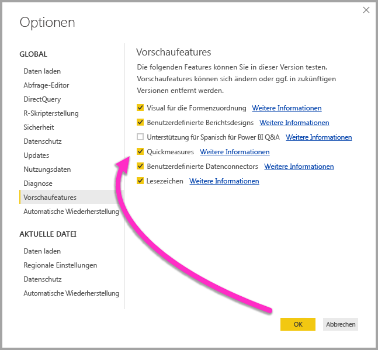

Sie müssen **Power BI Desktop** neu starten, nachdem Sie die Auswahl vorgenommen haben.

## Verwenden von Schnellmeasures
Klicken Sie zum Erstellen eines **Schnellmeasures** in **Power BI Desktop** im Bereich **Felder** mit der rechten Maustaste auf ein beliebiges Feld, und wählen Sie im daraufhin angezeigten Menü die Option **Schnellmeasures** aus.

Bei Verwendung von SSAS-Liveverbindungen (SQL Server Analysis Services) sind einige **Quickmeasures** verfügbar. In **Power BI Desktop** wird nur die Sammlung der **Quickmeasures** angezeigt, die für die Version von SSAS unterstützt werden, mit der die Verbindung hergestellt wird. Wenn eine Verbindung mit einer SSAS-Livedatenquelle besteht und bestimmte **Quickmeasures** nicht in der Liste enthalten sind, unterstützt die SSAS-Version, mit der die Verbindung besteht, nicht das DAX-Measure, mit dem das betreffende **Quickmeasure** implementiert wurde.

Nach Auswahl der Option im Kontextmenü erscheint das Fenster **Quickmeasures**. Hier können Sie die gewünschte Berechnung sowie die Felder auswählen, für die die Berechnung erfolgen soll.

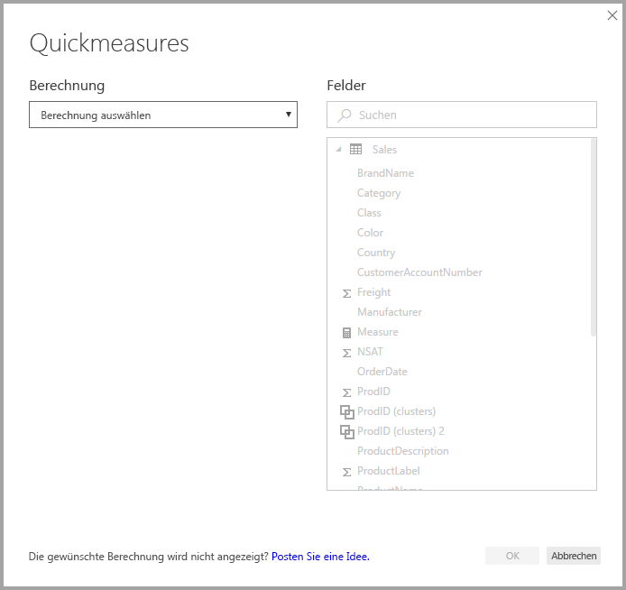

Wenn Sie das Dropdownmenü auswählen, erhalten Sie eine lange Liste mit verfügbaren **Schnellmeasures**.

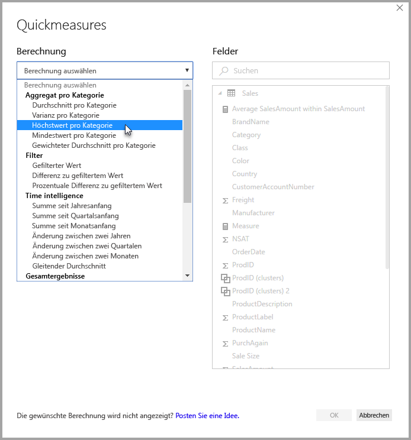

Die Schnellmeasure-Berechnungstypen sind in fünf unterschiedliche Gruppen unterteilt, die jeweils eine Reihe von Berechnungen umfassen. Folgende Gruppen und Berechnungen stehen zur Verfügung:

* **Pro Kategorie aggregieren**
  * Durchschnitt pro Kategorie
  * Varianz pro Kategorie
  * Höchstwert pro Kategorie
  * Mindestwert pro Kategorie
  * Gewichteter Durchschnitt pro Kategorie
* **Filter**
  * Gefilterter Wert
  * Differenz zu gefiltertem Wert
  * Prozentuale Differenz zu gefiltertem Wert
  * Sales from new categories (Umsätze aus neuen Kategorien)
* **Zeitinformationen**
  * Summe seit Jahresanfang
  * Summe seit Quartalsanfang
  * Summe seit Monatsanfang
  * Veränderung im Vergleich zum Vorjahr
  * Änderung zwischen zwei Quartalen
  * Änderung zwischen zwei Monaten
  * Gleitender Durchschnitt
* **Gesamtergebnisse**
  * Laufende Summe
  * Gesamtsumme für die Kategorie (Filter angewendet)
  * Gesamtsumme für die Kategorie (Filter nicht angewendet)
* **Mathematische Operationen**
  * Addition
  * Subtraktion
  * Multiplikation
  * Division
  * Prozentualer Unterschied
  * Korrelationskoeffizient
* **Text**
  * Bewertungssterne
  * Verkettete Werteliste

Diese Berechnungen werden voraussichtlich noch ergänzt. Daher würden wir gerne von Ihnen erfahren, welche **Quickmeasures** Sie sich wünschen und ob Sie Vorschläge (einschließlich zugrunde liegender DAX-Formeln) für **Quickmeasures** haben. Weitere Informationen hierzu finden Sie am Ende dieses Artikels.

## Beispiel für Schnellmeasures
In diesem Abschnitt sehen wir uns ein Beispiel dieser **Schnellmeasures** in Aktion an.

Die folgende **Matrix** zeigt eine Verkaufstabelle für verschiedene Elektronikprodukte. Hierbei handelt es sich um eine einfache Tabelle mit der Summe der einzelnen Kategorien.

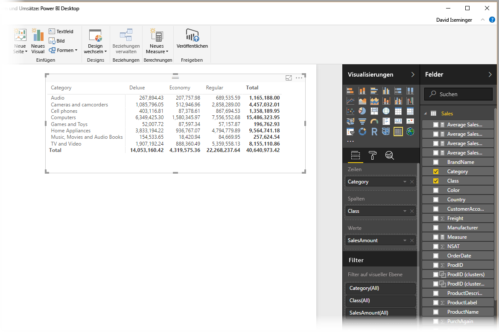

Wenn wir mit der rechten Maustaste auf den Feldbereich **Werte** klicken und **Quickmeasures** auswählen, können wir als *Berechnung* die Option *Durchschnitt pro Kategorie* und als *Basiswert* die Option *Summe von SalesAmount* auswählen. Anschließend können wir *SalesAmount* angeben, indem wir das entsprechende Feld aus dem Bereich *Felder* (rechts) in den Bereich *Kategorie* (links) ziehen.

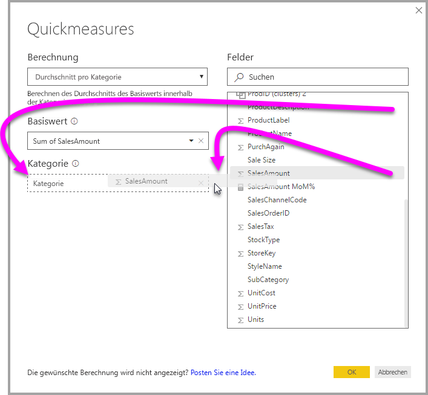

Wenn wir nun **OK** auswählen, passieren einige interessante Dinge, wie in der Abbildung nach der folgenden Liste zu sehen:

1. Die **Matrix** enthält nun eine neue Spalte mit unserer Berechnung (in diesem Fall: *Durchschnitt innerhalb von „SalesAmount“*).
2. Ein neues **Measure** wurde erstellt. Es befindet sich im Bereich **Felder** und wird von Power BI durch ein gelbes Kästchen hervorgehoben. Dieses Measure steht für jedes andere visuelle Element im Bericht zur Verfügung (nicht nur für das visuelle Element, für das es ursprünglich erstellt wurde).
3. Die für das **Schnellmeasure** erstellte DAX-Formel wird auf der Bearbeitungsleiste angezeigt.

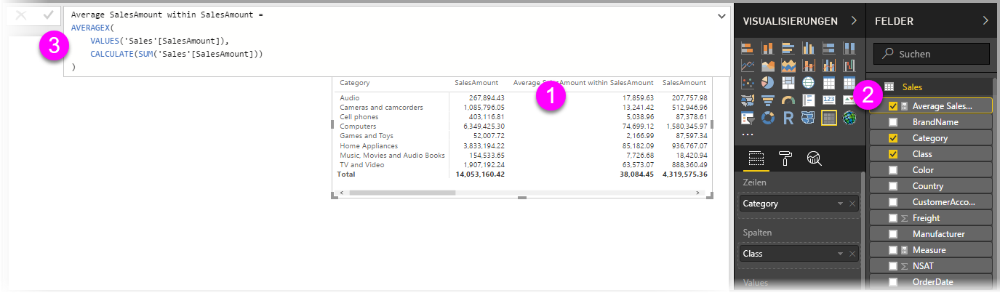

Beachten Sie im Zusammenhang mit dem ersten Punkt, dass das **Schnellmeasure** auf das visuelle Element angewendet wurde. Es gibt eine neue Spalte und einen zugeordneten Wert. Beide basieren auf dem erstellten **Schnellmeasure**.

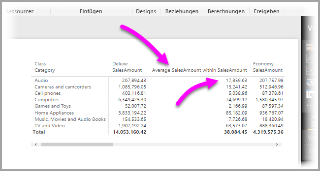

Zweitens: Das **Schnellmeasure** wird im Bereich **Felder** des Datenmodells angezeigt und kann wie jedes andere Feld im Modell für ein beliebiges anderes visuelles Element verwendet werden. In der folgenden Abbildung wurde unter Verwendung des neuen Felds, das durch das **Schnellmeasure** erstellt wurde, ein **Balkendiagramm** erstellt.

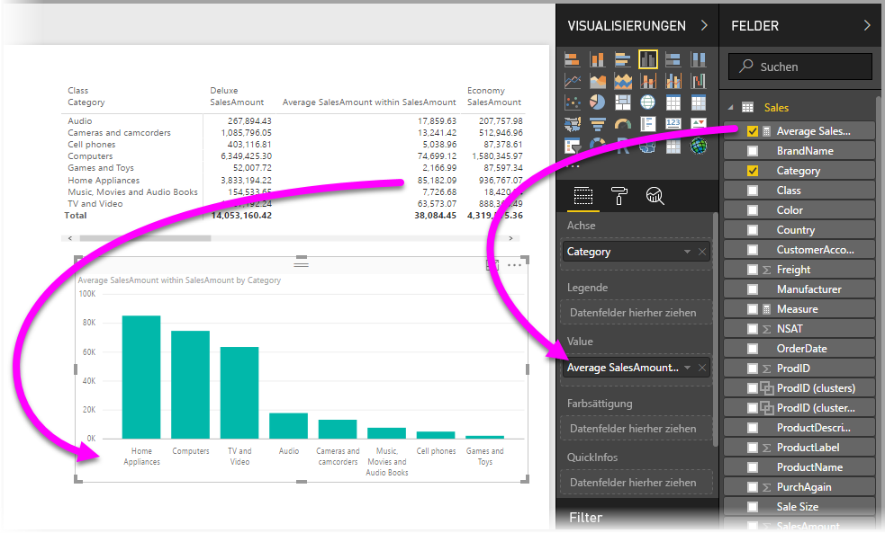

Im nächsten Abschnitt beschäftigen wir uns mit dem dritten Punkt: DAX-Formeln.

## Kennenlernen von DAX anhand von Schnellmeasures
Ein weiterer Vorteil von **Schnellmeasures**: Das Feature zeigt Ihnen direkt die DAX-Formel, die zur Implementierung des Measures erstellt wurde. In der folgenden Abbildung haben wir das Measure ausgewählt, das durch das **Schnellmeasure** erstellt wurde. (Es befindet sich nun im Bereich **Felder**, sodass wir lediglich darauf klicken müssen.) Daraufhin wird die **Bearbeitungsleiste** mit der DAX-Formel angezeigt, die Power BI zur Implementierung des Measures erstellt hat.

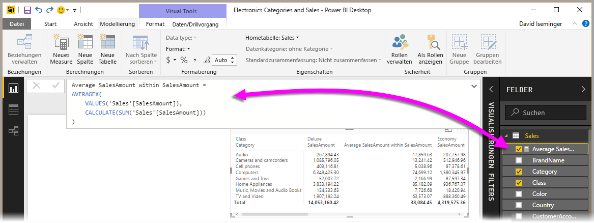

Das ist praktisch, denn so erfahren Sie, welche Formel dem Measure zugrunde liegt. Was aber vielleicht noch wichtiger ist: Sie können anhand von **Quickmeasures** sehen, wie die zugrunde liegenden DAX-Formeln erstellt werden sollten.

Angenommen, Sie müssen eine Berechnung für einen Jahresvergleich durchführen, wissen aber nicht so recht, wie Sie die DAX-Formel strukturieren (oder wo Sie überhaupt anfangen) sollen. In diesem Fall können Sie ein **Quickmeasure** mit der Berechnung **Änderung zwischen zwei Jahren** erstellen und sich den Vorgang ansehen. Gehen Sie dazu wie folgt vor: Erstellen Sie das **Quickmeasure**, betrachten Sie die Darstellung in Ihrem visuellen Element, sehen Sie sich an, wie die DAX-Formel funktioniert, und ändern Sie dann entweder die DAX-Formel direkt, oder erstellen Sie ein weiteres Measure, bis die Berechnungen Ihren Anforderungen oder Erwartungen entsprechen.

Das ist fast so als hätten Sie einen Lehrer, der umgehend auf Ihre Was-wäre-wenn-Fragen reagiert – und das mit nur wenigen Mausklicks. Sie können diese Measures jederzeit aus Ihrem Modell löschen, wenn sie Ihnen nicht zusagen. Dazu müssen Sie lediglich mit der rechten Maustaste auf das Measure klicken und **Löschen** auswählen.

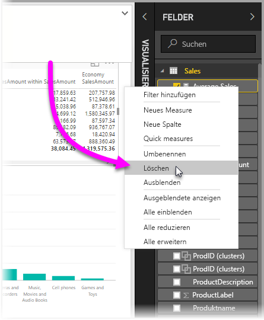

Und wenn Sie das optimale Measure erstellt haben, können Sie es über das gleiche Kontextmenü mit einem beliebigen Namen versehen.

## Einschränkungen und Überlegungen
Folgende Einschränkungen und Überlegungen sollten Sie berücksichtigen:

* **Quickmeasures** sind nur verfügbar, wenn Sie das Modell ändern können. Das ist bei einigen Liveverbindungen nicht der Fall (tabellarische SSAS-Liveverbindungen werden unterstützt, wie weiter oben erläutert).
* Das Measure, das dem Bereich **Felder** hinzugefügt wird, kann für ein beliebiges visuelles Element im Bericht verwendet werden.
* Sie können jederzeit die DAX-Formel anzeigen, die einem **Schnellmeasure** zugeordnet ist. Wählen Sie hierzu im Bereich **Felder** das erstellte Measure aus, und sehen Sie sich die Formel auf der **Bearbeitungsleiste** an.
* Beim Arbeiten im DirectQuery-Modus können Sie keine Quickmeasures mit Zeitintelligenz erstellen. Die DAX-Funktionen, die in diesen Quickmeasures verwendet werden, haben Auswirkungen auf die Leistung, wenn sie in die T-SQL-Anweisungen übersetzt werden, die an Ihre Datenquelle gesendet werden.

> [!WARNING]
> Ein Schnellmeasure generiert derzeit *nur* DAX-Anweisungen mit Kommas als Argumenttrennzeichen. Wenn Ihre Version von **Power BI Desktop** für eine Sprache lokalisiert ist, in der Kommas als Dezimaltrennzeichen verwendet werden, können Quickmeasures nicht ordnungsgemäß funktionieren.
> 
> 

### Zeitintelligenz und Quickmeasures
Ab dem **Power BI Desktop**-Update von Oktober 2017 können Sie eigene benutzerdefinierte Datumstabellen mit Zeitintelligenz-**Quickmeasures** verwenden. Wenn Sie ein externes Tabellenmodel verwenden, müssen Sie sicherstellen, dass die primäre Datumsspalte in dieser Tabelle beim Erstellen des Modells als Datumstabelle markiert wurde, wie in diesem [Artikel beschrieben](https://docs.microsoft.com/sql/analysis-services/tabular-models/specify-mark-as-date-table-for-use-with-time-intelligence-ssas-tabular). Wenn Sie Ihre eigene Datumstabelle importieren, stellen Sie sicher, dass Sie diese als Datumstabelle markieren, wie in [diesem Artikel](https://docs.microsoft.com/power-bi/desktop-date-tables) beschrieben.

### Weitere Informationen und Beispiele
Dieser Schwerpunktartikel wird voraussichtlich noch mit Beispielen und Anleitungen für die einzelnen Berechnungen der **Schnellmeasures** aktualisiert. Schauen Sie daher bald wieder vorbei.

Haben Sie eine Idee für ein noch nicht verfügbares **Schnellmeasure**? Sehr gut! Besuchen Sie [diese Seite](https://go.microsoft.com/fwlink/?linkid=842906), und reichen Sie Ihre Ideen (und DAX-Formeln) für das **Schnellmeasure** ein, das Sie sich für **Power BI Desktop** wünschen, damit wir es ggf. in einer späteren Version der Liste mit verfügbaren **Schnellmeasures** hinzufügen können.

