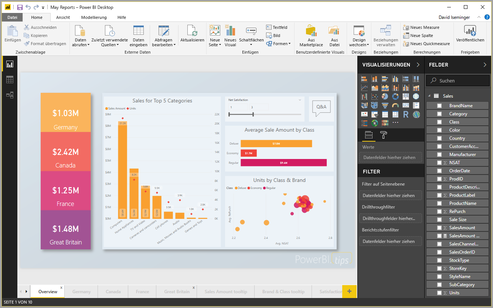

# Schnellstart: Herstellen einer Verbindung mit Daten in Power BI Desktop

In dieser Schnellstartanleitung stellen Sie über **Power BI Desktop** eine Verbindung mit Daten her. Dies ist der erste Schritt beim Erstellen von Datenmodellen und Berichten.

Wenn Sie noch nicht bei Power BI registriert sind, müssen Sie sich zuerst für eine [kostenlose Testversion registrieren](https://app.powerbi.com/signupredirect?pbi_source=web).

## Voraussetzungen

Um die Schritte in diesem Artikel auszuführen, benötigen Sie Folgendes:
* **Power BI Desktop** ist eine kostenlose Anwendung, die auf Ihrem lokalen Computer ausgeführt wird. Laden Sie sie herunter, und installieren Sie sie. Sie können [**Power BI Desktop** direkt herunterladen](https://powerbi.microsoft.com/desktop) oder aus dem [**Microsoft Store**](http://aka.ms/pbidesktopstore) abrufen.
* [Laden Sie diese Excel-Beispielarbeitsmappe herunter](http://go.microsoft.com/fwlink/?LinkID=521962), und erstellen Sie den Ordner *C:\PBID-qs*, in dem Sie die Excel-Datei speichern können. Bei den nachfolgenden Schritten in dieser Schnellstartanleitung wird davon ausgegangen, dass dies der Speicherort der heruntergeladenen Excel-Arbeitsmappe ist.

## Starten von Power BI Desktop

Nachdem Sie **Power BI Desktop** installiert haben, starten Sie die Anwendung, sodass sie auf Ihrem lokalen Computer ausgeführt wird. Es wird eine leere Canvas angezeigt, auf der Sie Visuals und Berichte aus den Daten erstellen, mit denen Sie eine Verbindung hergestellt haben. 

## Verbinden mit Daten

Mit **Power BI Desktop** können Sie Verbindungen mit verschiedenen Arten von Daten herstellen. Sie können eine Verbindung mit grundlegenden Datenquellen wie beispielsweise einer Microsoft Excel-Datei oder mit Onlinediensten herstellen, die unterschiedlichste Datentypen enthalten, z.B. Salesforce, Microsoft Dynamics, Azure Blob Storage und viele weitere. 

Wählen Sie zum Herstellen einer Verbindung mit Daten im Menüband **Start** den Eintrag **Daten abrufen** aus.

Das Fenster **Daten abrufen** wird angezeigt, in dem Sie aus den vielen verschiedenen Datenquellen auswählen können, mit denen **Power BI Desktop** eine Verbindung herstellen kann. In dieser Schnellstartanleitung verwenden wir die Excel-Arbeitsmappe, die Sie heruntergeladen haben und die im Abschnitt *Voraussetzungen* am Anfang dieses Artikels beschrieben wurde. 

Da es sich um eine Excel-Datei handelt, wählen Sie im Fenster **Daten abrufen** die Option **Excel** aus und klicken dann auf die Schaltfläche **Verbinden**.

Sie werden aufgefordert, den Speicherort der Excel-Datei anzugeben, mit dem Sie eine Verbindung herstellen möchten. Die heruntergeladene Datei heißt *Financial Sample*. Wählen Sie diese Datei aus, und klicken Sie dann auf **Öffnen**.

**Power BI Desktop** lädt die Arbeitsmappe, liest den Inhalt und zeigt Ihnen im Fenster **Navigator** die in der Datei verfügbaren Daten. In diesem Fenster können Sie die Daten auswählen, die in Power BI Desktop geladen werden sollen. Sie wählen die Tabellen aus, indem Sie die Kontrollkästchen neben jeder Tabelle aktivieren, die Sie importieren möchten. In diesem Fall importieren Sie beide verfügbaren Tabellen.

Nachdem Sie Ihre Auswahl getroffen haben, klicken Sie auf **Laden**, um die Daten in Power BI Desktop zu importieren.

## Anzeigen von Daten im Bereich „Felder“

Nachdem Sie die Tabellen geladen haben, werden die Daten im Bereich **Felder** angezeigt. Sie können jede Tabelle erweitern, indem Sie auf das Dreieck neben dem Tabellennamen klicken. In der folgenden Abbildung ist die Tabelle *financials* erweitert, und jedes Feld wird angezeigt. 

Und das ist auch schon alles! Sie haben in **Power BI Desktop** eine Verbindung mit Daten hergestellt, diese Daten geladen und können jetzt alle verfügbaren Felder in diesen Tabellen anzeigen.

## Nächste Schritte
In **Power BI Desktop** können Sie nach dem Herstellen einer Verbindung mit Daten verschiedene Aufgaben ausführen; Sie können beispielsweise Visuals und Berichte erstellen. Sehen Sie sich folgende Ressourcen an, um loszulegen:

* [Leitfaden für die ersten Schritte mit Power BI Desktop](desktop-getting-started.md)

