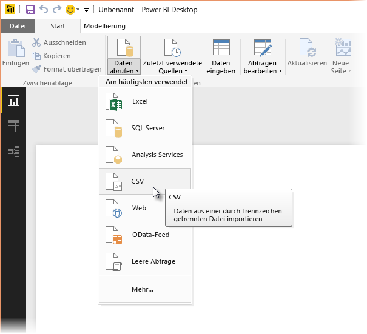
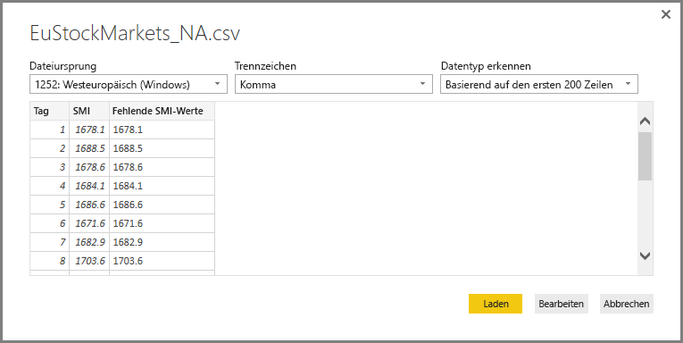
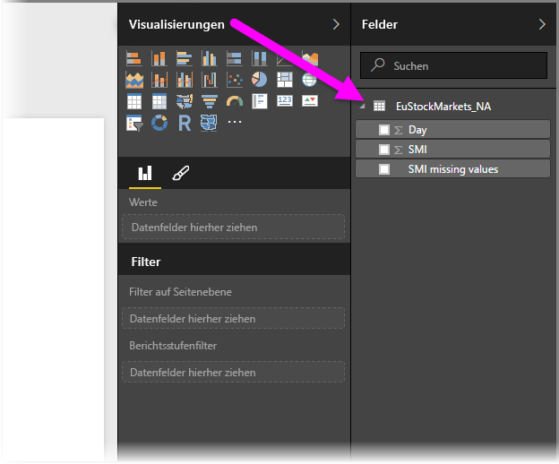
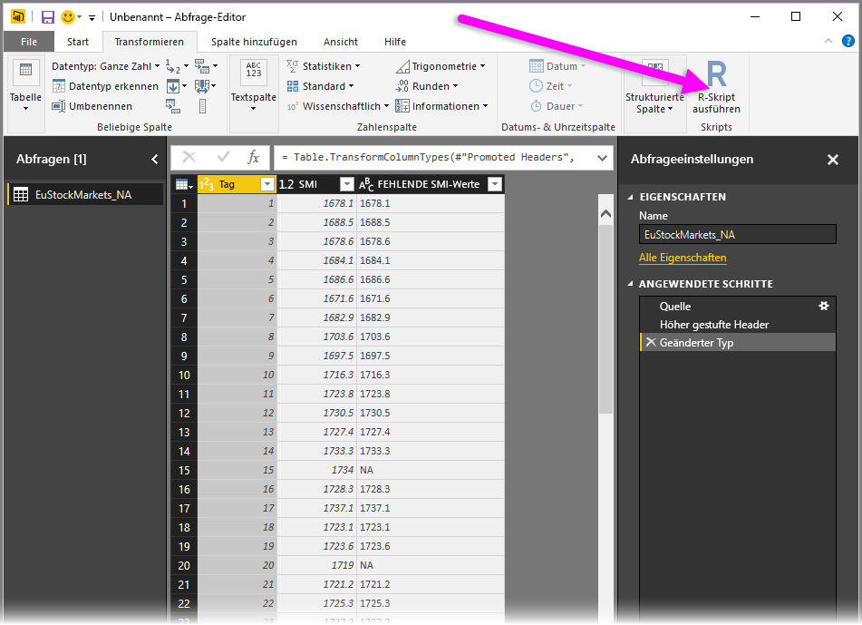
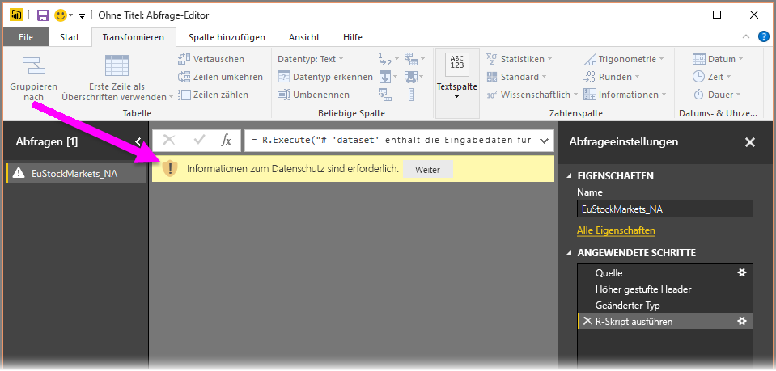
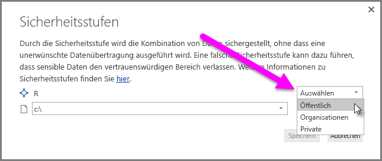
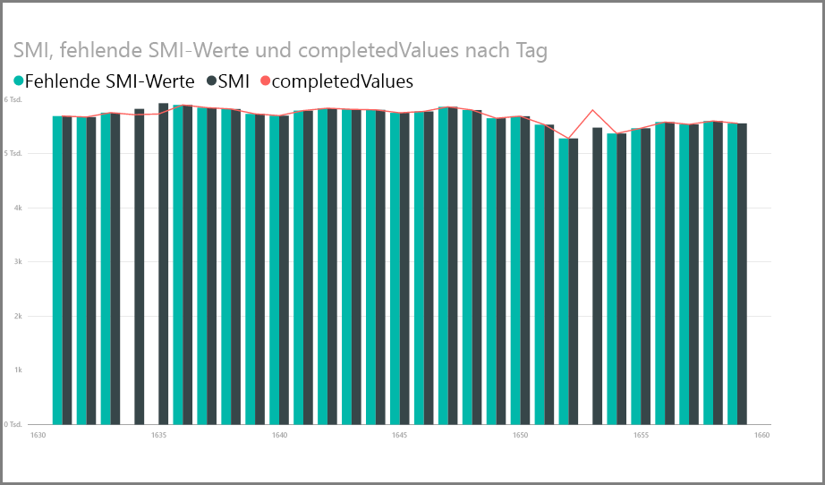
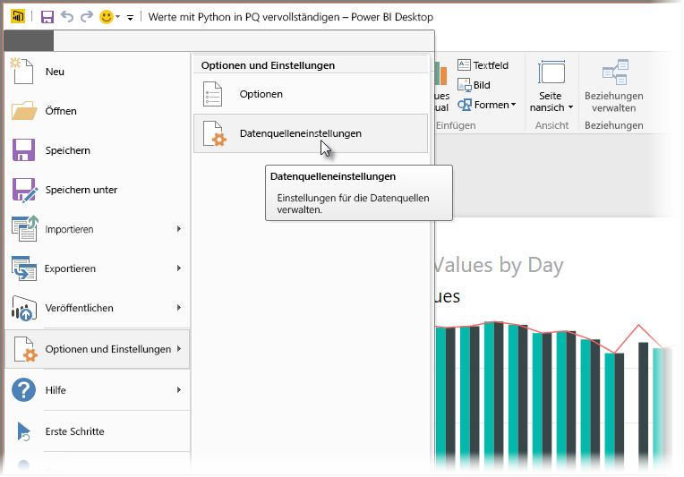
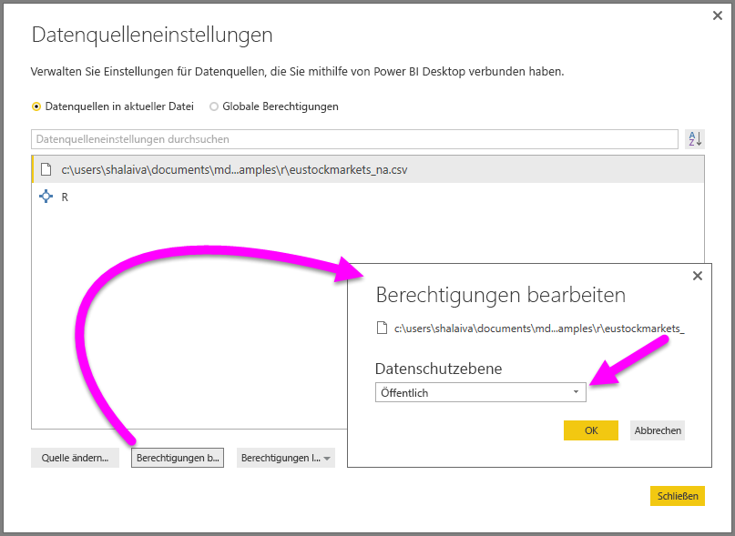

# Verwenden von R im Abfrage-Editor
Sie können **R**, eine häufig von Statistikern, Business Analysten und Datenanalysten verwendete Programmiersprache, im **Abfrage-Editor** von Power BI Desktop verwenden. Dank der Integration von R in den **Abfrage-Editor** können Sie mithilfe von R Daten bereinigen, erweiterte Datenstrukturierung und Analysen in Datasets ausführen, einschließlich der Ergänzung fehlender Daten, Prognosen und Clustering, um nur einige der Möglichkeiten zu nennen. **R** ist eine leistungsfähige Sprache, die im **Abfrage-Editor** zum Erstellen des Datenmodells und Erzeugen von Berichten verwendet werden kann.

## Installieren von R
Damit Sie **R** im **Abfrage-Editor** von Power BI Desktop verwenden können, müssen Sie **R** auf dem lokalen Computer installieren. **R** können Sie an vielen Stellen im Internet kostenlos herunterladen und installieren, u.a. von der [Revolution R Open-Downloadseite](https://mran.revolutionanalytics.com/download/) und aus dem [CRAN-Repository](https://cran.r-project.org/bin/windows/base/).

## Verwenden von R im Abfrage-Editor
Um die Verwendung von **R** im **Abfrage-Editor** zu veranschaulichen, wird dieses Beispiel aus einem Aktiendataset verwendet. Dieses basiert auf einer CSV-Datei, die Sie [hier herunterladen](http://download.microsoft.com/download/F/8/A/F8AA9DC9-8545-4AAE-9305-27AD1D01DC03/EuStockMarkets_NA.csv) können, um die Vorgehensweise nachzuvollziehen. Dieses Beispiel umfasst die folgenden Schritte:

1. Laden Sie zunächst die Daten in **Power BI Desktop**. Laden Sie in diesem Beispiel die Datei *EuStockMarkets_NA.csv*, und wählen Sie in **Power BI Desktop** aus dem Menüband **Home** die Option **Daten abrufen > CSV** aus.

   
2. Wählen Sie die Datei aus und dann **Öffnen** aus. Anschließend wird die CSV-Datei im Dialogfeld **CSV-Datei** angezeigt.

   
3. Nachdem die Daten geladen wurden, werden sie in Power BI Desktop im Bereich **Felder** angezeigt.

   
4. Öffnen Sie den **Abfrage-Editor**, indem Sie in **Power BI Desktop** auf der Registerkarte **Start** die Option **Abfragen bearbeiten** auswählen.

   
5. Wählen Sie auf der Registerkarte **Transformieren** die Option **R-Skript ausführen** aus. Der Editor **R-Skript ausführen** wird angezeigt (im nächsten Schritt dargestellt). Beachten Sie, dass in Zeile 15 und 20 Daten fehlen. Dies trifft auch für andere Zeilen zu, die in der folgenden Abbildung nicht dargestellt sind. In den folgenden Schritten wird gezeigt, wie R diese Zeilen für Sie ausfüllt.

   
6. Geben Sie für dieses Beispiel folgenden Skriptcode ein:

       library(mice)
       tempData <- mice(dataset,m=1,maxit=50,meth='pmm',seed=100)
       completedData <- complete(tempData,1)
       output <- dataset
       output$completedValues <- completedData$"SMI missing values"

   > [!NOTE]
   > In der R-Umgebung muss das Paket *mice* installiert sein, damit der oben gezeigte Skriptcode ordnungsgemäß ausgeführt wird. Führen Sie zum Installieren des Pakets „mice“ in der R-Installation den folgenden Befehl aus: |      > install.packages('mice')
   > 
   > 

   Wenn der Code in das Dialogfeld **R-Skript ausführen** eingefügt wird, sieht er folgendermaßen aus:

   
7. Nach dem Klicken auf **OK** wird im **Abfrage-Editor** ein Hinweis zum Datenschutz angezeigt.

   
8. Für die ordnungsgemäße Ausführung von R-Skripts im Power BI-Dienst müssen alle Datenquellen auf *Öffentlich* festgelegt werden. Weitere Informationen zu den Datenschutzeinstellungen und deren Bedeutung finden Sie unter [Sicherheitsstufen](desktop-privacy-levels.md).

   

   Im Bereich **Felder** wird eine neue Spalte mit dem Namen *completedValues* angezeigt. Beachten Sie, dass einige Datenelemente fehlen, z.B. in Zeile 15 und 18. Im nächsten Abschnitt sehen Sie, wie dies von R behandelt wird.

Mit einigen wenigen Zeilen R-Skript konnte der **Abfrage-Editor** die fehlenden Werte anhand eines Vorhersagemodells einfügen.

## Erstellen von visuellen Elementen aus R-Skript-Daten
Wir können jetzt ein visuelles Element erstellen, um zu sehen, wie der R-Skript-Code mithilfe des Pakets *mice* die fehlenden Werte eingefügt hat, wie in der folgenden Abbildung dargestellt:

Wenn das visuelle Element und alle weiteren visuellen Elemente, die Sie möglicherweise mit **Power BI Desktop** erstellen möchten, vollständig erstellt wurden, können Sie die **Power BI Desktop**-Datei (eine PBIX-Datei) speichern und anschließend das Datenmodell, einschließlich der in ihm enthaltenen R-Skripts, im Power BI-Dienst verwenden.

> [!NOTE]
> Möchten Sie eine fertige PBIX-Datei nach Abschluss dieser Schritte sehen? Dann können Sie die vollständige **Power BI Desktop**-Datei, die in diesen Beispielen verwendet wurde, [hier](http://download.microsoft.com/download/F/8/A/F8AA9DC9-8545-4AAE-9305-27AD1D01DC03/Complete%20Values%20with%20R%20in%20PQ.pbix) herunterladen.

Nachdem Sie die PBIX-Datei in den Power BI-Dienst hochgeladen haben, sind einige zusätzliche Schritte erforderlich, um die Datenaktualisierung (im Dienst) und das Aktualisieren der visuellen Elemente im Dienst zu aktivieren (zum Aktualisieren der visuellen Elemente erfordern die Daten Zugriff auf R). Die zusätzlichen Schritte lauten wie folgt:

* **Aktivieren geplanter Aktualisierungen für das Dataset** – Informationen zum Aktivieren geplanter Aktualisierungen für die Arbeitsmappe, die das Dataset mit R-Skripts enthält, finden Sie unter [Konfigurieren geplanter Aktualisierungen](refresh-scheduled-refresh.md). Dort finden Sie auch Informationen über **Personal Gateway**.
* **Installieren von Personal Gateway** – Auf dem Computer, auf dem sich die Datei befindet und auf dem R installiert ist, muss **Personal Gateway** installiert sein. Der Power BI-Dienst benötigt Zugriff auf die Arbeitsmappe und muss alle aktualisierten visuellen Elemente erneut rendern. Weitere Informationen zum [Installieren und Konfigurieren von Personal Gateway](service-gateway-personal-mode.md)

## Einschränkungen
Für Abfragen, die im **Abfrage-Editor** erstellte R-Skripts enthalten, gelten einige Einschränkungen:

* Alle R-Datenquelleneinstellungen müssen auf *Öffentlich* festgelegt sein, und alle anderen Schritte einer im **Abfrage-Editor** erstellten Abfrage müssen ebenfalls öffentlich sein. Um zu den Datenquelleneinstellungen zu gelangen, wählen Sie in **Power BI Desktop** die Option **Datei > Optionen und Einstellungen > Datenquelleneinstellungen** aus.

  

  Wählen Sie im Dialogfeld **Datenquelleneinstellungen** die Datenquelle(n) aus. Wählen Sie anschließend **Berechtigungen bearbeiten** aus, und stellen Sie sicher, dass die **Datenschutzebene** auf *Öffentlich* festgelegt ist.

      
* Um geplante Aktualisierungen der visuellen R-Elemente oder des Datasets zu ermöglichen, müssen Sie **Geplante Aktualisierung** aktivieren, und auf dem Computer, auf dem sich die Arbeitsmappe und die R-Installation befinden, muss **Personal Gateway** installiert sein. Weitere Informationen zu beiden Features finden Sie im vorherigen Abschnitt dieses Artikels, der Links zu weiteren Informationen über jedes dieser Features enthält.

R und benutzerdefinierte Abfragen bieten Ihnen unzählige Möglichkeiten – Sie können Daten analysieren und genau so strukturieren, wie sie dargestellt werden sollen.

