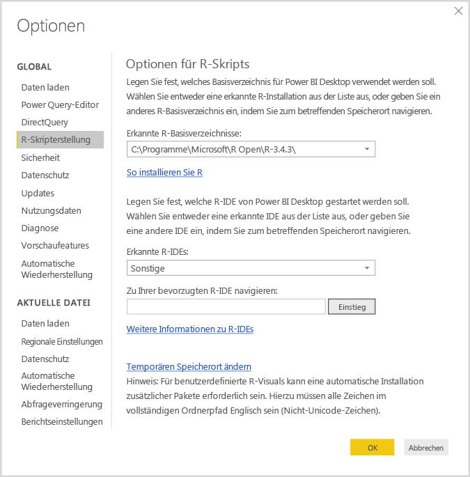
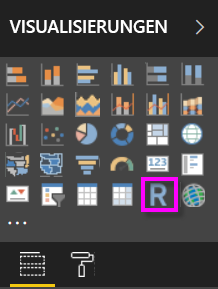
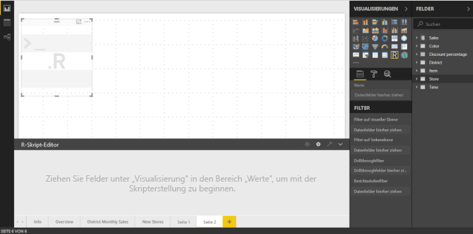
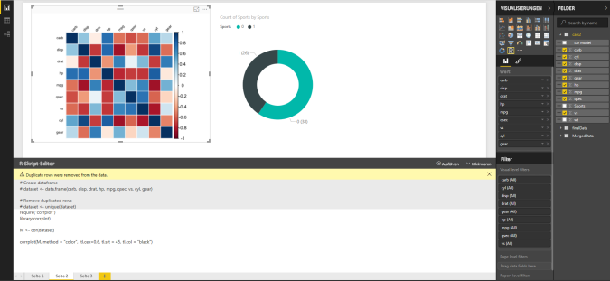
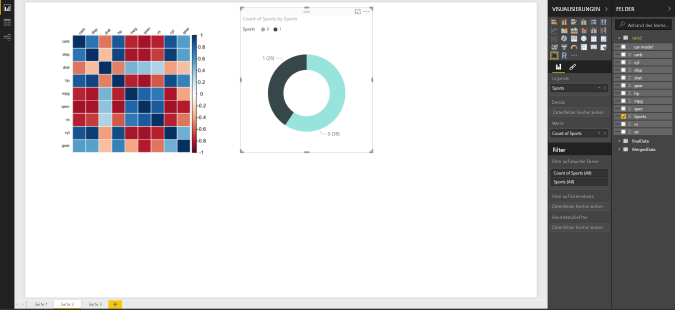
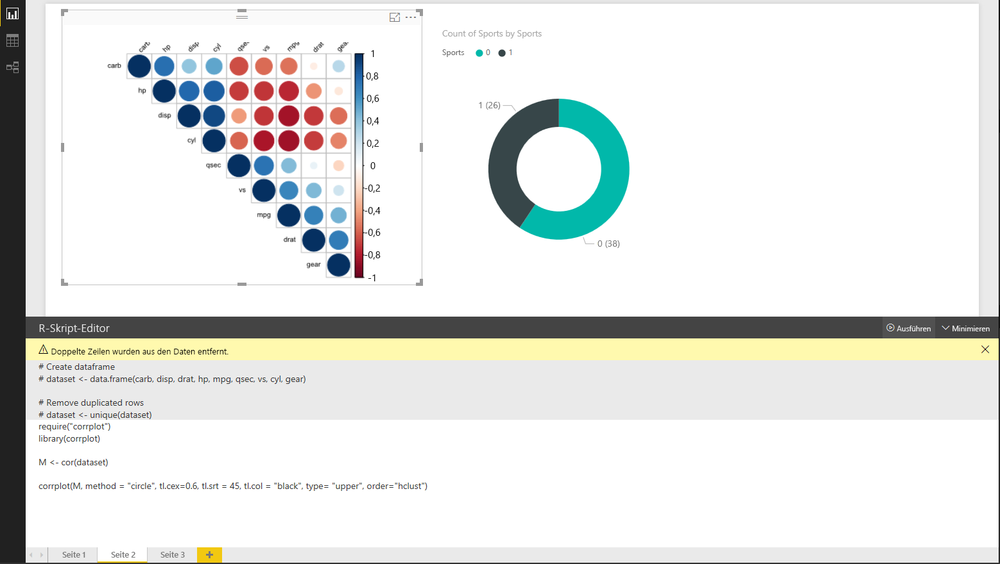
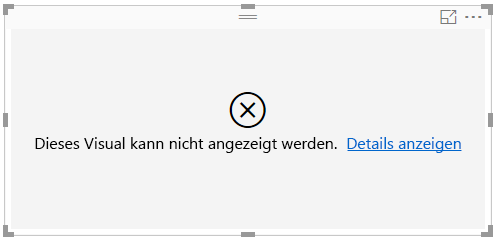

# Erstellen von Power BI-Visualisierungen mithilfe von R
Mit **Power BI Desktop** können Sie **R** jetzt zum Visualisieren Ihrer Daten verwenden.

## Installieren von R
Das **R**-Engine ist in **Power BI Desktop** nicht enthalten und wird von Power BI Desktop nicht bereitgestellt oder installiert. Damit Sie R-Skripts in **Power BI Desktop** ausführen können, müssen Sie **R** gesondert auf dem lokalen Computer installieren. **R** können Sie an vielen Stellen im Internet kostenlos herunterladen und installieren, u.a. von der [Revolution R Open-Downloadseite](https://mran.revolutionanalytics.com/download/) und aus dem [CRAN-Repository](https://cran.r-project.org/bin/windows/base/). Die aktuelle Version der R-Skripterstellung in **Power BI Desktop** unterstützt Unicode-Zeichen ebenso wie Leerzeichen (leere Zeichen) im Installationspfad.

## Aktivieren von R-Visuals
Zum Aktivieren von R-Visualisierungen wählen Sie **Datei > Optionen und Einstellungen > Optionen** aus. Stellen Sie anschließend sicher, dass auf der Seite **Optionen** im Abschnitt **R-Skripterstellung** des Fensters **Optionen** die lokale Installation von R angegeben ist, wie in der folgenden Abbildung dargestellt. In der folgenden Abbildung lautet der lokale Installationspfad von R **C:\Program Files\R\R-3.2.0**. Dieser Pfad ist im Textfeld explizit angegeben. Stellen Sie sicher, dass der angezeigte Pfad die lokale Installation von R, die von **Power BI Desktop** verwendet werden soll, richtig wiedergibt.
   
   

Nachdem Sie Ihre Installation von R angegeben haben, können Sie mit dem Erstellen von R-Visualisierungen beginnen.

## Erstellen von R-Visuals in Power BI Desktop
1. Wählen Sie zum Hinzufügen eines visuellen R-Elements das Symbol **visuelle R-Elemente** im Bereich **Visualisierung**, wie im folgenden Bild dargestellt.
   
   

   Wenn Sie einem Bericht ein visuelles R-Element hinzufügen, führt **Power BI Desktop** Folgendes aus:
   
   - Im Berichtszeichenbereich wird ein Platzhalterbild für ein R-Visual angezeigt.
   
   - Am unteren Rand des mittleren Bereichs wird der **R-Skript-Editor** angezeigt.
   
   

2. Fügen Sie anschließend wie in jeder anderen **Power BI Desktop**-Visualisierung dem Abschnitt **Werte** im Bereich **Felder** Felder hinzu, die im R-Skript verwendet werden sollen. 
    
    Für Ihr R-Skript sind nur Felder verfügbar, die dem Bereich **Felder** hinzugefügt wurden. Sie können im Bereich **Felder** neue Felder hinzufügen und nicht benötigte Felder entfernen, während Sie das R-Skript im **R-Skript-Editor von Power BI Desktop** bearbeiten. **Power BI Desktop** erkennt automatisch, welche Felder hinzugefügt oder entfernt wurden.
   
   > [!NOTE]
   > Der Standardaggregationstyp für R-Visuals lautet *Nicht zusammenfassen*.
   > 
   > 
   
3. Jetzt können Sie die Daten verwenden, die Sie zum Erstellen einer Zeichnung ausgewählt haben. 

    Während Sie Felder auswählen, generiert der **R-Skript-Editor** unterstützenden, gebundenen R-Skript-Code basierend auf Ihrer Auswahl im grauen Abschnitt im oberen Bereich des Editors. Wenn Sie zusätzliche Felder auswählen oder entfernen, wird im R-Skript-Editor automatisch Unterstützungscode entsprechend generiert bzw. entfernt.
   
   Im Beispiel in der folgenden Abbildung wurden drei Felder ausgewählt: „hp“, „gear“ und „drat“. Aufgrund dieser Auswahl generiert der R-Skript-Editor den folgenden Bindungscode:
   
   * Ein Datenrahmen mit dem Namen **dataset** wurde erstellt.
     * Dieser Datenrahmen besteht aus den vom Benutzer ausgewählten Feldern.
   * Die Standardaggregation lautet *Nicht zusammenfassen*.
   * Ähnlich wie bei Tabellenvisualisierungen werden Felder gruppiert, und doppelte Zeilen werden nur einmal angezeigt.
   
   
   
   > [!TIP]
   > In bestimmten Fällen sind Gruppierungen möglicherweise nicht erwünscht, oder es sollen alle Zeilen, einschließlich doppelter Zeilen, angezeigt werden. In diesem Fall können Sie dem Dataset ein Indexfeld hinzufügen, sodass alle Zeilen als eindeutig betrachtet werden und keine Gruppierung erfolgt.
   > 
   > 
   
   Der generierte Datensatz wird als **Dataset** bezeichnet, und Sie können auf die ausgewählten Spalten über ihre Namen zugreifen. Greifen Sie beispielsweise auf das Feld „gear“ zu, indem Sie *dataset$gear* in Ihr R-Skript schreiben. Verwenden Sie für Felder mit Leerzeichen oder Sonderzeichen einfache Anführungszeichen.

4. Mit dem Datenrahmen, der automatisch anhand der von Ihnen ausgewählten Felder generiert wurde, können Sie ein R-Skript zum Erzeugen von Zeichnungen auf dem R-Standardgerät schreiben. Wenn das Skript abgeschlossen ist, wählen Sie **Ausführen** auf der Titelleiste des **R-Skript-Editors** aus (**Ausführen** befindet sich auf der rechten Seite der Titelleiste).
   
    Bei Auswahl von **Ausführen** identifiziert **Power BI Desktop** die Zeichnung und stellt sie im Zeichenbereich dar. Da der Vorgang in der lokalen R-Installation ausgeführt wird, stellen Sie sicher, dass die erforderlichen Pakete installiert sind.
   
   **Power BI Desktop** zeichnet die Visualisierung neu, wenn eines der folgenden Ereignisse eintritt:
   
   * Wenn Sie auf der Titelleiste des **R-Skript-Editors** **Ausführen** auswählen.
   * Bei jedem Ändern der Daten durch Aktualisieren, Filtern oder Hervorheben von Daten.

     Die folgende Abbildung zeigt ein Beispiel für den Korrelationszeichnungscode, wobei die Korrelationen zwischen Attributen verschiedener Autotypen gezeichnet werden.

     

5. Um eine größere Ansicht der Visualisierungen zu erhalten, können Sie den **R-Skript-Editor**minimieren. Selbstverständlich können Sie die Korrelationszeichnung wie andere Visuals in **Power BI Desktop** kreuzfiltern, indem Sie im Ringdiagrammvisual (im obigen Beispielbild die runden Visuals auf der rechten Seite) nur Sportwagen auswählen.

    

6. Sie können auch das R-Skript ändern, um die Visualisierung anzupassen, und die Funktionsvielfalt von R nutzen, indem Sie dem Zeichenbefehl Parameter hinzufügen.

    Der ursprüngliche Zeichenbefehl lautete wie folgt:

    corrplot(M, method = "color",  tl.cex=0.6, tl.srt = 45, tl.col = "black")

    Mit einigen Änderungen im R-Skript lautet der Befehl jetzt folgendermaßen:

    corrplot(M, method = "circle", tl.cex=0.6, tl.srt = 45, tl.col = "black", type= "upper", order="hclust")

    Deshalb zeichnet jetzt das visuelle R-Element Kreise, berücksichtigt nur die obere Hälfte und ordnet die Matrix neu an, um korrelierte Attribute zu gruppieren, wie in der folgenden Abbildung gezeigt.

    

    Wenn ein R-Skript ausgeführt wird, das einen Fehler verursacht, wird das visuelle R-Element nicht gezeichnet, und im Zeichenbereich wird eine Fehlermeldung angezeigt. Um Informationen zu dem Fehler zu erhalten, wählen Sie in der Fehlermeldung des visuellen R-Elements **Details anzeigen** aus.

    

    > **R-Skript-Sicherheit:** R-Visualisierungen werden aus R-Skripts erstellt, die Code mit Sicherheits- oder Datenschutzrisiken enthalten können. Wenn ein Benutzer ein R-Visual zum ersten Mal aufruft oder damit interagiert, wird eine Sicherheitswarnmeldung angezeigt. Aktivieren Sie visuelle R-Elemente nur dann, wenn Sie dem Autor und der Quelle vertrauen, oder wenn Sie die zugehörigen Skripts überprüft und nachvollzogen haben.
    > 
    > 

## Bekannte Einschränkungen
Für visuelle R-Elemente in **Power BI Desktop** ergeben sich einige Einschränkungen:

* Beschränkungen der Datengröße – die vom visuellen R-Element zum Zeichnen verwendeten Daten sind auf 150.000 Zeilen beschränkt. Bei Auswahl von mehr als 150.000 Zeilen werden nur die oberen 150.000 Zeilen verwendet, und im Bild wird eine Meldung angezeigt.
* Beschränkung der Berechnungszeit: Wenn die Berechnung des visuellen R-Elements 5 Minuten überschreitet, wird die Ausführung aufgrund der Zeitüberschreitung abgebrochen und eine Fehlermeldung angezeigt.
* Beziehungen – wie bei anderen Power BI Desktop-Visualisierungen tritt ein Fehler auf, wenn Datenfelder aus unterschiedlichen Tabellen ausgewählt werden, zwischen denen keine Beziehung definiert ist.
* Visuelle R-Elemente werden aktualisiert, wenn Daten aktualisiert, gefiltert oder hervorgehoben werden. Das Bild selbst ist jedoch nicht interaktiv und kann nicht als Quelle für die Kreuzfilterung verwendet werden.
* Visuelle R-Elemente reagieren auf das Hervorheben anderer Visualisierungen. Sie können jedoch nicht auf visuelle R-Elemente klicken, um eine Kreuzfilterung anderer Elemente auszuführen.
* Nur auf dem R-Standardanzeigegerät erzeugte Zeichnungen werden im Zeichenbereich ordnungsgemäß angezeigt. Verwenden Sie nicht explizit ein anderes R-Anzeigegerät.
* In diesem Release werden RRO-Installationen von der 32-Bit-Version von Power BI Desktop nicht automatisch erkannt. Daher müssen Sie den Pfad zum R-Installationsverzeichnis unter **Optionen und Einstellungen > Optionen > R-Skripterstellung** manuell angeben.

## Nächste Schritte
Betrachten Sie die folgenden zusätzlichen Informationen über R in Power BI.

* [Ausführen von R-Skripts in Power BI Desktop](desktop-r-scripts.md)
* [Verwenden einer externen R-IDE mit Power BI](desktop-r-ide.md)

