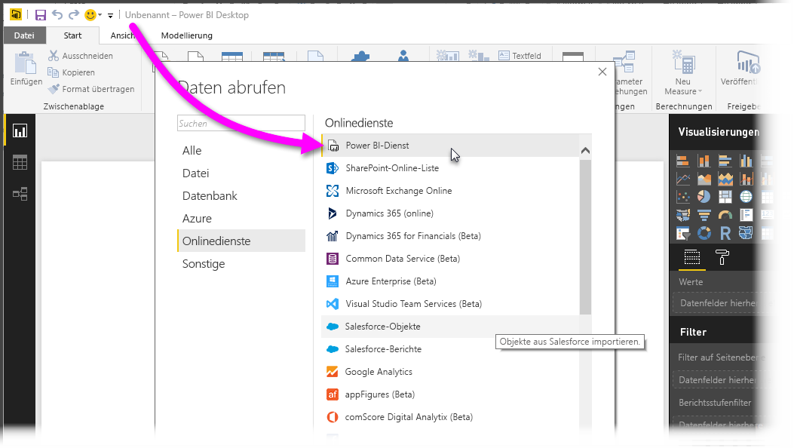
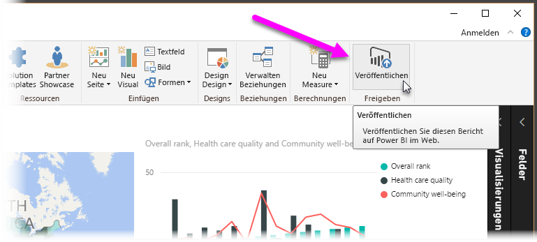
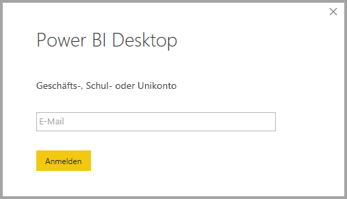
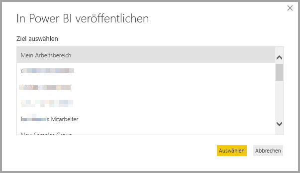
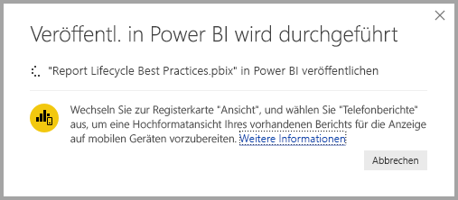
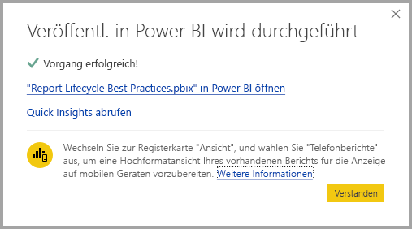
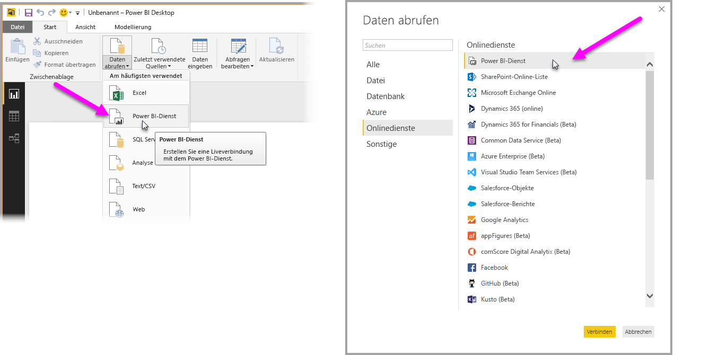
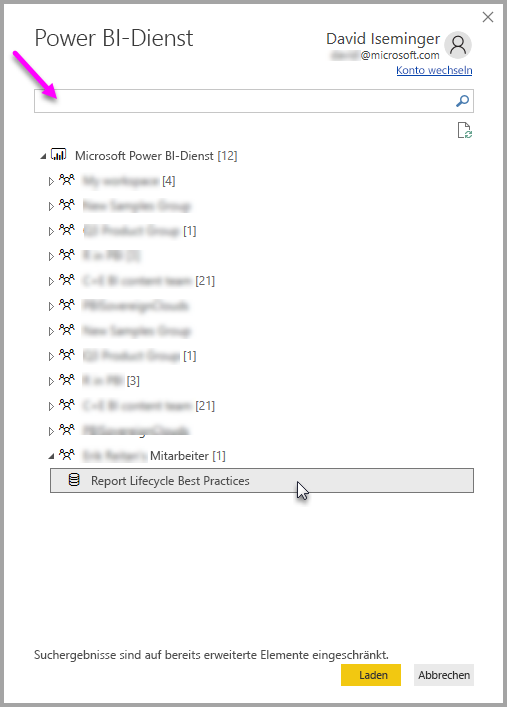
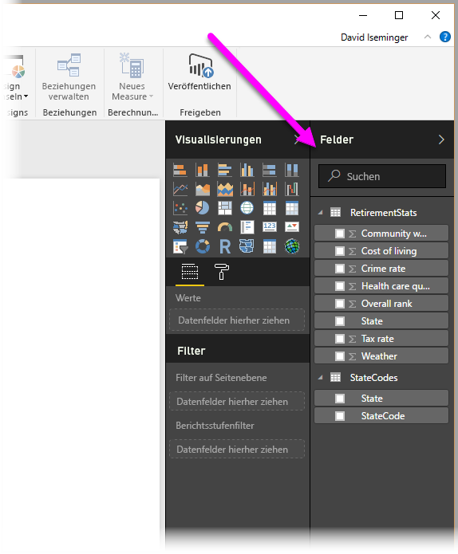

# Herstellen einer Verbindung mit Datasets im Power BI-Dienst über Power BI Desktop
Sie können eine Liveverbindung mit einem gemeinsam genutzten Dataset im Power BI-Dienst herstellen und auf Grundlage des gleichen Datasets viele verschiedene Berichte erstellen. Sie können also in Power BI Desktop ein optimal auf Ihre Anforderungen abgestimmtes Datenmodell erstellen und für den Power BI-Dienst veröffentlichen. Dadurch können Sie und andere Benutzer dann zahlreiche verschiedene Berichte (in separaten PBIX-Dateien) erstellen, die auf diesem gemeinsamen Datenmodell basieren. Das Feature heißt **Liveverbindung mit Power BI-Dienst**.

Dieser Artikel geht auf die zahlreichen Vorteile des Features sowie auf bewährte Methoden ein. Es sind allerdings auch ein paar Punkte und Einschränkungen zu berücksichtigen. Diese finden Sie am Ende des Artikels.

## Verwenden einer Liveverbindung mit dem Power BI-Dienst für die Verwaltung des Berichtslebenszyklus
Eine der Herausforderungen im Zusammenhang mit der Beliebtheit von Power BI liegt in der Verbreitung von Berichten, Dashboards und den jeweils zugrunde liegenden Datenmodellen. Der Grund: Sie können ganz einfach eindrucksvolle Berichte in **Power BI Desktop** erstellen, im **Power BI-Dienst** freigeben ([veröffentlichen](desktop-upload-desktop-files.md)) und anschließend auf der Grundlage dieser Datasets erstklassige Dashboards erstellen. Da diese Vorgehensweise von so vielen genutzt wird und dabei häufig die gleichen (oder zumindest sehr ähnliche) Datasets verwendet werden, lässt sich nicht mehr so einfach nachvollziehen, welcher Bericht denn nun auf welchem Dataset basiert – und wie aktuell das jeweilige Dataset ist. Das Feature **Liveverbindung mit Power BI-Dienst** ist die Antwort auf dieses Problem und macht das Erstellen, Freigeben und Erweitern von Berichten und Dashboards mit einem gemeinsamen Dataset einfacher und konsistenter.

### Erstellen und Freigeben eines von allen nutzbaren Datasets
Ein Beispiel: Anna ist Business Analyst in Ihrem Team und kann sehr gute Datenmodelle (auch Datasets genannt) erstellen. Dank ihres Know-hows kann Anna ein Dataset und einen Bericht erstellen und diesen anschließend über den **Power BI-Dienst** freigeben.

Alle sind von ihrem Bericht und von ihrem Dataset begeistert – und genau da beginnen die Probleme: Jeder in ihrem Team versucht, eine *eigene Version* dieses Datasets zu erstellen und anschließend seine eigenen Berichte für das Team freizugeben. Plötzlich enthält der Arbeitsbereich Ihres Teams im **Power BI-Dienst** zahlreiche verschiedene Berichte, die jeweils auf unterschiedlichen Datasets basieren. Welches davon ist auf dem neuesten Stand? Waren die Datasets identisch, oder doch nur annähernd gleich? Wo lagen die Unterschiede? Mit dem Feature **Liveverbindung mit Power BI-Dienst** lässt sich all das vermeiden. Im nächsten Abschnitt erfahren Sie, wie andere Benutzer das von Anna veröffentlichte Dataset für ihre eigenen Berichte verwenden können und wie Sie es allen Benutzern ermöglichen, ihre individuellen Berichte auf der Grundlage des gleichen fundierten, geprüften und veröffentlichten Datasets zu erstellen.

### Herstellen einer Liveverbindung mit einem Dataset des Power BI-Diensts
Nachdem Anna ihren Bericht (und das zugrunde liegende Dataset) erstellt hat, veröffentlicht sie ihn für den **Power BI-Dienst**, woraufhin er dort im Arbeitsbereich ihres Teams angezeigt wird. Damit steht er ab sofort allen Benutzern in ihrem Arbeitsbereich zur Verfügung.

Weitere Informationen zu Arbeitsbereichen finden Sie unter [App-Arbeitsbereiche](service-create-distribute-apps.md#app-workspaces).

Andere Mitglieder ihres Arbeitsbereichs können nun mithilfe des Features **Liveverbindung mit Power BI-Dienst** eine Liveverbindung mit dem von Anna freigegebenen Datenmodell herstellen eigene Berichte auf der Grundlage von *Annas ursprünglichem Dataset* erstellen.

In der folgenden Abbildung sehen Sie, wie Anna einen **Power BI Desktop-Bericht** erstellt und ihn (einschließlich seines Datenmodells) für den **Power BI-Dienst** veröffentlicht. Daraufhin können andere Benutzer in Annas Arbeitsbereich mithilfe des Features **Liveverbindung mit Power BI-Dienst** eine Verbindung mit ihrem Datenmodell herstellen und eigene Berichte auf der Grundlage von Annas Dataset erstellen.

> [!NOTE]
> Datasets werden nur innerhalb eines einzelnen Arbeitsbereichs freigegeben. Wenn Sie eine Liveverbindung mit dem Power BI-Dienst herstellen möchten, muss sich das Dataset, mit dem Sie die Verbindung herstellen, in einem gemeinsam genutzten Arbeitsbereich befinden, dem Sie selbst angehören.
> 
> 

## Schritt-für-Schritt-Anleitung zum Verwenden der Liveverbindung mit dem Power BI-Dienst
Nachdem Sie nun wissen, wie praktisch das Feature **Liveverbindung mit Power BI-Dienst** ist und wie Sie es als bewährte Methode für die Verwaltung des Berichtslebenszyklus verwenden können, erfahren Sie als Nächstes, welche Schritte erforderlich sind, um von Annas Bericht (und Dataset) zu einem freigegebenen Dataset zu gelangen, das von ihren Teamkollegen in ihrem Power BI-Arbeitsbereich verwendet werden kann.

### Veröffentlichen eines Power BI-Berichts und eines Datasets
Für die Berichtslebenszyklusverwaltung mithilfe des Features **Liveverbindung mit Power BI-Dienst** wird zunächst ein für die Teamkollegen interessanter Bericht (und ein Dataset) benötigt. Anna muss ihren Bericht also zunächst über **Power BI Desktop** **veröffentlichen**. Hierzu wählt sie in Power BI Desktop auf dem Menüband **Start** die Option **Veröffentlichen** aus.

Falls sie nicht bei ihrem Power BI-Dienstkonto angemeldet ist, erscheint eine Anmeldeaufforderung.

Hier kann sie den gewünschten Zielarbeitsbereich für die Veröffentlichung des Berichts und des Datasets auswählen. Nicht vergessen: Nur Mitglieder mit Zugriff auf den Arbeitsbereich, in dem ein Bericht veröffentlicht wird, können über das Feature **Liveverbindung mit Power BI-Dienst** auf das entsprechende Dataset zugreifen.

Der Veröffentlichungsprozess beginnt und kann in **Power BI Desktop** nachverfolgt werden.

Nach Abschluss des Vorgangs werden in **Power BI Desktop** eine Erfolgsmeldung, einige Links zum eigentlichen Bericht im **Power BI-Dienst** sowie ein Link zu **Schnelleinblicken** für den Bericht angezeigt.

Als Nächstes erfahren Sie, wie Teamkollegen mit Zugriff auf den Arbeitsbereich, in dem der Bericht und das Dataset veröffentlichten wurden, eine Verbindung mit dem Dataset herstellen und eigene Berichte erstellen können.

### Herstellen einer Liveverbindung zwischen dem Power BI-Dienst und dem veröffentlichten Dataset
Um eine Verbindung mit dem veröffentlichten Bericht herzustellen und einen eigenen Bericht auf der Grundlage des veröffentlichten Datasets zu erstellen, wählen Sie in **Power BI Desktop** auf dem Menüband **Start** die Option **Daten abrufen** und anschließend **Power BI-Dienst** aus. Alternativ können Sie auch die Befehlsfolge **Daten abrufen > Onlinedienste > Power BI-Dienst** verwenden.

Falls Sie noch nicht bei Power BI angemeldet sind, erscheint eine Anmeldeaufforderung. In dem Fenster, das nach der Anmeldung angezeigt wird, sehen Sie die Arbeitsbereiche, denen Sie angehören. Hier können Sie den Arbeitsbereich mit dem Dataset auswählen, mit dem Sie eine **Liveverbindung mit dem Power BI-Dienst** herstellen möchten.

Die Zahl in Klammern neben dem Arbeitsbereich gibt an, wie viele freigegebene Datasets in der jeweiligen Arbeitsgruppe verfügbar sind. Über das Dreieck auf der linken Seite können Sie den Arbeitsbereich erweitern und das freigegebene Dataset auswählen.

Ein paar Hinweise zu Elementen aus dem obigen Fenster für die **Liveverbindung mit dem Power BI-Dienst**:

* Sie können nach einem freigegebenen Dataset suchen, die Suchergebnisse sind jedoch auf die erweiterten Elemente beschränkt. Nicht erweiterte Arbeitsbereiche werden also nicht berücksichtigt.
* Sie können mehrere Arbeitsbereiche erweitern, um Ihre Suche auszudehnen.

Wenn Sie in dem Fenster die Option **Laden** auswählen, wird eine Liveverbindung mit dem ausgewählten Dataset hergestellt. Das bedeutet, dass die angezeigten Daten (also die Felder und ihre Werte) in Echtzeit in **Power BI Desktop** geladen werden.

Nun können Sie (und andere) auf der Grundlage des gleichen Datasets benutzerdefinierte Berichte erstellen und freigeben. Dadurch kann ein einzelner kompetenter Benutzer (wie Anna aus unserem Beispiel) ein wohlgeformtes Dataset erstellen und zahlreichen Teamkollegen die Verwendung des freigegebenen Datasets ermöglichen, damit diese ihre eigenen Berichte erstellen können.

> [!NOTE]
> Wenn Sie mithilfe einer Liveverbindung mit dem **Power BI-Dienst** Berichte auf Grundlage eines Datasets erstellen, können Sie den erstellten Bericht nur in dem Arbeitsbereich des Power BI-Diensts veröffentlichen, der das verwendete Dataset enthält.
> 
> 

## Einschränkungen und Überlegungen
Beim Verwenden des Features **Liveverbindung mit Power BI-Dienst** sind einige Einschränkungen und Überlegungen zu berücksichtigen.

* Mitglieder eines Arbeitsbereichs, die nur über mit Leseberechtigung verfügen, können aus **Power BI Desktop** keine Verbindung mit Datasets herstellen.
* Nur Benutzer, die dem gleichen Arbeitsbereich des **Power BI-Diensts** angehören, können mithilfe des Features **Liveverbindung mit Power BI-Dienst** eine Verbindung mit einem veröffentlichten Dataset herstellen. Benutzer können mehreren Arbeitsbereichen angehören (und in der Praxis ist das auch häufig der Fall).
* Da es sich hierbei um eine Liveverbindung handelt, sind die Navigation nach links sowie die Modellierung deaktiviert – ähnlich wie bei einer Verbindung mit **SQL Server Analysis Services**.
* Da es sich hierbei um eine Liveverbindung handelt, werden RLS (Row- and Role-Level Security; Sicherheit auf Zeilen- und Rollenebene), OneDrive for Business und ähnliche Verbindungsmerkmale erzwungen – genau wie bei einer Verbindung mit **SQL Server Analysis Services**.
* Wenn Sie im **Power BI-Dienst** das Dataset auswählen, mit dem eine Verbindung hergestellt werden soll, gilt das Suchfeld nur für Arbeitsbereiche, die erweitert wurden.
* Wenn der Besitzer die freigegebene PBIX-Originaldatei ändert, werden das Dataset und der im **Power BI-Dienst** freigegebene Bericht überschrieben.
* Die Mitglieder eines Arbeitsbereichs können den ursprünglich freigegebenen Bericht nicht ersetzen. Wenn Sie es dennoch versuchen, wird eine Warnung angezeigt, in der Sie zum Umbenennen der Datei und Veröffentlichen des Berichts aufgefordert werden.
* Wenn Sie das freigegebene Dataset im **Power BI-Dienst** löschen, funktionieren andere **Power BI Desktop-Dateien** (PBIX-Dateien) nicht mehr ordnungsgemäß oder zeigen keine visuellen Elemente mehr an.
* Bei Verwendung von Inhaltspaketen müssen Sie zunächst eine Kopie des Inhaltspakets erstellen, bevor Sie es als Grundlage für die Freigabe eines PBIX-Berichts und Datasets für den **Power BI-Dienst** verwenden.
* Wenn Inhaltspakete aus *Meine Organisation* kopiert wurden, können Sie den im Dienst erstellten Bericht und/oder einen Bericht, der beim Kopieren eines Inhaltspakets mit einer Liveverbindung erstellt wurde, nicht ersetzen. Wenn Sie es dennoch versuchen, wird eine Warnung angezeigt, in der Sie zum Umbenennen der Datei und Veröffentlichen des Berichts aufgefordert werden. In diesem Fall können Sie nur veröffentlichte Berichte mit Liveverbindung ersetzen.
* Wenn Sie mithilfe einer Liveverbindung mit dem **Power BI-Dienst** Berichte auf Grundlage eines Datasets erstellen, können Sie den erstellten Bericht nur in dem Arbeitsbereich des Power BI-Diensts veröffentlichen, der das verwendete Dataset enthält.
* Nach dem Löschen eines freigegebenen Datasets im **Power BI-Dienst** können Sie nicht mehr über **Power BI Desktop** auf dieses Dataset zugreifen.

