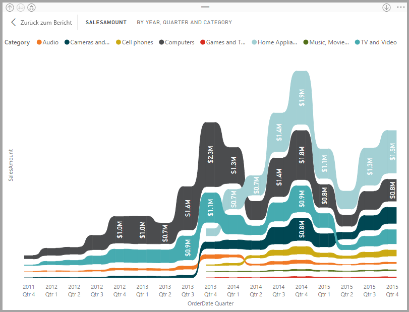
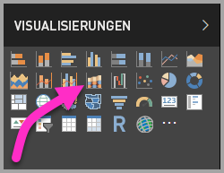
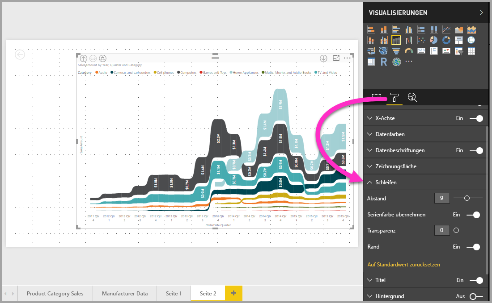

# Verwenden von Menübanddiagrammen in Power BI
Mit den Menübanddiagrammen in **Power BI** können Sie Daten visualisieren und schnell bestimmen, welche Kategorie von Daten den höchsten Rang (größten Wert) hat. Menübanddiagramme eignen sich gut zum Anzeigen von Rangänderungen, wobei der höchste Rang (Wert) immer für jeden Zeitraum oben angezeigt wird. Menübanddiagramme sind in **Power BI Desktop** ab dem Release von September 2017 und in nachfolgenden Updates des **Power BI-Diensts** verfügbar.

## Erstellen eines Menübanddiagramms
Wählen Sie zum Erstellen eines leeren Diagramms die Option **Menübanddiagramm** im Bereich **Visualisierungen** aus.

Menübanddiagramme verknüpfen eine Kategorie von Daten über das visualisierte Zeitkontinuum mithilfe von Bändern, sodass Sie den Rang einer bestimmten Kategorie während der gesamten Spanne der X-Achse (in der Regel die Zeitachse) erkennen können.

## Formatieren eines Menübanddiagramms
Wenn Sie ein Menübanddiagramm erstellen, stehen Ihnen im Abschnitt **Format** des Bereichs **Visualisierungen** Formatierungsoptionen zur Verfügung. Die Formatierungsoptionen für Menübanddiagramme ähneln denen für ein gestapeltes Säulendiagramm, mit zusätzlichen speziellen Formatierungsoptionen für die Bänder.

Mit den Formatierungsoptionen für Menübanddiagramme können Sie Folgendes anpassen:

* Mit **Abstand** können Sie den Abstand zwischen Bändern anpassen. Die Zahl ist der Prozentwert der maximalen Höhe der Spalte.
* Mit **Serienfarbe abgleichen** können Sie die Farbe der Bänder an die Reihenfarbe anpassen. Wenn die Option deaktiviert ist, sind die Bänder grau.
* **Transparenz** gibt die Transparenz der Bänder an. Der Standardwert ist 30.
* Mit **Rand** können Sie am oberen und unteren Rand der Bänder einen dunklen Rahmen platzieren. „Rand“ ist standardmäßig deaktiviert.

## Nächste Schritte
Weitere Informationen zu **Power BI Desktop** und den ersten Schritten finden Sie in den folgenden Artikeln.

* [Erste Schritte mit Power BI Desktop](desktop-getting-started.md)
* [Übersicht zu Abfragen mit Power BI Desktop](desktop-query-overview.md)
* [Datenquellen in Power BI Desktop](desktop-data-sources.md)
* [Verbinden mit Daten in Power BI Desktop](desktop-connect-to-data.md)
* [Strukturieren und Kombinieren von Daten mit Power BI Desktop](desktop-shape-and-combine-data.md)
* [Allgemeine Abfrageaufgaben in Power BI Desktop](desktop-common-query-tasks.md)   

