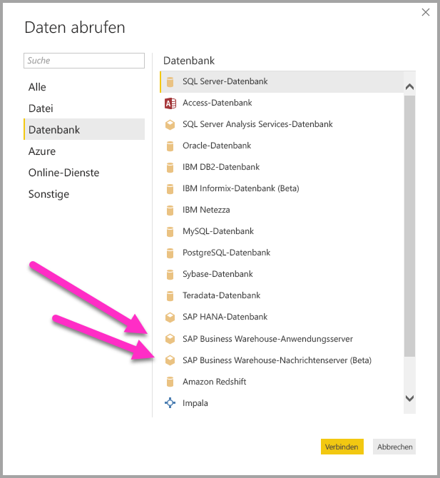
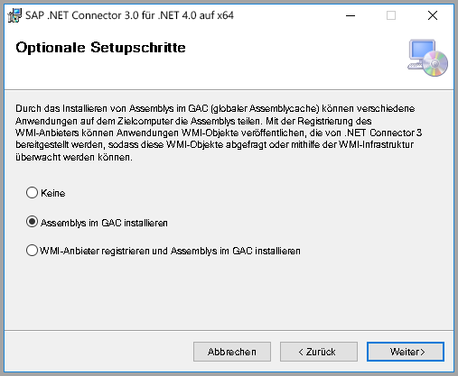
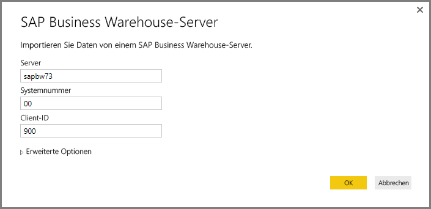
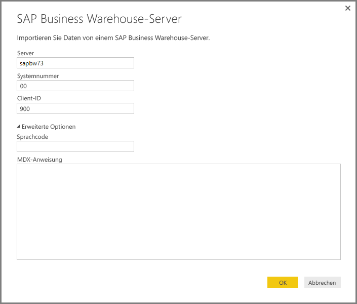
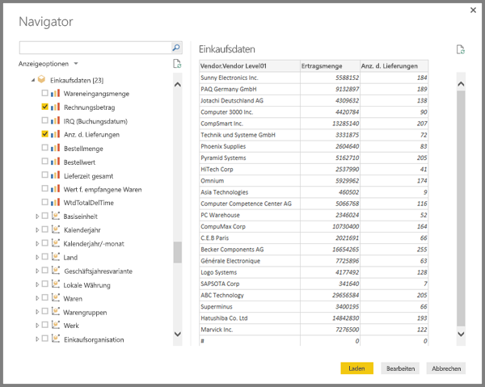
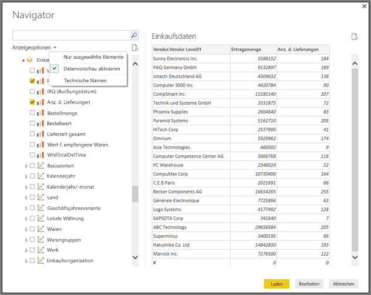
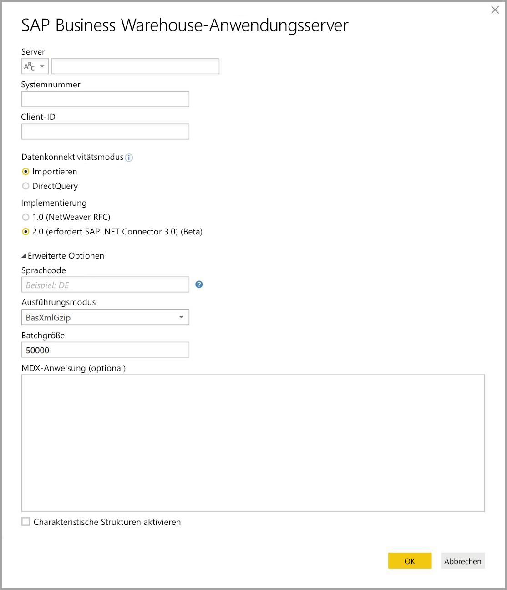
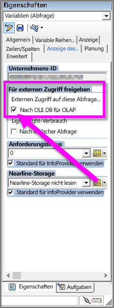

# Verwendung des SAP BW-Connectors in Power BI Desktop
Mit Power BI Desktop können Sie auf Daten aus **SAP Business Warehouse (BW)** zugreifen.

Weitere Informationen darüber, wie SAP-Kunden von der Verknüpfung von Power BI mit ihren vorhandenen SAP Business Warehouse-Systemen (BW) profitieren können, finden Sie im [Whitepaper von Power BI und SAP](https://aka.ms/powerbiandsapbw). Weitere Informationen zur Verwendung von DirectQuery mit SAP BW finden Sie im Artikel [DirectQuery und SAP Business Warehouse (BW)](desktop-directquery-sap-bw.md).

Seit dem **Power BI Desktop**-Release vom Juni 2018 (allgemein verfügbar mit dem Release von Oktober 2018) können Sie den SAP BW-Connector mit einer Implementierung nutzen, die die Leistung und die Funktionen erheblich verbessert. Diese aktualisierte Version des SAP BW-Connectors wurde von Microsoft entwickelt und heißt **Implementierung 2.0**. Sie können entweder Version 1 (v1) des **SAP BW-Connectors** oder die **Implementierung 2.0 des SAP-Connectors** verwenden. In den folgenden Abschnitten wird die Installation der einzelnen Versionen beschrieben. Sie können den einen oder den anderen Connector auswählen, wenn Sie über Power BI Desktop eine Verbindung zu SAP BW herstellen.

Es wird empfohlen, nach Möglichkeit die **Implementierung 2.0 des SAP-Connectors** zu verwenden.

## Installation von Version 1 des SAP BW-Connectors
Es wird empfohlen, nach Möglichkeit die Implementierung 2.0 des SAP-Connectors zu verwenden (siehe die Schritte im folgenden Abschnitt). In diesem Abschnitt wird die Installation von Version 1 des **SAP BW-Connectors** beschrieben. Führen Sie dazu die folgenden Schritte aus:

1. Installieren Sie die **SAP NetWeaver**-Bibliothek auf dem lokalen Computer. Sie erhalten die **SAP Netweaver**-Bibliothek von Ihrem SAP-Administrator oder direkt über das [SAP Software Download Center](https://support.sap.com/swdc). Da die Struktur des **SAP Software Download Center** regelmäßig überarbeitet wird, können wir keine genaueren Angaben zu dieser Website machen. Diese **SAP NetWeaver**-Bibliothek ist in der Regel auch in der Installation der SAP Client Tools enthalten.
   
   Sie können nach *SAP-Hinweis 1025361* suchen, um den Downloadpfad für die neueste Version zu ermitteln. Stellen Sie sicher, dass die Architektur für die **SAP NetWeaver**-Bibliothek (32 Bit oder 64 Bit) mit Ihrer Installation von **Power BI Desktop** übereinstimmt, und installieren Sie dann alle Dateien im **SAP NetWeaver RFC SDK** gemäß dem SAP-Hinweis.
2. Das Dialogfeld **Daten abrufen** enthält einen Eintrag für **SAP Business Warehouse-Anwendungsserver** und **SAP Business Warehouse-Nachrichtenserver** in der Kategorie **Datenbank**.
   
   

## Installation der Implementierung 2.0 des SAP-Connectors

Die **Implementierung 2.0** des SAP-Connectors erfordert den SAP .NET Connector 3.0. Sie können den [SAP .NET Connector 3.0 von der SAP-Website herunterladen](https://support.sap.com/en/product/connectors/msnet.html). Klicken Sie auf den folgenden Link:

* [SAP .NET Connector 3.0](https://support.sap.com/en/product/connectors/msnet.html)

Um auf den Download zugreifen zu können, ist ein gültiger S-User erforderlich. Kunden sollten sich an das SAP Basis-Team wenden, um den SAP .NET Connector 3.0 zu erhalten. 

Der Connector ist als 32-Bit- und 64-Bit-Version verfügbar, und Benutzer *müssen* sich für diejenige entscheiden, die mit ihrer Power BI Desktop-Installation kompatibel ist. Bei Redaktionsschluss dieses Dokuments waren auf der Website zwei Versionen (für .NET Framework 4.0) aufgeführt:

* SAP-Connector für Microsoft .NET 3.0.20.0 für Windows 32-Bit (x86) als ZIP-Datei (6,896 KB), 16. Januar 2018
* SAP-Connector für Microsoft .NET 3.0.20.0 für Windows 64-Bit (x64) als ZIP-Datei (7,180 KB), 16. Januar 2018

Achten Sie bei der Installation im Fenster **Optional setup steps** (Optionale Setupschritte) darauf, die Option *Install assemblies to GAC* (Assemblys im globalen Assemblycache installieren) wie in der folgenden Abbildung gezeigt auszuwählen.

> [!NOTE]
> Die erste Version von SAP BW erfordert Netweaver-DLLs. Wenn Sie stattdessen die Implementierung 2.0 des SAP-Connectors verwenden, sind die Netweaver-DLLs nicht notwendig.

## Features von Version 1 des SAP BW-Connectors
Mit Version 1 des **SAP BW-Connectors** in Power BI Desktop können Sie Daten aus Ihren Cubes im **SAP Business Warehouse-Server** importieren oder DirectQuery verwenden. 

Weitere Informationen zum **SAP BW-Connector** und seiner Verwendung mit DirectQuery finden Sie im Artikel [DirectQuery und SAP Business Warehouse (BW)](desktop-directquery-sap-bw.md).

Geben Sie Werte für *Server*, *Systemnummer* und *Client-ID* ein, um eine Verbindung herzustellen.

Ferner können Sie zwei zusätzliche **erweiterte Optionen** angeben: Sprachcode und eine benutzerdefinierte MDX-Anweisung zur Ausführung auf dem angegebenen Server.

Wenn keine MDX-Anweisung angegeben wurde, wird Ihnen das Fenster **Navigator** angezeigt, das die Liste der Cubes, die auf dem Server verfügbar sind, darstellt sowie die Möglichkeit, einen Drilldown auszuführen und Elemente aus den verfügbaren Cubes auszuwählen, einschließlich Dimensionen und Measures. Power BI macht Abfragen und Cubes verfügbar, die wiederum über [BW Open Analysis Interface OLAP BAPIs](https://help.sap.com/saphelp_nw70/helpdata/en/d9/ed8c3c59021315e10000000a114084/content.htm) verfügbar gemacht wurden.

Wenn Sie ein oder mehrere Elemente aus dem Server auswählen, wird abhängig von ihrer Auswahl eine Vorschau der Ausgabetabelle erstellt.

Das Fenster **Navigator** bietet auch einige **Anzeigeoptionen**, mit denen Sie die folgenden Schritte ausführen können:

* **Anzeigen von *Nur ausgewählte Elemente* im Vergleich zu *Alle Elemente* (Standardansicht):** Diese Option ist zum Überprüfen des endgültigen Satzes ausgewählter Elemente nützlich. Um eine alternative Möglichkeit der Darstellung dieser Auswahl anzuzeigen, wählen Sie die *Spaltennamen* im Bereich *Vorschau* aus.
* **Datenvorschau aktivieren (Standardverhalten):** Sie können auch steuern, ob die Datenvorschau in diesem Dialogfeld angezeigt werden soll. Das Deaktivieren der Datenvorschau verringert die Serveraufrufe, da keine Daten für die Vorschau mehr angefordert werden.
* **Technische Namen:** SAP BW unterstützt das Konzept von *technischen Namen* für Objekte innerhalb eines Cubes. Durch technische Namen kann ein Cube-Besitzer *benutzerfreundliche* Namen für Cubeobjekte verfügbar machen, statt nur die *physischen Namen* für diese Objekte im Cube.

Nach dem Auswählen aller erforderlichen Objekte im **Navigator** können Sie entscheiden, was Sie als Nächstes tun möchten, indem Sie dazu eine der folgenden Schaltflächen unten auf dem Fenster **Navigator** auswählen:

* Durch klicken auf **Laden** veranlassen Sie, dass der gesamten Satz von Zeilen für die Ausgabetabelle in das Power BI Desktop-Datenmodell geladen wird. Sie gelangen daraufhin zur Ansicht **Bericht**, wo Sie beginnen können, die Daten zu visualisieren oder weitere Änderungen mithilfe der Ansicht **Daten** oder **Beziehungen** durchzuführen.
* Wenn Sie **Bearbeiten** auswählen, wird der **Abfrage-Editor** geöffnet, in dem Sie zusätzliche Schritte zur Datentransformation und zum Filtern ausführen können, bevor der gesamte Satz von Zeilen in das Datenmodell für Power BI Desktop geladen wird.

Denken sie daran, dass Sie zusätzlich zum Importieren von Daten aus **SAP BW** Cubes, Daten aus einer Vielzahl anderer Datenquellen in Power BI Desktop importieren können und sie dann zu einem einzelnen Bericht zusammenfassen können. Dies stellt alle möglichen interessante Szenarios für die Berichterstellung und Analyse auf der Basis von **SAP BW**-Daten dar.

## Verwenden der Implementierung 2.0 des SAP BW-Connectors

Sie müssen eine neue Verbindung herstellen, um die Implementierung 2.0 des SAP BW-Connectors zu verwenden. Gehen Sie wie folgt vor, um die neue Verbindung herzustellen:

1. Wählen Sie im Fenster **Daten abrufen** entweder **SAP Business Warehouse-Anwendungsserver** oder **SAP Business Warehouse-Nachrichtenserver** aus.

2. Anschließend wird das neue Verbindungsdialogfeld angezeigt, in dem Sie die Implementierung auswählen können. Wenn Sie sich für die **Implementierung 2.0** entscheiden, wie in der folgenden Abbildung gezeigt, werden die Optionen „Ausführungsmodus“, „Batchgröße“ und „Charakteristische Strukturen aktivieren“ aktiviert.

    

3. Klicken Sie auf **OK**. Die **Navigator**-Benutzeroberfläche ist daraufhin identisch mit der, die im vorherigen Abschnitt für SAP BW-Connector Version 1 beschrieben wurde. 

### Neue Optionen für die Implementierung 2.0 

Die Implementierung 2.0 unterstützt die folgenden Optionen:

1. **ExecutionMode**: gibt die MDX-Schnittstelle an, mit der Abfragen auf dem Server ausgeführt werden. Folgende Optionen sind zulässig:

        a. SapBusinessWarehouseExecutionMode.BasXml
        b. SapBusinessWarehouseExecutionMode.BasXmlGzip
        c. SapBusinessWarehouseExecutionMode.DataStream

    Der Standardwert für diese Option ist SapBusinessWarehouseExecutionMode.BasXmlGzip.

    Die Verwendung von *SapBusinessWarehouseExecutionMode.BasXmlGzip* kann die Leistung bei hoher Latenz für große Datasets steigern.

2. **BatchSize**: gibt die maximale Anzahl von Zeilen an, die während der Ausführung einer MDX-Anweisung zu einem Zeitpunkt abgerufen werden. Eine kleine Anzahl von Zeilen bedeutet mehr Aufrufe des Servers, wenn ein großes Dataset abgerufen wird. Ist die Anzahl der Zeilen groß, kann es zu einer Leistungssteigerung kommen. Gleichzeitig können jedoch Speicherprobleme auf dem SAP BW-Server auftreten. Der Standardwert sind 50.000 Zeilen.

3. **EnableStructures**: ein logischer Wert, der angibt, ob charakteristische Strukturen erkannt werden. Der Standardwert für diese Option ist FALSE. Er beeinflusst die Liste der zur Auswahl stehenden Objekte und wird im Modus für native Abfragen nicht unterstützt.

Die Option **ScaleMeasures** ist seit dieser Implementierung veraltet. Ihr Verhalten entspricht jetzt der Einstellung *ScaleMeasures = FALSE*, d.h., sie zeigt immer nicht skalierte Werte an.

### Zusätzliche Verbesserungen für die Implementierung 2.0 

In der folgenden Aufzählung werden einige der Verbesserungen genannt, die in der neuen Implementierung enthalten sind:

* verbesserte Leistung.
* Abrufen mehrerer Millionen Datenzeilen und Feinabstimmung mithilfe des Batchgrößenparameters.
* Wechseln der Ausführungsmodi.
* Unterstützung für den komprimierten Modus. Besonders nützlich bei Verbindungen mit hoher Latenzzeit oder großen Datasets.
* verbesserte Erkennung von Date-Variablen.
* Datums- (ABAP-Typ: DATS) und Zeitdimensionen (ABAP-Typ: TIMS) können als Datumsangaben und Uhrzeiten statt als Textwerte verfügbar gemacht werden (experimentell).
* bessere Ausnahmebehandlung. Fehler in BAPI-Aufrufen werden jetzt gemeldet.
* Spaltenfaltung in den Modi „BasXml“ und „BasXmlGzip“. Wenn eine generierte MDX-Abfrage beispielsweise 40 Spalten abruft, die aktuelle Auswahl aber nur 10 benötigt, wird diese Anforderung an den Server übergeben, damit sie ein kleineres Dataset abruft.

### Ändern vorhandener Berichte zur Verwendung der Implementierung 2.0 

Das Ändern vorhandener Berichte zur Verwendung der **Implementierung 2.0** ist nur im Importmodus möglich und erfordert die folgenden, manuell auszuführenden Schritte:

1. Öffnen Sie einen vorhandenen Bericht, wählen Sie im Menüband **Abfragen bearbeiten** aus, und wählen Sie dann die SAP Business Warehouse-Abfrage aus, die Sie aktualisieren möchten.

2. Klicken Sie mit der rechten Maustaste auf die Abfrage, und wählen Sie **Erweiterter Editor** aus.

3. Ändern Sie im **Erweiterten Editor** den Aufruf „SapBusinessWarehouse.Cubes“ wie folgt: 

    a. Bestimmen Sie, ob die Abfrage bereits einen Optionsdatensatz enthält, der z.B. wie der im folgenden Beispiel dargestellte aussieht:

    

    b. Wenn dies der Fall ist, fügen Sie die Option „Implementierung 2.0“ hinzu, und entfernen Sie die Option „ScaleMeasures“, falls vorhanden, wie im Folgenden gezeigt:

    

    c. Wenn die Abfrage nicht bereits einen Optionsdatensatz enthält, fügen Sie ihn einfach hinzu. Beispielsweise, wenn sie über den folgenden verfügt:

    

    d. Ändern Sie ihn einfach in:

    

4. Es wurden alle Anstrengungen unternommen, damit die Implementierung 2.0 des SAP BW-Connectors mit Version 1 des SAP BW-Connectors kompatibel ist. Aufgrund der verschiedenen verwendeten SAP BW-MDX-Ausführungsmodi kann es jedoch Unterschiede geben. Versuchen Sie, zwischen den Ausführungsmodi zu wechseln, um Inkompatibilitäten zu beheben.

## Problembehandlung
In diesem Abschnitt werden die Fehlerbehebungsszenarios (und Lösungen) für die Arbeit mit dem **SAP BW**-Connector dargestellt.

1. Bei numerischen Daten aus **SAP BW** werden als Dezimaltrennzeichen Punkte statt Kommas zurückgegeben. Beispielsweise wird 1,000,000 als 1.000.000 zurückgegeben.
   
   **SAP BW** gibt Dezimaldaten entweder mit *,* (Komma) oder mit *.* (Punkt) als Dezimaltrennzeichen zurück. Um anzugeben, welches dieser Zeichen von **SAP BW** als Dezimaltrennzeichen verwendet werden soll, ruft der von **Power BI Desktop** verwendete Treiber *BAPI_USER_GET_DETAIL* auf. Dieser Aufruf gibt eine Struktur mit dem Namen **DEFAULTS** zurück, die das Feld *DCPFM* enthält, in dem die *Schreibweise des Dezimalformats* gespeichert wird. Es akzeptiert einen der folgenden drei Werte:
   
       ‘ ‘ (space) = Decimal point is comma: N.NNN,NN
       'X' = Decimal point is period: N,NNN.NN
       'Y' = Decimal point is N NNN NNN,NN
   
   Kunden, die dieses Problem gemeldet haben, stellten fest, dass der Aufruf von *BAPI_USER_GET_DETAIL* für einen bestimmten Benutzer (den Benutzer, für den die falschen Daten angezeigt werden) mit einer Fehlermeldung wie der folgenden fehlschlägt:
   
       You are not authorized to display users in group TI:
           <item>
               <TYPE>E</TYPE>
               <ID>01</ID>
               <NUMBER>512</NUMBER>
               <MESSAGE>You are not authorized to display users in group TI</MESSAGE>
               <LOG_NO/>
               <LOG_MSG_NO>000000</LOG_MSG_NO>
               <MESSAGE_V1>TI</MESSAGE_V1>
               <MESSAGE_V2/>
               <MESSAGE_V3/>
               <MESSAGE_V4/>
               <PARAMETER/>
               <ROW>0</ROW>
               <FIELD>BNAME</FIELD>
               <SYSTEM>CLNTPW1400</SYSTEM>
           </item>
   
   Um diesen Fehler zu beheben, müssen Benutzer den SAP-Administrator bitten, dem in Power BI verwendeten SAPBW-Benutzer das Recht zum Ausführen von *BAPI_USER_GET_DETAIL* zu gewähren. Außerdem sollten Sie sicherstellen, dass der Benutzer über den erforderlichen *DCPFM*-Wert verfügt, wie weiter oben in dieser Problembehandlungslösung beschrieben.
   
2. **Konnektivität für SAP BEx-Abfragen**
   
   Sie können **BEx**-Abfragen in Power BI Desktop ausführen, indem Sie eine bestimmte Eigenschaft aktivieren, wie in folgender Abbildung dargestellt:
   
   
   
3. Das Fenster **Navigator** zeigt keine Datenvorschau an, sondern gibt diese Fehlermeldung aus: *Der Objektverweis ist nicht auf eine Instanz eines Objekts festgelegt.*
   
   SAP-Benutzer müssen auf bestimmte BAPI-Funktionsmodule zugreifen, um Metadaten und Daten aus InfoProvider-Objekten von SAP BW abzurufen. Dazu gehören:
   * BAPI_MDPROVIDER_GET_CATALOGS
   * BAPI_MDPROVIDER_GET_CUBES
   * BAPI_MDPROVIDER_GET_DIMENSIONS
   * BAPI_MDPROVIDER_GET_HIERARCHYS
   * BAPI_MDPROVIDER_GET_LEVELS
   * BAPI_MDPROVIDER_GET_MEASURES
   * BAPI_MDPROVIDER_GET_MEMBERS
   * BAPI_MDPROVIDER_GET_VARIABLES
   * BAPI_IOBJ_GETDETAIL

   Um dieses Problem zu beheben, überprüfen Sie, ob der Benutzer auf die verschiedenen *MDPROVIDER*-Module und *BAPI_IOBJ_GETDETAIL* zugreifen kann. Für eine weiterführende Untersuchung dieses Problems und ähnlicher Probleme wählen Sie in den *Optionen* von Power BI Desktop im Fenster *Diagnose* die Option *Ablaufverfolgung aktivieren* aus. Versuchen Sie bei aktivierter Ablaufverfolgung erneut, Daten aus SAP BW abzurufen, und untersuchen Sie die Ablaufverfolgungsdatei auf weitere Details.

## Unterstützung der SAP BW-Verbindung

In der folgenden Tabelle wird die aktuelle Unterstützung für SAP BW veranschaulicht.

|Produkt  |Modus  |Authentifizierung  |Connector  |SNC-Bibliothek  |Unterstützt  |
|---------|---------|---------|---------|---------|---------|
|Power BI Desktop     |Beliebig         | Benutzer/Kennwort  | Anwendungsserver | N/V  | Ja  |
|Power BI Desktop     |Beliebig         | Windows          | Anwendungsserver | sapcrypto + gsskrb5/gx64krb5  | Ja  |
|Power BI Desktop     |Beliebig         | Windows per Identitätswechsel | Anwendungsserver | sapcrypto + gsskrb5/gx64krb5  | Ja  |
|Power BI Desktop     |Beliebig         | Benutzer/Kennwort        | Nachrichtenserver | N/V  | Ja  |
|Power BI Desktop     |Beliebig         | Windows        | Nachrichtenserver | sapcrypto + gsskrb5/gx64krb5  | Ja  |
|Power BI Desktop     |Beliebig         | Windows per Identitätswechsel | Nachrichtenserver | sapcrypto + gsskrb5/gx64krb5  | Ja  |
|Power BI Gateway     |Importieren      | Identisch mit Power BI Desktop |         |   |   |
|Power BI Gateway     |DirectQuery | Benutzer/Kennwort        | Anwendungsserver | N/V  | Ja  |
|Power BI Gateway     |DirectQuery | Windows per Identitätswechsel (fester Benutzer, kein SSO) | Anwendungsserver | sapcrypto + gsskrb5/gx64krb5  | Ja  |
|Power BI Gateway     |DirectQuery | SSO über Kerberos für DirectQuery-Abfragen verwenden | Anwendungsserver | *nur mit* gsskrb5/gx64krb5   | Ja  |
|Power BI Gateway     |DirectQuery | Benutzer/Kennwort        | Nachrichtenserver | N/V  | Ja  |
|Power BI Gateway     |DirectQuery | Windows per Identitätswechsel (fester Benutzer, kein SSO) | Nachrichtenserver | sapcrypto + gsskrb5/gx64krb5  | Ja  |
|Power BI Gateway     |DirectQuery | SSO über Kerberos für DirectQuery-Abfragen verwenden | Nachrichtenserver | sapcrypto + gsskrb5/gx64krb5  | Nein  |

## Nächste Schritte
Weitere Informationen zu SAP und DirectQuery finden Sie in den folgenden Ressourcen:

* [DirectQuery und SAP HANA](desktop-directquery-sap-hana.md)
* [DirectQuery und SAP Business Warehouse (BW)](desktop-directquery-sap-bw.md)
* [DirectQuery in Power BI](desktop-directquery-about.md)
* [Data Sources supported by DirectQuery (Von DirectQuery unterstützte Datenquellen)](desktop-directquery-data-sources.md)
* [Whitepaper von Power BI und SAP BW](https://aka.ms/powerbiandsapbw)
