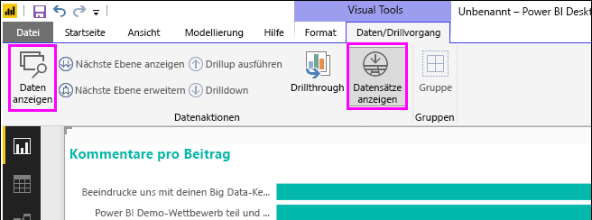
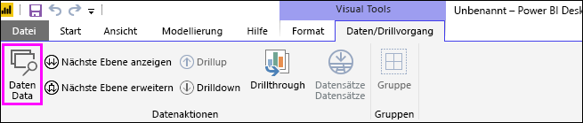
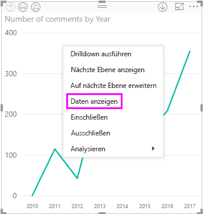
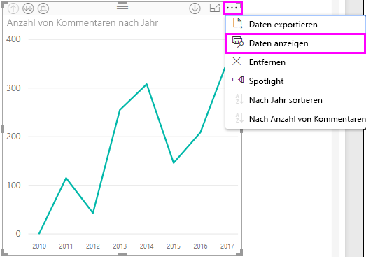
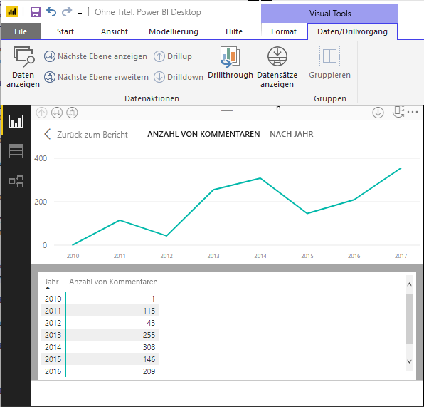
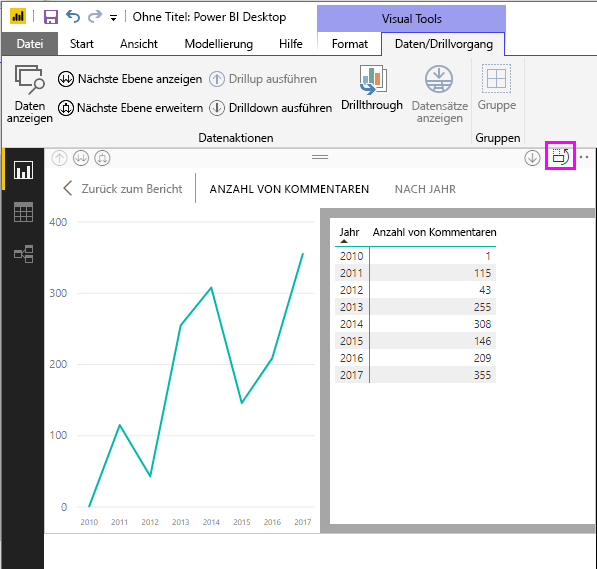
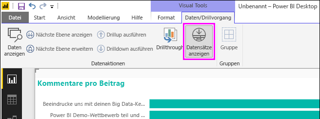
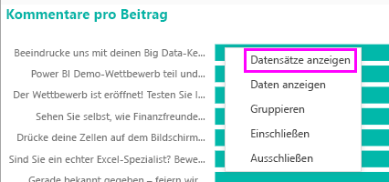
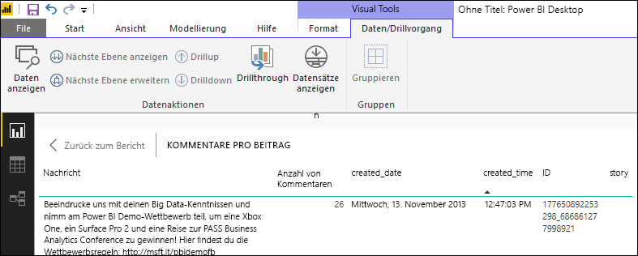
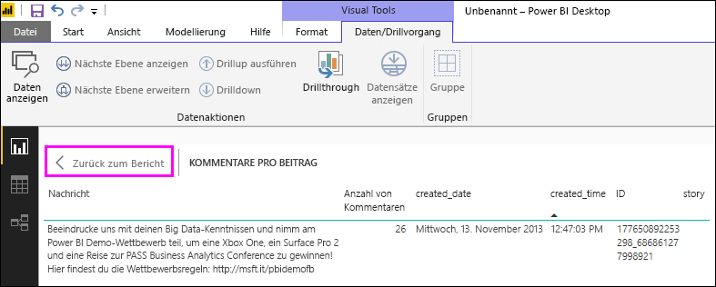

# Verwenden von „Daten anzeigen“ und „Datensätze anzeigen“ in Power BI Desktop
In **Power BI Desktop** können Sie beliebige Visualisierungen genauer betrachten (Drillthrough) und die Textdarstellung der zugrunde liegenden Daten oder einzelner Datensätze der ausgewählten Visuals anzeigen. Diese Features werden auch als *Durchklicken*, *Drillthrough* oder *Drillthrough zu den Details* bezeichnet.

Mit **Daten anzeigen** können Sie die Textdarstellung der Werte einer ausgewählten Visualisierung anzeigen und mit **Datensätze anzeigen** die zugrunde liegenden Zeilen eines bestimmten Datensatzes oder Datenpunkts. 

>[!IMPORTANT]
>**Daten anzeigen** und **Datensätze anzeigen** unterstützen nur die folgenden Visualisierungstypen:
>  - Balkendiagramm
>  - Säulendiagramm
>  - Ringdiagramm
>  - Flächenkartogramm
>  - Trichterdiagramm
>  - Zuordnung
>  - Kreisdiagramm
>  - Treemap

## Verwenden von „Daten anzeigen“ in Power BI Desktop

**Daten anzeigen** zeigt Ihnen die einer Visualisierung zugrunde liegenden Daten. **Daten anzeigen** befindet sich auf der Registerkarte **Daten/Drillvorgang** im Abschnitt **Visuelle Tools** des Menübands.

Sie können die Daten auch anzeigen, indem Sie mit der rechten Maustaste auf eine Visualisierung klicken und dann im Kontextmenü **Daten anzeigen** aufrufen. Alternativ können Sie auch auf die Auslassungspunkte (...) für **weitere Optionen** in der oberen rechten Ecke der Visualisierung klicken und **Daten anzeigen** auswählen.

&nbsp;&nbsp;

> [!NOTE]
> Sie müssen auf einen Datenpunkt im Visual zeigen, damit das Kontextmenü verfügbar ist.

**Wenn Sie** auf **Daten anzeigen** klicken, wird im Power BI Desktop-Zeichenbereich sowohl das Visual als auch die Textdarstellung der Daten angezeigt. Das Visual wird in der *horizontalen Ansicht* in der oberen Hälfte der Zeichenfläche angezeigt und die Daten in der unteren. 

Mit dem Symbol in der oberen rechten Ecke können Sie zwischen der*vertikalen Ansicht* und der horizontalen Ansicht wechseln.

Um zum Bericht zurückzukehren, wählen Sie in der oberen linken Ecke des Zeichenbereichs **< Zurück zum Bericht** aus.

## Verwenden von „Datensätze anzeigen“ in Power BI Desktop

Sie können den Fokus auch auf einen Datensatz einer Visualisierung legen und die zugrunde liegenden Daten genauer betrachten. Um **Datensätze anzeigen** zu verwenden, klicken Sie auf eine Visualisierung, wählen Sie in der Registerkarte **Daten/Drilldown** im Teil **Visual Tools** des Menübands **Datensätze anzeigen** aus, und klicken Sie dann auf einen Datenpunkt oder eine Zeile in der Visualisierung. 

> [!NOTE]
> Wenn die Schaltfläche **Datensätze anzeigen** im Menüband deaktiviert und ausgegraut ist, bedeutet dies, dass die ausgewählte Visualisierung **Datensätze anzeigen** nicht unterstützt.

Sie können auch mit der rechten Maustaste auf ein Datenelement klicken, und **Datensätze anzeigen** aus dem angezeigten Menü auswählen.

Wenn Sie **Datensätze anzeigen** für ein Datenelement auswählen, werden im Zeichenbereich von Power BI Desktop alle Daten angezeigt, die dem ausgewählten Element zugeordnet sind. 

Um zum Bericht zurückzukehren, wählen Sie in der oberen linken Ecke des Zeichenbereichs **< Zurück zum Bericht** aus.

> [!NOTE]
>Für **Datensätze anzeigen** gelten folgende Einschränkungen:
> - Sie können die Daten in der Ansicht **Datensätze anzeigen** nicht ändern und wieder im Bericht speichern.
> - Wenn die Visualisierung ein berechnetes Measure beinhaltet, können Sie **Datensätze anzeigen** nicht verwenden.
> - Sie können **Datensätze anzeigen** nicht verwenden, wenn Sie mit einem aktiven mehrdimensionalen Modell (MD-Modell) verbunden sind.

## Nächste Schritte
In **Power BI Desktop** stehen verschiedene Features für das Formatieren von Berichten und die Datenverwaltung zur Verfügung. Die folgenden Ressourcen enthalten einige Beispiele:

* [Verwenden von Gruppierung und Diskretisierung in Power BI Desktop](desktop-grouping-and-binning.md)
* [Verwenden von Gitternetzlinien, der Option „Am Raster ausrichten“, der Z-Reihenfolge, Ausrichtung und Verteilung in Power BI Desktop-Berichten](desktop-gridlines-snap-to-grid.md)

