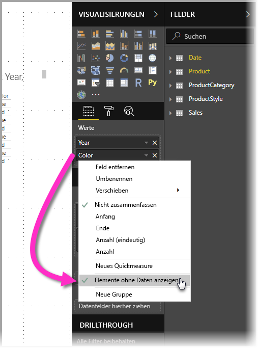
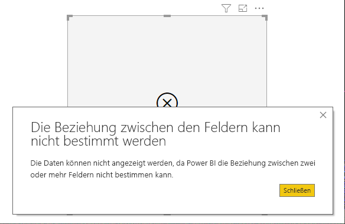

# Elemente ohne Daten in Power BI anzeigen

Mithilfe von Power BI können Sie alle Arten von Daten aus verschiedenen Quellen visualisieren. Bei der Erstellung eines Visuals zeigt Power BI nur relevante Daten, um die Präsentation und Darstellung von Daten ordnungsgemäß zu verwalten. Power BI bestimmt auf der Grundlage der Konfiguration des Visuals und des zugrundliegenden Modells, welche Daten relevant sind. Dieser Artikel beschreibt, wie sich Power BI beim Bestimmen der relevanten Daten verhält und bietet dazu Beispiele, wie Entscheidungen getroffen werden.

## Bestimmen relevanter Daten

Um das Konzept zu verstehen, nach dem Power BI bestimmt, welche Daten für die Anzeige relevant sind, sehen wir uns eine Tabelle als einfaches Beispiel an. Stellen Sie sich auf der Grundlage des Modells im Abschnitt mit den Beispielen am Ende dieses Artikels vor, Sie erstellen eine Tabelle mit den folgenden Einstellungen:

**1. Gruppen aus der gleichen Tabelle:** *Produkt[Farbe] - Produkt[Größe]*

|*Produkt [Farbe]*  |*Produkt [Größe]*  |
|---------|---------|
|Blau     |Groß         |
|Blau     |Mittel         |
|Blau     |Klein         |
|Rot     |Groß         |

In diesem Beispiel zeigt Power BI die Kombinationen von *[Farbe-Größe]* an, die in der Tabelle *[Produkt]* vorhanden sind. 

Sehen wir uns jetzt eine andere Kombination an:

**2. Gruppen aus verschiedenen, aber direkt aufeinander bezogenen Tabellen und ein Measure:** *ProduktStil[Finish] - Produkt[Farbe] - Summe(Umsatz[Menge])*

|*ProduktStil[Finish]*  |*Produkt [Farbe]*  |*[SummeMenge]*  |
|---------|---------|---------|
|Glänzend     |Blau         |10         |
|Matt     |Blau         |15         |

In diesem Beispiel zeigt Power BI nur vorhandene Kombinationen an. Beispielsweise wird („Ohne“ + „Blau“) oder („Matt“ + „Rot“) nicht angezeigt, weil diese Kombinationen im Modell nicht vorkommen. Die Bedingung, die bestimmt, welche Kombinationen vorhanden sind, ist der nicht leere Wert für *Summe(Umsatz[Menge])*.

Betrachten wir einen anderen Fall: 

**3. Gruppen aus verschiedenen, aber aufeinander bezogenen Tabellen ohne Measure:** *ProduktStil[Finish] - Produkt[Farbe]*

|*ProduktStil[Finish]*  |*Produkt [Farbe]*  |
|---------|---------|
|Glänzend     |Blau         |
|Glänzend     |Rot         |
|Matt     |Blau         |

Da es kein explizites Measure gibt und die zwei Tabellen direkt auf einander bezogen sind, versucht Power BI, ein Measure einzufügen, um die sich ergebenden Kombinationen einzuschränken. In diesem Fall fügt Power BI ein Measure *CALCULATE(COUNTROWS('Produkt'))* ein, das nicht leer sein darf, da *Produkt* die Tabelle ist, die beide Tabellen gemein haben.

Nach dieser Maßgabe zeigt Power BI die Kombinationen an, die Einträge in der Tabelle „Produkt“ aufweisen, was die Kombinationen *(„Ohne“ + „Blau“)* und *(„Matt“ + „Rot“)* ausschließt.

**4. Gruppen aus verschiedenen und nicht aufeinander bezogenen Tabellen**

Das Beispielmodell weist diese Kombination nicht auf, aber wenn Gruppen aus verschiedenen und nicht aufeinander bezogenen Tabellen vorhanden wären, könnte Power BI keine zwei Spalten aufeinander beziehen, und das Ergebnis wäre eine Crossjoinvereinigung aller Werte jeder Spalte. In dieser Situation gibt Power BI einen Fehler vom Typ *nicht eingeschränkter Join* aus, da solche Crossjoinvereinigungen in der Datenbank rechenaufwändig sind und Benutzern nicht viele Informationen geben. 

## Elemente ohne Daten anzeigen

Im vorherigen Abschnitt wurde beschrieben, wie Power BI bestimmt, welche Daten für die Ansicht relevant sind. Es kann aber Situationen geben, in denen Sie *möchten*, dass Elemente ohne Daten angezeigt werden. 

Die Funktion **Elemente ohne Daten anzeigen** ermöglicht genau das – Einschließen von Datenzeilen und -spalten, die keine Measuredaten (leere Measurewerte) enthalten.

Um die Funktion **Elemente ohne Daten anzeigen** zu aktivieren, wählen Sie ein Visual aus, dann klicken Sie im Panel **Felder** mit der rechten Maustaste auf das Feld und wählen im Menü, das dann angezeigt wird, **Elemente ohne Daten anzeigen** aus, wie in der folgenden Abbildung zu sehen.

Die Funktion **Elemente ohne Daten anzeigen** bleibt in den folgenden Situationen *ohne* Wirkung:

* Dem Visual wurde kein Measure hinzugefügt, und die Gruppierungsspalten stammen aus der gleichen Tabelle
* Die Gruppen sind nicht aufeinander bezogen; Power BI führt keine Abfragen für Visuals aus, die nicht aufeinander bezogene Gruppen aufweisen
* Das Measure ist auf keine der Gruppen bezogen; das hat den Grund, dass das Measure nur für einige Gruppenkombinationen nie leer ist
* Es gibt einen benutzerdefinierten Measurefilter, der leere Measures ausschließt – beispielsweise: *UmsatzBetrag > 0*

### So funktionieren Elemente ohne Daten

Die interessantesten Anwendungsfälle von **Elemente ohne Daten anzeigen** sind solche mit vorhandenen Measures. Sehen wir uns die Situation an, dass die Gruppen aus der gleichen Tabelle stammen oder durch einen Pfad im Modell auf einander bezogen werden können. Beispielsweise ist *ProduktStil* direkt auf *Produkt* und indirekt auf *Umsatz* bezogen, *ProduktStil* und *ProduktKategorie* können über die Tabelle *Produkt* aufeinander bezogen werden usw.

Sehen wir uns ein paar interessante Fälle an, und vergleichen wir sie mit aktivierter und deaktivierter Funktion **Elemente ohne Daten anzeigen**. 

**1. Gruppieren von Spalten aus der gleichen Tabelle:** *Produkt[Farbe] - Produkt[Größe] - Summe(Umsatz[Menge])*

So wird es mit deaktivierter Funktion **Elemente ohne Daten anzeigen** angezeigt:

|*Produkt [Farbe]*  |*Produkt [Größe]*  |*[SummeMenge]*  |
|---------|---------|---------|
|Blau     |Mittel         |15         |
|Blau     |Klein         |10         |

So wird es mit aktivierter Funktion **Elemente ohne Daten anzeigen** angezeigt:

|*Produkt [Farbe]*  |*Produkt [Größe]*  |*[SummeMenge]*  |
|---------|---------|---------|
|Blau     |Groß         |         |
|Blau     |Mittel         |15         |
|Blau     |Klein         |10         |
|Rot     |Groß         |         |

Beachten Sie, dass mit aktivierter Funktion zwei neue Kombinationen sichtbar wurden: *Blau - Groß* und *Rot - Groß*. Diesen beiden Einträgen entspricht keine *Menge* in der Tabelle *Umsatz*. Sie werden dennoch in der Tabelle *Produkt* angezeigt.

**2. Gruppieren von Spalten aus aufeinander bezogenen Tabellen:** *ProduktStil[Finish] - Produkt[Farbe] - Summe(Umsatz[Menge])*

So wird es mit deaktivierter Funktion **Elemente ohne Daten anzeigen** angezeigt:

|*ProduktStil[Finish]*  |*Produkt [Farbe]*  |*[SummeMenge]*  |
|---------|---------|---------|
|Glänzend     |Blau         |10         |
|Matt     |Blau         |15         |

So wird es mit aktivierter Funktion **Elemente ohne Daten anzeigen** angezeigt:

|*ProduktStil[Finish]*  |*Produkt [Farbe]*  |*[SummeMenge]*  |
|---------|---------|---------|
|Glänzend     |Blau         |10         |
|Glänzend     |Rot         |         |
|Matt     |Blau         |15         |
|Ohne     |         |         |

Beachten Sie, dass *(Glänzend-Rot)* und *(Ohne, leer)* als Kombinationen angezeigt wurden. Dies ist der Grund, warum sie angezeigt wurden:
* Power BI zog zuerst ProduktStil[Finish] in Betracht und wählte alle anzuzeigenden Werte aus – dies ergab Glänzend, Matt, Ohne.
* Mithilfe aller dieser Werte wählte Power BI alle entsprechenden Einträge für *Produkt[Farbe]* aus 
* Da *Ohne* keinem *Produkt[Farbe]* entspricht, wird für diesen Wert eine Leerstelle angezeigt

Sie müssen sich merken, dass der Auswahlmechanismus von Werten für die Spalten fremdabhängig ist und als *Left Outer Join*-Vorgang zwischen Tabellen angesehen werden kann. Wenn die Reihenfolge der Spalten geändert wird, ändern sich auch die Ergebnisse.

Sehen wir uns ein Beispiel zum Ändern der Reihenfolge und den Einfluss auf die Ergebnisse an. Dies ist das gleiche wie Element **2** in diesem Abschnitt mit geänderter Reihenfolge.

**Produkt[Farbe] - ProduktStil[Finish] - Summe(Umsatz[Menge])**

So wird es mit aktivierter Funktion **Elemente ohne Daten anzeigen** angezeigt:

|*Produkt [Farbe]* |*ProduktStil[Finish]*  |*[SummeMenge]*  |
|---------|---------|---------|
|Blau     |Glänzend         |10         |
|Blau     |Matt         |15         |
|Rot     |Glänzend         |         |

Beachten Sie, dass in diesem Fall *ProduktStil[Finish]=Ohne* nicht in der Tabelle angezeigt wird. Das hat den Grund, dass in diesem Fall Power BI zuerst alle Werte *Farbe* in der Tabelle *Produkt* auswählte. Anschließend wählte Power BI für jede Farbe die entsprechenden *Finish*-Werte aus, die Daten enthielten. Da *Ohne* in keiner Kombination von *Farbe* vorkommt, wird es nicht ausgewählt.

## Beispieldatenmodell

Dieser Abschnitt zeigt das Beispieldatenmodell, das in den Beispielen in diesem Artikel verwendet wird.

**Modell**: 

**Daten**:

|Produkt[ProduktID]|    Produkt[ProduktName]|   Produkt[Farbe]| Produkt[Größe]|  Produkt[KategorieID]|    Produkt[StilID]|
|---------|---------|---------|---------|---------|---------|
|1  |Prod1  |Blau   |Klein  |1  |1 |
|2  |Prod2  |Blau   |Mittel |2  |2 |
|3  |Prod3  |Rot    |Groß  |1  |1 |
|4  |Prod4  |Blau   |Groß  |2  |2 |

|ProduktKategorie[KategorieID]|   ProduktKategorie[KategorieName]|
|---------|---------|
|1  |Telefon   |
|2  |Kamera |
|3  |TV |

|ProduktStil[StilID]| ProduktStil[Finish]|   ProduktStil[Poliert]|
|---------|---------|---------|
|1  |Glänzend  |Ja |
|2  |Matt  |Nein |
|3  |Ohne   |Nein |

|Umsatz[UmsatzID]| Umsatz[ProduktID]|   Umsatz[Datum]|    Umsatz[Menge]|
|---------|---------|---------|---------|
|1  |1  |01.01.2012 00:00| 10 |
|2  |2  |01.01.2013| 15 |

## Nächste Schritte

In diesem Artikel wurde beschrieben, wie Sie die Funktion **Elemente ohne Daten anzeigen** in Power BI aktivieren konnten. Folgende Artikel könnten Sie ebenfalls interessieren: 

* [Datenquellen in Power BI Desktop](desktop-data-sources.md)
