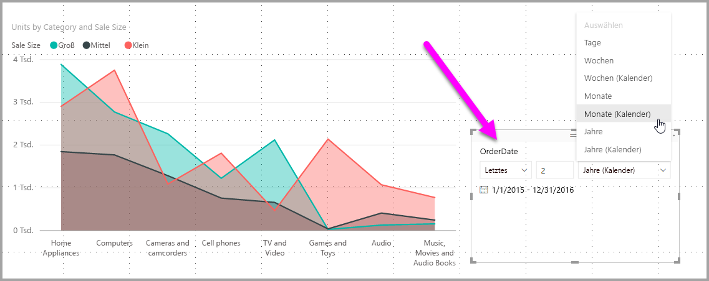
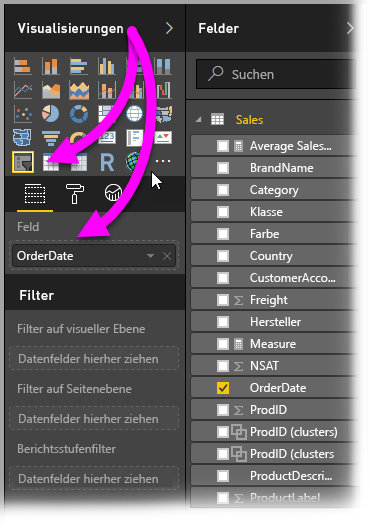
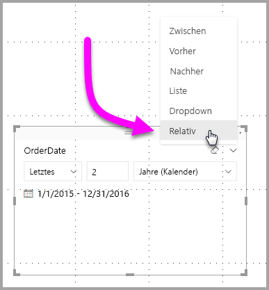
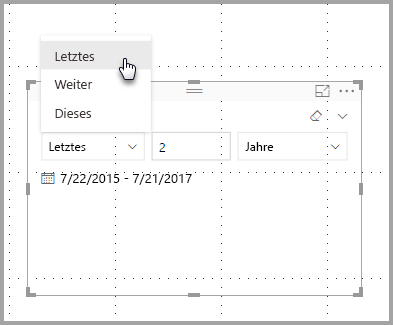
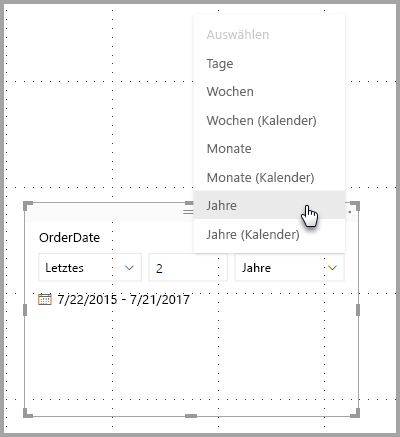
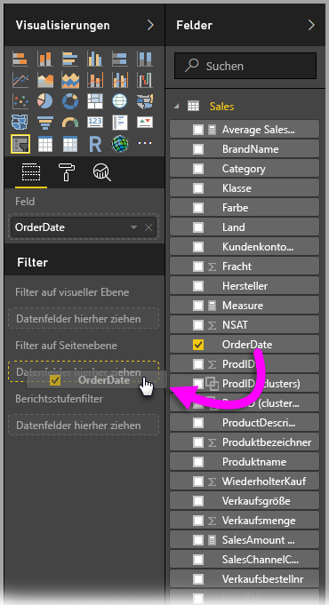
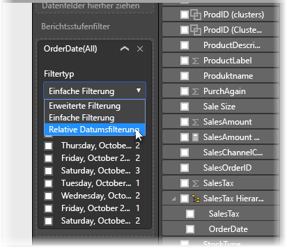
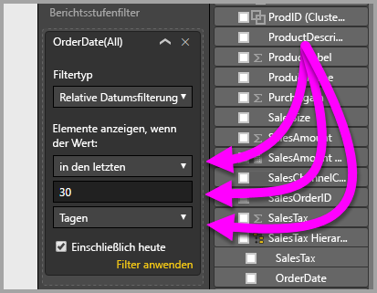

# Verwenden eines relativen Datenschnitts mit Datum und relativen Datumsfilters in Power BI Desktop
Mit dem **relativen Datenschnitt mit Datum** oder **relativem Datumsfilter** können Sie zeitbasierte Filter auf beliebige Datumsspalten in Ihrem Datenmodell anwenden. Ein Beispiel: Sie können mit dem **relativen Datenschnitt mit Datum** nur Daten zu Verkäufen anzeigen lassen, die innerhalb der letzten dreißig Tage (des letzten Monats, innerhalb des Kalendermonats usw.) aufgetreten sind. Wenn Sie die Daten aktualisieren, wendet der relative Zeitraum automatisch die entsprechende relative Datumseinschränkung an.

## Verwenden des relativen Datenschnitts mit Datumsbereich
Der relative Datenschnitt mit Datum funktioniert wie jeder andere Datenschnitt. Erstellen Sie einfach ein Visual vom Typ **Datenschnitt** für Ihren Bericht, und wählen Sie dann für **Feld** einen Datumswert aus. In der folgenden Abbildung ist das Feld *OrderDate* ausgewählt.

Klicken Sie rechts oben im **relativen Datenschnitt mit Datum** auf das Zirkumflexzeichen. Ein Menü wird angezeigt.

Wählen Sie für den relativen Datenschnitt mit Datum die Option *Relativ* aus.

Anschließend können Sie die Einstellungen auswählen. Für die erste Dropdownliste im *relativen Datenschnitt mit Datum* stehen folgende Auswahlmöglichkeiten zur Verfügung:

* Letzter
* Weiter
* Diese

Diese Auswahlmöglichkeiten werden in der folgenden Abbildung gezeigt.

Mit der nächsten (mittleren) Einstellung im *relativen Datenschnitt mit Datum* können Sie eine Zahl eingeben, um den relativen Datumsbereich zu definieren.

Mit der dritten Einstellung können Sie den Datumswert auswählen, und es stehen folgende Auswahlmöglichkeiten zur Verfügung:

* Tage
* Wochen
* Wochen (Kalender)
* Monate
* Monate (Kalender)
* Jahre
* Jahre (Kalender)

Diese Auswahlmöglichkeiten werden in der folgenden Abbildung gezeigt.

Sie wählen in dieser Liste die Option *Monate* aus, und geben für die mittlere Einstellung den Wert 2 ein. Folgendes geschieht: Wenn heute der 20. Juli ist, werden in den vom Datenschnitt eingeschränkten Visuals Daten für die vorhergehenden zwei Monate angezeigt, vom 20. Mai bis zum 20. Juli (dem heutigen Datum).

Wenn Sie hingegen *Monate (Kalender)* auswählen, zeigen die eingeschränkten Visuals Daten vom 1. Mai bis zum 30. Juni (die letzten zwei kompletten Kalendermonate).

## Verwenden des relativen Datumsbereichsfilters
Sie können auch einen relativen Datumsbereichsfilter für Ihre Berichtsseite oder für den gesamten Bericht erstellen. Ziehen Sie hierfür einfach ein Datumsfeld in den Abschnitt **Filter auf Seitenebene** oder **Berichtsstufenfilter** im Bereich **Feld**, wie in der folgenden Abbildung veranschaulicht.

Dort können Sie den relativen Datumsbereich ähnlich wie den **relativen Datenschnitt mit Datum** anpassen. Wählen Sie in der Dropdownliste **Filtertyp** den Eintrag **Relative Datumsfilterung** aus.

Nach Auswahl von **Relative Datumsfilterung** sehen Sie drei zu ändernde Abschnitte, einschließlich eines numerischen Feldes in der Mitte (wie beim Datenschnitt).

Mehr muss zum Verwenden dieser relativen Datumseinschränkungen in Ihren Berichten nicht erklärt werden.

## Einschränkungen und Überlegungen
Die folgenden Überlegungen und Einschränkungen betreffen derzeit den **relativen Datenschnitt mit Datum** und den relativen Datumsfilter.

* Datenmodelle in **Power BI** enthalten keine Zeitzoneninformationen. In Modellen können Zeitangaben gespeichert werden, es gibt jedoch keinerlei Hinweise auf die entsprechende Zeitzone.
* Der Datenschnitt und der Filter basieren immer auf der Uhrzeit in UTC. Wenn Sie also einen Filter in einem Bericht konfigurieren und den Bericht an einen Kollegen in einer anderen Zeitzone senden, sehen Sie beide die gleichen Daten. Befinden Sie sich jedoch nicht in der UTC-Zeitzone, entsprechen die Daten möglicherweise nicht dem erwarteten Zeitzonenversatz.
* In einer lokalen Zeitzone erfasste Daten können mit dem **Abfrage-Editor** in UTC konvertiert werden.

