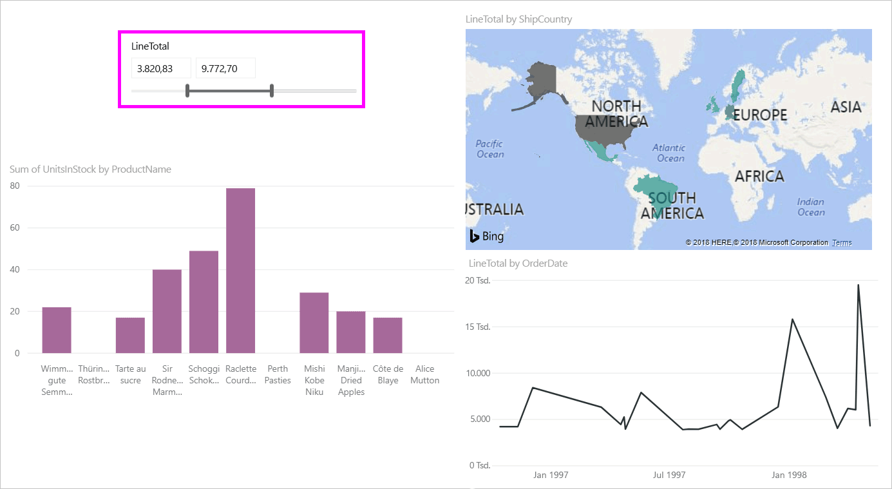
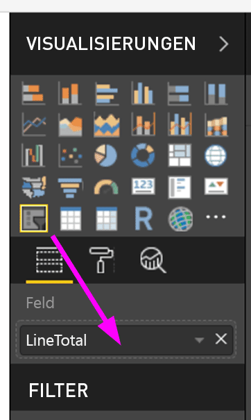
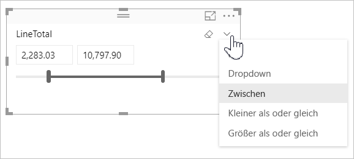
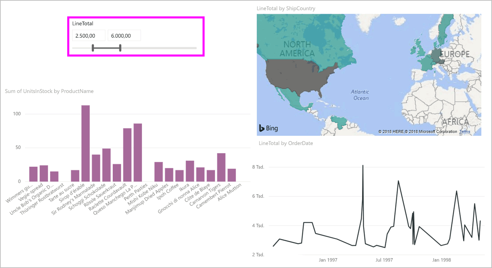
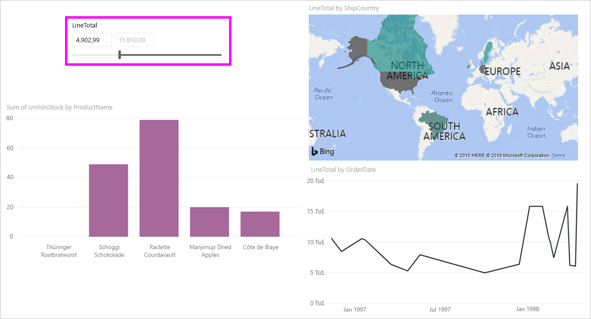

# Verwenden der Funktion „Datenschnitt für numerischen Bereich“ in Power BI Desktop
Mit dem Feature **Datenschnitt für numerischen Bereich** können Sie numerischen Spalten eine Reihe an Filtern zuweisen. Sie können numerische Daten filtern, die **zwischen** Zahlen liegen oder deren Wert **kleiner als oder gleich** oder **größer als oder gleich** eine Zahl ist. Diese Filtermethode ist unkompliziert, aber leistungsstark.

## Verwenden der Funktion „Datenschnitt für numerischen Bereich“
Der Datenschnitt für numerische Bereiche funktioniert wie jeder andere Datenschnitt. Erstellen Sie einfach eine **Datenschnitt**-Visualisierung für einen Bericht, und legen Sie dann für **Feld** einen Wert fest. In der folgenden Abbildung ist das Feld *LineTotal* ausgewählt.

Wählen Sie rechts oben im **Datenschnitt für numerischen Bereich** die Verknüpfung mit dem Pfeil nach unten aus. Ein Menü wird angezeigt.

Der numerische Bereich kann mithilfe von drei Bedingungen eingegrenzt werden:

* Zwischen
* Kleiner als oder gleich
* Größer als oder gleich

Wenn Sie **zwischen** auswählen, wird ein Schieberegler angezeigt, mit dem Sie die Ober- und Untergrenze des Filters einstellen können. Statt den Schieberegler zu verwenden, können Sie die Werte auch über die Eingabefelder festlegen. Das ist besonders nützlich, wenn Sie den Datenschnitt bei bestimmten Zahlen ansetzen möchten, die sich mit dem Schieberegler nicht genau einstellen lassen.

In der folgenden Abbildung wird die Berichtsseite nach Werten zwischen 2500,00 und 6000,00 in der Spalte *LineTotal* gefiltert.

Wenn Sie **Kleiner als oder gleich** auswählen, verschwindet der linke Ziehpunkt des Schiebereglers (für den niedrigeren Wert), und nur der Ziehpunkt für den höheren Wert kann eingestellt werden. In der folgenden Abbildung wurde der Schieberegler auf den Maximalwert von 5928,19 festgelegt.

Wenn Sie **Größer als oder gleich** auswählen, verschwindet der rechte Ziehpunkt (für den höheren Wert), und der niedrigere Wert kann angepasst werden. Das sehen Sie in der nächsten Abbildung. Jetzt werden nur Elemente mit einem *LineTotal* größer als oder gleich 4902,99 in den Visuals auf der Berichtsseite angezeigt.

## Ausrichten an ganzen Zahlen mit dem Datenschnitt für numerische Bereiche

Ein Datenschnitt für den numerischen Bereich richtet sich an ganzen Zahlen aus, wenn der Datentyp des zugrunde liegenden Felds **Ganze Zahl** ist. Dadurch kann der Slicer ordnungsgemäß an ganzen Zahlen ausgerichtet werden. In Feldern vom Typ **Dezimalzahl** können Sie Bruchzahlen eingeben oder diese darin auswählen. Die im Textfeld angewendete Formatierung entspricht der im Feld festgelegten Formatierung, auch wenn Sie genauere Zahlen eingeben oder auswählen können.

## Einschränkungen und Überlegungen
Die folgenden Überlegungen und Einschränkungen betreffen derzeit das Feature **Datenschnitt für numerischen Bereich**:

* Die Funktion **Datenschnitt für numerischen Bereich** filtert derzeit jede zugrunde liegende Zeile in den Daten, keine aggregierten Werte. Beispiel: Wenn Sie das Feld *SalesAmount* verwenden, wird der Filter auf jede Transaktion angewandt, die auf *SalesAmount* basiert, nicht auf die *SalesAmount*-Summe für jeden Datenpunkt der Visualisierung.
* Das Feature funktioniert derzeit nicht bei Measures.
* Sie können eine beliebige Zahl in die Textfelder eines numerischen Datenschnitts eingeben, auch wenn sie außerhalb des Wertebereichs der zugrunde liegenden Spalte liegt. So können Sie Filter einrichten, wenn Sie wissen, dass sich die Daten in Zukunft ändern können.
