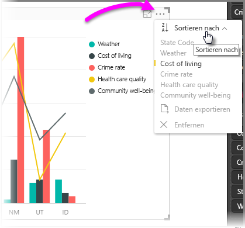
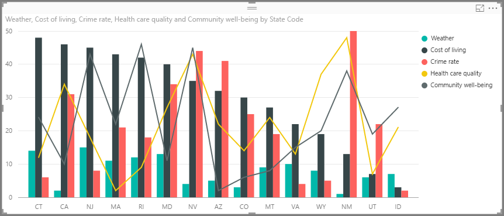
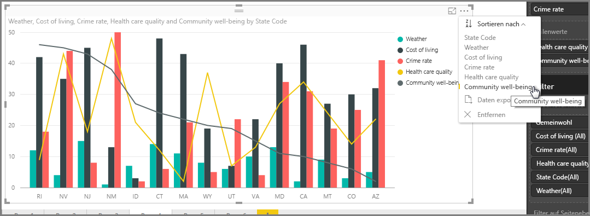
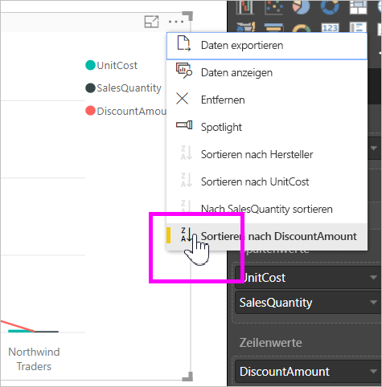
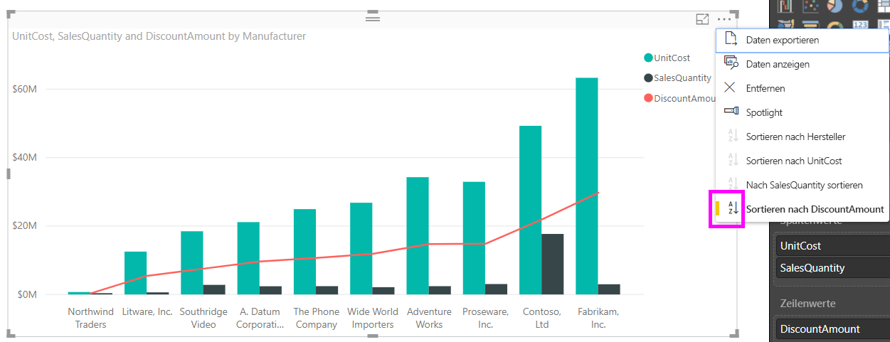
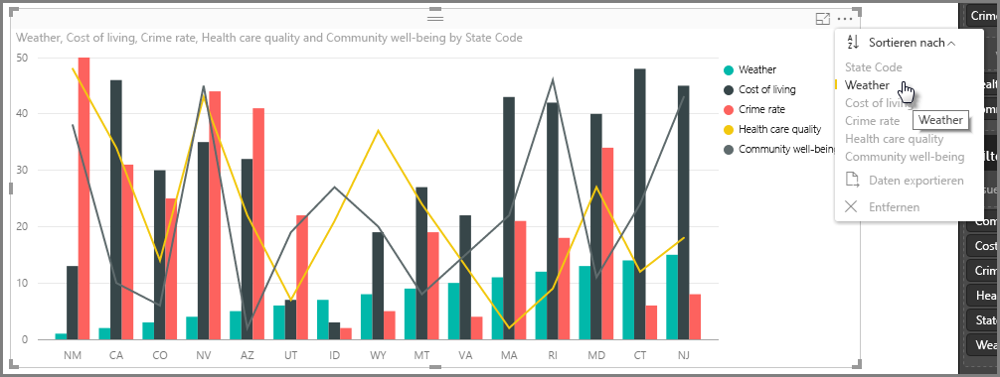
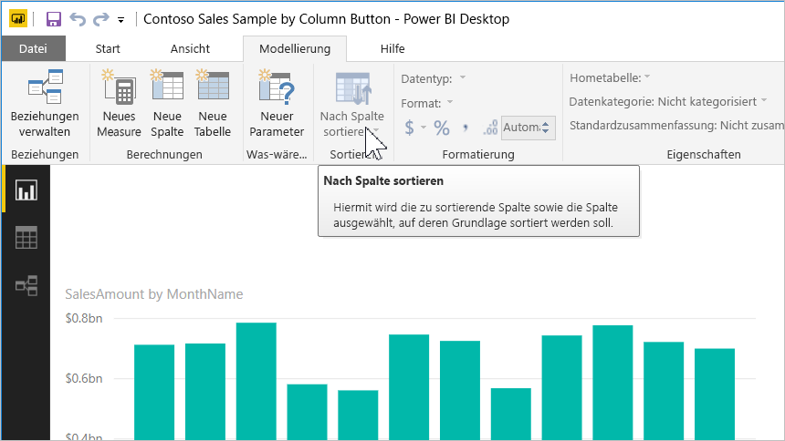
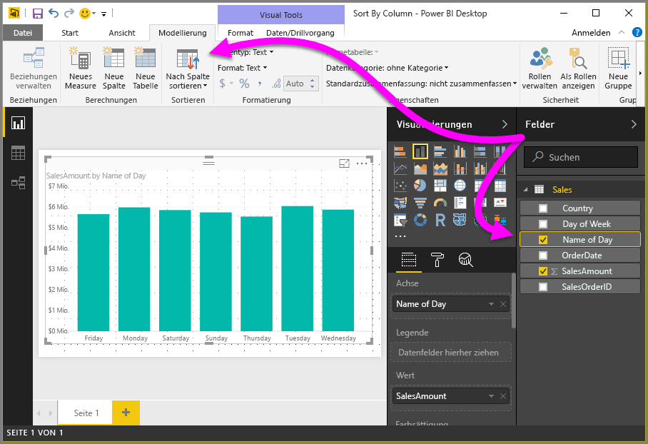
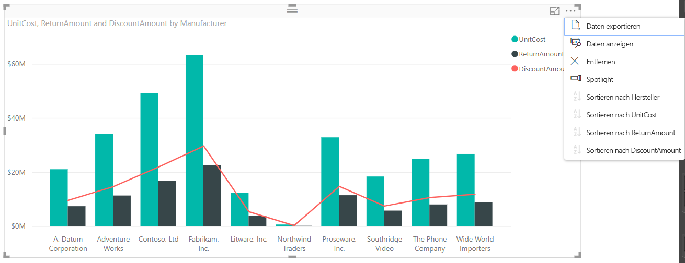

# Sortieren nach Spalten in Power BI Desktop
In **Power BI Desktop** und im **Power BI-Dienst** können Sie das Erscheinungsbild eines Visuals ändern, indem Sie es nach verschiedenen Datenfeldern sortieren. Indem Sie die Sortierung eines Visuals ändern, können Sie die Informationen hervorheben, die Sie vermitteln möchten, und sicherstellen, dass das Visual den gewünschten Trend (oder den gewünschten zentralen Aspekt) widerspiegelt.

Ob Sie numerische Daten (z. B. Umsatzzahlen) oder Text (z. B. Ländernamen) verwenden – die Visualisierungen lassen sich wunschgemäß sortieren und optisch aufbereiten.  **Power BI** bietet große Flexibilität beim Sortieren sowie Schnellmenüs. Wählen Sie in einem Visual das Menü mit den Auslassungszeichen (...) und dann **Sortieren nach**. Wählen Sie dann das Feld aus, nach dem sortiert werden soll, wie in der folgenden Abbildung dargestellt.

## Ausführliches Beispiel
Sehen wir uns ein ausführliches Beispiel an und wie es in **Power BI Desktop** funktioniert.

Die folgende Visualisierung listet die 15 US-Staaten mit den meisten Sonnentagen auf (Rangfolge von 1 bis 50, wobei 1 den meisten Sonnentagen entspricht). Hier die Darstellung der Visualisierung vor dem Sortieren.

Das visuelle Element ist derzeit nach **Cost of living** sortiert – das wird durch Farbvergleich der absteigenden Balken mit der Legende ersichtlich. Es gibt jedoch eine bessere Möglichkeit zum Festlegen der aktuellen Sortierspalte: das Dialogfeld **Sortieren nach**, das im Menü mit den Auslassungszeichen („...“) oben rechts in der Darstellung abgerufen werden kann. Nach Auswahl der Auslassungspunkte wird Folgendes angezeigt:

Bei dem nach Auswahl der Auslassungspunkte angezeigten Menü sind einige Punkte zu beachten:

* Der gelbe Balken neben **Cost of living** sowie die Tatsache, dass **Cost of living** fett gedruckt ist.
* Das kleine Symbol neben den Wörtern **Sortieren nach** mit dem Schriftzug **Z/A** (Z nach A) und einem Pfeil nach unten.

Wir werden diese in den nächsten beiden Abschnitten unabhängig voneinander betrachten.

## Auswählen der Sortierspalte
Wie gezeigt signalisiert der gelbe Balken neben **Cost of living** im Menü **Sortieren nach**, dass das visuelle Element anhand der Spalte **Cost of living** sortiert wurde. Das Sortieren nach einer anderen Spalte ist einfach – klicken Sie dazu auf die Auslassungszeichen, um das Menü **Sortieren nach** aufzurufen, und wählen Sie dann eine andere Spalte aus. Ganz einfach.

In der folgenden Abbildung wurde die Spalte **Community well-being** als Sortierspalte ausgewählt. Diese Spalte entspricht einer Linie im visuellen Element und keinem Balken. Nachstehend finden Sie die Darstellung nach Auswahl von **Community well-being**.

Beachten Sie, wie sich das visuelle Element geändert hat. Die Werte werden jetzt nach den im Visual vorhandenen US-Staaten angeordnet – beginnend beim höchsten Wert für „Community well-being“ (in diesem Fall RI für Rhode Island) bis zum niedrigsten Wert (AZ für Arizona). Beachten Sie, dass das Diagramm noch immer nur die 15 US-Staaten mit den meisten Sonnentagen enthält, die nun anhand einer anderen Spalte des visuellen Elements sortiert wurden.

Aber was geschieht, wenn wir statt in absteigender Reihenfolge aufsteigend sortieren möchten? Im nächsten Abschnitt wird gezeigt, wie einfach das ist.

## Auswählen der Sortierreihenfolge – vom kleinsten zum größten und umgekehrt
Ein genauerer Blick auf das Menü **Sortieren nach** in der vorherigen Abbildung zeigt im Symbol neben **Sortieren nach** den Schriftzug **Z/A** (Z nach A). Dies hat folgende Bedeutung:

Wenn **Z/A** angezeigt wird, zeigt dies eine Sortierreihenfolge im visuellen Element an, bei der zunächst der größte Wert und dann nacheinander die Werte bis hin zum kleinsten Wert berücksichtigt werden. Sie möchten dies ändern? Kein Problem – tippen oder klicken Sie hierzu einfach auf das Symbol **Z/A**. Damit ändern Sie die Sortierreihenfolge in **A/Z**, und im visuellen Element (in Bezug auf die ausgewählte Spalte) werden zunächst der kleinste Wert und dann die Werte bis hin zum größten Wert berücksichtigt.

Die Abbildung zeigt wieder dasselbe visuelle Element, dieses Mal jedoch nach Tippen auf das Symbol **Z/A** im Menü **Sortieren nach** zum Ändern der Sortierreihenfolge. Beachten Sie, dass AZ (Arizona) jetzt als erster US-Staat aufgeführt wird und RI (Rhode Island) im Gegensatz zur vorherigen Reihenfolge als letzter Eintrag erscheint.

Die Darstellung lässt sich nach jeder im visuellen Element enthaltenen Spalte sortieren – beispielsweise könnte „Weather“ als Sortierspalte ausgewählt werden und **Z/A** aus dem Menü **Sortieren nach**, um die US-Staaten mit der meisten Sonne anzuzeigen (der höchste Wert für „Weather“ entspricht in diesem Datenmodell der Anzahl der Sonnentage). Die anderen Spalten werden dennoch im visuellen Element berücksichtigt, wie auch immer sie für den betreffenden US-Staat gelten. Hier sehen Sie das visuelle Element mit den genannten Einstellungen.

## Sortieren mit der Schaltfläche „Nach Spalte sortieren“
Es gibt eine weitere Möglichkeit zum Sortieren von Daten. Sie können auf die Schaltfläche **Nach Spalte sortieren** im Menüband **Modellierung** klicken.

Bei diesem Verfahren zum Sortieren müssen Sie eine Spalte im Bereich **Felder** auswählen und anschließend auf die Schaltfläche **Nach Spalte sortieren** klicken, um auszuwählen, wie (d.h. nach welcher Spalte) die Visualisierung sortiert werden soll. Sie müssen die Spalte (Feld) im Bereich **Felder** auswählen, nach der sortiert werden soll, um die Schaltfläche **Nach Spalte sortieren** zu aktivieren – andernfalls ist die Schaltfläche inaktiv.

Ein typisches Beispiel: Sie verfügen über Daten für die einzelnen Tage der Woche, und diese sollen chronologisch sortiert werden. In den folgenden Schritten wird die Vorgehensweise erläutert.

1. Zunächst stellen Sie Folgendes fest: Wenn die Visualisierung, jedoch keine Spalte im Bereich **Felder** ausgewählt ist, ist die Schaltfläche **Nach Spalte sortieren** inaktiv (abgeblendet dargestellt).
   
   
2. Wenn Sie im Bereich **Felder** die Spalte auswählen, nach der sortiert werden soll, wird die Schaltfläche **Nach Spalte sortieren** aktiviert.
   
   
3. Nun können Sie bei ausgewählter Visualisierung die Spalte *Tag der Woche* anstelle der Standardspalte (*Name des Tags*) auswählen, und die Visualisierung wird in der gewünschten Reihenfolge sortiert: nach dem Tag der Woche.
   
   

Und das ist auch schon alles. Denken Sie daran, dass Sie im Bereich **Felder** eine Spalte auswählen müssen, damit die Schaltfläche **Nach Spalte sortieren** aktiviert wird.

## Wiederherstellen der Standardsortierspalte
Sie können nach einer beliebigen gewünschten Spalte sortieren, aber in bestimmten Situationen soll das visuelle Element anschließend wieder anhand der Standardsortierspalte dargestellt werden. Kein Problem. Öffnen Sie bei einem visuellen Element mit ausgewählter Sortierspalte (die durch einen gelben Balken im Menü **Sortieren nach** gekennzeichnet ist) einfach das Menü **Sortieren nach**, und wählen Sie die Spalte erneut aus, damit für die Visualisierung wieder die Standardsortierspalte verwendet wird.

Hier ist z. B. das vorherige Diagramm:

Wenn im Menü erneut **Weather** ausgewählt wird, wird für das Visual wieder das Standardverhalten angewendet. Somit erfolgt eine alphabetische Sortierung nach **State Code**, wie in der folgenden Abbildung gezeigt.

Durch die vielen Optionen beim Sortieren der visuellen Elemente wird das Erstellen eines wunschgemäßen Diagramms oder Bilds vereinfacht.

