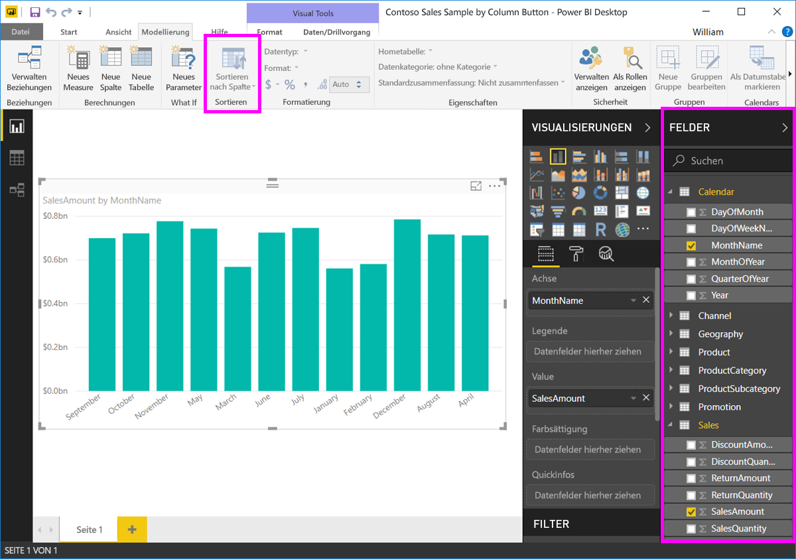

# Sortieren nach Spalten in Power BI Desktop
In **Power BI Desktop** und im **Power BI-Dienst** können Sie das Erscheinungsbild eines Visuals ändern, indem Sie es nach verschiedenen Datenfeldern sortieren. Indem Sie die Sortierung eines Visuals ändern, können Sie die Informationen hervorheben, die Sie vermitteln möchten, und sicherstellen, dass das Visual den gewünschten Trend (oder den gewünschten zentralen Aspekt) widerspiegelt.

Ob Sie numerische Daten (z.B. Umsatzzahlen) oder Text (z.B. Ländernamen) verwenden – die Visualisierungen lassen sich wunschgemäß sortieren und optisch aufbereiten.  **Power BI** bietet große Flexibilität beim Sortieren sowie Schnellmenüs. Wählen Sie in einem Visual das Menü mit den Auslassungszeichen (...) und dann das Feld aus, nach dem sortiert werden soll, wie in der folgenden Abbildung dargestellt.

## Ausführliches Beispiel
Sehen wir uns ein ausführliches Beispiel an und wie es in **Power BI Desktop** funktioniert.

In der folgenden Visualisierung sind die Kosten, die Verkaufsmenge sowie der Rabattbetrag für den jeweiligen Herstellernamen aufgeführt. Hier sehen Sie die Visualisierung vor dem weiteren Sortieren.

Das visuelle Element ist derzeit nach **SalesQuantity** sortiert – dies wird durch Farbvergleich der absteigenden Balken mit der Legende ersichtlich. Es gibt jedoch eine bessere Möglichkeit zum Festlegen der aktuellen Sortierspalte: das Menü mit den Auslassungszeichen („...“) oben rechts im Visual. Nach Auswahl der Auslassungspunkte wird Folgendes angezeigt:

* Das aktuelle Sortierfeld ist **SalesQuantity**, was durch den Fettdruck und die gelbe Leiste von **Sort By SalesQuantity** angegeben wird. 

* Die derzeitige Sortierrichtung ist von klein nach groß, was von dem kleinen Symbol **A/Z** (A nach Z) und einem Pfeil nach unten angegeben wird.

In den nächsten beiden Abschnitten betrachten wir das Sortierfeld und die -richtung unabhängig voneinander.

## Auswählen der Sortierspalte
Möglicherweise haben Sie schon die gelbe Leiste neben **Sort By SalesQuantity** im Menü **Weitere Optionen** gesehen, die angibt, dass das Visual nach **SalesQuantity** sortiert ist. Das Sortieren nach einer anderen Spalte ist einfach – klicken Sie dazu auf die Auslassungszeichen, um das Menü unter Auslassungspunkten aufzurufen, und wählen Sie dann eine andere Spalte aus.

In der folgenden Abbildung wurde die Spalte *DiscountAmount* als Sortierspalte ausgewählt. Diese Spalte entspricht einer Linie im visuellen Element und keinem Balken. Nachstehend finden Sie die Darstellung nach Auswahl von **Sortieren nach DiscountAmount**.

Beachten Sie, wie sich das visuelle Element geändert hat. Die Werte werden nun vom höchsten DiscountAmount-Wert im Visual „Fabrikam Inc.“ nach unten zum Hersteller „Northwind Traders“ sortiert, der über den niedrigsten Wert verfügt. 

Aber was geschieht, wenn wir statt in absteigender Reihenfolge aufsteigend sortieren möchten? Im nächsten Abschnitt wird gezeigt, wie einfach das ist.

## Auswählen der Sortierreihenfolge – vom kleinsten zum größten und umgekehrt
Ein genauerer Blick auf das Menü **Optionen** in der vorherigen Abbildung zeigt im Symbol neben **Sortieren nach DiscountAmount** den Schriftzug **Z/A** (Z nach A). Dies hat folgende Bedeutung:

Wenn **Z/A** angezeigt wird, zeigt dies eine Sortierreihenfolge im visuellen Element an, bei der zunächst der größte Wert und dann nacheinander die Werte bis hin zum kleinsten Wert berücksichtigt werden. Sie möchten dies ändern? Kein Problem – tippen oder klicken Sie hierzu einfach auf das Symbol **Z/A**. Damit ändern Sie die Sortierreihenfolge in **A/Z**, und im visuellen Element (in Bezug auf die ausgewählte Spalte) werden zunächst der kleinste Wert und dann die Werte bis hin zum größten Wert berücksichtigt.

Die Abbildung zeigt wieder dasselbe Visual, dieses Mal jedoch nach Tippen auf das Symbol **Z/A** im Menüelement **Sortieren nach DiscountAmount** zum Ändern der Sortierreihenfolge. Beachten Sie, dass Northwind Traders nun der erste aufgeführte Hersteller ist und Fabrikam Inc. der letzte – also das genaue Gegenteil wie zuvor.

Die Darstellung lässt sich nach jeder im visuellen Element enthaltenen Spalte sortieren – beispielsweise könnte „SalesQuantity“ als Sortierspalte ausgewählt werden mit **Sortieren nach SalesQuantity**, um die Hersteller mit den meisten Verkäufen anzuzeigen. Die anderen Spalten werden dennoch im Visual berücksichtigt, wie auch immer sie für den betreffenden Hersteller gelten. Hier sehen Sie das visuelle Element mit den genannten Einstellungen.

## Sortieren mit der Schaltfläche „Nach Spalte sortieren“
Es gibt eine weitere Möglichkeit zum Sortieren von Daten. Sie können auf die Schaltfläche **Nach Spalte sortieren** im Menüband **Modellierung** klicken.

Bei diesem Verfahren zum Sortieren müssen Sie eine Spalte im Bereich **Felder** auswählen und anschließend auf die Schaltfläche **Nach Spalte sortieren** klicken, um auszuwählen, wie (d.h. nach welcher Spalte) die Visualisierung sortiert werden soll. Sie müssen die Spalte (Feld) im Bereich **Felder** auswählen, nach der sortiert werden soll, um die Schaltfläche **Nach Spalte sortieren** zu aktivieren – andernfalls ist die Schaltfläche inaktiv.

Ein typisches Beispiel: Sie verfügen über Daten für die einzelnen Monate des Jahres, und diese sollen chronologisch sortiert werden. In den folgenden Schritten wird die Vorgehensweise erläutert.

1. Zunächst stellen Sie Folgendes fest: Wenn die Visualisierung, jedoch keine Spalte im Bereich **Felder** ausgewählt ist, ist die Schaltfläche **Nach Spalte sortieren** inaktiv (abgeblendet dargestellt).
   
   

2. Wenn Sie im Bereich **Felder** die Spalte auswählen, nach der sortiert werden soll, wird die Schaltfläche **Nach Spalte sortieren** aktiviert.
   
   
3. Nun können Sie bei ausgewähltem Visual die Spalte *MonthOfYear* anstelle der Standardspalte (*MonthName*) auswählen, und das Visual wird in der gewünschten Reihenfolge sortiert: nach dem Monat des Jahres.
   
   

Und das ist auch schon alles. Denken Sie daran, dass Sie im Bereich **Felder** eine Spalte auswählen müssen, damit die Schaltfläche **Nach Spalte sortieren** aktiviert wird.

## Wiederherstellen der Standardsortierspalte
Sie können nach einer beliebigen gewünschten Spalte sortieren, aber in bestimmten Situationen soll das visuelle Element anschließend wieder anhand der Standardsortierspalte dargestellt werden. Kein Problem. Öffnen Sie bei einem Visual mit ausgewählter Sortierspalte (die durch einen gelben Balken im Menü mit den Auslassungspunkten gekennzeichnet ist) einfach das Menü **Weitere Optionen**, und wählen Sie die Spalte erneut aus, damit für die Visualisierung wieder die Standardsortierspalte verwendet wird.

Hier ist z. B. das vorherige Diagramm:

Wenn im Menü erneut **SalesQuantity** ausgewählt wird, wird für das Visual wieder das Standardverhalten angewendet. Somit erfolgt eine alphabetische Sortierung nach **Manufacturer**, wie in der folgenden Abbildung gezeigt.

Durch die vielen Optionen beim Sortieren der visuellen Elemente wird das Erstellen eines wunschgemäßen Diagramms oder Bilds vereinfacht.

