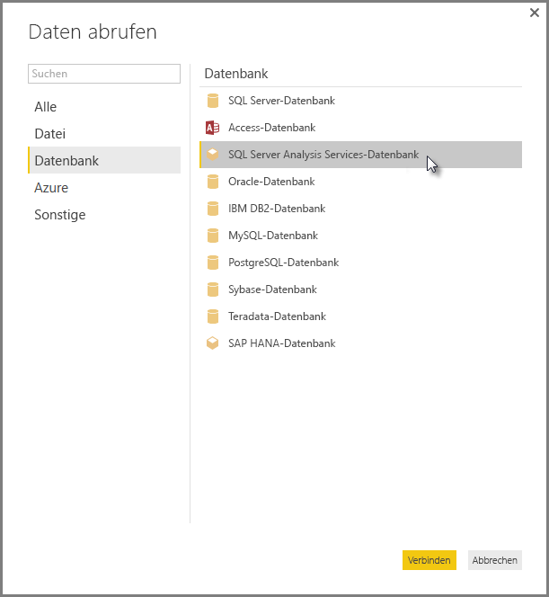

# Herstellen einer Verbindung zu mehrdimensionalen SSAS-Modellen in Power BI Desktop
Mit Power BI Desktop können Sie auf **mehrdimensionale SSAS-Modelle**(häufig als **SSAS MD**bezeichnet) zugreifen.

Zum Herstellen einer Verbindung zu einer **SSAS MD**-Datenbank klicken Sie wie in der folgenden Abbildung dargestellt auf **Daten abrufen &gt; Datenbank &gt; SQL Server Analysis Services-Datenbank**.

**Mehrdimensionale SSAS-Modelle** im Liveverbindungsmodus werden sowohl im Power BI-Dienst als auch in Power BI Desktop unterstützt. Sie können Berichte mit Verwendung von **mehrdimensionalen SSAS-Modellen** auch im Livemodus im Power BI-Dienst veröffentlichen oder in den Dienst hochladen.

## Features und Funktionen von SSAS MD
In den folgenden Abschnitten werden die Features und Funktionen von Power BI- und SSAS MD-Verbindungen beschrieben.

### Tabellarische Metadaten von mehrdimensionalen Modellen
Die folgende Tabelle beschreibt die Beziehungen zwischen mehrdimensionalen Objekten und den tabellarischen Metadaten, die an Power BI Desktop zurückgegeben werden. Power BI fragt die tabellarischen Metadaten aus dem Modell ab. Abhängig von den zurückgegebenen Metadaten werden die entsprechenden DAX-Abfragen für Analysis Services ausgeführt, sobald Sie eine Visualisierung erstellen, wie z.B. eine Tabelle, eine Matrix, ein Diagramm oder einen Datenschnitt („Slicer“).

| Mehrdimensionales BISM-Objekt | Tabellarische Metadaten |
| --- | --- |
| Cube |Modell |
| Cubedimension |Tabelle |
| Dimensionsattribute (Schlüssel), Name |Spalten |
| Measuregruppe |Tabelle |
| Measure |Measure |
| Measures ohne zugeordnete Measuregruppe |Innerhalb einer Tabelle mit dem Namen *Measures* |
| Beziehung Cubedimension -> Measuregruppe |Beziehung |
| Perspektive |Perspektive |
| KPI |KPI |
| Benutzerhierarchien/Hierarchien aus über- und untergeordneten Elementen |Hierarchien |

### Measures, Measuregruppen und KPIs
Measuregruppen in einem mehrdimensionalen Cube werden in Power BI im Bereich **Felder** als Tabellen mit nebenstehenden Zeichen ∑ verfügbar gemacht. Berechnete Measures, die nicht über eine zugeordnete Measuregruppe verfügen, werden in den tabellarischen Metadaten in einer speziellen Tabelle namens *Measures* gruppiert.

In einem mehrdimensionalen Modell können Sie für einen Satz von Measures oder KPIs in einem Cube festlegen, dass diese in einem *Anzeigeordner* abgelegt werden. Dies kann zum Vereinfachen komplexer Modelle beitragen. Power BI erkennt Anzeigeordner in tabellarischen Metadaten und zeigt Measures und KPIs in den Anzeigeordnern an. KPIs in mehrdimensionalen Datenbanken unterstützen *Wert*, *Ziel*, *Statusgrafik* und *Trendgrafik*.

### Dimensionsattributtyp
Mehrdimensionale Modelle unterstützen auch das Zuordnen von Dimensionsattributen zu bestimmten Dimensionsattributtypen. Beispielsweise wird eine Dimension **Geografie**, bei der den Dimensionsattributen *Ort*, *Bundesland/Kanton*, *Land* und *Postleitzahl* die entsprechenden Geografietypen zugeordnet sind, in den tabellarischen Metadaten verfügbar gemacht. Power BI erkennt die Metadaten und ermöglicht es Ihnen dadurch, Kartenvisualisierungen zu erstellen. Damit Sie solche Zuordnungen schnell erkennen können, wird in Power BI im Bereich *Feld* neben dem betreffenden Element ein **Kartensymbol** angezeigt.

Power BI kann auch Bilder darstellen, wenn Sie ein Feld mit den URLs (Uniform Resource Locator) der Bilder angeben. Sie können für diese Felder in SQL Server Data Tools (oder anschließend in Power BI) den Typ *ImageURL* festlegen, und diese Typinformationen werden dann in den tabellarischen Metadaten für Power BI bereitgestellt. Power BI kann dann diese Bilder aus der URL abrufen und in Visualisierungen anzeigen.

### Hierarchien aus über- und untergeordneten Elementen
Mehrdimensionale Modelle unterstützen Hierarchien aus über- und untergeordneten Elementen (Über-/Unterordnungshierarchien). Diese werden in den tabellarischen Metadaten als *Hierarchie* dargestellt. Jede Ebene in einer Über-/Unterordnungshierarchie wird als ausgeblendete Spalte in den tabellarischen Metadaten verfügbar gemacht. Das Schlüsselattribut der über- und untergeordneten Dimension wird in den tabellarischen Metadaten nicht verfügbar gemacht.

### Berechnete Dimensionselemente
Mehrdimensionale Modelle unterstützen das Erstellen verschiedener Arten von *berechneten Elementen*. Die beiden häufigsten Arten von berechneten Elementen sind die folgenden:

* Berechnete Elemente in Attributhierarchien, die nicht mit *Alle* gleichgeordnet sind
* Berechnete Elemente in Benutzerhierarchien

Mehrdimensionale Modelle machen *berechnete Elemente in Attributhierarchien* als Werte in einer Spalte verfügbar. Beim Verfügbarmachen dieser Art von berechneten Elementen gibt es einige zusätzliche Optionen und Einschränkungen:

* Ein Dimensionsattribut kann einen optionalen *UnknownMember* haben.
* Ein Attribut, das berechnete Elemente enthält, kann nicht das Schlüsselattribut der Dimension sein, es sei denn, es ist das einzige Attribut der Dimension.
* Ein Attribut, das berechnete Elemente enthält, kann kein über- und untergeordnetes Attribut sein.

Die berechneten Elemente von Benutzerhierarchien werden nicht in Power BI verfügbar gemacht. Stattdessen können Sie eine Verbindung mit einem Cube herstellen, der die berechneten Elemente in Benutzerhierarchien enthält. Sie können die berechneten Elemente jedoch nur dann anzeigen, wenn sie die Einschränkungen in der vorherigen Aufzählung erfüllen.

### Sicherheit
Mehrdimensionale Modelle unterstützen die Sicherheit auf Dimensions- und Zellenebene mithilfe von *Rollen*. Wenn Sie einen Cube mit Power BI verbinden, werden Sie authentifiziert, und es wird geprüft, ob Sie über die geeigneten Berechtigungen verfügen. Wenn für einen Benutzer *Dimensionssicherheit* festgelegt wurde, sind die entsprechenden Dimensionselemente für den Benutzer in Power BI nicht sichtbar. Wenn für einen Benutzer jedoch eine Berechtigung mit *Zellensicherheit* definiert wurde, bei der Einschränkungen für bestimmte Zellen bestehen, kann dieser Benutzer über Power BI keine Verbindung mit dem Cube herstellen.

## Überlegungen und Einschränkungen
Die Verwendung von **SSAS MD**unterliegt bestimmten Einschränkungen:

* Auf einem Server muss SQL Server 2012 SP1 CU4 oder eine höhere Version von Analysis Services ausgeführt werden, damit der SSAS MD-Connector für Power BI Desktop ordnungsgemäß funktioniert.
* *Aktionen* und *benannte Mengen* werden nicht für Power BI verfügbar gemacht. Dennoch können Sie eine Verbindung mit Cubes herstellen, die auch *Aktionen* oder *benannte Mengen* enthalten, und Sie können entsprechende Visualisierungen und Berichte erstellen.
* Möglicherweise tritt ein Fehler auf, bei dem Power BI Metadaten für ein SSAS-Modell anzeigt, Sie aber keine Modelldaten abrufen können. Dieser Fall kann eintreten, wenn Sie die 32-Bit-Version des MSOLAP-Anbieters auf Ihrem System installiert haben und nicht über die 64-Bit-Version verfügen. Die Installation der 64-Bit-Version kann dieses Problem beheben.

## Unterstützte Features von SSAS MD in Power BI Desktop
Die folgenden Features von SSAS MD werden in Power BI Desktop unterstützt:

* In dieser Version von **SSAS MD** wird die Verwendung der folgenden Elemente unterstützt ([weitere Informationen zu diesen Features](https://msdn.microsoft.com/library/jj969574.aspx)):
  * Anzeigeordner
  * KPI-Trends
  * Standardelemente
  * Dimensionsattribute
  * Berechnete Dimensionselemente (muss ein einzelnes reales Element sein, wenn die Dimension über mehr als ein Attribut verfügt, darf nur das Schlüsselattribut der Dimension sein, wenn es das einzige Attribut ist, und darf kein über- und untergeordnetes Attribut sein)
  * Typen von Dimensionsattributen
  * Hierarchien
  * Measures (mit oder ohne Measuregruppen)
  * Measures als Varianten
  * KPIs
  * ImageUrls
  * Dimensionssicherheit

## Problembehandlung 
In der folgenden Liste sind alle bekannten Probleme beim Verbinden mit SQL Server Analysis Services (SSAS) aufgeführt. 

* **Error: Couldn't load model schema** (Fehler: Modellschema konnte nicht geladen werden.): Dieser Fehler tritt normalerweise nur dann auf, wenn der Benutzer, der versucht, eine Verbindung mit Analysis Services herzustellen, keine Zugriffsberechtigungen für die Datenbank/den Cube besitzt.
