# Erstellen von QuickInfos basierend auf Berichtsseiten in Power BI Desktop
Sie können visuell aufbereitete **QuickInfos für Berichte** erstellen, die beim Zeigen mit der Maus auf Visuals angezeigt werden. Die QuickInfos basieren auf Berichtsseiten, die Sie in **Power BI Desktop** erstellen können. Da Sie die Berichtsseite für eine QuickInfo selbst erstellen, können benutzerdefinierte QuickInfos Visuals, Bilder und jede andere Auflistung von Elementen enthalten, die Sie auf der Berichtsseite erstellen. 

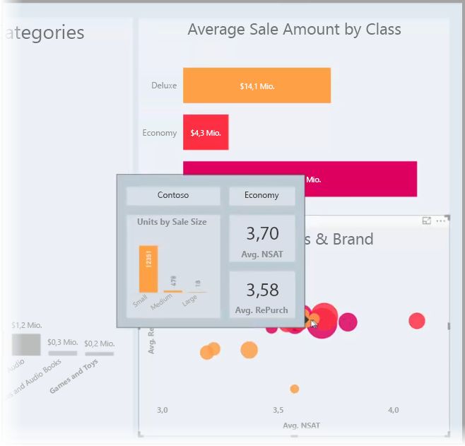

Sie können beliebig viele QuickInfo-Seiten erstellen. Jede QuickInfo-Seite kann einem Feld oder mehreren Feldern in Ihrem Bericht zugeordnet werden. Wenn Sie nun auf ein Visual zeigen, das das ausgewählte Feld enthält, wird die QuickInfo angezeigt, die Sie auf der QuickInfo-Seite erstellt haben, und dies gefiltert nach Datenpunkten, auf die mit der Maus gezeigt wird. 

QuickInfos für Berichte bieten Ihnen viele interessante Möglichkeiten. Erfahren Sie im folgenden Abschnitt, wie Sie QuickInfos erstellen und konfigurieren.

### Aktivieren der Vorschau für QuickInfos 
Ab dem **Power BI Desktop**-Release von September 2018 sind QuickInfos allgemein verfügbar und müssen nicht aktiviert werden. 

Bei Verwendung einer früheren Version von **Power BI Desktop** können Sie es als Vorschaufeature aktivieren, indem Sie in Power BI Desktop auf **Datei > Optionen und Einstellungen > Optionen > Vorschaufeatures** klicken und das Kontrollkästchen neben **QuickInfos zur Berichtsseite** aktivieren. 

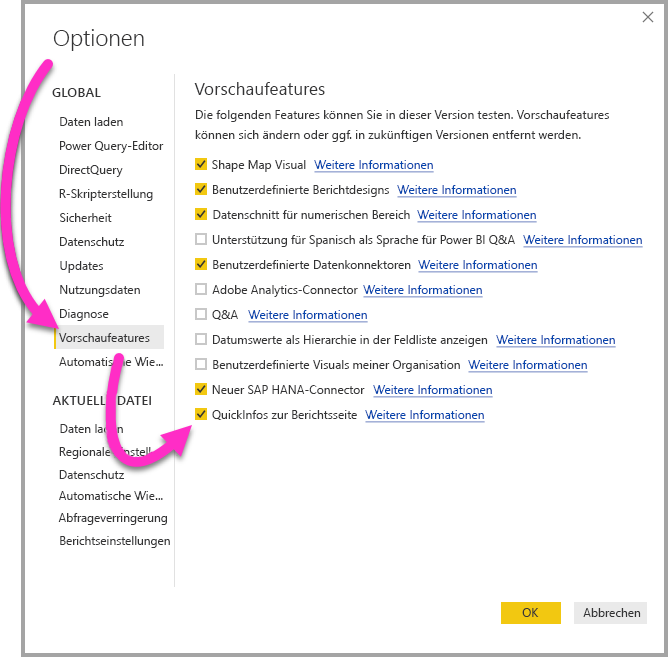

Zum Aktivieren der QuickInfo-Vorschauversion für Berichte müssen Sie **Power BI Desktop** neu starten, nachdem Sie die Auswahl vorgenommen haben.

Grundsätzlich wird ein Upgrade auf das neueste Release von **Power BI Desktop** empfohlen. Dieses ist über einen Link in [Power BI Desktop abrufen](desktop-get-the-desktop.md) erhältlich. 

## Erstellen einer QuickInfo-Berichtsseite
Klicken Sie zunächst auf die **+**-Schaltfläche am unteren Rand des **Power BI Desktop**-Zeichenbereichs im Bereich der Seiten-Registerkarten, um eine neue Berichtsseite zu erstellen. Die Schaltfläche befindet sich neben der letzten Seite des Berichts. 

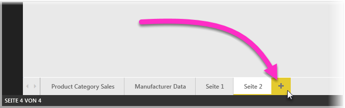

Die Größe der QuickInfo können Sie beliebig wählen. Bedenken Sie jedoch, dass QuickInfos über dem Zeichenbereich des Berichts angezeigt werden und daher relativ klein sein sollten. Im Bereich **Format** wird auf der Karte **Seitengröße** eine neue Seitengrößenvorlage namens *QuickInfo* angezeigt. Diese stellt eine Zeichenbereichsgröße für Berichtsseiten bereit, die für QuickInfos geeignet ist.

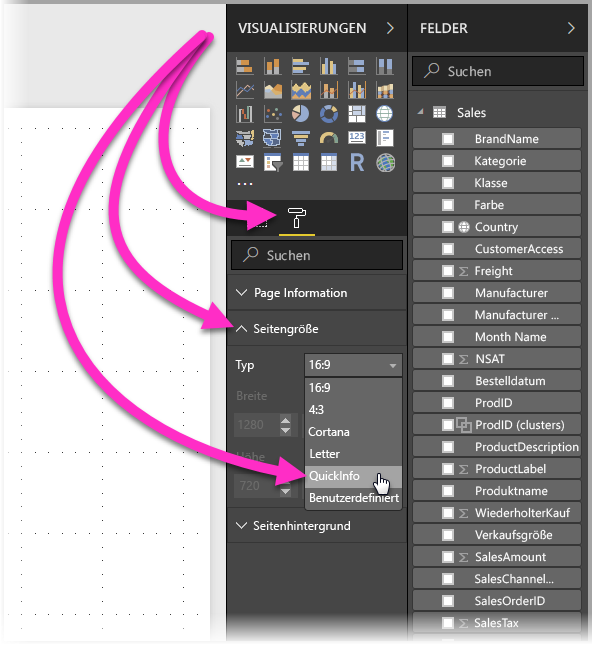

Standardmäßig wird der Zeichenbereich für den Bericht in **Power BI Desktop** an den verfügbaren Platz auf der Seite anpasst. Diese Einstellung passt zwar in vielen Fällen, jedoch nicht im Fall von QuickInfos. Ändern Sie die **Seitenansicht** in die tatsächliche Größe, damit die spätere Darstellung der QuickInfo angezeigt wird. 

Wählen Sie hierfür aus dem Menüband die Registerkarte **Ansicht** aus. Klicken Sie anschließend wie in der folgenden Abbildung dargestellt auf **Seitenansicht > Tatsächliche Größe**.

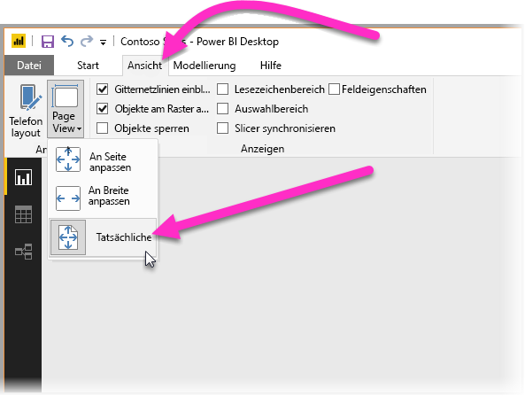

Sie können der Berichtsseite auch einen eindeutigen Namen geben. Wählen Sie hierzu im Bereich **Format** die Karte **Seiteninformationen** aus, und geben Sie den entsprechenden Namen in das Feld **Namen** ein. In der folgenden Abbildung lautet der Name des QuickInfo-Berichts *QuickInfo 1*. Sie können jedoch jeden beliebigen Namen eingeben.

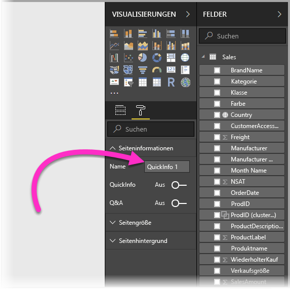

Hier können Sie nun beliebige Visuals erstellen, die in der QuickInfo angezeigt werden sollen. Die folgende Abbildung zeigt eine QuickInfo-Seite mit zwei Karten und einem gruppierten Balkendiagramm sowie einer Hintergrundfarbe für die Seite selbst und für die jeweiligen Visuals.

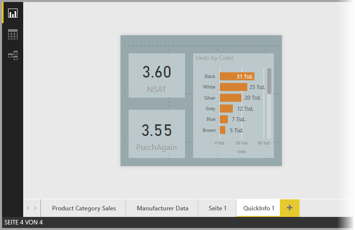

Damit die QuickInfo-Berichtsseite auch als QuickInfo ausgeführt wird, sind noch weitere Schritte erforderlich. Erfahren Sie im nächsten Abschnitt, wie die QuickInfo-Seite in mehreren Schritten konfiguriert werden muss. 

## Konfigurieren der QuickInfo-Berichtsseite

Nachdem die QuickInfo-Berichtsseite erstellt wurde, muss sie konfiguriert werden, damit **Power BI Desktop** sie als QuickInfo registriert. Außerdem stellen Sie so sicher, dass die Seite beim Zeigen auf die korrekten Visuals angezeigt wird.

Verschieben Sie in der Karte **Seiteninformationen** zunächst den **QuickInfo**-Schieberegler auf **Ein**, damit aus der Seite eine QuickInfo wird. 

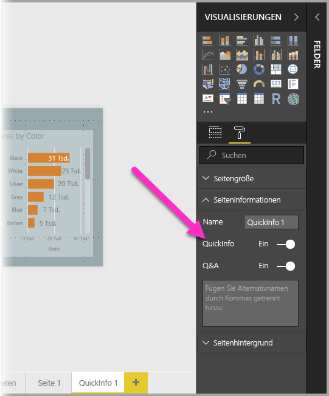

Geben Sie anschließend die Felder an, für die die QuickInfo angezeigt werden soll. Die QuickInfo wird für Visuals im Bericht angezeigt, die das von Ihnen angegebene Feld enthalten. Sie können ein oder mehrere Felder angeben, indem Sie es vom **Felder**-Abschnitt des Bereichs **Visualisierungen** in den Bucket **QuickInfo-Felder** ziehen. In der folgenden Abbildung wurde das Feld *SalesAmount* in den Bucket **QuickInfo-Felder** gezogen.

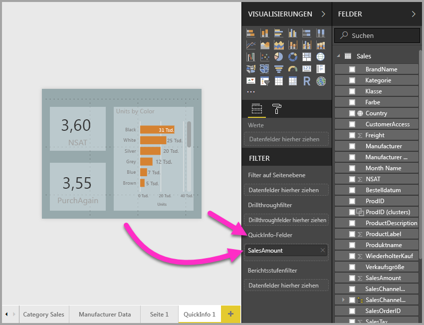
 
Sie können dem Bucket **QuickInfo-Felder** sowohl numerische als auch Kategoriefelder hinzufügen, einschließlich Measures.

Die fertiggestellte QuickInfo-Berichtsseite wird nun als QuickInfo in Visuals des Berichts angezeigt, die eines der im Bucket **QuickInfo-Felder** platzierten Felder verwenden. Dabei wird die Standard-QuickInfo von Power BI durch diese Seite ersetzt.

## Manuelles Festlegen einer QuickInfo für Berichte

Neben der Erstellung einer QuickInfo, die automatisch beim Zeigen auf ein Visual angezeigt wird, das das angegebene Feld enthält, können Sie eine QuickInfo auch manuell festlegen. 

Visuals, die QuickInfos für Berichte unterstützen, verfügen im Bereich **Formatierung** über eine **QuickInfo**-Karte. 

Wählen Sie zum manuellen Festlegen einer QuickInfo zunächst das Visual aus, für das die manuelle QuickInfo angezeigt werden soll. Klicken Sie anschließend im Bereich **Visualisierungen** auf den Abschnitt **Format**, und erweitern Sie die Karte **QuickInfo**.

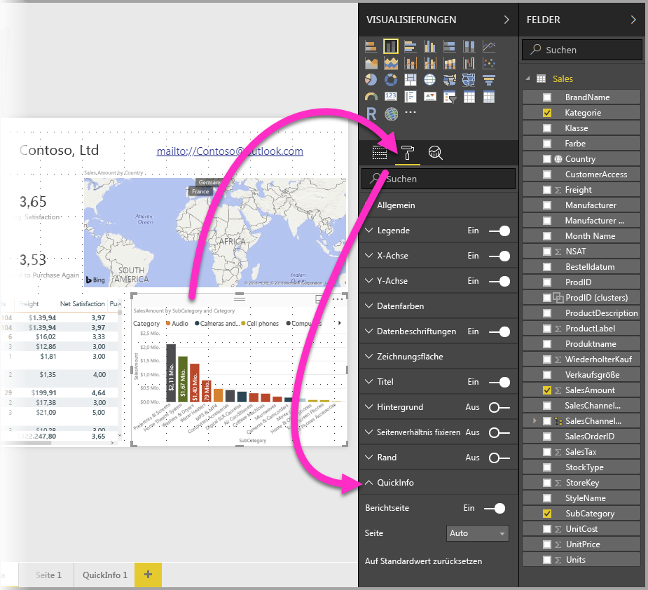

Wählen Sie aus der Dropdownliste **Seite** die QuickInfo-Seite aus, die Sie für das ausgewählte Visual verwenden möchten. Beachten Sie, dass nur als **QuickInfo**-Seiten angegebene Berichtsseiten im Dialogfeld angezeigt werden.

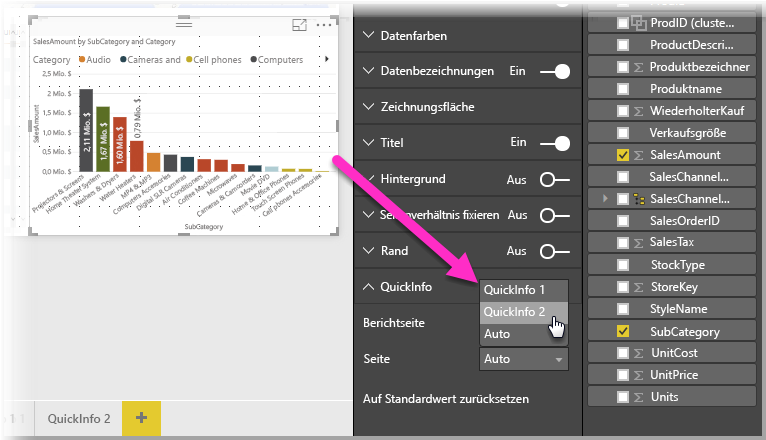

Es gibt viele Verwendungsmöglichkeiten für manuell festgelegte QuickInfos. Sie können etwa eine leere Seite als QuickInfo festlegen und dadurch die Standardauswahl für Power BI-QuickInfos überschreiben. Sie können diese Methode auch verwenden, wenn Sie nicht möchten, dass die automatisch von Power BI ausgewählte QuickInfo angezeigt wird. Bei einem Visual mit zwei Feldern, denen jeweils eine QuickInfo zugeordnet ist, wird von Power BI beispielsweise nur eine der beiden QuickInfos angezeigt. In diesem Fall können Sie manuell auswählen, welche QuickInfo angezeigt werden soll.

## Wiederherstellen der Standard-QuickInfos

Wenn Sie für ein Visual eine manuelle QuickInfo erstellt haben, stattdessen jedoch die Standard-QuickInfo anzeigen möchten, können Sie jederzeit zur Standard-QuickInfo von Power BI zurückkehren. Wählen Sie dazu in der erweiterten **QuickInfo**-Karte des ausgewählten Visuals aus der Dropdownliste **Seite** die Option *Auto* aus, um zur Standardauswahl zurückzukehren.

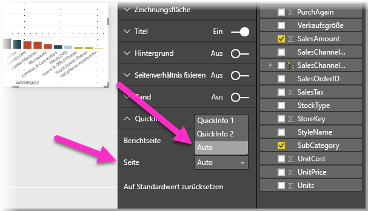

## Benutzerdefinierte QuickInfos und Liniendiagramme

Bei der Interaktion von QuickInfos für Berichte mit Liniendiagramm-Visuals sowie mit Visuals mit Kreuzhervorhebung sollten Sie folgende Aspekte beachten:

### QuickInfos und Liniendiagramme

Bei QuickInfos für Liniendiagramme wird nur eine QuickInfo für alle Linien im Diagramm angezeigt. Dies ist vergleichbar mit dem Standardverhalten von QuickInfos für Liniendiagramme, bei dem auch nur eine QuickInfo anzeigt wird. 

Dies liegt daran, dass das Feld in der Legende nicht als Filter für die QuickInfo übergeben wird. Die folgende Abbildung zeigt eine QuickInfo für alle an jenem Tag verkauften Einheiten für alle drei in der QuickInfo angezeigten Klassen (in diesem Beispiel Deluxe, Economy und Regular). 

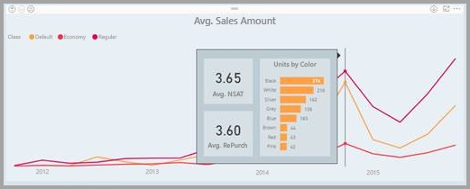

### QuickInfos und Kreuzhervorhebung

Bei einer Kreuzhervorhebung für ein Visual in einem Bericht zeigen QuickInfos für Berichte immer die Daten mit Kreuzhervorhebung an. Dies gilt auch beim Zeigen auf den ausgeblendeten Abschnitt des Datenpunkts. In der folgenden Abbildung zeigt die Maus auf den ausgeblendeten (nicht hervorgehobenen) Abschnitt des Balkendiagramms. Die QuickInfo für Berichte zeigt jedoch die Daten für den hervorgehobenen Bereich dieses Datenpunkts (die hervorgehobenen Daten) an.

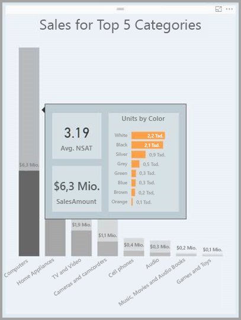

## Einschränkungen und Überlegungen
Folgende Einschränkungen und Überlegungen sollten Sie bei **QuickInfos** berücksichtigen:

* Ab dem **Power BI Desktop**-Release von September 2018 sind QuickInfos allgemein verfügbar und werden auch von Kartenvisuals unterstützt.
* Ab dem **Power BI Desktop**-Release von Juli 2018 werden Tabellen- und Matrixvisuals für QuickInfos unterstützt. 
* QuickInfos für Berichte werden nicht beim Anzeigen von Berichten in mobilen Apps oder in eingebetteten Umgebungen unterstützt, einschließlich Webveröffentlichungen. 
* QuickInfos für Berichte werden nicht für benutzerdefinierte Visuals unterstützt. 
* Cluster werden derzeit nicht als Felder unterstützt, die in QuickInfos für Berichte angezeigt werden können. 
* Bei der Auswahl eines Felds zur Anzeige in einer QuickInfo für Berichte und beim Vergleich von Feld und Kategorie gilt, dass Visuals, die dieses Feld enthalten, die angegebene QuickInfo nur anzeigen, wenn die Zusammenfassung mit dem ausgewählten Feld übereinstimmt. 

## Nächste Schritte
Weitere Informationen zu Features, die QuickInfos für Berichte ähneln oder mit diesen interagieren, finden Sie in den folgenden Artikeln:

* [Verwenden der Drillthroughfunktion in Power BI Desktop](desktop-drillthrough.md)
* [Anzeigen einer Dashboardkachel oder eines Berichtsvisuals im Fokusmodus](service-focus-mode.md)

