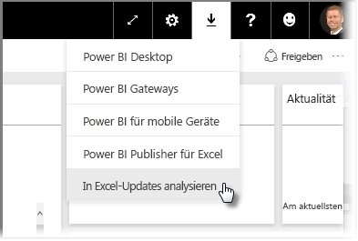
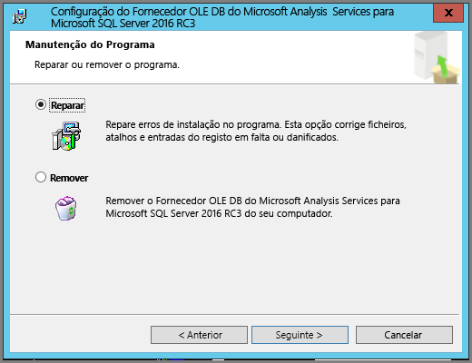
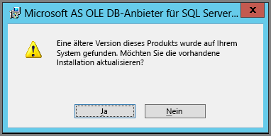

# Problembehandlung bei „In Excel analysieren“
Es kann bei der Verwendung von „In Excel analysieren“ vorkommen, dass ein unerwartetes Ergebnis auftritt oder eine Funktion nicht wie erwartet funktioniert. Diese Seite enthält Lösungen für häufige Probleme bei der Verwendung von „In Excel analysieren“.

> [!NOTE]
> Auf einer separaten Seite finden Sie eine Beschreibung und Aktivierungshinweise für [In Excel analysieren](service-analyze-in-excel.md).
> 
> Falls bei Ihnen ein Fall auftritt, der hier nicht aufgelistet ist, und es Ihnen Probleme verursacht, können Sie auf der [Communitywebsite](http://community.powerbi.com/) um Hilfe bitten oder ein [Supportticket](https://powerbi.microsoft.com/support/) erstellen.
> 
> 

Dieser Artikel enthält Anweisungen zum Vorgehen bei den folgenden Problemen:

* Aktualisieren von Excel-Bibliotheken für den OLE DB-Anbieter
* Ermitteln des Aktualisierungsbedarfs Ihrer Excel-Bibliotheken
* Fehler „Es kann keine Verbindung hergestellt werden“
* Fehler „Verboten“
* Fehlende Datenmodelle
* Fehler „Token abgelaufen“
* Fehler beim Versuch, auf lokale Analysis Services zuzugreifen
* Ziehen in den Wertebereich von PivotTables nicht möglich (keine Measures)

## Aktualisieren von Excel-Bibliotheken für den OLE DB-Anbieter
Um **In Excel analysieren** verwenden zu können, muss auf dem Computer ein aktueller AS OLE DB-Anbieter installiert sein. Dieser [Communitybeitrag](http://community.powerbi.com/t5/Service/Analyze-in-Excel-Initialization-of-the-data-source-failed/m-p/30837#M8081) ist eine hervorragende Quelle, um die Installation des OLE DB-Anbieters zu überprüfen oder eine neuere Version herunterladen.

Die Excel-Bibliotheken müssen der Windows-Version (32 Bit/64 Bit) entsprechen. Falls Sie 64-Bit-Windows installiert haben, muss der 64-Bit-OLE DB-Anbieter installiert werden.

Um die neuesten Excel-Bibliotheken herunterzuladen, wechseln Sie zu Power BI, und wählen Sie den **nach unten weisenden Pfeil** in der oberen rechten Ecke des Diensts aus. Wählen Sie dann **In Excel-Updates analysieren**.

Wählen Sie im angezeigten Dialogfeld die Option **Download (Vorschau)** aus.

## Ermitteln des Aktualisierungsbedarfs Ihrer Excel-Bibliotheken
Sie können die neueste Version der Excel-OLE DB-Anbieter-Bibliotheken über die Links im vorherigen Abschnitt herunterladen. Nachdem Sie die entsprechende OLE DB-Anbieterbibliothek heruntergeladen haben und mit der Installation beginnen, erfolgt eine Prüfung der derzeitig installierten Version.

Falls die Clientbibliotheken Ihres Excel-OLE DB-Anbieters auf dem aktuellen Stand sind, wird ein Dialogfeld angezeigt, das wie folgt aussieht:

C:\Users\davidi\Desktop\powerbi-content-pr\articles\media\powerbi-desktop-troubleshooting-analyze-in-excel

Falls jedoch die zu installierende Version neuer ist als die auf dem Computer, wird folgendes Dialogfeld angezeigt:

Wenn das Dialogfeld zu einem Upgrade auffordert, sollten Sie mit der Installation fortfahren, um die aktuellste Version des OLE DB-Anbieters auf Ihrem Computer zu erhalten.

## Fehler „Es kann keine Verbindung hergestellt werden“
Die Hauptursache für den Fehler *Es kann keine Verbindung hergestellt werden* ist, dass die Clientbibliotheken des OLE DB-Anbieters auf dem Computer nicht aktuell sind. Weitere Informationen zum Ermitteln des richtigen Updates sowie den Downloadlink finden Sie unter **Aktualisieren von Excel-Bibliotheken für den OLE DB-Anbieter** weiter oben in diesem Artikel.

## Fehler „Verboten“
Einige Benutzer haben mehr als ein Power BI-Konto, und wenn Excel versucht, mit den vorhandenen Anmeldeinformationen eine Verbindung zu Power BI herzustellen, können dabei Anmeldeinformationen verwendet werden, die keine Zugriffsrechte für das gewünschte Dataset oder den gewünschten Bericht umfassen.

In diesem Fall kann die Fehlermeldung **Verboten** angezeigt werden. Diese kann bedeuten, dass Sie möglicherweise mit Anmeldeinformationen bei Power BI angemeldet sind, mit denen Sie keine Berechtigung für das Dataset erhalten. Sollte die Fehlermeldung **Verboten** auftreten, geben Sie bei der Abfrage Ihrer Anmeldeinformationen diejenigen an, die Zugriffsrechte auf das Dataset beinhalten, das Sie verwenden möchten.

Sollten weiterhin Fehler auftreten, melden Sie sich bei Power BI mit einem berechtigten Konto an, und prüfen Sie, ob das Dataset, das Sie in Excel aufrufen möchten, angezeigt wird und Sie darauf zugreifen können.

## Fehlende Datenmodelle
Wenn der Fehler **Can't find OLAP cube model** (OLAP-Cube-Modell wurde nicht gefunden) auftritt, besitzt das Dataset, auf das Sie zugreifen möchten, kein Datenmodell und lässt sich daher in Excel nicht analysieren.

## Fehler „Token abgelaufen“
Wenn der Fehler **Token abgelaufen** angezeigt wird, bedeutet dies, dass die Funktion **In Excel analysieren** auf dem verwendeten Computer längere Zeit nicht genutzt wurde. Geben Sie Ihre Anmeldeinformationen einfach erneut ein, oder öffnen Sie die Datei erneut, um den Fehler zu beheben.

## Fehler beim Versuch, auf lokale Analysis Services zuzugreifen
Bei dem Versuch, auf ein Dataset zuzugreifen, das Verbindungen zu lokalen Analysis Services-Daten enthält, kann eine Fehlermeldung angezeigt werden. **In Excel analysieren** unterstützt das Herstellen einer Verbindung mit Datasets und Berichten in lokalen **Analysis Services** mit einer Verbindungszeichenfolge, solange der Computer sich in der gleichen Domäne wie der **Analysis Services**-Server befindet und Ihr Konto Zugriff auf den **Analysis Services**-Server hat.

## Ziehen in den Wertebereich von PivotTables nicht möglich (keine Measures)
Wenn über **In Excel analysieren** eine Verbindung mit einem externen OLAP-Modell hergestellt wird (Verbindungsmethode von Excel zu Power BI), benötigt die *PivotTable* [**Measures**, die im externen Modell festgelegt werden](https://support.microsoft.com/kb/234700), da alle Berechnungen auf dem Server ausgeführt werden. Hier besteht ein Unterschied zur Arbeit mit einer lokalen Datenquelle (wie Tabellen in Excel oder Datensätzen in **Power BI Desktop** oder beim **Power BI-Dienst**). In diesem Fall steht das Tabellenmodell lokal zur Verfügung. Daher können Sie [implizite Measures verwenden](https://msdn.microsoft.com/library/gg399077.aspx). Diese werden dynamisch generiert und nicht im Datenmodell gespeichert. Hierbei unterscheidet sich das Verhalten in Excel von dem in **Power BI Desktop** oder im **Power BI-Dienst**: Die Daten können Spalten enthalten, die in Power BI als Measures verarbeitet werden, in Excel aber nicht als Werte (Measures) verwendet werden können.

Sie haben verschiedene Möglichkeiten, dieses Problem zu beheben:

1. [Erstellen Sie in **Power BI Desktop** Measures in Ihrem Datenmodell](desktop-tutorial-create-measures.md). Veröffentlichen Sie das Datenmodell dann mithilfe des **Power BI-Diensts**. Greifen Sie dann aus Excel auf das veröffentlichte Dataset zu.
2. [Erstellen Sie Measures aus Excel PowerPivot in Ihrem Datenmodell.](https://support.office.com/article/Create-a-Measure-in-Power-Pivot-d3cc1495-b4e5-48e7-ba98-163022a71198)
3. Wenn Sie Daten aus einer Excel-Arbeitsmappe, die nur Tabellen enthält (und über kein Datenmodell verfügt), importiert haben, können Sie [die Tabellen zum Datenmodell hinzufügen](https://support.office.com/article/Add-worksheet-data-to-a-Data-Model-using-a-linked-table-d3665fc3-99b0-479d-ba09-a37640f5be42). Befolgen Sie dann die Schritte aus Option 2 (direkt über dieser Anweisung), um Measures im Datenmodell zu erstellen.

Sobald die Measures im Modell des Power BI-Diensts definiert wurden, können Sie diese im Bereich **Werte** der Excel-PivotTables verwenden.

## Nächste Schritte
[In Excel analysieren](service-analyze-in-excel.md)

[Tutorial: Erstellen eigener Measures in Power BI Desktop](desktop-tutorial-create-measures.md)

[Measures in PowerPivot](https://msdn.microsoft.com/library/gg399077.aspx)

[Erstellen eines Measures in PowerPivot](https://support.office.com/article/Create-a-Measure-in-Power-Pivot-d3cc1495-b4e5-48e7-ba98-163022a71198)

[Hinzufügen von Arbeitsblattdaten zu einem Datenmodell mithilfe einer verknüpften Tabelle](https://support.office.com/article/Add-worksheet-data-to-a-Data-Model-using-a-linked-table-d3665fc3-99b0-479d-ba09-a37640f5be42)

[Unterschiede zwischen PivotTables in Excel mit und ohne OLAP](https://support.microsoft.com/kb/234700)

