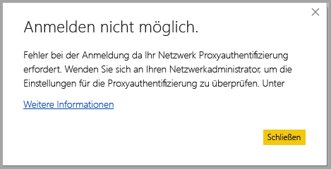
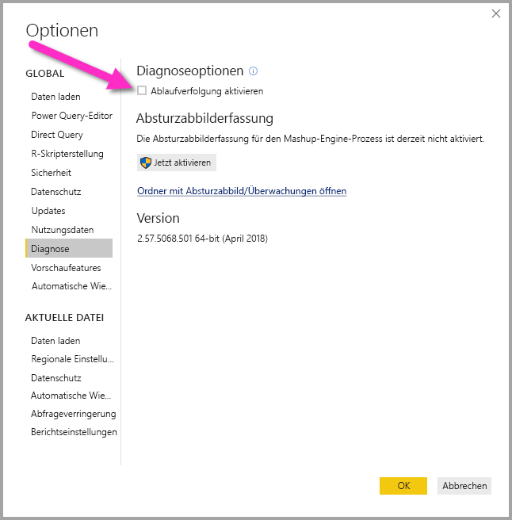

# Problembehandlung zur Anmeldung bei Power BI Desktop
Möglicherweise treten manchmal Fehler auf, wenn Sie versuchen, sich bei **Power BI Desktop** anzumelden. Es gibt zwei Hauptgründe für Anmeldeprobleme: **Proxyauthentifizierungsfehler** und **Nicht-HTTPS-URL-Umleitungsfehler**. 

Der erste Schritt, um die Ursache Ihres Anmeldeproblems zu bestimmen, ist, dass Sie sich an Ihren Administrator wenden und ihm Diagnoseinformationen vorlegen, damit er die Ursache des Problems bestimmen kann. Indem der Administrator die in Verbindung mit Ihrem Anmeldeproblem im Einzelnen auftretenden Schwierigkeiten verfolgt, kann er bestimmen, welche der folgenden Fehler bei Ihnen vorliegen. 

Betrachten wir nun der Reihe nach diese einzelnen Schwierigkeiten. Am Ende dieses Artikels finden Sie eine Erörterung zum Aufzeichnen einer *Ablaufverfolgung* in Power BI Desktop, die die Problembehandlung erleichtern kann.

## Fehler: Proxyauthentifizierung erforderlich

Der folgende Bildschirm zeigt ein Beispiel für den Fehler *Proxyauthentifizierung erforderlich*.

Die folgenden Ausnahmen in *Power BI Desktop*-Ablaufverfolgungsdateien sind mit diesem Fehler verknüpft:

* *Microsoft.PowerBI.Client.Windows.Services.PowerBIWebException*
* *HttpStatusCode: ProxyAuthenticationRequired*

Die wahrscheinlichste Ursache für diesen Fehler ist, dass ein Proxyauthentifizierungsserver in Ihrem Netzwerk die Webanforderungen von **Power BI Desktop** blockiert. 

Wenn in Ihrem Netzwerk ein Proxyauthentifizierungsserver verwendet wird, kann Ihr Administrator dieses Problem durch das Whitelisting der folgenden Domänen auf dem Proxyauthentifizierungsserver beheben:

* app.powerbi.com
* api.powerbi.com
* Domänen im Namespace *.analysis.windows.net

Für Kunden, die Teil einer Behördencloud sind, kann dieses Problem durch das Whitelisting der folgenden Domänen auf dem Proxyauthentifizierungsserver behandelt werden:

* app.powerbigov.us
* api.powerbigov.us
* Domänen im Namespace *.analysis.usgovcloudapi.net

## Fehler: Nicht-HTTPS-URL-Umleitung wird nicht unterstützt

Aktuelle Versionen von **Power BI Desktop** verwenden die aktuelle Version der Active Directory Authentication Library (ADAL), die keine Umleitung an nicht gesicherte URLs (nicht-HTTPS) zulässt. 

Die folgenden Ausnahmen in *Power BI Desktop*-Ablaufverfolgungsdateien sind mit diesem Fehler verknüpft:

* *Microsoft.IdentityModel.Clients.ActiveDirectory.AdalServiceException: Nicht-HTTPS-URL-Umleitung wird in Webansicht nicht unterstützt*
* *ErrorCode: non_https_redirect_failed*

Wenn *ErrorCode: non_https_redirect_failed* auftritt, bedeutet dies, dass mindestens eine Umleitungsseite oder ein Anbieter in der Umleitungskette kein HTTPS-geschützter Endpunkt ist, oder dass ein Zertifikatsaussteller einer oder mehrerer Umleitungen nicht zu den vertrauenswürdigen Stammzertifizierungsstellen des Geräts zählt. Alle Anbieter in einer Anmeldeumleitungskette müssen eine HTTPS-URL verwenden. Um dieses Problem zu behandeln, wenden Sie sich an Ihren Administrator, und fordern Sie an, dass gesicherte URLs für ihre Authentifizierungswebsites verwendet werden. 

## Gewusst wie: Sammeln einer Ablaufverfolgung in Power BI Desktop

Um eine Ablaufverfolgung in **Power BI Desktop** zu sammeln, gehen Sie folgendermaßen vor:

1. Aktivieren Sie die Ablaufverfolgung in **Power BI Desktop**, indem Sie zu **Datei > Optionen und Einstellungen > Optionen** wechseln und dann **Diagnose** aus den Optionen im linken Bereich auswählen. Aktivieren Sie im dann angezeigten Bereich das Kontrollkästchen neben **Ablaufverfolgung aktivieren**, wie in der folgenden Abbildung dargestellt. Möglicherweise müssen Sie **Power BI Desktop** neu starten.
   
   

2. Führen Sie dann die Schritte aus, die den Fehler reproduzieren. Wenn der Fehler auftritt, fügt **Power BI Desktop** dem Ablaufverfolgungsprotokoll, das auf dem lokalen Computer verwaltet wird, Ereignisse hinzu.

3. Navigieren Sie zu dem Ordner „Traces“ auf dem lokalen Computer. Um diesen Ordner zu finden, wählen Sie den Link in **Diagnose** aus, wo Sie die Ablaufverfolgung aktiviert haben – *Ordner mit Absturzabbild/Überwachungen öffnen* in der vorherigen Abbildung. Häufig befindet er sich auf dem lokalen Computer an folgendem Speicherort:

    `C:\Users/<user name>/AppData/Local/Microsoft/Power BI Desktop/Traces`

Dieser Ordner enthält möglicherweise viele Ablaufverfolgungsdateien. Stellen Sie sicher, dass Sie nur die zuletzt verwendeten Dateien an Ihren Administrator senden, um die schnelle Identifikation des Fehlers zu erleichtern. 

