# Tutorial: Facebook-Analysen mit Power BI Desktop

In diesem Tutorial erfahren Sie, wie Sie Daten aus Facebook importieren und in Power BI Desktop verwenden. Sie verbinden und importieren Daten von der Power BI-Facebook-Seite, wenden Transformationen auf die importierten Daten an und verwenden die Daten in Berichtsvisualisierungen.

## Herstellen der Verbindung mit einer Facebook-Seite

In diesem Tutorial werden Daten von der [Microsoft Power BI-Facebook-Seite](https://www.facebook.com/microsoftbi) (*https://www.facebook.com/microsoftbi*) verwendet. Um sich mit dieser Seite zu verbinden und Daten zu importieren, benötigen Sie keine besonderen Anmeldeinformationen, sondern lediglich ein persönliches Facebook-Konto.

1. Öffnen Sie Power BI Desktop, und wählen Sie im Dialogfeld **Erste Schritte** oder auf der Registerkarte des Menübands **Start** die Option **Daten abrufen**. Wählen Sie dann **Daten abrufen** und anschließend **Mehr...**.
   
2. Wählen Sie im Dialogfeld **Daten abrufen** aus der Gruppe **Onlinedienste** die Option **Facebook** aus, und wählen Sie dann **Verbinden**.
   
   
   
   Ein Dialogfeld wird angezeigt, das Sie vor den Risiken bei Verwendung eines Drittanbieterdiensts warnt.
   
   
   
3. Wählen Sie **Weiter** aus. Das Dialogfeld **Facebook** wird angezeigt.
   
4. Geben Sie im Dialogfeld den Seitennamen **microsoftbi** in das Textfeld **Benutzername** ein, oder kopieren Sie diesen hinein, und wählen Sie dann aus der Dropdownliste **Verbindung** die Option **Beiträge** aus. Klicken Sie dann auf **OK**.
   
   
   
5. Wenn Sie zur Eingabe von Anmeldeinformationen aufgefordert werden, melden Sie sich mit Ihrem Facebook-Konto an, um Power BI den Zugriff über Ihr Konto zu gewähren.
   
   

   Nach dem Herstellen der Verbindung mit der Power BI-Facebook-Seite sehen Sie eine Vorschau der Daten auf der Seite **Beiträge**. 
   
   
   
## Strukturieren und Transformieren der importierten Daten

Sie wollen anzeigen, welche Beiträge im Laufe der Zeit die meisten Kommentare haben. In der Vorschau der **Beiträge** stellen Sie jedoch fest, dass die Daten von **created_time** schwer zu lesen und zu verstehen sind, und es überhaupt keine Kommentare gibt. Sie müssen die Daten zunächst strukturieren und bereinigen, damit Sie diese optimal nutzen können. Mit dem **Power Query-Editor** von Power BI Desktop können Sie die Daten vor oder nach dem Import in Power BI Desktop bearbeiten. 

### Unterteilen der Spalte für Datum/Uhrzeit

Unterteilen Sie zunächst die Werte für Datum und Uhrzeit in der Spalte **created_time** für eine bessere Lesbarkeit. 

1. Wählen Sie in der Facebook-Datenvorschau **Bearbeiten** aus. 
   
   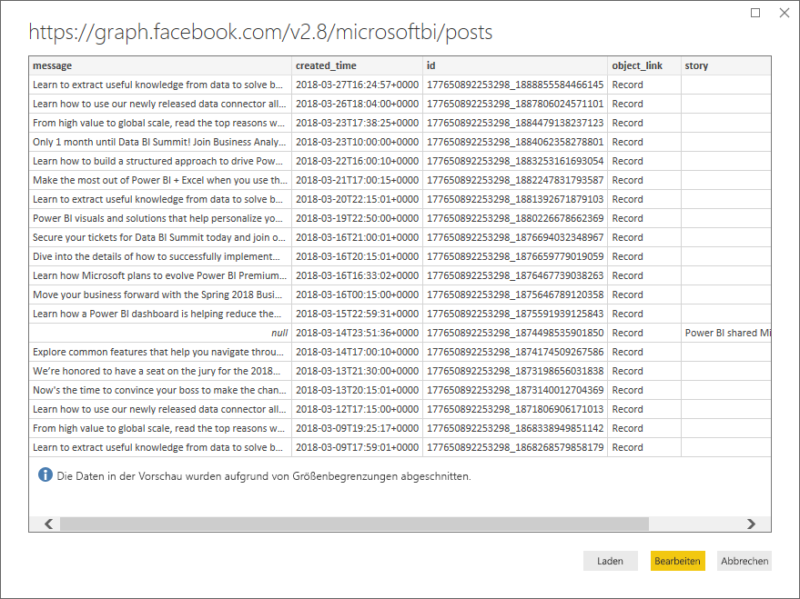
   
   Der **Power Query-Editor** von Power BI Desktop wird in einem neuen Fenster geöffnet und zeigt die Datenvorschau von der Power BI-Facebook-Seite an. 
   
   
   
2. Wählen Sie die Spalte **created_time** aus. Beachten Sie, dass es sich aktuell um einen Textdatentyp handelt, der durch ein **ABC**-Symbol in der Spaltenüberschrift gekennzeichnet ist. Klicken Sie mit der rechten Maustaste auf die Spaltenüberschrift, und wählen Sie in der Dropdownliste **Spalte teilen > Nach Trennzeichen** aus, oder wählen Sie im Menüband auf der Registerkarte „Start“ unter **Transformieren** die Option **Spalte teilen > Nach Trennzeichen** aus.  
   
   
   
3. Wählen Sie im Dialogfeld **Spalte nach Trennzeichen teilen** im der Dropdownliste die Option **Benutzerdefiniert** aus, geben Sie im Eingabefeld das Zeichen **T** ein (welches den Anfang des Uhrzeitteils in den Werten „created_time“ angibt), und wählen Sie dann **OK**. 
   
   
   
   Die Spalte wird in zwei Spalten unterteilt, die die Zeichenfolgen vor und nach dem **T**-Trennzeichen enthalten und **created_time.1** bzw. **created_time.2** benannt sind. Beachten Sie, dass Power BI die Datentypen **Datum** für die erste Spalte und **Uhrzeit** für die zweite Spalte automatisch erkannt und geändert hat. Die Datums- und Zeitwerte wurden so formatiert, dass sie besser lesbar sind.
   
4. Benennen Sie die Spalten um, indem Sie auf jede Spaltenüberschrift doppelklicken oder jede Spalte markieren und dann im Menüband in der Registerkarte **Transformation** in der Gruppe **Jede Spalte** die Option **Umbenennen** auswählen und die neuen Spaltenüberschriften **created_date** bzw. **created_time** eingeben.
   
   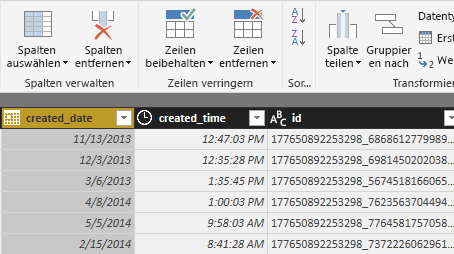
   
### Erweitern der geschachtelten Spalte

Jetzt, da die Datums- und Zeitdaten so sind, wie Sie sie haben möchten, können Sie die Kommentardaten anzeigen, indem Sie eine geschachtelte Spalte erweitern. 

1. Markieren Sie die Spalte **object_link**, und wählen Sie dann das , um das Dialogfeld **Erweitern/Aggregieren** zu öffnen. Wählen Sie **Verbindungen**, und wählen Sie dann **OK**. 
   
   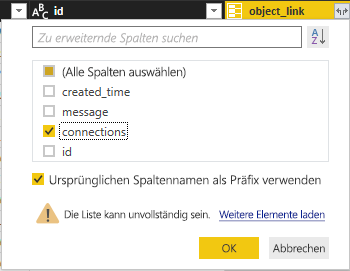
   
   Die Spaltenüberschriften werden in **object_link.connections** geändert.
2. Wählen Sie erneut oben in der Spalte **object_link.connections** das , wählen Sie **Kommentare**, und wählen Sie dann **OK**. Die Spaltenüberschriften werden in **object_link.connections.comments** geändert.
   
3. Wählen Sie oben in der Spalte **object_link.connections.comments** das , und wählen Sie diesmal im Dialogfeld **Aggregieren** anstelle von „Erweitern“. Wählen Sie **# Anzahl von ID**, und wählen Sie dann **OK**. 
   
   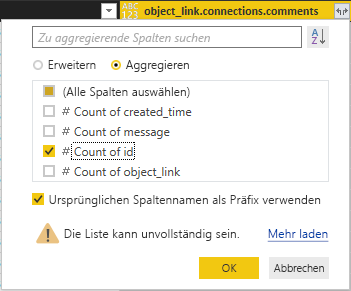
   
   In der Spalte wird nun die Anzahl von Kommentaren für jede Nachricht angezeigt. 
   
4. Benennen Sie die Spalte **Anzahl von object_link.connections.comments.id** in **Anzahl von Kommentaren** um.
   
5. Wählen Sie den Abwärtspfeil neben der Überschrift **Anzahl von Kommentaren**, und wählen Sie **Absteigend sortieren**, um die Beiträge von den meisten bis zu den wenigsten Kommentaren zu sortieren. 
   
   
   
### Überprüfen der Abfrageschritte

Während Sie Daten im **Power Query-Editor** strukturiert und transformiert haben, wurde jeder Schritt auf der rechten Seite des Power Query-Editor-Fensters im Bereich **Abfrageeinstellungen** im Abschnitt **Angewendete Schritte** aufgezeichnet. Sie können durch die angewandten Schritte zurückgehen, um genau zu sehen, welche Änderungen Sie vorgenommen haben, und sie bei Bedarf bearbeiten, löschen oder neu anordnen (obwohl dies riskant sein kann, da das Ändern vorhergehender Schritte spätere Schritte beeinträchtigen kann). 

Nach dem Anwenden der bisherigen Datentransformationen sollte der Abschnitt „Angewendete Schritte“ wie folgt aussehen:
   
   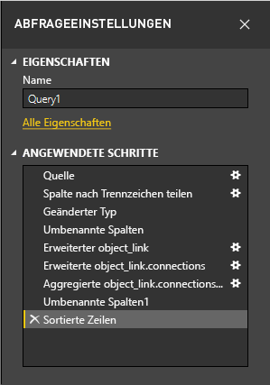
   
   >[!TIP]
   >Den angewendeten Schritten liegen Formeln zugrunde, die in der **Power Query-Sprache**, auch bekannt als **M**-Sprache, geschrieben sind. Zum Anzeigen und Bearbeiten der Formeln wählen Sie in der Registerkarte „Start“ des Menübands in die Gruppe **Abfrage** die Option **Erweiterter Editor**. 

### Importieren der transformierten Daten

Wenn Sie mit den Daten zufrieden sind, wählen Sie in der Registerkarte „Start“ des Menübands **Schließen und übernehmen** > **Schließen und übernehmen**, um sie in Power BI Desktop zu importieren. 
   
   
   
   Es wird ein Dialogfeld angezeigt, in dem Sie den Status des Ladevorgangs der Daten in das Datenmodell von Power BI Desktop verfolgen können. 
   
   
   
   Sobald die Daten geladen sind, erscheinen sie in der Berichtsansicht in der Liste „Felder“ als neue Abfrage.
   
   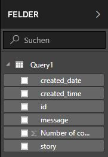
   
## Verwenden der Daten in Berichtvisualisierungen 

Nachdem Sie die Daten von der Facebook-Seite importiert haben, können Sie mithilfe von Visualisierungen schnell und einfach Einblicke in Ihre Daten erhalten. Die Erstellung einer Visualisierung ist denkbar einfach: Wählen Sie ein Feld aus, oder ziehen Sie es aus der Liste **Felder** in den Berichtszeichenbereich.

### Erstellen eines Balkendiagramms

1. Wählen Sie in der Power BI Desktop-Berichtsansicht in der Liste „Felder“ die Option **Nachricht**, oder ziehen Sie sie in den Zeichenbereich. Eine Tabelle mit allen Beitragsnachrichten wird im Zeichenbereich angezeigt. 
   
   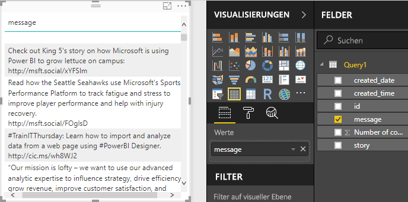
   
2. Wählen Sie bei ausgewählter Tabelle aus der Liste „Felder“ die Option **Anzahl von Kommentaren**, oder ziehen Sie sie in die Tabelle. 
   
3. Wählen Sie im Bereich „Visualisierungen“ das Symbol **Gestapeltes Balkendiagramm** aus. Die Tabelle wird in ein Balkendiagramm geändert, das die Anzahl von Kommentaren pro Beitrag zeigt. 
   
   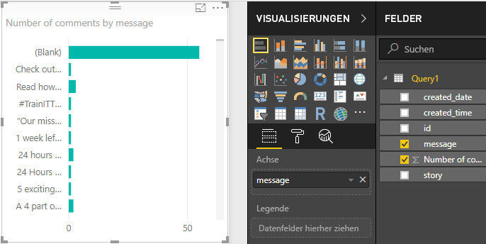
   
4. Wählen Sie die Auslassungspunkte (...) in der oberen rechten Ecke der Visualisierung, und wählen Sie dann **Nach Anzahl von Kommentaren sortieren**, um die Tabelle nach absteigender Anzahl von Kommentaren zu sortieren. 
   
   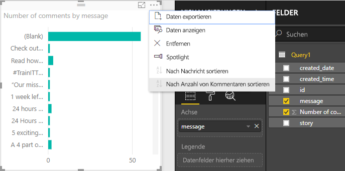
   
5. Beachten Sie, dass die meisten Kommentare mit **leeren** Nachrichten verbunden waren (diese Beiträge können Geschichten, Links, Videos oder andere Inhalte ohne Text gewesen sein). Um die Zeile „Leer“ herauszufiltern, wählen Sie am unteren Rand des Bereichs „Visualisierungen“ unter **Filter**die Option **Nachricht (alle)**, wählen Sie **Alle auswählen**, und wählen Sie dann **Leer**, um die Auswahl aufzuheben. Die Filtereinträge zeigen nun **Nachricht ist nicht (Leer)** an, und die Zeile „Leer“ wird im Diagramm nicht mehr angezeigt. 
   
   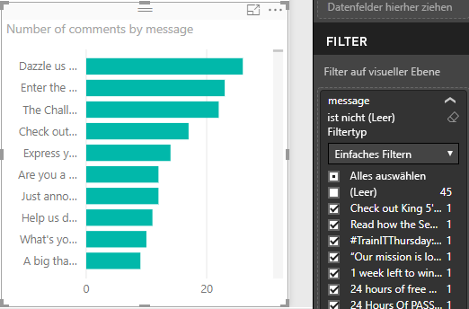
   
### Formatieren der Tabelle

Die Visualisierung wird interessanter, allerdings können Sie nicht viel vom Beitragstext im Diagramm sehen. So zeigen Sie mehr vom Beitragstext an

1. Vergrößern Sie das Diagramm über die Handles der Diagrammvisualisierung soweit wie möglich. 
   
2. Wählen Sie bei ausgewähltem Diagramm im Bereich „Visualisierung“ das **Formatierungssymbol** (Farbroller).
   
3. Wählen Sie den Abwärtspfeil neben **Y-Achse**, und ziehen Sie den Schieberegler ganz nach rechts neben **Maximalgröße** (50 %). 
4. Verringern Sie zudem die **Textgröße** auf **10**, damit mehr Text hinein passt.
   
   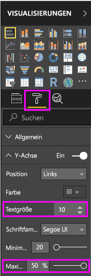
   
   Im Diagramm sind nun die meisten Beitragsinhalte zu sehen. 
   
   
   
Die X-Achse (Anzahl von Kommentaren) des Diagramms zeigt keine genauen Werte an und sieht am unteren Ende des Diagramms verloren aus. Verwenden Sie stattdessen Datenbeschriftungen. 

1. Wählen Sie das Formatierungssymbol, und stellen Sie dann den Schieberegler neben **X-Achse** auf **Aus**. 
   
2. Stellen Sie den Schieberegler neben **Datenbeschriftungen** auf **Ein**. Jetzt wird im Diagramm die genaue Anzahl von Kommentaren für jeden Beitrag angezeigt.
   
   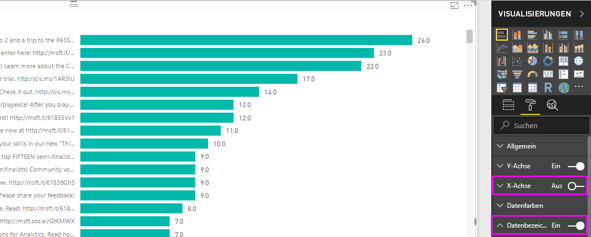
   
### Bearbeiten des Datentyps

Das Diagramm sieht nun schon viel besser aus, die Datenbeschriftungen haben jedoch noch alle eine Nachkommastelle (**,0**). Dies ist störend und irreführend, da die **Anzahl von Beiträgen** eine ganze Zahl sein muss. Daher müssen Sie den Datentyp für die Spalte **Anzahl von Beiträgen** in „Ganzzahl“ ändern.

1. Klicken Sie zum Ändern des Datentyps mit der rechten Maustaste in der Liste „Felder“ auf **Abfrage1**, oder zeigen Sie darauf, und wählen Sie die Auslassungszeichen (...) für **Weitere Optionen** und dann **Abfrage bearbeiten**. Sie können auch in der Registerkarte „Start“ des Menübands im Bereich **Externe Daten** die Option **Abfragen bearbeiten** wählen und dann in der Dropdownliste erneut **Abfragen bearbeiten** wählen. Der **Power Query-Editor** von Power BI Desktop wird in einem separaten Fenster geöffnet.
   
   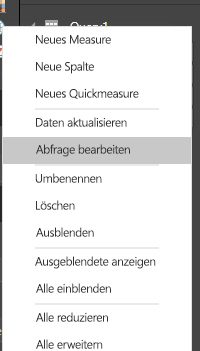     
   
2. Wählen Sie im Power Query-Editor die Spalte **Anzahl von Kommentaren**, und ändern Sie den Datentyp in **Ganze Zahl**, indem Sie eine der folgenden Vorgehensweisen wählen: 
   - Wählen Sie das Symbol **1.2** neben der Spaltenüberschrift **Anzahl von Kommentaren** und anschließend in der Dropdownliste **Ganze Zahl** aus.
   - Klicken Sie mit der rechten Maustaste auf die Spaltenüberschrift und wählen **Typ ändern > Ganze Zahl** aus.
   - Wählen Sie die Option **Datentyp: Dezimalzahl** auf der Registerkarte „Start“ in der Gruppe **Transformieren** oder die Option **Ganze Zahl** auf der Registerkarte **Transformieren** in der Gruppe **Beliebige Spalte**.
   
   Das Symbol in der Spaltenüberschrift wird in **123** geändert und weist so auf den Datentyp „Ganze Zahl“ hin.
   
   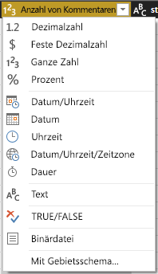
   
3. Wählen Sie **Schließen und übernehmen** oder nur **Übernehmen**, um die Änderungen zu übernehmen, während das Power Query-Editor-Fenster geöffnet bleibt. Sobald die Änderungen geladen sind, werden die Datenbeschriftungen im Diagramm als ganze Zahlen angezeigt. 
   
   
   
### Erstellen eines Datenschnitts

Sie möchten die Anzahl von Kommentaren zu Beiträgen im Zeitverlauf visualisieren. Sie können eine Datenschnittvisualisierung erstellen, um die Diagrammdaten für verschiedene Zeitabschnitte zu filtern. 

1. Klicken Sie auf eine leere Stelle im Zeichenbereich, und wählen Sie dann im Bereich „Visualisierungen“ das **Datenschnittsymbol**. Es wird eine leere Datenschnittvisualisierung angezeigt. 
   
   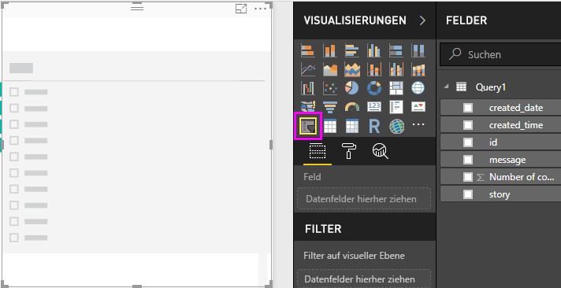
   
2. Wählen Sie aus der Liste „Felder“ das Feld **created_date**, oder ziehen Sie es in den neuen Datenschnitt. Der Datenschnitt wird basierend auf dem Datumsdatentyp des Felds in einen Datumsschieberegler geändert.
   
   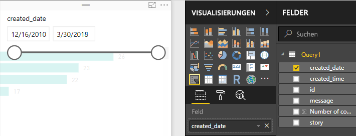
   
3. Verschieben Sie die Schieberegler-Ziehpunkte, um einen anderen Datumsbereich zu wählen, und sehen Sie, wie die Diagrammdaten entsprechend gefiltert werden. Sie können auch die Datumsfelder im Datenschnitt verwenden, um bestimmte Daten einzugeben, oder Sie wählen die Daten im Popupkalender aus.
    
   
   
### Formatieren der Visualisierungen

Sie entscheiden sich, dem Diagramm einen aussagekräftigeren und attraktiveren Titel zu geben. 

1. Wählen Sie bei ausgewähltem Diagramm das Symbol **Format**, und wählen Sie den Dropdownpfeil, um **Titel** zu erweitern.
2. Ändern Sie **Titeltext** in **Kommentare pro Beitrag**. 
3. Wählen Sie den Dropdownpfeil neben **Schriftfarbe**, und wählen Sie eine grüne Farbe, passend zu den grünen Balken der Visualisierung.
4. Erhöhen Sie die **Textgröße** auf **10**, und ändern Sie die **Schriftfamilie** in **Segoe (Fett)**.

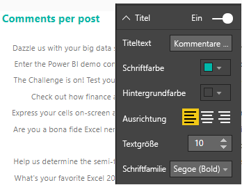

Experimentieren Sie mit anderen Formatierungsoptionen und Einstellungen, um das Aussehen Ihrer Visualisierungen zu ändern. 

## Erstellen weiterer Visualisierungen

Wie Sie sehen können, ist das Anpassen von Visualisierungen in Berichten wirklich einfach, um so Ihre Daten in der gewünschten Weise zu präsentieren. Verwenden Sie zum Beispiel die importierten Facebook-Daten, um dieses Liniendiagramm mit der Anzahl von Kommentaren im Zeitverlauf zu erstellen.

Power BI Desktop bietet ein nahtloses End-to-End-Erlebnis, das vom Abrufen der Daten aus einer Vielzahl von Datenquellen über die Strukturierung der Daten für Analysezwecke bis zur Visualisierung dieser Daten auf umfassende und interaktive Weise reicht. Nachdem Ihr Bericht fertig ist, können Sie ihn [in Power BI-Dienst hochladen](desktop-upload-desktop-files.md) und auf seiner Grundlage Dashboards erstellen, die Sie für andere Power BI-Benutzer freigeben können.

## Nächste Schritte
* [Weitere Tutorials zu Power BI Desktop lesen](http://go.microsoft.com/fwlink/?LinkID=521937)
* [Videos zu Power BI Desktop ansehen](http://go.microsoft.com/fwlink/?LinkID=519322)
* [Power BI-Forum besuchen](http://go.microsoft.com/fwlink/?LinkID=519326)
* [Power BI-Blog lesen](http://go.microsoft.com/fwlink/?LinkID=519327)

